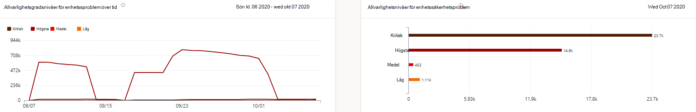

# Rapport om sårbara enheter – Hantering av hot och säkerhetsrisker

[!INCLUDE [Microsoft 365 Defender rebranding](../../includes/microsoft-defender.md)]

**Gäller för:**

- [Microsoft Defender för Endpoint](https://go.microsoft.com/fwlink/?linkid=2154037)
- [Hot och hantering av säkerhetsrisker](next-gen-threat-and-vuln-mgt.md)
- [Microsoft 365 Defender](https://go.microsoft.com/fwlink/?linkid=2118804)

>Vill du uppleva Microsoft Defender för Slutpunkt? [Registrera dig för en kostnadsfri utvärderingsversion.](https://www.microsoft.com/microsoft-365/windows/microsoft-defender-atp?ocid=docs-wdatp-portaloverview-abovefoldlink)

Rapporten visar diagram och stapeldiagram med sårbar enhetstrender och aktuell statistik. Målet är att du förstår andan och omfattningen av din enhets exponering.

Få tillgång till rapporten i Microsoft Defender Säkerhetscenter genom att **gå till Rapporter > sårbara enheter**

Det finns två kolumner:

- Trender (över tid). Kan visa de senaste 30 dagarna, 3 månader, 6 månader eller ett anpassat datumintervall.
- I dag (aktuell information)

**Filter:** Du kan filtrera data efter allvarlighetsnivåer, sårbarhet, sårbarhet, ålder, operativsystemsplattform, Windows 10 version eller enhetsgrupp.

**Öka detaljnivån**: Om det finns en insikt som du vill utforska ytterligare väljer du relevant stapeldiagram för att visa en filtrerad lista med enheter på sidan Enhetslager. Därifrån kan du exportera listan.

## Diagram för allvarlighetsnivå

Varje enhet räknas bara en gång enligt det mest allvarliga problemet på enheten.

## Utnyttja tillgänglighetsdiagram

Varje enhet räknas bara en gång baserat på den högsta nivån av känd sårbarhet.

## Diagram över sårbarhetsåldern

Varje enhet räknas bara en gång under datumet för den äldsta sårbarhetspublikationen. Äldre säkerhetsproblem har större risk att utnyttjas.

## Sårbara enheter efter operativsystemsplattformsgrafer

Antalet enheter i varje operativsystem som exponeras på grund av säkerhetsproblem med programvara.

## Sårbara enheter som kan Windows 10 av versionsdiagram

Antalet enheter på varje version Windows 10 exponeras på grund av sårbara program eller operativsystem.

## Relaterade ämnen

- [Översikt över hantering av säkerhetsrisker hot och hot](next-gen-threat-and-vuln-mgt.md)
- [Säkerhetsrekommendationer](tvm-security-recommendation.md)
