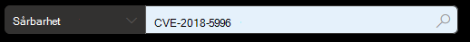
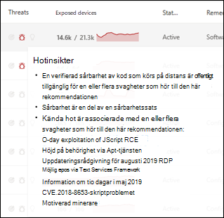
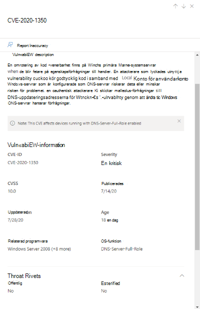
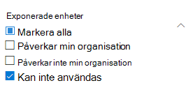
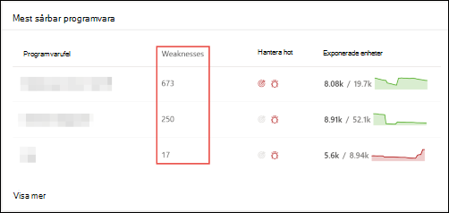
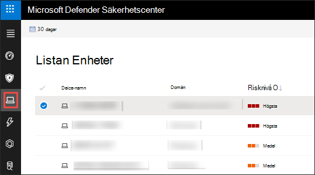
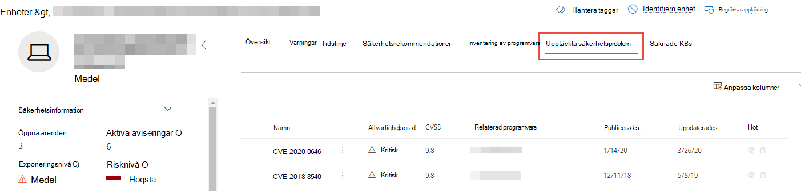
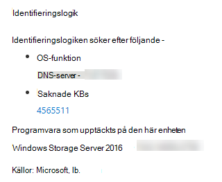

# Säkerhetsproblem i min organisation – hantering av hot och riskerVulnerabilities in my organization - threat and vulnerability management

[!INCLUDE [Microsoft 365 Defender rebranding](../../includes/microsoft-defender.md)]

**Gäller för:****Applies to:**
- [Microsoft Defender för EndpointMicrosoft Defender for Endpoint](https://go.microsoft.com/fwlink/?linkid=2154037)
- [Hantering av hot och sårbarhetThreat and vulnerability management](next-gen-threat-and-vuln-mgt.md)
- [Microsoft 365 DefenderMicrosoft 365 Defender](https://go.microsoft.com/fwlink/?linkid=2118804)

>Vill du uppleva Microsoft Defender för Slutpunkt?Want to experience Microsoft Defender for Endpoint? [Registrera dig för en kostnadsfri utvärderingsversion.Sign up for a free trial.](https://www.microsoft.com/microsoft-365/windows/microsoft-defender-atp?ocid=docs-wdatp-portaloverview-abovefoldlink)

Hantering av hot och risker använder samma signaler i Defender för Endpoints slutpunktsskydd för att söka igenom och upptäcka svagheter.Threat and vulnerability management uses the same signals in Defender for Endpoint's endpoint protection to scan and detect vulnerabilities.

På **sidan Svagheter** visas svagheter i programvaran som dina enheter exponeras för genom att lista CVE-ID (Common Vulnerabilities and Exposures).The **Weaknesses** page lists the software vulnerabilities your devices are exposed to by listing the Common Vulnerabilities and Exposures (CVE) ID. Du kan också se allvarlighetsgrad, CVSS-klassificering (Common Vulnerability Rating System), aktuella uppgifter i organisationen, motsvarande intrång, hotinsikter med mera.You can also view the severity, Common Vulnerability Scoring System (CVSS) rating, prevalence in your organization, corresponding breach, threat insights, and more.

>[!NOTE]
>Om det inte finns någon officiell CVE-ID tilldelad till en sårbarhet, tilldelas sårbarhetsnamnet med hjälp av hantering av hot och sårbarhet.If there is no official CVE-ID assigned to a vulnerability, the vulnerability name is assigned by threat and vulnerability management.

>[!TIP]
>E-postmeddelanden om nya sårbarhetshändelser finns i [Konfigurera e-postaviseringar om säkerhetsrisk i Microsoft Defender för slutpunkt](configure-vulnerability-email-notifications.md)To get emails about new vulnerability events, see [Configure vulnerability email notifications in Microsoft Defender for Endpoint](configure-vulnerability-email-notifications.md)

## Gå till sidan SvagheterNavigate to the Weaknesses page

Gå till sidan Svagheter på ett par olika sätt:Access the Weaknesses page a few different ways:

- Välja **Känslighet** från navigeringsmenyn för hot och sårbarhetshantering i [Microsoft Defender Säkerhetscenter](portal-overview.md)Selecting **Weaknesses** from the threat and vulnerability management navigation menu in the [Microsoft Defender Security Center](portal-overview.md)
- Global sökningGlobal search

### NavigeringsmenyNavigation menu

Gå till navigeringsmenyn för hot och sårbarhetshantering och välj **Svagheter** för att öppna listan över CV:er.Go to the threat and vulnerability management navigation menu and select **Weaknesses** to open the list of CVEs.

### Säkerhetsproblem i global sökningVulnerabilities in global search

1. Gå till den nedrullningsmenyn för global sökning.Go to the global search drop-down menu.
2. Välj **Sårbarhet** och nyckel i det vanliga säkerhetsproblem och exponerings-ID (CVE) som du letar efter och välj sedan sökikonen.Select **Vulnerability** and key-in the Common Vulnerabilities and Exposures (CVE) ID that you're looking for, then select the search icon. Sidan **Bevarande** öppnas med den CVE-information som du letar efter.The **Weaknesses** page opens with the CVE information that you're looking for.

3. Välj CVE för att öppna en utfällbarhetspanel med mer information, inklusive sårbarhetsbeskrivning, information om hot, hotinsikter och exponerade enheter.Select the CVE to open a flyout panel with more information, including the vulnerability description, details, threat insights, and exposed devices.

Om du vill se resten av svagheterna på sidan **Förvarna** skriver du CVE och väljer sedan sök.To see the rest of the vulnerabilities in the **Weaknesses** page, type CVE, then select search.

## Översikt över svagheterWeaknesses overview

Åtgärda säkerhetsproblem i exponerade enheter för att minska risken för tillgångar och organisation.Remediate the vulnerabilities in exposed devices to reduce the risk to your assets and organization. Om kolumnen **Exponerade** enheter visar 0, innebär det att du inte är i riskabelt fall.If the **Exposed Devices** column shows 0, that means you aren't at risk.

### Insikter om intrång och hotBreach and threat insights

Visa eventuella relaterade insikter om intrång och hot **i kolumnen** Hot när ikonerna är röda.View any related breach and threat insights in the **Threat** column when the icons are colored red.

 >[!NOTE]
 > Prioritera alltid rekommendationer som är associerade med pågående hot.Always prioritize recommendations that are associated with ongoing threats. Dessa rekommendationer markeras med ikonen för These recommendations are marked with the threat insight icon  och insiktsikonen  mål. .and breach insight icon .  

Ikonen för intrångsinformation markeras om det finns en säkerhetsrisk i organisationen.The breach insights icon is highlighted if there's a vulnerability found in your organization.

Ikonen för hotinsikter markeras om det finns associerade sårbarheter i den sårbarhet som finns i organisationen.The threat insights icon is highlighted if there are associated exploits in the vulnerability found in your organization. Hovra över ikonen för att se om risken är en del av en sårbarhetssats eller kopplad till specifika avancerade beständiga kampanjer eller aktivitetsgrupper.Hovering over the icon shows whether the threat is a part of an exploit kit, or connected to specific advanced persistent campaigns or activity groups. När rapporten är tillgänglig finns det en länk till en rapport om hotanalys där det inte finns några dagars användningsnyheter, avslöjanden eller relaterade säkerhetsrådgivare.When available, there's a link to a Threat Analytics report with zero-day exploitation news, disclosures, or related security advisories.  

### Få sårbarhetsinsikterGain vulnerability insights

Om du väljer en CVE öppnas en utfällbarhetspanel med mer information, till exempel sårbarhetsbeskrivning, information, information om hot och exponerade enheter.If you select a CVE, a flyout panel will open with more information such as the vulnerability description, details, threat insights, and exposed devices.

- Kategorin "OS-funktion" visas i relevanta scenarierThe "OS Feature" category is shown in relevant scenarios
- Du kan gå till relaterad säkerhetsrekommendationer för varje CVE med exponerade enheterYou can go to the related security recommendation for every CVE with exposed device

 

### Programvara som inte stödsSoftware that isn't supported

CV:er för programvara som för närvarande inte stöds av & sårbarhetshantering finns fortfarande på sidan Förskanning.CVEs for software that isn't currently supported by threat & vulnerability management is still present in the Weaknesses page. Eftersom programvaran inte stöds är endast begränsade data tillgängliga.Because the software is not supported, only limited data will be available.

Information om exponerade enheter kommer inte att vara tillgänglig för CV:er med programvara som inte stöds.Exposed device information will not be available for CVEs with unsupported software. Filtrera efter programvara som inte stöds genom att välja alternativet "Inte tillgängligt" i avsnittet "Exponerade enheter".Filter by unsupported software by selecting the "Not available" option in the "Exposed devices" section.

 

## Visa vanliga säkerhetsproblem och exponeringar (CVE) på andra platserView Common Vulnerabilities and Exposures (CVE) entries in other places

### Mest sårbar programvara på instrumentpanelenTop vulnerable software in the dashboard

1. Gå till [instrumentpanelen för hot och sårbarhetshantering](tvm-dashboard-insights.md) och rulla ned till den **mest sårbara programvaruwidgeten.**Go to the [threat and vulnerability management dashboard](tvm-dashboard-insights.md) and scroll down to the **Top vulnerable software** widget. Du kommer att se antalet svagheter i varje programvara, tillsammans med information om hot och en detaljerad bild av exponering av enheter över tid.You will see the number of vulnerabilities found in each software, along with threat information and a high-level view of device exposure over time.

    

2. Välj den programvara du vill undersöka för att gå till en sida med en detaljgranskning.Select the software you want to investigate to go to a drilldown page.
3. Välj fliken **Identifierade säkerhetsproblem.**Select the **Discovered vulnerabilities** tab.
4. Välj det säkerhetsproblem du vill undersöka för mer information om sårbarhetsinformationSelect the vulnerability you want to investigate for more information on vulnerability details

    

### Upptäck säkerhetsproblem på enhetssidanDiscover vulnerabilities in the device page

Visa relaterad information om svagheter på enhetens sida.View related weaknesses information in the device page.

1. Gå till menyraden för navigering i Microsoft Defender Säkerhetscenter och välj sedan enhetsikonen.Go to the Microsoft Defender Security Center navigation menu bar, then select the device icon. Sidan **Enheter öppnas.**The **Devices list** page opens.
2. På sidan **Enheter väljer** du namnet på enheten som du vill undersöka.In the **Devices list** page, select the device name that you want to investigate.

    

3. Enhetens sida öppnas med information och svarsalternativ för den enhet du vill undersöka.The device page will open with details and response options for the device you want to investigate.
4. Välj **Identifierade säkerhetsproblem**.Select **Discovered vulnerabilities**.

    

5. Välj det sårbarhet som du vill undersöka för att öppna en utfällbarhetspanel med CVE-information, till exempel: sårbarhetsbeskrivning, hotinsikter och identifieringslogik.Select the vulnerability that you want to investigate to open up a flyout panel with the CVE details, such as: vulnerability description, threat insights, and detection logic.

#### Logik för identifiering av CVECVE Detection logic

I likhet med programvarubevisen visar vi nu den identifieringslogik vi använt på en enhet för att visa att den är sårbar.Similar to the software evidence, we now show the detection logic we applied on a device in order to state that it's vulnerable. Det nya avsnittet kallas "Identifieringslogik" (i alla identifierade problem på enhetssidan) och visar identifieringslogiken och källan.The new section is called "Detection Logic" (in any discovered vulnerability in the device page) and shows the detection logic and source.

Kategorin "OS-funktion" visas också i relevanta scenarier.The "OS Feature" category is also shown in relevant scenarios. En CVE skulle påverka enheter som kör ett sårbart operativsystem endast om en specifik OS-komponent är aktiverad.A CVE would affect devices that run a vulnerable OS only if a specific OS component is enabled. Anta att Windows Server 2019 har en säkerhetsrisk i DNS-komponenten.Let's say Windows Server 2019 has vulnerability in its DNS component. Med den här nya funktionen kommer vi bara att ansluta denna CVE till Windows Server 2019-enheter med DNS-funktionen aktiverad i operativsystemet.With this new capability, we’ll only attach this CVE to the Windows Server 2019 devices with the DNS capability enabled in their OS.

## Rapportera felaktigheterReport inaccuracy

Rapportera en falsk positiv när du ser någon vag, felaktig eller ofullständig information.Report a false positive when you see any vague, inaccurate, or incomplete information. Du kan också rapportera säkerhetsrekommendationer som redan har åtgärdats.You can also report on security recommendations that have already been remediated.

1. Öppna CVE på sidan Försv.Open the CVE on the Weaknesses page.
2. Välj **Rapportens felaktigheter så** öppnas ett utfällt fönster.Select **Report inaccuracy** and a flyout pane will open.
3. Välj kategorin felaktigheter i den nedrullningrullningsmenyn och fyll i din e-postadress och information om felaktigheter.Select the inaccuracy category from the drop-down menu and fill in your email address and inaccuracy details.
4. Välj **Skicka**.Select **Submit**. Din feedback skickas omedelbart till experter på hot och sårbarhetshantering.Your feedback is immediately sent to the threat and vulnerability management experts.

## Relaterade artiklarRelated articles

- [Översikt över hot- och sårbarhetshanteringThreat and vulnerability management overview](next-gen-threat-and-vuln-mgt.md)
- [SäkerhetsrekommendationerSecurity recommendations](tvm-security-recommendation.md)
- [ProgramvaruinventeringSoftware inventory](tvm-software-inventory.md)
- [InstrumentpanelsinsikterDashboard insights](tvm-dashboard-insights.md)
- [Visa och ordna listan Microsoft Defender för slutpunktsenheterView and organize the Microsoft Defender for Endpoint Devices list](machines-view-overview.md)
