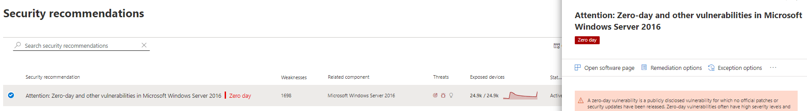

# Minimera svagheter utan dag – Hantering av hot och säkerhetsriskerMitigate zero-day vulnerabilities - threat and vulnerability management

[!INCLUDE [Microsoft 365 Defender rebranding](../../includes/microsoft-defender.md)]

**Gäller för:****Applies to:**

- [Microsoft Defender för EndpointMicrosoft Defender for Endpoint](https://go.microsoft.com/fwlink/?linkid=2154037)
- [Hot och hantering av säkerhetsriskerThreat and vulnerability management](next-gen-threat-and-vuln-mgt.md)
- [Microsoft 365 DefenderMicrosoft 365 Defender](https://go.microsoft.com/fwlink/?linkid=2118804)

>Vill du uppleva Microsoft Defender för Slutpunkt?Want to experience Microsoft Defender for Endpoint? [Registrera dig för en kostnadsfri utvärderingsversion.Sign up for a free trial.](https://www.microsoft.com/microsoft-365/windows/microsoft-defender-atp?ocid=docs-wdatp-portaloverview-abovefoldlink)

Ett nolldagarshål är ett offentligt avslöjat säkerhetshål där inga officiella korrigeringar eller säkerhetsuppdateringar har släppts.A zero-day vulnerability is a publicly disclosed vulnerability for which no official patches or security updates have been released. Nolldagarsbrister har ofta hög allvarlighetsnivå och utnyttjas aktivt.Zero-day vulnerabilities often have high severity levels and are actively exploited.

Hot och hantering av säkerhetsrisker bara visar svagheter som inte har någon dag.Threat and vulnerability management will only display zero-day vulnerabilities it has information about.

## Hitta information om svagheter utan dagFind information about zero-day vulnerabilities

När en nolldagarsrisk har hittats kommer information om den att förmedlas genom följande upplevelser i Microsoft Defender Säkerhetscenter.Once a zero-day vulnerability has been found, information about it will be conveyed through the following experiences in the Microsoft Defender Security Center.

>[!NOTE]
> 0-dagars sårbarhet är för närvarande endast tillgängligt för Windows produkter.0-day vulnerability capability is currently available only for Windows products.

### Hot och hantering av säkerhetsrisker instrumentpanelThreat and vulnerability management dashboard

Leta efter rekommendationer med en nolldagarstagg i kortet "Bästa säkerhetsrekommendationer".Look for recommendations with a zero-day tag in the “Top security recommendations” card.

Hitta den bästa programvaran med nolldagarstaggen på kortet "Mest sårbar programvara".Find top software with the zero-day tag in the "Top vulnerable software" card.

### Sida för svagheterWeaknesses page

Leta efter det namngivna nolldagarsproblemet tillsammans med en beskrivning och information.Look for the named zero-day vulnerability along with a description and details.

- Om problemet har ett CVE-ID tilldelat ser du nolldagarsetiketten bredvid CVE-namnet.If this vulnerability has a CVE-ID assigned, you’ll see the zero-day label next to the CVE name.

- Om det här problemet inte har något CVE-ID tilldelat hittar du det under ett internt, tillfälligt namn som ser ut som "TVM-XXXX-XXXX".If this vulnerability has no CVE-ID assigned, you'll find it under an internal, temporary name that looks like “TVM-XXXX-XXXX”. Namnet uppdateras när en officiell CVE-ID har tilldelats, men det tidigare interna namnet är fortfarande sökbart och finns i sidopanelen.The name will be updated once an official CVE-ID has been assigned, but the previous internal name will still be searchable and found in the side-panel.

### Sidan För programvaruinventeringSoftware inventory page

Leta efter programvara med nolldagarstaggen.Look for software with the zero-day tag. Filtrera efter "nolldagars"-taggen för att endast se säkerhetsproblem med programvara utan dag.Filter by the "zero day" tag to only see software with zero-day vulnerabilities.

### Sidan ProgramvaraSoftware page

Leta efter en nolldagarstagg för varje programvara som har påverkats av den nolldagars sårbarheten.Look for a zero-day tag for each software that has been affected by the zero–day vulnerability.

### Sidan SäkerhetsrekommendationerSecurity recommendations page

Visa tydliga förslag om åtgärder och åtgärder, inklusive lösningar om de finns.View clear suggestions about remediation and mitigation options, including workarounds if they exist. Filtrera efter "nolldagars"-taggen för att endast se säkerhetsrekommendationer om svagheter utan dag.Filter by the "zero day" tag to only see security recommendations addressing zero-day vulnerabilities.

Om det finns programvara med ett nolldagars sårbarhet och ytterligare säkerhetsproblem att ta itu med får du en rekommendation om alla säkerhetsproblem.If there's software with a zero-day vulnerability and additional vulnerabilities to address, you'll get one recommendation about all vulnerabilities.

## Åtgärda svagheter utan dagAddressing zero-day vulnerabilities

Gå till sidan med säkerhetsrekommendationer och välj en rekommendation om en nolldag.Go to the security recommendation page and select a recommendation with a zero-day. En utfällbarhet öppnas med information om nolldagar och andra säkerhetsproblem för programvaran.A flyout will open with information about the zero-day and other vulnerabilities for that software.

Om det finns en länk till åtgärder och lösningar finns det en länk.There will be a link to mitigation options and workarounds if they are available. Lösningar kan minska risken som kan uppstå med den här nolldagarsproblemet tills en korrigering eller säkerhetsuppdatering kan distribueras.Workarounds may help reduce the risk posed by this zero-day vulnerability until a patch or security update can be deployed.

Öppna alternativ för åtgärder och välj åtgärdstyp.Open remediation options and choose the attention type. Åtgärdsalternativet "åtgärd krävs" rekommenderas för säkerhetsproblem med nolldagar, eftersom ingen uppdatering har släppts än.An "attention required" remediation option is recommended for the zero-day vulnerabilities, since an update hasn't been released yet. Du kan inte välja ett förfallodatum eftersom det inte finns någon specifik åtgärd att utföra.You won't be able to select a due date, since there's no specific action to perform. Om det finns äldre säkerhetsproblem för den här programvaran som du vill åtgärda kan du åsidosätta alternativet "åtgärd som krävs" och välja "uppdatera".If there are older vulnerabilities for this software you wish to remediation, you can override the "attention required" remediation option and choose “update.”

## Spåra aktiviteter för nolldagarsreparationTrack zero-day remediation activities

Gå till Hantering av hot och säkerhetsrisker [åtgärdssidan](tvm-remediation.md) för att visa objektet för åtgärdsaktiviteten.Go to the threat and vulnerability management [Remediation](tvm-remediation.md) page to view the remediation activity item. Om du väljer åtgärdsalternativet "åtgärd krävs" finns det ingen förloppsstapel, status för biljett eller förfallodatum eftersom det inte finns någon verklig åtgärd vi kan övervaka.If you chose the "attention required" remediation option, there will be no progress bar, ticket status, or due date since there's no actual action we can monitor. Du kan filtrera efter åtgärdstyp, till exempel "programuppdatering" eller "åtgärd krävs", för att se alla aktivitetsobjekt i samma kategori.You can filter by remediation type, such as "software update" or "attention required," to see all activity items in the same category.

## Korrigera säkerhetsproblem med nolldagarPatching zero-day vulnerabilities

När en korrigering släpps för nolldagen ändras rekommendationen till "Uppdatering" och en blå etikett bredvid den där det står "Ny säkerhetsuppdatering för noll dag".When a patch is released for the zero-day, the recommendation will be changed to “Update” and a blue label next to it that says “New security update for zero day.” Den kommer inte längre att ses som en nolldag, nolldagarstaggen tas bort från alla sidor.It will no longer consider as a zero-day, the zero-day tag will be removed from all pages.

## Relaterade artiklarRelated articles

- [Översikt över hantering av säkerhetsrisker hot och hotThreat and vulnerability management overview](next-gen-threat-and-vuln-mgt.md)
- [InstrumentpanelenDashboard](tvm-dashboard-insights.md)
- [SäkerhetsrekommendationerSecurity recommendations](tvm-security-recommendation.md)
- [ProgramvaruinventeringSoftware inventory](tvm-software-inventory.md)
- [Sårbarhet i min organisationVulnerabilities in my organization](tvm-weaknesses.md)
