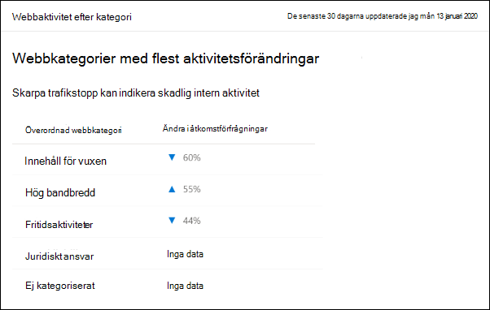
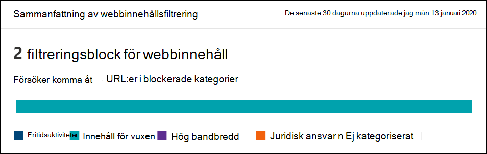
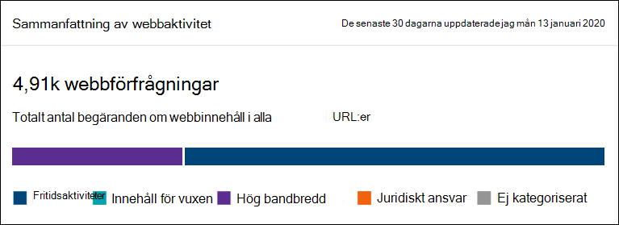

# Filtrering av webbinnehåll

[!INCLUDE [Microsoft 365 Defender rebranding](../../includes/microsoft-defender.md)]

**Gäller för:**
- [Microsoft Defender för Endpoint](https://go.microsoft.com/fwlink/p/?linkid=2154037)
- [Microsoft 365 Defender](https://go.microsoft.com/fwlink/?linkid=2118804)

> [!IMPORTANT]
> **Webbinnehållsfiltrering är för närvarande i offentlig förhandsversion** 
> Den här förhandsversionen tillhandahålls utan ett servicenivåavtal och rekommenderas inte för produktionsarbetsbelastningar. Vissa funktioner kanske inte stöds eller kan ha begränsade funktioner.
> Mer information finns i [Förhandsversionsfunktioner för Microsoft Defender för slutpunkt.](preview.md)

>Vill du uppleva Microsoft Defender för Slutpunkt? [Registrera dig för en kostnadsfri utvärderingsversion.](https://www.microsoft.com/microsoft-365/windows/microsoft-defender-atp?ocid=docs-wdatp-main-abovefoldlink&rtc=1)

Webbinnehållsfiltrering är [en del av webbskyddsfunktionerna](web-protection-overview.md) i Microsoft Defender för Endpoint. Det gör att din organisation kan spåra och reglera åtkomsten till webbplatser baserat på deras innehållskategorier. Många av dessa webbplatser, även om de inte är skadliga, kan vara problematiska på grund av regelefterlevnad, bandbreddsanvändning eller andra problem.

Konfigurera principer i din enhetsgrupper för att blockera vissa kategorier. När en kategori blockeras förhindrar du att användare i angivna enhetsgrupper kommer åt URL-adresser som är kopplade till kategorin. URL-adresser granskas automatiskt för alla kategorier som inte blockeras. Användarna kan komma åt URL-adresser utan störningar och du samlar in åtkomststatistik för att skapa ett mer anpassat principbeslut. Användarna ser ett blockeringsmeddelande om ett element på sidan de visar är att ringa samtal till en blockerad resurs.

Webbinnehållsfiltrering är tillgängligt i de större webbläsarna, med block som utförs av Windows Defender SmartScreen (Microsoft Edge) och Network Protection (Chrome, Firefox, Och Opera). Mer information om webbläsarstöd finns i avsnittet krav.

Sammanfattning av fördelarna:

- Användare hindras från att komma åt webbplatser i blockerade kategorier, oavsett om de surfar lokalt eller inte
- Distribuera enkelt principer till grupper av användare med hjälp av enhetsgrupper som definierats [i Microsoft Defender för slutpunktsrollbaserade inställningar för åtkomstkontroll](https://docs.microsoft.com/microsoft-365/security/defender-endpoint/rbac)
- Access-webbrapporter på samma centrala plats, med synlighet över faktiska block och webbanvändning

## Användarupplevelse

Blockeringen för webbläsare som stöds av tredje part tillhandahålls av Network Protection, som ger ett popup-meddelande på systemnivå om en blockerad anslutning för användaren. 

Om du vill ha en mer användarvänlig upplevelse i webbläsaren kan du använda Microsoft Edge.

## Förutsättningar

Innan du provar den här funktionen bör du kontrollera att du har följande krav:

- Windows 10 Enterprise E5, Microsoft 365 E5, Microsoft 365 E5 Security, Microsoft 365 E3 + Microsoft 365 E5-säkerhets tillägg eller fristående Microsoft Defender för slutpunkt-licens. 
- Åtkomst till Microsoft Defender Säkerhetscenter-portalen
- Enheter som kör Windows 10 Anniversary Update (version 1607) eller senare med den senaste Mo MOB-uppdateringen.

Om Windows Defender SmartScreen inte är aktiverat tar nätverksskydd över blockeringen. Nätverksskyddet [måste aktiveras](enable-network-protection.md) på enheten. Chrome, Firefox, Firefox och Opera är för närvarande webbläsare från tredje part där den här funktionen är aktiverad.

## Datahantering

Vi följer den region som du har valt att använda som en del av dina [Microsoft Defender för slutpunktsdatahanteringsinställningar.](https://docs.microsoft.com/microsoft-365/security/defender-endpoint/data-storage-privacy) Dina data lämnar inte datacentret i den regionen. Dessutom kommer dina data inte att delas med någon tredje part, inklusive våra dataleverantörer.

## Aktivera webbinnehållsfiltrering

I den vänstra navigeringsmenyn väljer du **Inställningar > Allmänt > Avancerade funktioner.** Bläddra nedåt tills du ser posten för **webbinnehållsfiltrering**. Ändra växlingsknappen till **På** **och Spara inställningar.**

### Konfigurera principer för filtrering av webbinnehåll

Principer för filtrering av webbinnehåll anger vilka webbplatskategorier som blockeras i vilka enhetsgrupper. Du hanterar principerna genom att gå till **Inställningar > eller > på Webbinnehållsfiltrering.**

Använd filtret för att hitta principer som innehåller vissa blockerade kategorier eller som tillämpas på specifika enhetsgrupper.

### Skapa en princip

Så här lägger du till en ny princip:

1. Välj **Lägg till princip** på sidan för **webbinnehållsfiltrering** i **Inställningar**.
2. Ange ett namn.
3. Markera de kategorier som ska blockeras. Använd expanderikonen för att helt expandera varje överordnad kategori och välja specifika kategorier för webbinnehåll.
4. Ange principens omfattning. Välj enhetsgrupper för att ange var principen ska tillämpas. Det är bara enheter i de valda enhetsgrupperna som hindras från att komma åt webbplatser i de valda kategorierna.
5. Granska sammanfattningen och spara principen. Det kan ta upp till 2 timmar innan principuppdateringen tillämpas på dina valda enheter.

Tips: Du kan distribuera en princip utan att välja en kategori i en enhetsgrupp. Den här åtgärden skapar en princip för granskning bara för att hjälpa dig att förstå användarbeteendet innan du skapar en blockeringsprincip.

>[!NOTE]
>Om du tar bort en princip eller ändrar enhetsgrupper samtidigt kan det orsaka en fördröjning i principdistributionen.

>[!IMPORTANT]
>Att blockera kategorin "Okategoriserad" kan leda till oväntade och oönskade resultat.  

### Tillåt specifika webbplatser

Du kan åsidosätta kategorin blockerad i webbinnehållsfiltrering om du vill tillåta en enda webbplats genom att skapa en egen indikatorprincip. Principen för anpassad indikator ersätter webbinnehållsfiltreringsprincipen när den tillämpas på enhetsgruppen i fråga.

1. Skapa en anpassad indikator i Microsoft Defender Säkerhetscenter genom att gå till URL:en **för**  >    >  **inställningsindikatorer/lägg till**  >  **objekt för domän**
2. Ange domänen för webbplatsen
3. Ställ in principåtgärden på **Tillåt**.  

### Rapportering av felaktigheter

Om du träffar på en domän som felaktigt har kategoriserats kan du rapportera felaktigheter direkt till oss från rapportsidan Webbinnehållsfiltrering. Den här funktionen är endast tillgänglig i det nya säkerhetscentret för Microsoft 365 (security.microsoft.com).

Om du vill rapportera en felaktigheter navigerar du till Rapporter > skydd mot > information om **webbinnehållsfiltrering > Domäner**. På fliken Domäner i webbinnehållsfiltreringsrapporterna visas en ellips bredvid var och en av domänerna. Hovra över de här ellipsen **och välj Rapportinaccuracy**.

En panel öppnas där du kan välja prioritet och lägga till ytterligare information, till exempel den föreslagna kategorin för omkategorisering. När du har slutfört formuläret väljer du **Skicka**. Vår grupp kommer att granska begäran inom en arbetsdag. Skapa en anpassad indikator för tillåt för omedelbar [blockering.](indicator-ip-domain.md)

## Filtreringskort och information för webbinnehåll

Välj **Rapporter > för webbskydd om** du vill visa kort med information om filtrering av webbinnehåll och skydd mot webbhot. På följande kort får du sammanfattningsinformation om filtrering av webbinnehåll.

### Webbaktivitet efter kategori

Det här kortet visar de överordnade webbinnehållskategorierna med den största ökningen eller minskning av antalet åtkomstförsök. Förstå förändrat webbaktivitetsmönster i organisationen från de senaste 30 dagarna, 3 månaderna eller 6 månaderna. Välj ett kategorinamn om du vill visa mer information.

Under de första 30 dagarna av den här funktionen kanske organisationen inte har tillräckligt med data för att visa den här informationen.

### Sammanfattningskort för webbinnehållsfiltrering

På det här kortet visas fördelningen av blockerade åtkomstförsök mellan de olika överordnade webbinnehållskategorierna. Välj en av de färgade staplarna om du vill visa mer information om en viss överordnad webbkategori.

### Sammanfattningskort för webbaktivitet

På det här kortet visas det totala antalet begäranden om webbinnehåll i alla URL:er.

### Visa kortinformation

Du kommer åt **rapportinformationen för varje** kort genom att välja en tabellrad eller en färgad stapel i diagrammet på kortet. Rapportinformationssidan för varje kort innehåller omfattande statistiska data om kategorier av webbinnehåll, webbplatsdomäner och enhetsgrupper.

- **Webbkategorier:** Visar de webbinnehållskategorier som har haft åtkomstförsök i organisationen. Välj en specifik kategori för att öppna en utfällbladstext för sammanfattningen.

- **Domäner**: Visar de webbdomäner som har använts eller blockerats i organisationen. Välj en viss domän om du vill visa detaljerad information om den domänen.

- **Enhetsgrupper:** Visar alla enhetsgrupper som har skapat webbaktivitet i organisationen

Använd tidsintervallsfiltret längst upp till vänster på sidan för att välja en tidsperiod. Du kan också filtrera informationen eller anpassa kolumnerna. Markera en rad för att öppna ett utfällt fönster med ännu mer information om det markerade objektet.

## Fel och problem

### Begränsningar och kända problem i den här förhandsversionen

- Endast Microsoft Edge stöds om enhetens OS-konfiguration är Server (cmd > Systeminfo > OS Configuration). Nätverksskydd stöds endast i inspektera-läge på serverenheter, som ansvarar för att skydda trafiken mellan webbläsare som stöds.

- Enheter som inte tilldelats visas med felaktiga data i rapporten. I rapportens information > pivot för enhetsgrupper visas eventuellt en rad med ett tomt enhetsgruppsfält. Den här gruppen innehåller dina otilldelade enheter innan de läggs till i den angivna gruppen. Rapporten för den här raden kanske inte innehåller korrekt antal enheter eller antal åtkomstvärden.

- Rapporterna för webbinnehållsfiltrering är för närvarande begränsade till att visa de 5 000 högsta posterna. Till exempel visar rapporten "Domäner" bara maximalt de 5 000 toppdomänerna för en viss filterfråga, om tillämpligt. 

## Relaterade ämnen

- [Översikt över webbskydd](web-protection-overview.md)
- [Skydd mot webbhot](web-threat-protection.md)
- [Övervaka webbsäkerhet](web-protection-monitoring.md)
- [Svara på webbhot](web-protection-response.md)
