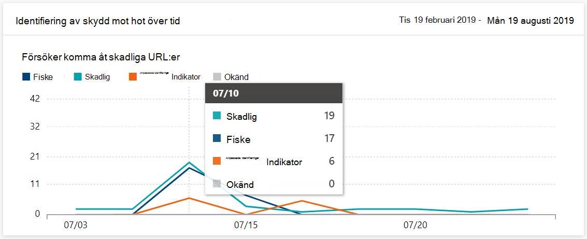
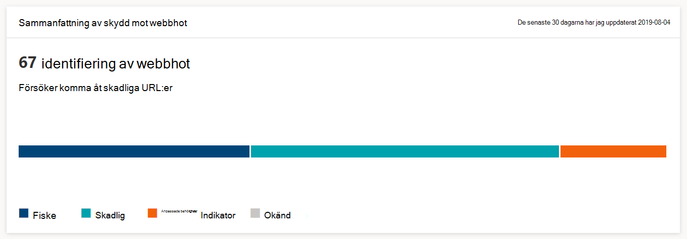

# Övervaka surfsäkerhetMonitor web browsing security

[!INCLUDE [Microsoft 365 Defender rebranding](../../includes/microsoft-defender.md)]

**Gäller för:****Applies to:**
- [Microsoft Defender för EndpointMicrosoft Defender for Endpoint](https://go.microsoft.com/fwlink/p/?linkid=2146631)
- [Microsoft 365 DefenderMicrosoft 365 Defender](https://go.microsoft.com/fwlink/?linkid=2118804)

>Vill du uppleva Microsoft Defender för Slutpunkt?Want to experience Microsoft Defender for Endpoint? [Registrera dig för en kostnadsfri utvärderingsversion.Sign up for a free trial.](https://www.microsoft.com/microsoft-365/windows/microsoft-defender-atp?ocid=docs-wdatp-main-abovefoldlink&rtc=1)

Med webbskydd kan du övervaka organisationens webbsurfningssäkerhet genom rapporter under **Rapporter > skydd på** webben i Microsoft Defender Säkerhetscenter.Web protection lets you monitor your organization’s web browsing security through reports under **Reports > Web protection** in the Microsoft Defender Security Center. Rapporten innehåller kort som tillhandahåller statistik för identifiering av webbhot.The report contains cards that provide web threat detection statistics.

- **Identifiering av skydd** mot webbhot med tiden – det här trendkortet visar antalet webbhot som upptäckts av typ under den valda tidsperioden (de senaste 30 dagarna, de senaste 3 månaderna, de senaste 6 månaderna)**Web threat protection detections over time** - this trending card displays the number of web threats detected by type during the selected time period (Last 30 days, Last 3 months, Last 6 months)
 
    

- **Sammanfattning av skydd** mot webbhot – det här kortet visar totalt antal identifieringar av webbhot under de senaste 30 dagarna, med distribution för olika typer av webbhot.**Web threat protection summary** - this card displays the total web threat detections in the past 30 days, showing distribution across the different types of web threats. Om du väljer en sektor öppnas listan med domäner som hittades med skadliga eller oönskade webbplatser.Selecting a slice opens the list of the domains that were found with malicious or unwanted websites.

    

>[!Note]
>Det kan ta upp till 12 timmar innan ett block visas på korten eller i domänlistan.It can take up to 12 hours before a block is reflected in the cards or the domain list.

## Typer av webbhotTypes of web threats

Webbskydd kategoriserar skadliga och oönskade webbplatser som:Web protection categorizes malicious and unwanted websites as:

- **Nätfiske** – webbplatser som innehåller falska webbformulär och andra former av nätfiske som designats för att lura användare att dela upp autentiseringsuppgifter och annan känslig information**Phishing** - websites that contain spoofed web forms and other phishing mechanisms designed to trick users into divulging credentials and other sensitive information
- **Skadlig** – webbplatser som är värd för skadlig programvara och sårbarhetskod**Malicious** - websites that host malware and exploit code
- **Anpassad indikator** – webbplatser vars URL:er eller domäner du har lagt till i din [anpassade indikatorlista för](manage-indicators.md) blockering**Custom indicator** - websites whose URLs or domains you've added to your [custom indicator list](manage-indicators.md) for blocking

## Visa domänlistanView the domain list

Välj en specifik kategori för webbhot i **sammanfattningskortet för skydd mot webbhot** för att öppna **sidan** Domäner.Select a specific web threat category in the **Web threat protection summary** card to open the **Domains** page. Den här sidan visar listan över domänerna under den hotkategorin.This page displays the list of the domains under that threat category. Sidan innehåller följande information för varje domän:The page provides the following information for each domain:

- **Antal åtkomst** – antal förfrågningar om URL-adresser i domänen**Access count** - number of requests for URLs in the domain
- **Block** – antal gånger som förfrågningar har blockerats**Blocks** - number of times requests were blocked
- **Access-trend** – ändra antalet åtkomstförsök**Access trend** - change in number of access attempts
- **Hotkategori** – typ av webbhot**Threat category** - type of web threat
- **Enheter** – antal enheter med åtkomstförsök**Devices** - number of devices with access attempts

Välj en domän för att visa listan över enheter som har försökt komma åt URL:er i den domänen och listan med URL:er.Select a domain to view the list of devices that have attempted to access URLs in that domain and the list of URLs.

## Relaterade ämnenRelated topics

- [Översikt över webbskyddWeb protection overview](web-protection-overview.md)
- [Filtrering av webbinnehållWeb content filtering](web-content-filtering.md)
- [Skydd mot webbhotWeb threat protection](web-threat-protection.md)
- [Svara på webbhotRespond to web threats](web-protection-response.md)
