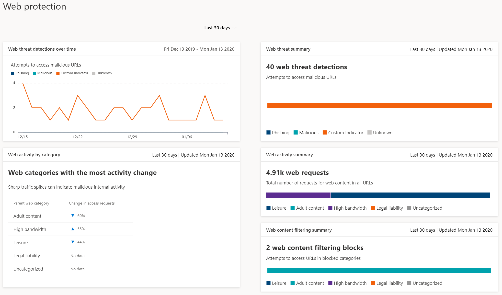

# Webbskydd

[!INCLUDE [Microsoft 365 Defender rebranding](../../includes/microsoft-defender.md)]

**Gäller för:**
- [Microsoft Defender för Endpoint](https://go.microsoft.com/fwlink/p/?linkid=2154037)
- [Microsoft 365 Defender](https://go.microsoft.com/fwlink/?linkid=2118804)

>Vill du uppleva Microsoft Defender för Slutpunkt? [Registrera dig för en kostnadsfri utvärderingsversion.](https://www.microsoft.com/microsoft-365/windows/microsoft-defender-atp?ocid=docs-wdatp-main-abovefoldlink&rtc=1)

Webbskydd i Microsoft Defender för Endpoint är en funktion som består av skydd [mot webbhot och](web-threat-protection.md) [webbinnehållsfiltrering.](web-content-filtering.md) Med webbskydd kan du skydda dina enheter mot webbhot och reglera oönskat innehåll. Du hittar webbskyddsrapporter i Microsoft Defender Säkerhetscenter genom att gå **till Rapporter > skydd på webben.**

## Skydd mot webbhot

Korten som utgör skydd mot webbhot är identifiering **av webbhot över tid och** en sammanfattning av **webbhot.**

Skydd mot webbhot omfattar:
- Omfattande insyn i webbhot som påverkar din organisation
- Undersökningsfunktioner över webbrelaterad hotaktivitet genom varningar och omfattande profiler av URL:er och enheter som har åtkomst till dessa URL:er
- En fullständig uppsättning säkerhetsfunktioner som spårar allmänna åtkomsttrender till skadliga och oönskade webbplatser

## Filtrering av webbinnehåll

Korten som ingår i webbinnehållsfiltrering **är Webbaktivitet efter kategori**, Sammanfattning av webbinnehållsfiltrering och **Sammanfattning av webbaktivitet**. 

Webbinnehållsfiltrering omfattar:
- Användare hindras från att komma åt webbplatser i blockerade kategorier, oavsett om de bläddrar lokalt eller inte
- Du kan enkelt distribuera olika principer till olika uppsättningar av användare med hjälp av enhetsgrupper som definierats i microsoft Defender för [slutpunktsrollbaserade inställningar för åtkomstkontroll](https://docs.microsoft.com/microsoft-365/security/defender-endpoint/rbac)
- Du kan komma åt webbrapporter på samma centrala plats, med synlighet över faktiska block och webbanvändning

## I det här avsnittet

Ämne | Beskrivning
:---|:---
[Skydd mot webbhot](web-threat-protection.md) | Stoppa åtkomst till nätfiskewebbplatser, vektorer för skadlig programvara, sårbarheter, icke betrodda eller ryktesbaserade webbplatser samt webbplatser som du har blockerat.
[Filtrering av webbinnehåll](web-content-filtering.md) | Spåra och reglera åtkomsten till webbplatser baserat på deras innehållskategorier.
