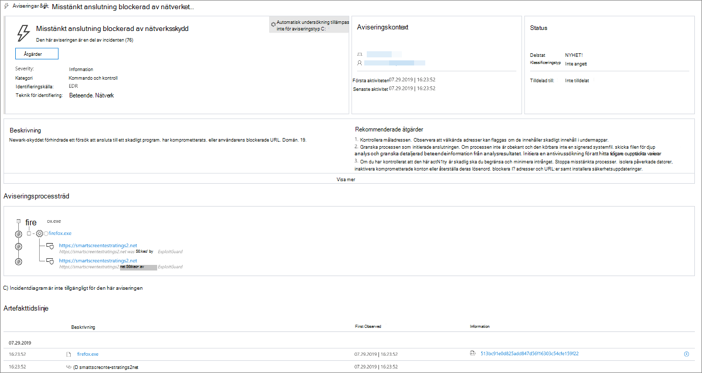
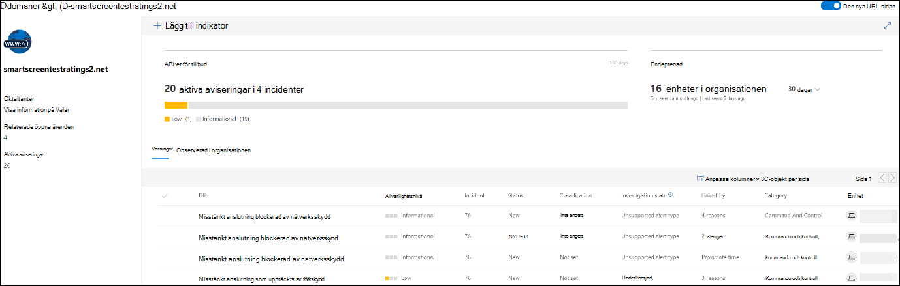
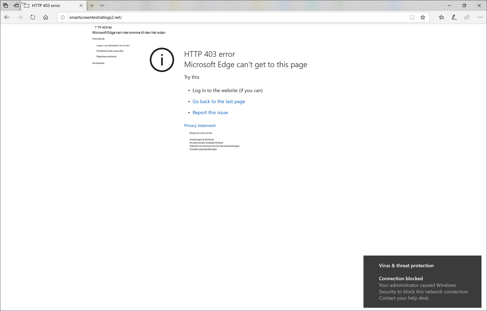
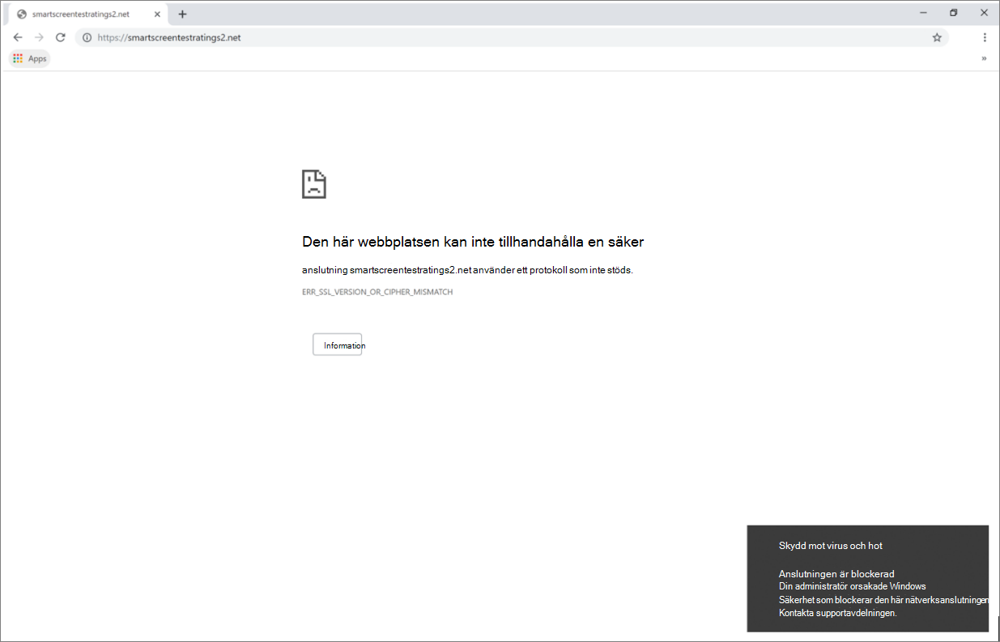

# Svara på webbhotRespond to web threats

[!INCLUDE [Microsoft 365 Defender rebranding](../../includes/microsoft-defender.md)]

**Gäller för:****Applies to:**
- [Microsoft Defender för EndpointMicrosoft Defender for Endpoint](https://go.microsoft.com/fwlink/p/?linkid=2154037)
- [Microsoft 365 DefenderMicrosoft 365 Defender](https://go.microsoft.com/fwlink/?linkid=2118804)

>Vill du uppleva Microsoft Defender för Slutpunkt?Want to experience Microsoft Defender for Endpoint? [Registrera dig för en kostnadsfri utvärderingsversion.Sign up for a free trial.](https://www.microsoft.com/microsoft-365/windows/microsoft-defender-atp?ocid=docs-wdatp-main-abovefoldlink&rtc=1)

Med webbskydd i Microsoft Defender för Slutpunkt kan du effektivt undersöka och svara på aviseringar som rör skadliga webbplatser och webbplatser i din anpassade indikatorlista.Web protection in Microsoft Defender for Endpoint lets you efficiently investigate and respond to alerts related to malicious websites and websites in your custom indicator list.

## Visa varningar för webbhotView web threat alerts
Microsoft Defender för Slutpunkt genererar följande [aviseringar om](manage-alerts.md) skadlig eller misstänkt webbaktivitet:Microsoft Defender for Endpoint generates the following [alerts](manage-alerts.md) for malicious or suspicious web activity:
- **Misstänkt anslutning som blockeras** av nätverksskydd – den här aviseringen genereras när ett  försök att komma åt en skadlig webbplats eller en webbplats i den anpassade indikatorlistan stoppas av nätverksskydd i *blockeringsläge***Suspicious connection blocked by network protection** — this alert is generated when an attempt to access a malicious website or a website in your custom indicator list is *stopped* by network protection in *block* mode
- **Misstänkt anslutning som upptäckts** av nätverksskydd – den här varningen genereras när ett försök att komma åt en skadlig webbplats eller en webbplats i den anpassade indikatorlistan identifieras av nätverksskyddet i *granskningsläge***Suspicious connection detected by network protection** — this alert is generated when an attempt to access a malicious website or a website in your custom indicator list is detected by network protection in *audit only* mode

Varje avisering ger följande information:Each alert provides the following information: 
- Enhet som försökte komma åt den blockerade webbplatsenDevice that attempted to access the blocked website
- Program eller program som används för att skicka webbbegäranApplication or program used to send the web request
- Skadlig URL eller URL i den anpassade indikatorlistanMalicious URL or URL in the custom indicator list
- Rekommenderade åtgärder för svarareRecommended actions for responders

>[!Note]
>För att minska mängden aviseringar konsoliderar Microsoft Defender för Endpoint identifiering av webbhot för samma domän på samma enhet varje dag till en enda avisering.To reduce the volume of alerts, Microsoft Defender for Endpoint consolidates web threat detections for the same domain on the same device each day to a single alert. Endast en avisering skapas och räknas in i [skyddsrapporten för webben.](web-protection-monitoring.md)Only one alert is generated and counted into the [web protection report](web-protection-monitoring.md).

## Kontrollera webbplatsinformationInspect website details
Du kan visa mer genom att välja webbadressen eller domänen för webbplatsen i aviseringen.You can dive deeper by selecting the URL or domain of the website in the alert. Då öppnas en sida om just den URL:en eller domänen med olika information, till exempel:This opens a page about that particular URL or domain with various information, including:
- Enheter som försökte komma åt webbplatsenDevices that attempted to access website
- Incidenter och aviseringar relaterade till webbplatsenIncidents and alerts related to the website
- Hur ofta webbplatsen sågs i händelser i organisationenHow frequent the website was seen in events in your organization

    

[Läs mer om sidorna för URL- eller domänentitetLearn more about URL or domain entity pages](investigate-domain.md)

## Kontrollera enhetenInspect the device
Du kan också kontrollera vilken enhet som försökte komma åt en blockerad URL.You can also check the device that attempted to access a blocked URL. Om du väljer namnet på enheten på aviseringssidan öppnas en sida med omfattande information om enheten.Selecting the name of the device on the alert page opens a page with comprehensive information about the device.

[Läs mer om enhetsentitetssidorLearn more about device entity pages](investigate-machines.md)

## Webbläsare och Windows-meddelanden för slutanvändareWeb browser and Windows notifications for end users

Med webbskydd i Microsoft Defender för Endpoint hindras slutanvändarna från att besöka skadliga eller oönskade webbplatser med hjälp av Microsoft Edge eller andra webbläsare.With web protection in Microsoft Defender for Endpoint, your end users will be prevented from visiting malicious or unwanted websites using Microsoft Edge or other browsers. Eftersom blockering utförs av [nätverksskydd](network-protection.md)ser de ett allmänt fel från webbläsaren.Because blocking is performed by [network protection](network-protection.md), they will see a generic error from the web browser. De ser också ett meddelande från Windows.They will also see a notification from Windows.

 *Webbhot blockeras i Microsoft Edge*
*Web threat blocked on Microsoft Edge*

 *blockeras i Chrome*
*Web threat blocked on Chrome*

## Relaterade ämnenRelated topics
- [Översikt över webbskyddWeb protection overview](web-protection-overview.md)
- [Filtrering av webbinnehållWeb content filtering](web-content-filtering.md)
- [Skydd mot webbhotWeb threat protection](web-threat-protection.md)
- [Övervaka webbsäkerhetMonitor web security](web-protection-monitoring.md)
