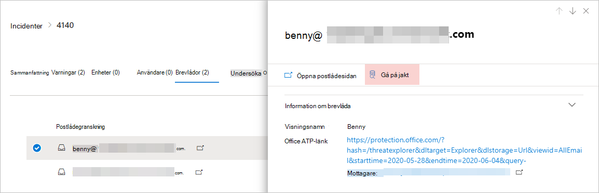

# <a name="quickly-hunt-for-entity-or-event-information-with-go-hunt"></a><span data-ttu-id="e1d38-104">Snabbt jaga efter entitets- eller händelseinformation med go-hunt</span><span class="sxs-lookup"><span data-stu-id="e1d38-104">Quickly hunt for entity or event information with go hunt</span></span>

[!INCLUDE [Microsoft 365 Defender rebranding](../includes/microsoft-defender.md)]


<span data-ttu-id="e1d38-105">**Gäller för:**</span><span class="sxs-lookup"><span data-stu-id="e1d38-105">**Applies to:**</span></span>
- <span data-ttu-id="e1d38-106">Microsoft 365 Defender</span><span class="sxs-lookup"><span data-stu-id="e1d38-106">Microsoft 365 Defender</span></span>
- <span data-ttu-id="e1d38-107">Microsoft Defender för Endpoint</span><span class="sxs-lookup"><span data-stu-id="e1d38-107">Microsoft Defender for Endpoint</span></span>

<span data-ttu-id="e1d38-108">Med *sökåtgärden* sök kan du snabbt undersöka händelser och olika entitetstyper med hjälp av kraftfulla [frågebaserade, avancerade](advanced-hunting-overview.md) sökfunktioner.</span><span class="sxs-lookup"><span data-stu-id="e1d38-108">With the *go hunt* action, you can quickly investigate events and various entity types using powerful query-based [advanced hunting](advanced-hunting-overview.md) capabilities.</span></span> <span data-ttu-id="e1d38-109">Den här åtgärden kör automatiskt en avancerad fråga för att hitta relevant information om den valda händelsen eller enheten.</span><span class="sxs-lookup"><span data-stu-id="e1d38-109">This action automatically runs an advanced hunting query to find relevant information about the selected event or entity.</span></span>

<span data-ttu-id="e1d38-110">Åtgärden *gåsök* är tillgänglig i olika delar av säkerhetscentret när händelse- eller entitetsinformation visas.</span><span class="sxs-lookup"><span data-stu-id="e1d38-110">The *go hunt* action is available in various sections of the security center whenever event or entity details are displayed.</span></span> <span data-ttu-id="e1d38-111">Du kan till exempel använda *gå jag* från följande avsnitt:</span><span class="sxs-lookup"><span data-stu-id="e1d38-111">For example, you can use *go hunt* from the following sections:</span></span>

- <span data-ttu-id="e1d38-112">På [incidentsidan kan](investigate-incidents.md#summary)du granska information om användare, enheter och många andra enheter som är kopplade till ett problem.</span><span class="sxs-lookup"><span data-stu-id="e1d38-112">In the [incident page](investigate-incidents.md#summary), you can review details about users, devices, and many other entities associated with an incident.</span></span> <span data-ttu-id="e1d38-113">När du väljer en entitet får du ytterligare information samt olika åtgärder du kan utföra på den enheten.</span><span class="sxs-lookup"><span data-stu-id="e1d38-113">As you select an entity, you get additional information as well as various actions you could take on that entity.</span></span> <span data-ttu-id="e1d38-114">I exemplet nedan är en postlåda markerad och visar information om postlådan samt alternativet för att leta efter mer information om postlådan.</span><span class="sxs-lookup"><span data-stu-id="e1d38-114">In the example below, a mailbox is selected, showing details about the mailbox as well the option to hunt for more information about the mailbox.</span></span>

    

- <span data-ttu-id="e1d38-116">På incidentsidan kan du också komma åt en lista över enheter under bevisfliken. Om du väljer en av dessa enheter kan du snabbt jaga efter information om den enheten.</span><span class="sxs-lookup"><span data-stu-id="e1d38-116">In the incident page, you can also access a list of entities under the evidence tab. Selecting one of those entities provides an option to quickly hunt for information about that entity.</span></span>

    


- <span data-ttu-id="e1d38-118">När du visar tidslinjen för en enhet kan du välja en händelse på tidslinjen om du vill visa ytterligare information om händelsen.</span><span class="sxs-lookup"><span data-stu-id="e1d38-118">When viewing the timeline for a device, you can select an event in the timeline to view additional information about that event.</span></span> <span data-ttu-id="e1d38-119">När en händelse har valts får du möjlighet att leta efter andra relevanta händelser vid avancerad sökning.</span><span class="sxs-lookup"><span data-stu-id="e1d38-119">Once an event is selected, you get the option to hunt for other relevant events in advanced hunting.</span></span>

    

<span data-ttu-id="e1d38-121">Om **du väljer Sök** efter sök eller Sök **efter** relaterade händelser passeras olika frågor, beroende på om du har valt en enhet eller en händelse.</span><span class="sxs-lookup"><span data-stu-id="e1d38-121">Selecting **Go hunt** or **Hunt for related events** passes different queries, depending on whether you've selected an entity or an event.</span></span>

## <a name="query-for-entity-information"></a><span data-ttu-id="e1d38-122">Fråga för entitetsinformation</span><span class="sxs-lookup"><span data-stu-id="e1d38-122">Query for entity information</span></span>
<span data-ttu-id="e1d38-123">När du *använder go hunt* to query för information om en användare, enhet eller någon annan typ av entitet, kontrollerar frågan alla relevanta schematabeller för alla händelser som innefattar den enheten.</span><span class="sxs-lookup"><span data-stu-id="e1d38-123">When using *go hunt* to query for information about a user, device, or any other type of entity, the query checks all relevant schema tables for any events involving that entity.</span></span> <span data-ttu-id="e1d38-124">För att resultatet ska kunna hanteras är frågan begränsad till ungefär samma tidsperiod som den tidigaste aktiviteten under de senaste 30 dagarna som innefattar enheten och som är kopplad till händelsen.</span><span class="sxs-lookup"><span data-stu-id="e1d38-124">To keep the results manageable, the query is scoped to around the same time period as the earliest activity in the past 30 days that involves the entity and is associated with the incident.</span></span>

<span data-ttu-id="e1d38-125">Här är ett exempel på sökfrågan för en enhet:</span><span class="sxs-lookup"><span data-stu-id="e1d38-125">Here is an example of the go hunt query for a device:</span></span>

```kusto
let selectedTimestamp = datetime(2020-06-02T02:06:47.1167157Z);
let deviceName = "fv-az770.example.com";
let deviceId = "device-guid";
search in (DeviceLogonEvents, DeviceProcessEvents, DeviceNetworkEvents, DeviceFileEvents, DeviceRegistryEvents, DeviceImageLoadEvents, DeviceEvents, DeviceImageLoadEvents, IdentityLogonEvents, IdentityQueryEvents)
Timestamp between ((selectedTimestamp - 1h) .. (selectedTimestamp + 1h))
and DeviceName == deviceName
// or RemoteDeviceName == deviceName
// or DeviceId == deviceId
| take 100
```
### <a name="supported-entity-types"></a><span data-ttu-id="e1d38-126">Entitetstyper som stöds</span><span class="sxs-lookup"><span data-stu-id="e1d38-126">Supported entity types</span></span>
<span data-ttu-id="e1d38-127">Du kan använda *gåsök när* du har valt någon av följande entitetstyper:</span><span class="sxs-lookup"><span data-stu-id="e1d38-127">You can use *go hunt* after selecting any of these entity types:</span></span>

- <span data-ttu-id="e1d38-128">Filer</span><span class="sxs-lookup"><span data-stu-id="e1d38-128">Files</span></span>
- <span data-ttu-id="e1d38-129">E-postmeddelanden</span><span class="sxs-lookup"><span data-stu-id="e1d38-129">Emails</span></span>
- <span data-ttu-id="e1d38-130">E-postkluster</span><span class="sxs-lookup"><span data-stu-id="e1d38-130">Email clusters</span></span>
- <span data-ttu-id="e1d38-131">Postlådor</span><span class="sxs-lookup"><span data-stu-id="e1d38-131">Mailboxes</span></span>
- <span data-ttu-id="e1d38-132">Användare</span><span class="sxs-lookup"><span data-stu-id="e1d38-132">Users</span></span>
- <span data-ttu-id="e1d38-133">Enheter</span><span class="sxs-lookup"><span data-stu-id="e1d38-133">Devices</span></span>
- <span data-ttu-id="e1d38-134">IP-adresser</span><span class="sxs-lookup"><span data-stu-id="e1d38-134">IP addresses</span></span>
- <span data-ttu-id="e1d38-135">URL:er</span><span class="sxs-lookup"><span data-stu-id="e1d38-135">URLs</span></span>

## <a name="query-for-event-information"></a><span data-ttu-id="e1d38-136">Fråga för händelseinformation</span><span class="sxs-lookup"><span data-stu-id="e1d38-136">Query for event information</span></span>
<span data-ttu-id="e1d38-137">När du *använder sökfråga* efter information om en tidslinjehändelse söker frågan i alla relevanta schematabeller efter andra händelser vid tidpunkten för den valda händelsen.</span><span class="sxs-lookup"><span data-stu-id="e1d38-137">When using *go hunt* to query for information about a timeline event, the query checks all relevant schema tables for other events around the time of the selected event.</span></span> <span data-ttu-id="e1d38-138">Följande fråga visar till exempel händelser i olika schematabeller som inträffade ungefär samma tidsperiod på samma enhet:</span><span class="sxs-lookup"><span data-stu-id="e1d38-138">For example, the following query lists events in various schema tables that occurred around the same time period on the same device:</span></span>

```kusto
// List relevant events 30 minutes before and after selected LogonAttempted event
let selectedEventTimestamp = datetime(2020-06-04T01:29:09.2496688Z);
search in (DeviceFileEvents, DeviceProcessEvents, DeviceEvents, DeviceRegistryEvents, DeviceNetworkEvents, DeviceImageLoadEvents, DeviceLogonEvents)
    Timestamp between ((selectedEventTimestamp - 30m) .. (selectedEventTimestamp + 30m))
    and DeviceId == "079ecf9c5798d249128817619606c1c47369eb3e"
| sort by Timestamp desc
| extend Relevance = iff(Timestamp == selectedEventTimestamp, "Selected event", iff(Timestamp < selectedEventTimestamp, "Earlier event", "Later event"))
| project-reorder Relevance
```

## <a name="adjust-the-query"></a><span data-ttu-id="e1d38-139">Justera frågan</span><span class="sxs-lookup"><span data-stu-id="e1d38-139">Adjust the query</span></span>
<span data-ttu-id="e1d38-140">Om du har viss kunskap [om frågespråket](advanced-hunting-query-language.md)kan du justera frågan efter dina önskemål.</span><span class="sxs-lookup"><span data-stu-id="e1d38-140">With some knowledge of the [query language](advanced-hunting-query-language.md), you can adjust the query to your preference.</span></span> <span data-ttu-id="e1d38-141">Du kan till exempel justera den här raden, som bestämmer storleken på tidsfönstret:</span><span class="sxs-lookup"><span data-stu-id="e1d38-141">For example, you can adjust this line, which determines the size of the time window:</span></span>

```kusto
Timestamp between ((selectedTimestamp - 1h) .. (selectedTimestamp + 1h))
```

<span data-ttu-id="e1d38-142">Förutom att ändra frågan för att få mer relevanta resultat kan du också:</span><span class="sxs-lookup"><span data-stu-id="e1d38-142">In addition to modifying the query to get more relevant results, you can also:</span></span>
- [<span data-ttu-id="e1d38-143">Visa resultatet som diagram</span><span class="sxs-lookup"><span data-stu-id="e1d38-143">View the results as charts</span></span>](advanced-hunting-query-results.md#view-query-results-as-a-table-or-chart)
- [<span data-ttu-id="e1d38-144">Skapa en anpassad identifieringsregel</span><span class="sxs-lookup"><span data-stu-id="e1d38-144">Create a custom detection rule</span></span>](custom-detection-rules.md)

>[!NOTE]
><span data-ttu-id="e1d38-145">Vissa tabeller i den här artikeln kanske inte är tillgängliga i Microsoft Defender för Endpoint.</span><span class="sxs-lookup"><span data-stu-id="e1d38-145">Some tables in this article might not be available in Microsoft Defender for Endpoint.</span></span> <span data-ttu-id="e1d38-146">[Aktivera Microsoft 365 Defender för](m365d-enable.md) att leta efter hot med hjälp av fler datakällor.</span><span class="sxs-lookup"><span data-stu-id="e1d38-146">[Turn on Microsoft 365 Defender](m365d-enable.md) to hunt for threats using more data sources.</span></span> <span data-ttu-id="e1d38-147">Du kan flytta dina avancerade arbetsflöden för sökning från Microsoft Defender för Slutpunkt till Microsoft 365 Defender genom att följa stegen i Migrera avancerade sökfrågor från [Microsoft Defender för Slutpunkt.](advanced-hunting-migrate-from-mde.md)</span><span class="sxs-lookup"><span data-stu-id="e1d38-147">You can move your advanced hunting workflows from Microsoft Defender for Endpoint to Microsoft 365 Defender by following the steps in [Migrate advanced hunting queries from Microsoft Defender for Endpoint](advanced-hunting-migrate-from-mde.md).</span></span>

## <a name="related-topics"></a><span data-ttu-id="e1d38-148">Relaterade ämnen</span><span class="sxs-lookup"><span data-stu-id="e1d38-148">Related topics</span></span>
- [<span data-ttu-id="e1d38-149">Översikt över avancerad jakt</span><span class="sxs-lookup"><span data-stu-id="e1d38-149">Advanced hunting overview</span></span>](advanced-hunting-overview.md)
- [<span data-ttu-id="e1d38-150">Lär dig frågespråket</span><span class="sxs-lookup"><span data-stu-id="e1d38-150">Learn the query language</span></span>](advanced-hunting-query-language.md)
- [<span data-ttu-id="e1d38-151">Arbeta med frågeresultat</span><span class="sxs-lookup"><span data-stu-id="e1d38-151">Work with query results</span></span>](advanced-hunting-query-results.md)
- [<span data-ttu-id="e1d38-152">Anpassade regler för identifiering</span><span class="sxs-lookup"><span data-stu-id="e1d38-152">Custom detection rules</span></span>](custom-detection-rules.md)
