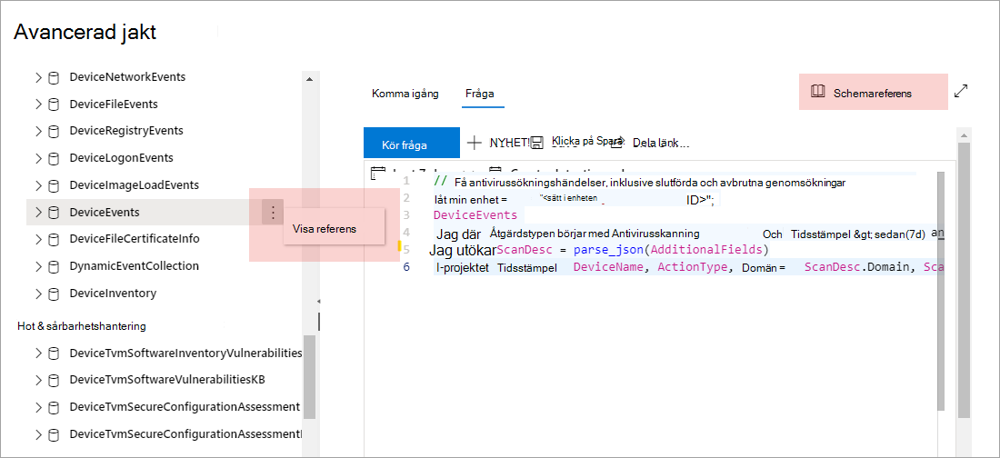

# Förstå det avancerade sökschematUnderstand the advanced hunting schema

[!INCLUDE [Microsoft 365 Defender rebranding](../includes/microsoft-defender.md)]

**Gäller för:****Applies to:**
- Microsoft 365 DefenderMicrosoft 365 Defender

[!INCLUDE [Prerelease information](../includes/prerelease.md)]

Det [avancerade sökschemat](advanced-hunting-overview.md) består av flera tabeller som innehåller händelseinformation eller information om enheter, aviseringar, identiteter och andra entitetstyper.The [advanced hunting](advanced-hunting-overview.md) schema is made up of multiple tables that provide either event information or information about devices, alerts, identities, and other entity types. För att skapa frågor som sträcker sig över flera tabeller effektivt måste du förstå tabellerna och kolumnerna i det avancerade sökschemat.To effectively build queries that span multiple tables, you need to understand the tables and the columns in the advanced hunting schema.

## Hämta schemainformation i säkerhetscentretGet schema information in the security center
När du skapar frågor kan du använda den inbyggda schemareferensen för att snabbt få följande information om varje tabell i schemat:While constructing queries, use the built-in schema reference to quickly get the following information about each table in the schema:

- **Tabellbeskrivning**– typ av data som finns i tabellen och källan till dessa data.**Tables description**—type of data contained in the table and the source of that data.
- **Kolumner**– alla kolumner i tabellen.**Columns**—all the columns in the table.
- **Åtgärdstyper**– möjliga värden i `ActionType` kolumnen som representerar de händelsetyper som stöds av tabellen.**Action types**—possible values in the `ActionType` column representing the event types supported by the table. Den här informationen tillhandahålls endast för tabeller som innehåller händelseinformation.This information is provided only for tables that contain event information.
- **Exempelfråga**– exempelfrågor som innehåller hur tabellen kan användas.**Sample query**—example queries that feature how the table can be utilized.

### Komma åt schemareferensenAccess the schema reference
Om du snabbt vill komma åt schemareferensen **väljer du åtgärden** Visa referens bredvid tabellnamnet i schemarepresentationen.To quickly access the schema reference, select the **View reference** action next to the table name in the schema representation. Du kan också välja **Schemareferens om** du vill söka efter en tabell.You can also select **Schema reference** to search for a table.   

 

## Lär dig schematabellernaLearn the schema tables
I följande referens visas alla tabeller i schemat.The following reference lists all the tables in the schema. Varje tabellnamn länkar till en sida som beskriver kolumnnamnen för tabellen.Each table name links to a page describing the column names for that table. Tabell- och kolumnnamn visas också i säkerhetscentret som en del av schemarepresentationen på den avancerade sökskärmen.Table and column names are also listed in the security center as part of the schema representation on the advanced hunting screen.

| TabellnamnTable name | BeskrivningDescription |
|------------|-------------|
| **[AlertEvidence](advanced-hunting-alertevidence-table.md)****[AlertEvidence](advanced-hunting-alertevidence-table.md)** | Filer, IP-adresser, URL:er, användare eller enheter som associeras med aviseringarFiles, IP addresses, URLs, users, or devices associated with alerts |
| **[AlertInfo](advanced-hunting-alertinfo-table.md)****[AlertInfo](advanced-hunting-alertinfo-table.md)** | Varningar från Microsoft Defender för Slutpunkt, Microsoft Defender för Office 365, Microsoft Cloud App Security och Microsoft Defender för identitet, inklusive information om allvarlighetsgrad och hotkategoriseringAlerts from Microsoft Defender for Endpoint, Microsoft Defender for Office 365, Microsoft Cloud App Security, and Microsoft Defender for Identity, including severity information and threat categorization  |
| **[CloudAppEvents](advanced-hunting-cloudappevents-table.md)****[CloudAppEvents](advanced-hunting-cloudappevents-table.md)** | Händelser som innefattar konton och objekt i Office 365 och andra molnappar och -tjänsterEvents involving accounts and objects in Office 365 and other cloud apps and services |
| **[DeviceEvents](advanced-hunting-deviceevents-table.md)****[DeviceEvents](advanced-hunting-deviceevents-table.md)** | Flera händelsetyper, bland annat händelser som utlöses av säkerhetskontroller, Windows Defender Antivirus och sårbarhetsskyddMultiple event types, including events triggered by security controls such as Windows Defender Antivirus and exploit protection |
| **[DeviceFileCertificateInfo](advanced-hunting-DeviceFileCertificateInfo-table.md)****[DeviceFileCertificateInfo](advanced-hunting-DeviceFileCertificateInfo-table.md)** | Certifikatinformation för signerade filer som erhållits från certifikatverifieringshändelser i slutpunkterCertificate information of signed files obtained from certificate verification events on endpoints |
| **[DeviceFileEvents](advanced-hunting-devicefileevents-table.md)****[DeviceFileEvents](advanced-hunting-devicefileevents-table.md)** | Skapa, ändra filer och andra filsystemhändelserFile creation, modification, and other file system events |
| **[DeviceImageLoadEvents](advanced-hunting-deviceimageloadevents-table.md)****[DeviceImageLoadEvents](advanced-hunting-deviceimageloadevents-table.md)** | DLL-inläsningshändelserDLL loading events |
| **[DeviceInfo](advanced-hunting-deviceinfo-table.md)****[DeviceInfo](advanced-hunting-deviceinfo-table.md)** | Maskininformation, inklusive OS-informationMachine information, including OS information |
| **[DeviceLogonEvents](advanced-hunting-devicelogonevents-table.md)****[DeviceLogonEvents](advanced-hunting-devicelogonevents-table.md)** | Inloggningar och andra autentiseringshändelser på enheterSign-ins and other authentication events on devices |
| **[DeviceNetworkEvents](advanced-hunting-devicenetworkevents-table.md)****[DeviceNetworkEvents](advanced-hunting-devicenetworkevents-table.md)** | Nätverksanslutning och relaterade händelserNetwork connection and related events |
| **[DeviceNetworkInfo](advanced-hunting-devicenetworkinfo-table.md)****[DeviceNetworkInfo](advanced-hunting-devicenetworkinfo-table.md)** | Nätverksegenskaper för enheter, inklusive fysiska adaptrar, IP- och MAC-adresser, samt anslutna nätverk och domänerNetwork properties of devices, including physical adapters, IP and MAC addresses, as well as connected networks and domains |
| **[DeviceProcessEvents](advanced-hunting-deviceprocessevents-table.md)****[DeviceProcessEvents](advanced-hunting-deviceprocessevents-table.md)** | Skapa processer och relaterade händelserProcess creation and related events |
| **[DeviceRegistryEvents](advanced-hunting-deviceregistryevents-table.md)****[DeviceRegistryEvents](advanced-hunting-deviceregistryevents-table.md)** | Skapa och ändra registerposterCreation and modification of registry entries |
| **[DeviceTvmSecureConfigurationAssessment](advanced-hunting-devicetvmsecureconfigurationassessment-table.md)****[DeviceTvmSecureConfigurationAssessment](advanced-hunting-devicetvmsecureconfigurationassessment-table.md)** | Hot & sårbarhetshanteringsutvärderingshändelser, som anger status för olika säkerhetskonfigurationer på enheterThreat & Vulnerability Management assessment events, indicating the status of various security configurations on devices |
| **[DeviceTvmSecureConfigurationAssessmentKB](advanced-hunting-devicetvmsecureconfigurationassessmentkb-table.md)****[DeviceTvmSecureConfigurationAssessmentKB](advanced-hunting-devicetvmsecureconfigurationassessmentkb-table.md)** | Kunskapsbas av olika säkerhetskonfigurationer som används av Threat & Vulnerability Management för att utvärdera enheter; inkluderar mappningar till olika standarder och riktvärdeKnowledge base of various security configurations used by Threat & Vulnerability Management to assess devices; includes mappings to various standards and benchmarks  |
| **[DeviceTvmSoftwareInventory](advanced-hunting-devicetvmsoftwareinventory-table.md)****[DeviceTvmSoftwareInventory](advanced-hunting-devicetvmsoftwareinventory-table.md)** | Inventering av programvara installerad på enheter, inklusive deras versionsinformation och status vid slutet av supportenInventory of software installed on devices, including their version information and end-of-support status |
| **[DeviceTvmSoftwareVulnerabilities](advanced-hunting-devicetvmsoftwarevulnerabilities-table.md)****[DeviceTvmSoftwareVulnerabilities](advanced-hunting-devicetvmsoftwarevulnerabilities-table.md)** | Sårbarheter i programvaran som finns på enheter och listan över tillgängliga säkerhetsuppdateringar som är tillgängliga för varje sårbarhetSoftware vulnerabilities found on devices and the list of available security updates that address each vulnerability |
| **[DeviceTvmSoftwareVulnerabilitiesKB](advanced-hunting-devicetvmsoftwarevulnerabilitieskb-table.md)****[DeviceTvmSoftwareVulnerabilitiesKB](advanced-hunting-devicetvmsoftwarevulnerabilitieskb-table.md)** | Kunskapsbas för offentligt avslöjat säkerhetsproblem, inklusive om sårbarhetskod är offentligt tillgängligKnowledge base of publicly disclosed vulnerabilities, including whether exploit code is publicly available |
| **[EmailAttachmentInfo](advanced-hunting-emailattachmentinfo-table.md)****[EmailAttachmentInfo](advanced-hunting-emailattachmentinfo-table.md)** | Information om bifogade filer i e-postmeddelandenInformation about files attached to emails |
| **[EmailEvents](advanced-hunting-emailevents-table.md)****[EmailEvents](advanced-hunting-emailevents-table.md)** | Microsoft 365 e-posthändelser, inklusive e-postleverans och blockeringshändelserMicrosoft 365 email events, including email delivery and blocking events |
| **[EmailPostDeliveryEvents](advanced-hunting-emailpostdeliveryevents-table.md)****[EmailPostDeliveryEvents](advanced-hunting-emailpostdeliveryevents-table.md)** | Säkerhetshändelser som inträffar efter leveransen, Microsoft 365 e-postmeddelanden har levererats till mottagarens postlådaSecurity events that occur post-delivery, after Microsoft 365 has delivered the emails to the recipient mailbox |
| **[EmailUrlInfo](advanced-hunting-emailurlinfo-table.md)****[EmailUrlInfo](advanced-hunting-emailurlinfo-table.md)** | Information om URL:er för e-postmeddelandenInformation about URLs on emails |
| **[IdentityDirectoryEvents](advanced-hunting-identitydirectoryevents-table.md)****[IdentityDirectoryEvents](advanced-hunting-identitydirectoryevents-table.md)** | Händelser som innefattar en lokal domänkontrollant som kör Active Directory (AD).Events involving an on-premises domain controller running Active Directory (AD). Den här tabellen omfattar ett antal identitetsrelaterade händelser och systemhändelser på domänkontrollanten.This table covers a range of identity-related events and system events on the domain controller. |
| **[IdentityInfo](advanced-hunting-identityinfo-table.md)****[IdentityInfo](advanced-hunting-identityinfo-table.md)** | Kontoinformation från olika källor, bland annat Azure Active DirectoryAccount information from various sources, including Azure Active Directory |
| **[IdentityLogonEvents](advanced-hunting-identitylogonevents-table.md)****[IdentityLogonEvents](advanced-hunting-identitylogonevents-table.md)** | Autentiseringshändelser i Active Directory och Microsoft-onlinetjänsterAuthentication events on Active Directory and Microsoft online services |
| **[IdentityQueryEvents](advanced-hunting-identityqueryevents-table.md)****[IdentityQueryEvents](advanced-hunting-identityqueryevents-table.md)** | Frågor för Active Directory-objekt, till exempel användare, grupper, enheter och domänerQueries for Active Directory objects, such as users, groups, devices, and domains |

## Relaterade ämnenRelated topics
- [Översikt över avancerad jaktAdvanced hunting overview](advanced-hunting-overview.md)
- [Lär dig frågespråketLearn the query language](advanced-hunting-query-language.md)
- [Arbeta med frågeresultatWork with query results](advanced-hunting-query-results.md)
- [Använda delade frågorUse shared queries](advanced-hunting-shared-queries.md)
- [Jaga över olika enheter, e-postmeddelanden, appar och identiteterHunt across devices, emails, apps, and identities](advanced-hunting-query-emails-devices.md)
- [Använda metodtips för frågorApply query best practices](advanced-hunting-best-practices.md)
