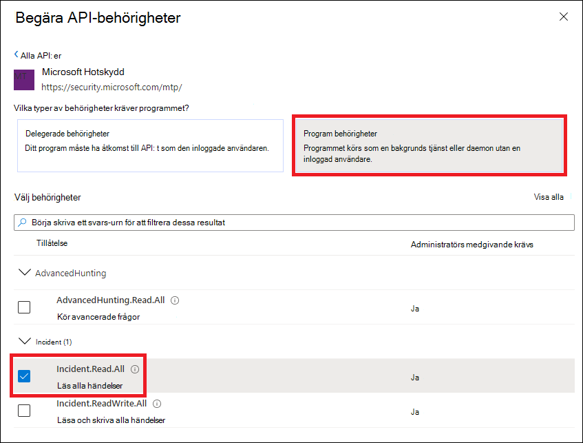
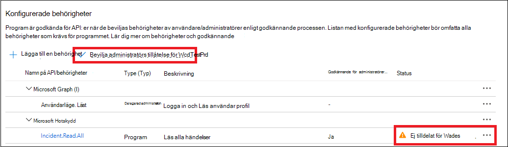
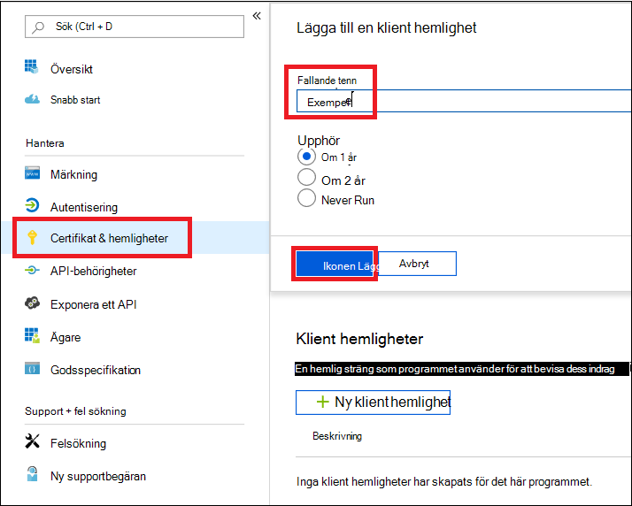

# <a name="create-an-app-to-access-microsoft-365-defender-without-a-user"></a><span data-ttu-id="15966-104">Skapa en app för att komma åt Microsoft 365 Defender utan en användare</span><span class="sxs-lookup"><span data-stu-id="15966-104">Create an app to access Microsoft 365 Defender without a user</span></span>

[!INCLUDE [Microsoft 365 Defender rebranding](../includes/microsoft-defender.md)]

<span data-ttu-id="15966-105">**Gäller för:**</span><span class="sxs-lookup"><span data-stu-id="15966-105">**Applies to:**</span></span>

- <span data-ttu-id="15966-106">Microsoft 365 Defender</span><span class="sxs-lookup"><span data-stu-id="15966-106">Microsoft 365 Defender</span></span>

> [!IMPORTANT]
> <span data-ttu-id="15966-107">En del information gäller förinstallerad produkt som kan ha ändrats mycket innan den släpps kommersiellt.</span><span class="sxs-lookup"><span data-stu-id="15966-107">Some information relates to prereleased product which may be substantially modified before it's commercially released.</span></span> <span data-ttu-id="15966-108">Microsoft lämnar inga garantier, uttryckliga eller underförstådda, med avseende på den information som anges här.</span><span class="sxs-lookup"><span data-stu-id="15966-108">Microsoft makes no warranties, express or implied, with respect to the information provided here.</span></span>

<span data-ttu-id="15966-109">På den här sidan beskrivs hur du skapar ett program för att få programåtkomst till Microsoft 365 Defender utan en definierad användare, till exempel om du skapar ett bakgrundsprogram eller en bakgrundstjänst.</span><span class="sxs-lookup"><span data-stu-id="15966-109">This page describes how to create an application to get programmatic access to Microsoft 365 Defender without a defined user—for example, if you're creating a daemon or background service.</span></span>

<span data-ttu-id="15966-110">Om du behöver programmeringsåtkomst till Microsoft 365 Defender för en eller flera användares räkning kan du läsa Skapa en app för att få åtkomst till [Microsoft 365 Defender-API:er](api-create-app-user-context.md) åt en användare och Skapa en app med partneråtkomst till [Microsoft 365 Defender-API:er.](api-partner-access.md)</span><span class="sxs-lookup"><span data-stu-id="15966-110">If you need programmatic access to Microsoft 365 Defender on behalf of one or more users, see [Create an app to access Microsoft 365 Defender APIs on behalf of a user](api-create-app-user-context.md) and [Create an app with partner access to Microsoft 365 Defender APIs](api-partner-access.md).</span></span> <span data-ttu-id="15966-111">Om du är osäker på vilken typ av åtkomst du behöver kan du gå till [Komma igång.](api-access.md)</span><span class="sxs-lookup"><span data-stu-id="15966-111">If you're not sure which kind of access you need, see [Get started](api-access.md).</span></span>

<span data-ttu-id="15966-112">Microsoft 365 Defender visar mycket av sina data och åtgärder via en uppsättning programmässiga API:er.</span><span class="sxs-lookup"><span data-stu-id="15966-112">Microsoft 365 Defender exposes much of its data and actions through a set of programmatic APIs.</span></span> <span data-ttu-id="15966-113">De här API:erna hjälper dig att automatisera arbetsflöden och utnyttja funktionerna i Microsoft 365 Defender.</span><span class="sxs-lookup"><span data-stu-id="15966-113">Those APIs help you automate workflows and make use of Microsoft 365 Defender's capabilities.</span></span> <span data-ttu-id="15966-114">Den här API-åtkomsten kräver OAuth2.0-autentisering.</span><span class="sxs-lookup"><span data-stu-id="15966-114">This API access requires OAuth2.0 authentication.</span></span> <span data-ttu-id="15966-115">Mer information finns i [OAuth 2.0 Auktoriseringskodflöde](/azure/active-directory/develop/active-directory-v2-protocols-oauth-code).</span><span class="sxs-lookup"><span data-stu-id="15966-115">For more information, see [OAuth 2.0 Authorization Code Flow](/azure/active-directory/develop/active-directory-v2-protocols-oauth-code).</span></span>

<span data-ttu-id="15966-116">I allmänhet måste du vidta följande steg för att använda följande API:er:</span><span class="sxs-lookup"><span data-stu-id="15966-116">In general, you'll need to take the following steps to use these APIs:</span></span>

- <span data-ttu-id="15966-117">Skapa ett Azure Active Directory-program (Azure AD).</span><span class="sxs-lookup"><span data-stu-id="15966-117">Create an Azure Active Directory (Azure AD) application.</span></span>
- <span data-ttu-id="15966-118">Hämta en åtkomsttoken med det här programmet.</span><span class="sxs-lookup"><span data-stu-id="15966-118">Get an access token using this application.</span></span>
- <span data-ttu-id="15966-119">Använd tokenet för att få åtkomst till Microsoft 365 Defender API.</span><span class="sxs-lookup"><span data-stu-id="15966-119">Use the token to access Microsoft 365 Defender API.</span></span>

<span data-ttu-id="15966-120">I den här artikeln förklaras hur du:</span><span class="sxs-lookup"><span data-stu-id="15966-120">This article explains how to:</span></span>

- <span data-ttu-id="15966-121">Skapa ett Azure AD-program</span><span class="sxs-lookup"><span data-stu-id="15966-121">Create an Azure AD application</span></span>
- <span data-ttu-id="15966-122">Hämta en åtkomsttoken till Microsoft 365 Defender</span><span class="sxs-lookup"><span data-stu-id="15966-122">Get an access token to Microsoft 365 Defender</span></span>
- <span data-ttu-id="15966-123">Verifiera token.</span><span class="sxs-lookup"><span data-stu-id="15966-123">Validate the token.</span></span>

## <a name="create-an-app"></a><span data-ttu-id="15966-124">Skapa en app</span><span class="sxs-lookup"><span data-stu-id="15966-124">Create an app</span></span>

1. <span data-ttu-id="15966-125">Logga in i [Azure](https://portal.azure.com) som en användare med **rollen Global** administratör.</span><span class="sxs-lookup"><span data-stu-id="15966-125">Sign in to [Azure](https://portal.azure.com) as a user with the **Global Administrator** role.</span></span>

2. <span data-ttu-id="15966-126">Gå till **Azure Active Directory-appregistreringar**  >    >  **Ny registrering.**</span><span class="sxs-lookup"><span data-stu-id="15966-126">Navigate to **Azure Active Directory** > **App registrations** > **New registration**.</span></span>

   

3. <span data-ttu-id="15966-128">Välj ett namn för programmet i formuläret och välj sedan **Registrera**.</span><span class="sxs-lookup"><span data-stu-id="15966-128">In the form, choose a name for your application, then select **Register**.</span></span>

4. <span data-ttu-id="15966-129">På programsidan väljer du **API-behörigheter** Lägg till  >    >  **behörighetS-API:er** som min organisation använder >, skriver Microsoft Threat Protection och väljer **Microsoft Threat Protection**.</span><span class="sxs-lookup"><span data-stu-id="15966-129">On your application page, select **API Permissions** > **Add permission** > **APIs my organization uses** >, type **Microsoft Threat Protection**, and select **Microsoft Threat Protection**.</span></span> <span data-ttu-id="15966-130">Appen kan nu komma åt Microsoft 365 Defender.</span><span class="sxs-lookup"><span data-stu-id="15966-130">Your app can now access Microsoft 365 Defender.</span></span>

   > [!TIP]
   > <span data-ttu-id="15966-131">*Microsoft Threat Protection* är ett tidigare namn för Microsoft 365 Defender och visas inte i den ursprungliga listan.</span><span class="sxs-lookup"><span data-stu-id="15966-131">*Microsoft Threat Protection* is a former name for Microsoft 365 Defender, and will not appear in the original list.</span></span> <span data-ttu-id="15966-132">Du måste börja skriva namnet i textrutan för att det ska visas.</span><span class="sxs-lookup"><span data-stu-id="15966-132">You need to start writing its name in the text box to see it appear.</span></span>

   

5. <span data-ttu-id="15966-134">Välj **Programbehörigheter.**</span><span class="sxs-lookup"><span data-stu-id="15966-134">Select **Application permissions**.</span></span> <span data-ttu-id="15966-135">Välj relevanta behörigheter för ditt scenario (till exempel **Incident.Läsa.Alla)** och välj sedan Lägg **till behörigheter.**</span><span class="sxs-lookup"><span data-stu-id="15966-135">Choose the relevant permissions for your scenario (for example, **Incident.Read.All**), and then select **Add permissions**.</span></span>

   

    > [!NOTE]
    > <span data-ttu-id="15966-137">Du måste välja rätt behörighet för ditt scenario.</span><span class="sxs-lookup"><span data-stu-id="15966-137">You need to select the relevant permissions for your scenario.</span></span> <span data-ttu-id="15966-138">*Läs alla incidenter* är bara ett exempel.</span><span class="sxs-lookup"><span data-stu-id="15966-138">*Read all incidents* is just an example.</span></span> <span data-ttu-id="15966-139">Information om vilken behörighet du behöver finns i avsnittet **Behörigheter i** det API du vill anropa.</span><span class="sxs-lookup"><span data-stu-id="15966-139">To determine which permission you need, please look at the **Permissions** section in the API you want to call.</span></span>
    >
    > <span data-ttu-id="15966-140">Om du till exempel [vill köra avancerade frågor](api-advanced-hunting.md)väljer du behörigheten Kör avancerade frågor. om [du vill isolera en](/windows/security/threat-protection/microsoft-defender-atp/isolate-machine)enhet väljer du behörigheten "Isolera dator".</span><span class="sxs-lookup"><span data-stu-id="15966-140">For instance, to [run advanced queries](api-advanced-hunting.md), select the 'Run advanced queries' permission; to [isolate a device](/windows/security/threat-protection/microsoft-defender-atp/isolate-machine), select the 'Isolate machine' permission.</span></span>

6. <span data-ttu-id="15966-141">Välj **Bevilja administratörsmedgivande**.</span><span class="sxs-lookup"><span data-stu-id="15966-141">Select **Grant admin consent**.</span></span> <span data-ttu-id="15966-142">Varje gång du lägger till en behörighet måste du välja **Ge administratörsmedgivande** för att den ska gälla.</span><span class="sxs-lookup"><span data-stu-id="15966-142">Every time you add a permission, you must select **Grant admin consent** for it to take effect.</span></span>

    

7. <span data-ttu-id="15966-144">Om du vill lägga till en hemligt i programmet väljer **du Certifikat &,** lägger till en beskrivning till hemligheten och väljer sedan Lägg **till**.</span><span class="sxs-lookup"><span data-stu-id="15966-144">To add a secret to the application, select **Certificates & secrets**, add a description to the secret, then select **Add**.</span></span>

    > [!TIP]
    > <span data-ttu-id="15966-145">När du har **valt Lägg** till väljer du kopiera **det genererade hemliga värdet**.</span><span class="sxs-lookup"><span data-stu-id="15966-145">After you select **Add**, select **copy the generated secret value**.</span></span> <span data-ttu-id="15966-146">Du kommer inte att kunna hämta det hemliga värdet när du har lämnat.</span><span class="sxs-lookup"><span data-stu-id="15966-146">You won't be able to retrieve the secret value after you leave.</span></span>

    

8. <span data-ttu-id="15966-148">Spela in ditt program-ID och ditt klient-ID på ett säkert ställe.</span><span class="sxs-lookup"><span data-stu-id="15966-148">Record your application ID and your tenant ID somewhere safe.</span></span> <span data-ttu-id="15966-149">De visas under Översikt **på** din programsida.</span><span class="sxs-lookup"><span data-stu-id="15966-149">They're listed under **Overview** on your application page.</span></span>

   

9. <span data-ttu-id="15966-151">Endast för **Microsoft 365 Defender-partner:** Följ de här anvisningarna för partneråtkomst via Microsoft 365 Defender-API:er, ange att appen ska ha flera klientorganisationsklienter så att den blir tillgänglig i alla klientorganisationen när du har fått administratörsmedgivande. [](./api-partner-access.md)</span><span class="sxs-lookup"><span data-stu-id="15966-151">**For Microsoft 365 Defender Partners only**: [Follow these instructions](./api-partner-access.md) for partner access through the Microsoft 365 Defender APIs, set your app to be multi-tenant, so it can be available in all tenants once you receive admin consent.</span></span> <span data-ttu-id="15966-152">Partneråtkomst **krävs för** appar från tredje part – till exempel om du skapar ett program som ska köras i flera kunders klientorganisation.</span><span class="sxs-lookup"><span data-stu-id="15966-152">Partner access is **required** for third-party apps—for example, if you create an app that is intended to run in multiple customers' tenants.</span></span> <span data-ttu-id="15966-153">Det är **inte obligatoriskt** om du skapar en tjänst som du bara vill köra i klientorganisationen, till exempel ett program för din egen användning som bara kommer att interagera med dina egna data.</span><span class="sxs-lookup"><span data-stu-id="15966-153">It is **not required** if you create a service that you want to run in your tenant only, such as an application for your own usage that will only interact with your own data.</span></span> <span data-ttu-id="15966-154">Så här anger du att programmet ska ha flera innehavare:</span><span class="sxs-lookup"><span data-stu-id="15966-154">To set your app to be multi-tenant:</span></span>

    - <span data-ttu-id="15966-155">Gå till **Autentisering** och lägg till https://portal.azure.com som Redirect **URI.**</span><span class="sxs-lookup"><span data-stu-id="15966-155">Go to **Authentication**, and add https://portal.azure.com as the **Redirect URI**.</span></span>

    - <span data-ttu-id="15966-156">Längst ned på **sidan,** under Kontotyper  som stöds, väljer du Konton i ett organisationskatalogprograms medgivande för appen med flera innehavare.</span><span class="sxs-lookup"><span data-stu-id="15966-156">On the bottom of the page, under **Supported account types**, select the **Accounts in any organizational directory** application consent for your multi-tenant app.</span></span>

    <span data-ttu-id="15966-157">Eftersom programmet interagerar med Microsoft 365 Defender åt dina användare måste det godkännas för varje klientorganisation för vilken du tänker använda det.</span><span class="sxs-lookup"><span data-stu-id="15966-157">Since your application interacts with Microsoft 365 Defender on behalf of your users, it needs be approved for every tenant on which you intend to use it.</span></span>

    <span data-ttu-id="15966-158">Den globala Active Directory-administratören för varje klientorganisation måste välja länken för medgivande och godkänna appen.</span><span class="sxs-lookup"><span data-stu-id="15966-158">The Active Directory global admin for each tenant needs to select the consent link and approve your app.</span></span>

    <span data-ttu-id="15966-159">Medgivandelänken har följande struktur:</span><span class="sxs-lookup"><span data-stu-id="15966-159">The consent link has the following structure:</span></span>

    ```http
    https://login.microsoftonline.com/common/oauth2/authorize?prompt=consent&client_id=<00000000-0000-0000-0000-000000000000>&response_type=code&sso_reload=true
    ```

    <span data-ttu-id="15966-160">Siffrorna ska `00000000-0000-0000-0000-000000000000` ersättas med ditt Program-ID.</span><span class="sxs-lookup"><span data-stu-id="15966-160">The digits `00000000-0000-0000-0000-000000000000` should be replaced with your Application ID.</span></span>  

<span data-ttu-id="15966-161">**Klart!**</span><span class="sxs-lookup"><span data-stu-id="15966-161">**Done!**</span></span> <span data-ttu-id="15966-162">Ett program har registrerats!</span><span class="sxs-lookup"><span data-stu-id="15966-162">You've successfully registered an application!</span></span> <span data-ttu-id="15966-163">Se exempel nedan för insamling och validering av token.</span><span class="sxs-lookup"><span data-stu-id="15966-163">See examples below for token acquisition and validation.</span></span>

## <a name="get-an-access-token"></a><span data-ttu-id="15966-164">Hämta en åtkomsttoken</span><span class="sxs-lookup"><span data-stu-id="15966-164">Get an access token</span></span>

<span data-ttu-id="15966-165">Mer information om Azure Active Directory-token finns i [självstudiekursen för Azure AD.](/azure/active-directory/develop/active-directory-v2-protocols-oauth-client-creds)</span><span class="sxs-lookup"><span data-stu-id="15966-165">For more information on Azure Active Directory tokens, see the [Azure AD tutorial](/azure/active-directory/develop/active-directory-v2-protocols-oauth-client-creds).</span></span>

> [!IMPORTANT]
> <span data-ttu-id="15966-166">Även om exemplen i det här avsnittet uppmuntrar dig att  klistra in i hemliga värden i testsyfte bör du aldrig hårdkoda hemligheter i ett program som körs i produktion.</span><span class="sxs-lookup"><span data-stu-id="15966-166">Although the examples in this section encourage you to paste in secret values for testing purposes, you should **never hardcode secrets** into an application running in production.</span></span> <span data-ttu-id="15966-167">En tredje part kan använda din hemligt för att komma åt resurser.</span><span class="sxs-lookup"><span data-stu-id="15966-167">A third party could use your secret to access resources.</span></span> <span data-ttu-id="15966-168">Du kan skydda dina apphemligheter med hjälp av [Azure Key Vault.](/azure/key-vault/general/about-keys-secrets-certificates)</span><span class="sxs-lookup"><span data-stu-id="15966-168">You can help keep your app's secrets secure by using [Azure Key Vault](/azure/key-vault/general/about-keys-secrets-certificates).</span></span> <span data-ttu-id="15966-169">Ett praktiskt exempel på hur du kan skydda din app finns i Hantera hemligheter i [dina serverappar med Azure Key Vault.](/learn/modules/manage-secrets-with-azure-key-vault/)</span><span class="sxs-lookup"><span data-stu-id="15966-169">For a practical example of how you can protect your app, see [Manage secrets in your server apps with Azure Key Vault](/learn/modules/manage-secrets-with-azure-key-vault/).</span></span>

### <a name="get-an-access-token-using-powershell"></a><span data-ttu-id="15966-170">Hämta en åtkomsttoken med Hjälp av PowerShell</span><span class="sxs-lookup"><span data-stu-id="15966-170">Get an access token using PowerShell</span></span>

```PowerShell
# This code gets the application context token and saves it to a file named "Latest-token.txt" under the current directory.

$tenantId = '' # Paste your directory (tenant) ID here
$clientId = '' # Paste your application (client) ID here
$appSecret = '' # Paste your own app secret here to test, then store it in a safe place, such as the Azure Key Vault!

$resourceAppIdUri = 'https://api.security.microsoft.com'
$oAuthUri = "https://login.windows.net/$tenantId/oauth2/token"

$authBody = [Ordered] @{
    resource = $resourceAppIdUri
    client_id = $clientId
    client_secret = $appSecret
    grant_type = 'client_credentials'
}

$authResponse = Invoke-RestMethod -Method Post -Uri $oAuthUri -Body $authBody -ErrorAction Stop
$token = $authResponse.access_token

Out-File -FilePath "./Latest-token.txt" -InputObject $token

return $token
```

### <a name="get-an-access-token-using-c"></a><span data-ttu-id="15966-171">Hämta en åtkomsttoken med C\#</span><span class="sxs-lookup"><span data-stu-id="15966-171">Get an access token using C\#</span></span>

> [!NOTE]
> <span data-ttu-id="15966-172">Följande kod testades med Nuget Microsoft.IdentityModel.Clients.ActiveDirectory 3.19.8.</span><span class="sxs-lookup"><span data-stu-id="15966-172">The following code was tested with Nuget Microsoft.IdentityModel.Clients.ActiveDirectory 3.19.8.</span></span>

1. <span data-ttu-id="15966-173">Skapa ett nytt konsolprogram.</span><span class="sxs-lookup"><span data-stu-id="15966-173">Create a new console application.</span></span>

1. <span data-ttu-id="15966-174">Installera NuGet [Microsoft.IdentityModel.Clients.ActiveDirectory](https://www.nuget.org/packages/Microsoft.IdentityModel.Clients.ActiveDirectory/).</span><span class="sxs-lookup"><span data-stu-id="15966-174">Install NuGet [Microsoft.IdentityModel.Clients.ActiveDirectory](https://www.nuget.org/packages/Microsoft.IdentityModel.Clients.ActiveDirectory/).</span></span>

1. <span data-ttu-id="15966-175">Lägg till följande rad:</span><span class="sxs-lookup"><span data-stu-id="15966-175">Add the following line:</span></span>

    ```C#
    using Microsoft.IdentityModel.Clients.ActiveDirectory;
    ```

1. <span data-ttu-id="15966-176">Kopiera och klistra in följande kod i programmet (glöm inte att uppdatera de tre variablerna: `tenantId` `clientId` , , `appSecret` ):</span><span class="sxs-lookup"><span data-stu-id="15966-176">Copy and paste the following code into your app (don't forget to update the three variables: `tenantId`, `clientId`, `appSecret`):</span></span>

    ```C#
    string tenantId = ""; // Paste your directory (tenant) ID here
    string clientId = ""; // Paste your application (client) ID here
    string appSecret = ""; // Paste your own app secret here to test, then store it in a safe place, such as the Azure Key Vault!

    const string authority = "https://login.windows.net";
    const string wdatpResourceId = "https://api.security.microsoft.com";

    AuthenticationContext auth = new AuthenticationContext($"{authority}/{tenantId}/");
    ClientCredential clientCredential = new ClientCredential(clientId, appSecret);
    AuthenticationResult authenticationResult = auth.AcquireTokenAsync(wdatpResourceId, clientCredential).GetAwaiter().GetResult();
    string token = authenticationResult.AccessToken;
    ```

### <a name="get-an-access-token-using-python"></a><span data-ttu-id="15966-177">Hämta en åtkomsttoken med Python</span><span class="sxs-lookup"><span data-stu-id="15966-177">Get an access token using Python</span></span>

```Python
import json
import urllib.request
import urllib.parse

tenantId = '' # Paste your directory (tenant) ID here
clientId = '' # Paste your application (client) ID here
appSecret = '' # Paste your own app secret here to test, then store it in a safe place, such as the Azure Key Vault!

url = "https://login.windows.net/%s/oauth2/token" % (tenantId)

resourceAppIdUri = 'https://api.security.microsoft.com'

body = {
    'resource' : resourceAppIdUri,
    'client_id' : clientId,
    'client_secret' : appSecret,
    'grant_type' : 'client_credentials'
}

data = urllib.parse.urlencode(body).encode("utf-8")

req = urllib.request.Request(url, data)
response = urllib.request.urlopen(req)
jsonResponse = json.loads(response.read())
aadToken = jsonResponse["access_token"]
```

### <a name="get-an-access-token-using-curl"></a><span data-ttu-id="15966-178">Få en åtkomsttoken genom att avböja</span><span class="sxs-lookup"><span data-stu-id="15966-178">Get an access token using curl</span></span>

> [!NOTE]
> <span data-ttu-id="15966-179">Avbildning är förinstallerat på Windows 10, version 1803 och senare.</span><span class="sxs-lookup"><span data-stu-id="15966-179">Curl is pre-installed on Windows 10, versions 1803 and later.</span></span> <span data-ttu-id="15966-180">För andra versioner av Windows laddar du ned och installerar verktyget direkt från den [officiella avbildningswebbplatsen](https://curl.haxx.se/windows/).</span><span class="sxs-lookup"><span data-stu-id="15966-180">For other versions of Windows, download and install the tool directly from the [official curl website](https://curl.haxx.se/windows/).</span></span>

1. <span data-ttu-id="15966-181">Öppna en kommandotolk och ange CLIENT_ID ditt Azure-program-ID.</span><span class="sxs-lookup"><span data-stu-id="15966-181">Open a command prompt, and set CLIENT_ID to your Azure application ID.</span></span>

1. <span data-ttu-id="15966-182">Ställ CLIENT_SECRET till Azure-programhemligheten.</span><span class="sxs-lookup"><span data-stu-id="15966-182">Set CLIENT_SECRET to your Azure application secret.</span></span>

1. <span data-ttu-id="15966-183">Ange TENANT_ID azure-klientorganisations-ID för kunden som vill använda appen för att få åtkomst till Microsoft 365 Defender.</span><span class="sxs-lookup"><span data-stu-id="15966-183">Set TENANT_ID to the Azure tenant ID of the customer that wants to use your app to access Microsoft 365 Defender.</span></span>

1. <span data-ttu-id="15966-184">Kör följande kommando:</span><span class="sxs-lookup"><span data-stu-id="15966-184">Run the following command:</span></span>

   ```bash
   curl -i -X POST -H "Content-Type:application/x-www-form-urlencoded" -d "grant_type=client_credentials" -d "client_id=%CLIENT_ID%" -d "scope=https://api.security.microsoft.com/.default" -d "client_secret=%CLIENT_SECRET%" "https://login.microsoftonline.com/%TENANT_ID%/oauth2/v2.0/token" -k
   ```

   <span data-ttu-id="15966-185">Ett lyckat svar ser ut så här:</span><span class="sxs-lookup"><span data-stu-id="15966-185">A successful response will look like this:</span></span>

   ```bash
   {"token_type":"Bearer","expires_in":3599,"ext_expires_in":0,"access_token":"eyJ0eXAiOiJKV1QiLCJhbGciOiJSUzI1NiIsIn <truncated> aWReH7P0s0tjTBX8wGWqJUdDA"}
   ```

## <a name="validate-the-token"></a><span data-ttu-id="15966-186">Verifiera token</span><span class="sxs-lookup"><span data-stu-id="15966-186">Validate the token</span></span>

1. <span data-ttu-id="15966-187">Kopiera och klistra in tokenet på [JSON-webbplatsen för webbtokens validator, JWT,](https://jwt.ms) för att avkoda den.</span><span class="sxs-lookup"><span data-stu-id="15966-187">Copy and paste the token into the [JSON web token validator website, JWT,](https://jwt.ms) to decode it.</span></span>

1. <span data-ttu-id="15966-188">Kontrollera att rollerna *som* anges i den avkodade token innehåller de önskade behörigheterna.</span><span class="sxs-lookup"><span data-stu-id="15966-188">Make sure that the *roles* claim within the decoded token contains the desired permissions.</span></span>

   <span data-ttu-id="15966-189">På följande bild kan du se en avkodad token som köpts från en app, med `Incidents.Read.All` `Incidents.ReadWrite.All` , och `AdvancedHunting.Read.All` behörigheter:</span><span class="sxs-lookup"><span data-stu-id="15966-189">In the following image, you can see a decoded token acquired from an app, with `Incidents.Read.All`, `Incidents.ReadWrite.All`, and `AdvancedHunting.Read.All` permissions:</span></span>

   

## <a name="use-the-token-to-access-the-microsoft-365-defender-api"></a><span data-ttu-id="15966-191">Använda token för att få åtkomst till Microsoft 365 Defender API</span><span class="sxs-lookup"><span data-stu-id="15966-191">Use the token to access the Microsoft 365 Defender API</span></span>

1. <span data-ttu-id="15966-192">Välj det API du vill använda (ärenden eller avancerad sökning).</span><span class="sxs-lookup"><span data-stu-id="15966-192">Choose the API you want to use (incidents, or advanced hunting).</span></span> <span data-ttu-id="15966-193">Mer information finns i Microsoft [365 Defender-API:er som stöds.](api-supported.md)</span><span class="sxs-lookup"><span data-stu-id="15966-193">For more information, see [Supported Microsoft 365 Defender APIs](api-supported.md).</span></span>

2. <span data-ttu-id="15966-194">I http-begäran som du håller på att skicka anger du i autentiseringsrubriken till , Bearer är auktoriseringsschemat och token som din `"Bearer" <token>` verifierade token.  </span><span class="sxs-lookup"><span data-stu-id="15966-194">In the http request you are about to send, set the authorization header to `"Bearer" <token>`, *Bearer* being the authorization scheme, and *token* being your validated token.</span></span>

3. <span data-ttu-id="15966-195">Tokenet förfaller inom en timme.</span><span class="sxs-lookup"><span data-stu-id="15966-195">The token will expire within one hour.</span></span> <span data-ttu-id="15966-196">Du kan skicka mer än en begäran under denna tid med samma token.</span><span class="sxs-lookup"><span data-stu-id="15966-196">You can send more than one request during this time with the same token.</span></span>

<span data-ttu-id="15966-197">I följande exempel visas hur du skickar en begäran om att få en lista över incidenter med **hjälp av C#**.</span><span class="sxs-lookup"><span data-stu-id="15966-197">The following example shows how to send a request to get a list of incidents **using C#**.</span></span>

```C#
    var httpClient = new HttpClient();
    var request = new HttpRequestMessage(HttpMethod.Get, "https://api.security.microsoft.com/api/incidents");

    request.Headers.Authorization = new AuthenticationHeaderValue("Bearer", token);

    var response = httpClient.SendAsync(request).GetAwaiter().GetResult();
```

## <a name="related-articles"></a><span data-ttu-id="15966-198">Relaterade artiklar</span><span class="sxs-lookup"><span data-stu-id="15966-198">Related articles</span></span>

- [<span data-ttu-id="15966-199">Översikt över Microsoft 365 Defender-API:er</span><span class="sxs-lookup"><span data-stu-id="15966-199">Microsoft 365 Defender APIs overview</span></span>](api-overview.md)
- [<span data-ttu-id="15966-200">Åtkomst till Microsoft 365 Defender-API:er</span><span class="sxs-lookup"><span data-stu-id="15966-200">Access the Microsoft 365 Defender APIs</span></span>](api-access.md)
- [<span data-ttu-id="15966-201">Skapa programmet Hello world</span><span class="sxs-lookup"><span data-stu-id="15966-201">Create a 'Hello world' application</span></span>](api-hello-world.md)
- [<span data-ttu-id="15966-202">Skapa en app för åtkomst till Microsoft 365 Defender-API:er för en användares räkning</span><span class="sxs-lookup"><span data-stu-id="15966-202">Create an app to access Microsoft 365 Defender APIs on behalf of a user</span></span>](api-create-app-user-context.md)
- [<span data-ttu-id="15966-203">Skapa en app med partner med flera klientorganisationens åtkomst till Microsoft 365 Defender-API:er</span><span class="sxs-lookup"><span data-stu-id="15966-203">Create an app with multi-tenant partner access to Microsoft 365 Defender APIs</span></span>](api-partner-access.md)
- [<span data-ttu-id="15966-204">Läs mer om API-begränsningar och licensiering</span><span class="sxs-lookup"><span data-stu-id="15966-204">Learn about API limits and licensing</span></span>](api-terms.md)
- [<span data-ttu-id="15966-205">Förstå felkoder</span><span class="sxs-lookup"><span data-stu-id="15966-205">Understand error codes</span></span>](api-error-codes.md)
- [<span data-ttu-id="15966-206">Hantera hemligheter i dina serverappar med Azure-tangentvalvet</span><span class="sxs-lookup"><span data-stu-id="15966-206">Manage secrets in your server apps with Azure Key Vault</span></span>](/learn/modules/manage-secrets-with-azure-key-vault/)
- [<span data-ttu-id="15966-207">OAuth 2.0-auktorisering för användar logga in och API-åtkomst</span><span class="sxs-lookup"><span data-stu-id="15966-207">OAuth 2.0 authorization for user sign in and API access</span></span>](/azure/active-directory/develop/active-directory-v2-protocols-oauth-code)