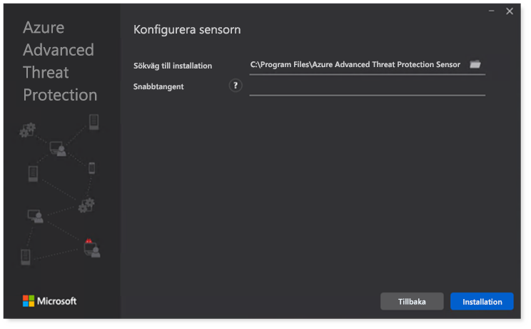
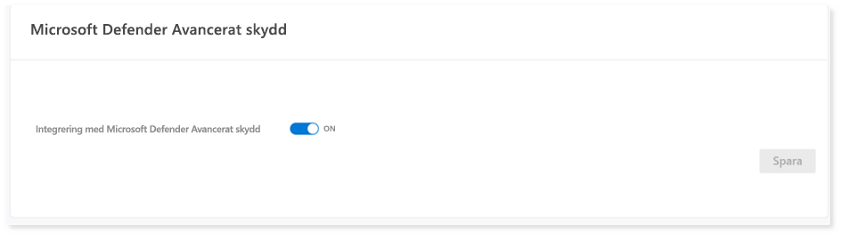
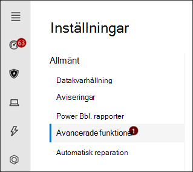

# Konfigurera Microsoft 365 Defender för testlabb- eller pilotmiljöConfigure Microsoft 365 Defender pillars for your trial lab or pilot environment

[!INCLUDE [Microsoft 365 Defender rebranding](../includes/microsoft-defender.md)]

**Gäller för:****Applies to:**
- Microsoft 365 DefenderMicrosoft 365 Defender

Att skapa Microsoft 365 Defender testlabb eller pilotmiljö och distribuera den är en trefasprocess:Creating a Microsoft 365 Defender trial lab or pilot environment and deploying it is a three-phase process:

| [Fas 1: FörberedaPhase 1: Prepare](prepare-m365d-eval.md) | [Fas 2: KonfigureraPhase 2: Set up](setup-m365deval.md) | Fas 3: IntroduktionPhase 3: Onboard |  [Tillbaka till pilotspelbokenBack to pilot playbook](m365d-pilot.md) |
|--|--|--|--|
|| |*Du är här!**You are here!* | |

Du befinner dig för närvarande i konfigurationsfasen.You're currently in the configuration phase.

Förberedelse är avgörande för en lyckad distribution.Preparation is key to any successful deployment. I den här artikeln får du vägledning i de punkter du behöver tänka på när du förbereder distributionen av Microsoft Defender för Slutpunkt.In this article, you'll be guided on the points you'll need to consider as you prepare to deploy Microsoft Defender for Endpoint.

## Microsoft 365 Defender pelareMicrosoft 365 Defender pillars
Microsoft 365 Defender av fyra pelar.Microsoft 365 Defender consists of four pillars. Även om en ände redan kan ge värde åt er nätverksorganisations säkerhet, ger de fyra Microsoft 365 Defender ger organisationen störst värde.Although one pillar can already provide value to your network organization's security, enabling the four Microsoft 365 Defender pillars will give your organization the most value.

I det här avsnittet får du veta hur du konfigurerar:This section will guide you to configure:

- Microsoft Defender för Office 365Microsoft Defender for Office 365
- Microsoft Defender for IdentityMicrosoft Defender for Identity
- Microsoft Cloud App SecurityMicrosoft Cloud App Security
- Microsoft Defender för EndpointMicrosoft Defender for Endpoint

## Konfigurera Microsoft Defender för Office 365Configure Microsoft Defender for Office 365

> [!NOTE]
> Hoppa över det här steget om du redan har aktiverat Defender för Office 365.Skip this step if you've already enabled Defender for Office 365.

Det finns en PowerShell-modul som kallas *Office 365 Advanced Threat Protection Recommended Configuration Analyzer (ORCA)* som hjälper dig att avgöra vissa av de här inställningarna.There's a PowerShell Module called the *Office 365 Advanced Threat Protection Recommended Configuration Analyzer (ORCA)* that helps determine some of these settings. När du kör som administratör i klientorganisationen får du en utvärdering av anti-spam, anti-phish och andra inställningar för att bli kontaktad av ett meddelande.When run as an administrator in your tenant, get-ORCAReport will help generate an assessment of the anti-spam, anti-phish, and other message hygiene settings. Du kan hämta den här modulen från https://www.powershellgallery.com/packages/ORCA/ .You can download this module from https://www.powershellgallery.com/packages/ORCA/.

1. Gå till [Office 365 säkerhet & Hothanteringspolicy](https://protection.office.com/homepage)  >  **i**  >  **Säkerhetscenter.**Navigate to [Office 365 Security & Compliance Center](https://protection.office.com/homepage) > **Threat management** > **Policy**.

   

2. Klicka **på Skydd mot nätfiske** och **välj** Skapa och fyll i principens namn och beskrivning.Click **Anti-phishing**, select **Create** and fill in the policy name and description. Klicka **Nästa**.Click **Next**.

   

   > [!NOTE]
   > Redigera principen för avancerad skydd mot nätfiske i Microsoft Defender för Office 365.Edit your Advanced anti-phishing policy in Microsoft Defender for Office 365. Ändra **avancerat tröskelvärde för nätfiske** **till 2 – Aggressivt.**Change **Advanced Phishing Threshold** to **2 - Aggressive**.

3. Klicka på **listrutan Lägg** till ett villkor och välj dina domäner som mottagardomän.Click the **Add a condition** drop-down menu and select your domain(s) as recipient domain. Klicka **Nästa**.Click **Next**.

   

4. Granska inställningarna.Review your settings. Klicka **på Skapa den här principen för** att bekräfta.Click **Create this policy** to confirm.

   

5. Välj **Valv bifogade** filer och välj alternativet Aktivera **ATP för SharePoint, OneDrive och Microsoft Teams.**Select **Safe Attachments** and select the **Turn on ATP for SharePoint, OneDrive, and Microsoft Teams** option.

   

6. Klicka på +-ikonen för att skapa en ny princip för säkra bifogade filer, använd den som mottagardomän för domänerna.Click the + icon to create a new safe attachment policy, apply it as recipient domain to your domains. Klicka på **Spara**.Click **Save**.

   

7. Välj sedan principen **Valv och** klicka sedan på pennikonen för att redigera standardprincipen.Next, select the **Safe Links** policy, then click the pencil icon to edit the default policy.

8. Kontrollera att alternativet **Spåra inte när användare klickar** på säkra länkar inte är markerat, medan resten av alternativen är markerade.Make sure that the **Do not track when users click safe links** option is not selected, while the rest of the options are selected. Mer [Valv finns i inställningar för Valv](/microsoft-365/security/office-365-security/recommended-settings-for-eop-and-office365) länkar.See [Safe Links settings](/microsoft-365/security/office-365-security/recommended-settings-for-eop-and-office365) for details. Klicka på **Spara**.Click **Save**.

   

9. Välj sedan **standardprincipen** för skadlig programvara och pennikonen.Next select the **Anti-malware** policy, select the default, and choose the pencil icon.

10. Klicka **Inställningar** väljer Ja och **använd standardmeddelandetexten för** att aktivera svar för identifiering av skadlig **programvara.**Click **Settings** and select **Yes and use the default notification text** to enable **Malware Detection Response**. Aktivera filtret **Vanliga typer av bifogade filer.**Turn the **Common Attachment Types Filter** on. Klicka på **Spara**.Click **Save**.

    

11. Gå till [Office 365 att & granskningsloggsökning](https://protection.office.com/homepage)i efterlevnadscenter  >    >   och aktivera granskning.Navigate to [Office 365 Security & Compliance Center](https://protection.office.com/homepage) > **Search** > **Audit log search** and turn Auditing on.

    

12. Integrera Microsoft Defender för Office 365 med Microsoft Defender för Endpoint.Integrate Microsoft Defender for Office 365 with Microsoft Defender for Endpoint. Gå till [Office 365 säkerhet &](https://protection.office.com/homepage)Säkerhetscenter – Hothanteringsutforskaren och välj Microsoft Defender för Inställningar slutpunkt i det övre högra hörnet av  >    >   skärmen. Navigate to [Office 365 Security & Compliance Center](https://protection.office.com/homepage) > **Threat management** > **Explorer** and select **Microsoft Defender for Endpoint Settings** on the upper right corner of the screen. I dialogrutan Defender för slutpunktsanslutning aktiverar du microsoft **Anslut microsoft Defender för slutpunkt.**In the Defender for Endpoint connection dialog box, turn on **Connect to Microsoft Defender for Endpoint**.

    

## Konfigurera Microsoft Defender för identitetConfigure Microsoft Defender for Identity

> [!NOTE]
> Hoppa över det här steget om du redan har aktiverat Microsoft Defender för identitetSkip this step if you've already enabled Microsoft Defender for Identity

1. Gå till [Microsoft 365 säkerhetscenter och](https://security.microsoft.com/info) > **fler resurser** Microsoft Defender för  >  **identitet.**Navigate to [Microsoft 365 Security Center](https://security.microsoft.com/info) > select **More Resources** > **Microsoft Defender for Identity**.

   

2. Klicka **på Skapa** för att starta guiden Microsoft Defender för identitet.Click **Create** to start the Microsoft Defender for Identity wizard.

   

3. Välj **Ange ett användarnamn och lösenord för att ansluta till Active Directory-skogen**.Choose **Provide a username and password to connect to your Active Directory forest**.

   

4. Ange lokala autentiseringsuppgifter för Active Directory.Enter your Active Directory on-premises credentials. Det kan vara alla användarkonton som har läsbehörighet till Active Directory.This can be any user account that has read access to Active Directory.

   

5. Välj sedan Ladda **ned sensorinstallation och** överför filen till domänkontrollanten.Next, choose **Download Sensor Setup** and transfer file to your domain controller.

   

6. Kör Microsoft Defender för konfiguration av identitets sensor och börja följa guiden.Execute the Microsoft Defender for Identity Sensor Setup and begin following the wizard.

   

7. Klicka **på** Nästa vid sensordistributionstypen.Click **Next** at the sensor deployment type.

   

8. Kopiera snabbtangenten eftersom du måste ange den nästa i guiden.Copy the access key because you need to enter it next in the Wizard.

   

9. Kopiera in snabbtangenten i guiden och klicka på **Installera**.Copy the access key into the Wizard and click **Install**.

   

10. Grattis! Du har konfigurerat Microsoft Defender för identitet på domänkontrollanten.Congratulations, you've successfully configured Microsoft Defender for Identity on your domain controller.

    

11. Under avsnittet [Microsoft Defender för identitetsinställningar](https://go.microsoft.com/fwlink/?linkid=2040449) väljer du \*\*Microsoft Defender för slutpunkt \*\*. Aktivera sedan växlingsknappen.Under the [Microsoft Defender for Identity](https://go.microsoft.com/fwlink/?linkid=2040449) settings section, select \*\*Microsoft Defender for Endpoint \*\*, then turn on the toggle. Klicka på **Spara**.Click **Save**.

    

## Konfigurera Microsoft Cloud App SecurityConfigure Microsoft Cloud App Security

> [!NOTE]
> Hoppa över det här steget om du redan har aktiverat Microsoft Cloud App Security.Skip this step if you've already enabled Microsoft Cloud App Security.

1. Gå till [Microsoft 365 Säkerhetscenter](https://security.microsoft.com/info)  >  **Fler resurser**  >  **Microsoft Cloud App Security**.Navigate to [Microsoft 365 Security Center](https://security.microsoft.com/info) > **More Resources** > **Microsoft Cloud App Security**.

   

2. När du uppmanas att integrera Microsoft Defender för identitet markerar du **Aktivera Microsoft Defender för identitetsdataintegrering.**At the information prompt to integrate Microsoft Defender for Identity, select **Enable Microsoft Defender for Identity data integration**.

   

   > [!NOTE]
   > Om du inte ser det här alternativet kan det innebära att microsoft Defender för identitetsdataintegrering redan har aktiverats.If you don’t see this prompt, it might mean that your Microsoft Defender for Identity data integration has already been enabled. Om du är osäker kan du kontakta IT-administratören för att bekräfta.However, if you are not sure, contact your IT Administrator to confirm.

3. Gå till **Inställningar**, aktivera **växlingsknappen Microsoft Defender för identitetsintegrering** och klicka sedan på **Spara**.Go to **Settings**, turn on the **Microsoft Defender for Identity integration** toggle, then click **Save**.

   

   > [!NOTE]
   > För nya microsoft Defender för identitetsinstanser är växlingsknappen för den här integreringen aktiverad automatiskt.For new Microsoft Defender for Identity instances, this integration toggle is automatically turned on. Bekräfta att Microsoft Defender för identitetsintegrering har aktiverats innan du går vidare till nästa steg.Confirm that your Microsoft Defender for Identity integration has been enabled before you proceed to the next step.

4. Under inställningarna för molnidentifiering väljer du **Microsoft Defender för Slutpunktsintegrering** och aktiverar sedan integreringen.Under the Cloud discovery settings, select **Microsoft Defender for Endpoint integration**, then enable the integration. Klicka på **Spara**.Click **Save**.

   

5. Under Inställningar för molnidentifiering **väljer du Användarberikning** och aktiverar sedan Azure Active Directory.Under Cloud discovery settings, select **User enrichment**, then enable the integration with Azure Active Directory.

   

## Konfigurera Microsoft Defender för slutpunktConfigure Microsoft Defender for Endpoint

> [!NOTE]
> Hoppa över det här steget om du redan har aktiverat Microsoft Defender för Slutpunkt.Skip this step if you've already enabled Microsoft Defender for Endpoint.

1. Gå till [Microsoft 365 Säkerhetscenter](https://security.microsoft.com/info)  >  **Fler resurser**  >  **Microsoft Defender Säkerhetscenter**.Navigate to [Microsoft 365 Security Center](https://security.microsoft.com/info) > **More Resources** > **Microsoft Defender Security Center**. Klicka **på Öppna**.Click **Open**.

   

2. Följ guiden Microsoft Defender för slutpunkt.Follow the Microsoft Defender for Endpoint wizard. Klicka **Nästa**.Click **Next**.

   

3. Välj baserat på önskad datalagringsplats, databevarandeprincip, organisationsstorlek och möjlighet att registrera dig för förhandsgranskningsfunktioner.Choose based on your preferred data storage location, data retention policy, organization size, and opt-in for preview features.

   

   > [!NOTE]
   > Du kan inte ändra vissa inställningar, till exempel datalagringsplats efteråt.You cannot change some of the settings, like data storage location, afterwards.

   Klicka **Nästa**.Click **Next**.

4. Klicka **på Fortsätt** så etableras microsoft Defender för slutpunktsklientorganisationen.Click **Continue** and it will provision your Microsoft Defender for Endpoint tenant.

   

5. Få igång slutpunkterna genom grupprinciper, Microsoft Endpoint Manager eller genom att köra ett lokalt skript för Microsoft Defender för Slutpunkt.Onboard your endpoints through Group Policies, Microsoft Endpoint Manager or by running a local script to Microsoft Defender for Endpoint. För enkelhetens skull använder den här guiden det lokala skriptet.For simplicity, this guide uses the local script.

6. Klicka **på Ladda ned** paket och kopiera introduktionsskriptet till slutpunkterna.Click **Download package** and copy the onboarding script to your endpoint(s).

   

7. Kör onboarding-skriptet som administratör på slutpunkten och välj Y.On your endpoint, run the onboarding script as Administrator and choose Y.

   

8. Grattis! Du har introducerat din första slutpunkt.Congratulations, you've onboarded your first endpoint.

   

9. Kopiera och klistra in identifieringstestet från guiden Microsoft Defender för slutpunkt.Copy-paste the detection test from the Microsoft Defender for Endpoint wizard.

   

10. Kopiera PowerShell-skriptet till en upphöjd kommandotolk och kör den.Copy the PowerShell script to an elevated command prompt and run it.

    

11. Välj **Börja använda Microsoft Defender för slutpunkt** i guiden.Select **Start using Microsoft Defender for Endpoint** from the Wizard.

    

12. Besök [Microsoft Defender Säkerhetscenter](https://securitycenter.windows.com/).Visit the [Microsoft Defender Security Center](https://securitycenter.windows.com/). Gå till **Inställningar** och välj sedan **Avancerade funktioner**.Go to **Settings** and then select **Advanced features**.

    

13. Aktivera integrering med **Microsoft Defender för identitet.**Turn on the integration with **Microsoft Defender for Identity**.

    

14. Aktivera integreringen med **Office 365 Threat Intelligence.**Turn on the integration with **Office 365 Threat Intelligence**.

    

15. Aktivera integrering med **Microsoft Cloud App Security**.Turn on integration with **Microsoft Cloud App Security**.

    

16. Rulla nedåt och klicka **på Spara inställningar** för att bekräfta de nya integrationerna.Scroll down and click **Save preferences** to confirm the new integrations.

    

## Starta tjänsten Microsoft 365 DefenderStart the Microsoft 365 Defender service

> [!NOTE]
> Från och med den 1 juni 2020 aktiverar Microsoft automatiskt Microsoft 365 Defender för alla berättigade klientorganisationar.Starting June 1, 2020, Microsoft automatically enables Microsoft 365 Defender features for all eligible tenants. Mer information finns [i den här Microsoft Tech Community-artikeln om licensberättigande.](https://techcommunity.microsoft.com/t5/security-privacy-and-compliance/microsoft-threat-protection-will-automatically-turn-on-for/ba-p/1345426)See this [Microsoft Tech Community article on license eligibility](https://techcommunity.microsoft.com/t5/security-privacy-and-compliance/microsoft-threat-protection-will-automatically-turn-on-for/ba-p/1345426) for details.

Gå till [Microsoft 365 Säkerhetscenter](https://security.microsoft.com/homepage).Go to [Microsoft 365 Security Center](https://security.microsoft.com/homepage). Gå till **Inställningar** och välj **sedan Microsoft 365 Defender**.Navigate to **Settings** and then select **Microsoft 365 Defender**.

Mer omfattande vägledning finns i [Aktivera Microsoft 365 Defender.](m365d-enable.md)For a more comprehensive guidance, see [Turn on Microsoft 365 Defender](m365d-enable.md).

Grattis!Congratulations! Du har just skapat din Microsoft 365 Defender testlabb eller pilotmiljö!You've just created your Microsoft 365 Defender trial lab or pilot environment! Nu kan du bekanta dig Microsoft 365 Defender användargränssnittet!Now you can familiarize yourself with the Microsoft 365 Defender user interface! Se vad du kan lära dig av följande Microsoft 365 Defender interaktiva guide och vet hur du använder varje instrumentpanel för dina dagliga säkerhetsåtgärdsuppgifter.See what you can learn from the following Microsoft 365 Defender interactive guide and know how to use each dashboard for your day-to-day security operation tasks.

[Ta del av den interaktiva guidenCheck out the interactive guide](https://aka.ms/MTP-Interactive-Guide)

Sedan kan du simulera en attack och se hur funktionerna i olika produkter identifierar, skapar aviseringar och automatiskt svarar på fillösa angrepp mot en slutpunkt.Next, you can simulate an attack and see how the cross product capabilities detect, create alerts, and automatically respond to a fileless attack on an endpoint.

## Nästa stegNext step

- [Generera en testavisering](generate-test-alert.md) – Kör en attack simulering i Microsoft 365 Defender provlabb.[Generate a test alert](generate-test-alert.md) - Run an attack simulation in your Microsoft 365 Defender trial lab.
