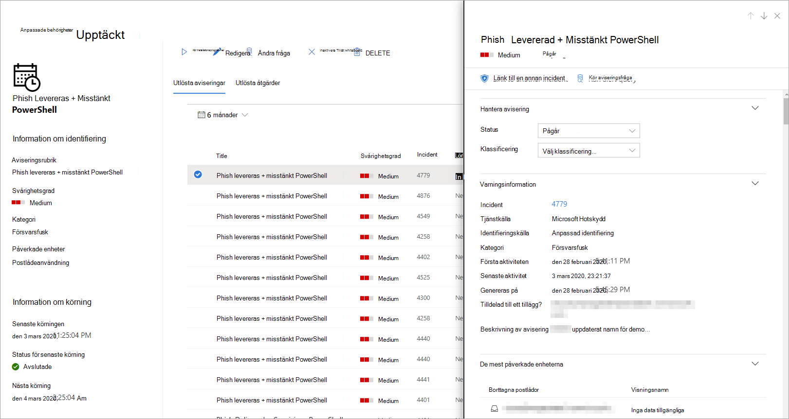

# <a name="create-and-manage-custom-detections-rules"></a>Skapa och hantera anpassade identifieringsregler

[!INCLUDE [Microsoft 365 Defender rebranding](../includes/microsoft-defender.md)]


**Gäller för:**
- Microsoft 365 Defender

Anpassade identifieringsregler är regler som du kan utforma och modifiera [med hjälp av avancerade sökfrågor.](advanced-hunting-overview.md) Med dessa regler kan du proaktivt övervaka olika händelser och systemhändelser, inklusive misstänkt intrång och felkonfigurerade slutpunkter. Du kan ange att de ska köras med jämna mellanrum, generera aviseringar och vidta svarsåtgärder när det finns matchningar.

## <a name="required-permissions-for-managing-custom-detections"></a>Behörighet som krävs för att hantera anpassade identifieringar

För att kunna hantera anpassade identifieringar måste du tilldelas en av följande roller:

- **Säkerhetsadministratör**– Användare med denna [Azure Active Directory-roll](/azure/active-directory/users-groups-roles/directory-assign-admin-roles#security-administrator) kan hantera säkerhetsinställningar i Microsoft 365 säkerhetscenter och andra portaler och tjänster.

- **Säkerhetsoperator**– Användare med denna [Azure Active Directory-roll](/azure/active-directory/users-groups-roles/directory-assign-admin-roles#security-administrator) kan hantera aviseringar och ha global skrivskyddsåtkomst till säkerhetsrelaterade funktioner, inklusive all information i Säkerhetscenter för Microsoft 365. Den här rollen är tillräcklig för att hantera anpassade identifieringar endast om rollbaserad åtkomstkontroll (RBAC) är inaktiverad i Microsoft Defender för Slutpunkt. Om RBAC har konfigurerats behöver du också behörigheten hantera **säkerhetsinställningar** för Defender för Endpoint.

En global administratör kan hantera nödvändiga **behörigheter genom att:**

- Tilldela rollen **som säkerhetsadministratör** **eller säkerhetsoperator** i administrationscentret för [Microsoft 365](https://admin.microsoft.com/) under **Roller –**  >  **säkerhetsadministratör.**
- Kontrollera RBAC-inställningarna för Microsoft Defender för Slutpunkt i [Microsoft Defender Säkerhetscenter](https://securitycenter.windows.com/) under **Roller för**  >  **inställningar.**  >   Välj motsvarande roll för att tilldela **behörigheten hantera säkerhetsinställningar.**

> [!NOTE]
> Om du vill hantera anpassade identifieringar **behöver** säkerhetsoperatorerna behörigheten hantera säkerhetsinställningar i Microsoft Defender för Endpoint om RBAC är aktiverat. 

## <a name="create-a-custom-detection-rule"></a>Skapa en anpassad identifieringsregel
### <a name="1-prepare-the-query"></a>1. Förbereda frågan.

I Microsoft 365 säkerhetscenter går du till **Avancerad sökning** och väljer en befintlig fråga eller skapar en ny fråga. När du använder en ny fråga kör du frågan för att identifiera fel och förstå möjliga resultat.

>[!IMPORTANT]
>För att förhindra att tjänsten returnerar för många aviseringar är varje regel begränsad till att generera endast 100 aviseringar när den körs. Innan du skapar en regel bör du justera frågan för att undvika aviseringar om normal aktivitet.


#### <a name="required-columns-in-the-query-results"></a>Obligatoriska kolumner i frågeresultatet
Om du vill skapa en anpassad identifieringsregel måste frågan returnera följande kolumner:

- `Timestamp`– används för att ange tidsstämpeln för genererade aviseringar
- `ReportId`– aktiverar uppslag för de ursprungliga posterna
- En av följande kolumner som identifierar specifika enheter, användare eller postlådor:
    - `DeviceId`
    - `DeviceName`
    - `RemoteDeviceName`
    - `RecipientEmailAddress`
    - `SenderFromAddress` (kuvertavsändare Return-Path adress)
    - `SenderMailFromAddress` (avsändaradressen visas i e-postklienten)
    - `RecipientObjectId`
    - `AccountObjectId`
    - `AccountSid`
    - `AccountUpn`
    - `InitiatingProcessAccountSid`
    - `InitiatingProcessAccountUpn`
    - `InitiatingProcessAccountObjectId`

>[!NOTE]
>Stöd för ytterligare enheter läggs till när nya tabeller läggs till i det [avancerade sökschemat.](advanced-hunting-schema-tables.md)

Enkla frågor, till exempel de som inte använder operatorn eller för att anpassa eller sammanställa resultat, returnerar `project` `summarize` vanligtvis dessa gemensamma kolumner.

Det finns olika sätt att säkerställa att mer komplexa frågor returnerar dessa kolumner. Om du till exempel föredrar att aggregera och räkna efter entitet under en kolumn som , kan du fortfarande returnera och genom att hämta den från den senaste händelsen som innefattar `DeviceId` `Timestamp` varje unik `ReportId` `DeviceId` .

I exempelfrågan nedan räknas antalet unika enheter () med antivirusidentifiering och antalet används för att endast hitta enheter med `DeviceId` fler än fem identifieringar. För att returnera det `Timestamp` senaste och motsvarande används `ReportId` `summarize` operatorn med `arg_max` funktionen.

```kusto
DeviceEvents
| where Timestamp > ago(1d)
| where ActionType == "AntivirusDetection"
| summarize (Timestamp, ReportId)=arg_max(Timestamp, ReportId), count() by DeviceId
| where count_ > 5
```

> [!TIP]
> För att få bättre frågeprestanda kan du ange ett tidsfilter som matchar den avsedda körningsfrekvensen för regeln. Eftersom det minsta antalet körningar är en gång _per dygn_ omfattar filtreringen för den senaste dagen alla nya data.

### <a name="2-create-new-rule-and-provide-alert-details"></a>2. Skapa en ny regel och ange aviseringsinformation.

Med frågan i frågeredigeraren väljer du **Skapa identifieringsregel** och anger följande aviseringsinformation:

- **Identifieringsnamn**– namnet på identifieringsregeln
- **Frekvens**– intervall för att köra frågan och vidta åtgärder. [Mer information finns nedan](#rule-frequency)
- **Aviseringsrubrik**– rubrik som visas med aviseringar som utlöses av regeln
- **Allvarlighetsgrad**– potentiell risk för komponenten eller aktiviteten som identifieras av regeln
- **Kategori**– hotkomponent eller aktivitet som identifieras av regeln
- **MITRE ATT&CK-tekniker**– en eller flera attacktekniker som identifieras av regeln enligt reglerna som beskrivs i [MITRE ATT&CK-ramverket.](https://attack.mitre.org/) Det här avsnittet är dolt för vissa aviseringskategorier, till exempel skadlig kod, utpressningstrojaner, misstänkt aktivitet och oönskad programvara
- **Beskrivning**– mer information om komponenten eller aktiviteten som identifieras av regeln 
- **Rekommenderade åtgärder**– ytterligare åtgärder som svarare kan vidta för en avisering

#### <a name="rule-frequency"></a>Regelfrekvens
När du sparar en ny regel körs den och söker efter matchningar från de senaste 30 dagarnas data. Regeln körs sedan igen med fasta intervall, och en motslagsvaraktighet tillämpas baserat på den frekvens du väljer:

- **Körs en gång per dygn** och kontrollerar data från de senaste 30 dagarna
- **Körs var 12:e** timme per dygn och kontrollerar data från de senaste 24 timmarna
- **Körs var tredje timme** och kontrollerar data från de senaste 6 timmarna
- **Varje timme** körs varje timme och du kontrollerar data från de senaste två timmarna

När du redigerar en regel körs den med tillämpade ändringar under nästa körning enligt den frekvens du har angett.


>[!TIP]
> Matcha tidsfiltren i frågan med tillbakaslagslängden. Resultat utanför återställningsvaraktigheten ignoreras.  

Välj den frekvens som matchar hur nära du vill övervaka identifieringar. Ta hänsyn till organisationens kapacitet att svara på aviseringarna.

### <a name="3-choose-the-impacted-entities"></a>3. Välj de berörda enheterna.
Identifiera kolumnerna i frågeresultatet där du förväntar dig att hitta den viktigaste påverkade eller påverkade enheten. En fråga kan till exempel returnera avsändarens ( `SenderFromAddress` eller `SenderMailFromAddress` ) och mottagarens ( ) `RecipientEmailAddress` adresser. Genom att identifiera vilka av dessa kolumner som representerar den viktigaste påverkade enheten bidrar tjänsten till att slå samman relevanta aviseringar, korrelera incidenter och målsvarsåtgärder.

Du kan bara välja en kolumn för varje entitetstyp (postlåda, användare eller enhet). Kolumner som inte returneras av frågan kan inte markeras.

### <a name="4-specify-actions"></a>4. Ange åtgärder.
Den anpassade identifieringsregeln kan automatiskt vidta åtgärder på enheter, filer eller användare som returneras av frågan.

#### <a name="actions-on-devices"></a>Åtgärder på enheter
Dessa åtgärder tillämpas på enheter i `DeviceId` kolumnen med frågeresultat:
- **Isolera enhet**– använder Microsoft Defender för Endpoint för att tillämpa fullständig nätverksisolering, vilket hindrar enheten från att ansluta till något program eller en tjänst. [Läs mer om Microsoft Defender för Endpoint-datorisolering](/windows/security/threat-protection/microsoft-defender-atp/respond-machine-alerts#isolate-devices-from-the-network)
- Samla in **undersökningspaket**– samlar in enhetsinformation i en ZIP-fil. [Läs mer om Microsoft Defender för undersökningspaketet för slutpunkt](/windows/security/threat-protection/microsoft-defender-atp/respond-machine-alerts#collect-investigation-package-from-devices)
- **Kör antivirussökning**– utför en fullständig Windows Defender Antivirus-sökning på enheten
- **Initiera undersökning**– initierar en [automatiserad undersökning](m365d-autoir.md) på enheten
- **Begränsa programkörning**– anger begränsningar på enheten så att endast filer som har signerats med ett Certifikat utfärdat av Microsoft kan köras. [Läs mer om appbegränsningar med Microsoft Defender för Slutpunkt](/microsoft-365/security/defender-endpoint/respond-machine-alerts#restrict-app-execution)

#### <a name="actions-on-files"></a>Åtgärder för filer
Med det här alternativet kan du välja att **tillämpa filåtgärden** Karantän för filer i `SHA1` , , eller kolumnen i `InitiatingProcessSHA1` `SHA256` `InitiatingProcessSHA256` frågeresultatet. Den här åtgärden tar bort filen från dess aktuella plats och placerar en kopia i karantän.

#### <a name="actions-on-users"></a>Åtgärder för användare
Med det här alternativet **vidtas åtgärden Markera** användare som komprometterad på användare i , eller i kolumnen för `AccountObjectId` `InitiatingProcessAccountObjectId` `RecipientObjectId` frågeresultatet. Med den här åtgärden ställs användarnas risknivå in på "hög" i Azure Active Directory, vilket utlöser motsvarande [identitetsskyddsprinciper.](/azure/active-directory/identity-protection/overview-identity-protection)

> [!NOTE]
> Åtgärden tillåt eller blockera för anpassade identifieringsregler stöds för närvarande inte i Microsoft 365 Defender.

### <a name="5-set-the-rule-scope"></a>5. Ange regelns omfattning.
Ange omfattningen för att ange vilka enheter som omfattas av regeln. Omfattningen påverkar regler som kontrollerar enheter och påverkar inte regler som bara kontrollerar postlådor och användarkonton eller identiteter.

När du anger omfattningen kan du välja:

- Alla enheter
- Specifika enhetsgrupper

Endast data från enheter i omfattningen kommer att tillfrågas. Dessutom kommer åtgärder endast att vidtas på de enheterna.

### <a name="6-review-and-turn-on-the-rule"></a>6. Granska och aktivera regeln.
När du har granskat regeln väljer du **Skapa för** att spara den. Regeln för anpassad identifiering körs direkt. Den körs igen baserat på konfigurerad frekvens för att söka efter matchningar, generera aviseringar och vidta svarsåtgärder.


>[!Important] 
>Anpassade identifieringar bör regelbundet granskas av effektivitet och effektivitet. Om du vill vara säker på att du skapar identifieringar som utlöser sanna aviseringar tar det tid att granska dina befintliga anpassade identifieringar genom att följa stegen i Hantera [befintliga anpassade identifieringsregler.](#manage-existing-custom-detection-rules) <br>  
Du behåller kontrollen över hur omfattande eller specifika dina anpassade identifieringar är, så falska varningar som genereras av anpassade identifieringar kan ange ett behov av att ändra vissa parametrar för reglerna.


## <a name="manage-existing-custom-detection-rules"></a>Hantera befintliga anpassade identifieringsregler
Du kan visa listan över befintliga anpassade identifieringsregler, kontrollera deras tidigare körningar och granska de aviseringar som de har utlöst. Du kan även köra en regel på begäran och ändra den.

>[!TIP]
> Aviseringar som upphöjs med anpassade identifieringar är tillgängliga via API:er för aviseringar och incidenter. Mer information finns i Microsoft [365 Defender-API:er som stöds.](api-supported.md)

### <a name="view-existing-rules"></a>Visa befintliga regler

Om du vill visa alla befintliga anpassade identifieringsregler går du **till Söka** efter  >  **anpassade identifieringar.** På sidan visas alla regler med följande körningsinformation:

- **Senaste körningen**– när en regel senast körts för att söka efter frågematchningar och generera aviseringar
- **Status för senaste körningen**– om en regel kördes som den ska
- **Nästa körning**– nästa schemalagda körning
- **Status**– om en regel har aktiverats eller inaktiverats

### <a name="view-rule-details-modify-rule-and-run-rule"></a>Visa regeldetaljer, ändra regel och köra regel

Om du vill visa omfattande information om en anpassad identifieringsregel **går** du till  >  Anpassade identifieringar av **visning** och väljer namnet på regeln. Du kan sedan visa allmän information om regeln, inklusive information om dess körningsstatus och omfattning. Sidan innehåller också en lista över utlösande aviseringar och åtgärder.

<br>
*Information om anpassade identifieringsregel*

Du kan också utföra följande åtgärder på regeln från den här sidan:

- **Kör**– kör regeln direkt. Då återställs också intervallet för nästa körning.
- **Redigera**– ändra regeln utan att ändra frågan
- **Ändra fråga**– redigera frågan under avancerad sökning
- **Aktivera**  /  **Inaktivera –** aktivera regeln eller hindra den från att köras
- **Ta** bort – inaktivera regeln och ta bort den

### <a name="view-and-manage-triggered-alerts"></a>Visa och hantera utlösande aviseringar

På skärmen med regeldetaljer (**Anpassad** identifiering av uppgifter  >    >  **[Regelnamn]**) går du till Utlösade aviseringar, som visar de aviseringar som genererats av matchningar mot regeln. Välj en avisering om du vill visa detaljerad information om den och utföra följande åtgärder:

- Hantera aviseringen genom att ange dess status och klassificering (sant eller falskt meddelande)
- Länka aviseringen till en händelse
- Kör frågan som utlöste varningen vid avancerad sökning

### <a name="review-actions"></a>Granska åtgärder
På skärmen med regeldetaljer **(** Anpassade identifieringar av uppgifter  >    >  **[Regelnamn] )** går du till Utlösade åtgärder, där de åtgärder som vidtas baserat på matchningar mot regeln visas.

>[!TIP]
>Om du snabbt vill visa information och vidta åtgärder för ett objekt i en tabell använder du urvalskolumnen [&#10003;] till vänster om tabellen.

## <a name="see-also"></a>Se även
- [Översikt över anpassade identifieringar](custom-detections-overview.md)
- [Översikt över avancerad jakt](advanced-hunting-overview.md)
- [Lär dig språket för avancerad fråga om sökning](advanced-hunting-query-language.md)
- [Migrera avancerade frågor om sökning från Microsoft Defender för Endpoint](advanced-hunting-migrate-from-mde.md)
