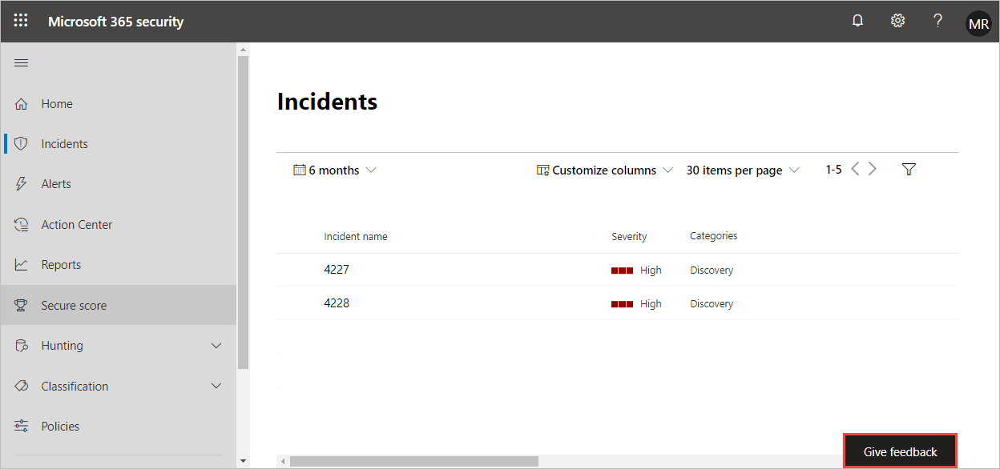

# Ge feedback om Microsoft 365 DefenderProvide feedback on Microsoft 365 Defender

[!INCLUDE [Microsoft 365 Defender rebranding](../includes/microsoft-defender.md)]

**Gäller för:****Applies to:**
- Microsoft 365 DefenderMicrosoft 365 Defender

Din feedback hjälper oss att bli bättre i din miljö mot avancerade attacker.Your feedback helps us get better in protecting your environment from advanced attacks. Dela din upplevelse, intryck och förfrågningar genom att ge feedback.Share your experience, impressions, and  requests by providing feedback.

I den här videon ser du hur enkelt det är att ge feedback.Check out this video to see how easy it is to provide feedback.

> [!VIDEO https://www.microsoft.com/en-us/videoplayer/embed/RE4LWeP]

1. Välj Lämna feedback från valfri del **av portalen.**From any part of the portal, select **Give feedback**. 

    

2. Betygsätta din upplevelse och ge information om vad du gillade eller var förbättringar kan göras.Rate your experience and provide details on what you liked or where improvement can be made. Du kan också välja att bli kontaktad om din feedback.You can also choose to be contacted about the feedback. 

3. Välj **Skicka**.Select **Submit**.
