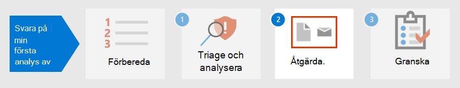

# Steg 1.Step 1. Triangel och analysera den första incidentenTriage and analyze your first incident

[!INCLUDE [Microsoft 365 Defender rebranding](../includes/microsoft-defender.md)]

**Gäller för:****Applies to:**
- Microsoft 365 DefenderMicrosoft 365 Defender

När du ägnar lite tid åt att etablera, implementera och underhålla säkerhetsåtgärder enligt organisationens standarder, kan du konfigurera säkerhetslösningar som hjälper dig att snabbt identifiera säkerhetsrisker och hot.As you spend some time establishing, implementing, and maintaining security measures according to the organization’s standards, you can set up security solutions to help you quickly identify security risks and threats. Microsoft 365 Med Defender kan du identifiera, kontrollera och undersöka incidenter med hjälp av ett fönster av glas där du kan hitta den information du behöver för att fatta snabba beslut.Microsoft 365 Defender allows you to detect, triage, and investigate incidents through its single-pane-of-glass experience where you can find the information you need to make timely decisions. 

När ett säkerhetstillbud har upptäckts visar Microsoft 365 Defender information som du behöver prioritera eller prioritera en händelse framför andra.Once a security incident is detected, Microsoft 365 Defender presents details you will need to triage or prioritize an incident or incidents over others. Efter att ha avbestämt prioritering kan analytiker sedan fokusera på att undersöka ärenden som tilldelats dem.After determining prioritization, analysts can then focus their energy on investigating cases assigned to them.

## Identifiering av Microsoft 365 DefenderDetection by Microsoft 365 Defender

Microsoft 365 Defender tar emot aviseringar och händelser från flera Microsoft-säkerhetsplattformar som identifieringskällor för att skapa en bild och kontext för skadlig aktivitet.Microsoft 365 Defender receives alerts and events from multiple Microsoft security platforms as detection sources to create a holistic picture and context of malicious activity. Det här är de möjliga identifieringskällorna:These are the possible detection sources:

- [Microsoft Defender för Slutpunkt](../defender-endpoint/microsoft-defender-endpoint.md) är en identifiering och åtgärd på slutpunkt-lösning (Identifiering och åtgärd på slutpunkt) som använder Microsoft Defender antivirus samt molnaktiverad avancerad lösning med Microsofts Graph.[Microsoft Defender for Endpoint](../defender-endpoint/microsoft-defender-endpoint.md) is an endpoint detection and response solution (EDR) that uses Microsoft Defender antivirus as well as cloud-enabled advanced threat protection using Microsoft Security Graph. Defender för Endpoint är en enhetlig plattform för förebyggande skydd, identifiering efter intrång, automatiserad undersökning och svar.Defender for Endpoint is a unified platform for preventative protection, post-breach detection, automated investigation, and response. It protects endpoints from cyberthreats, detects advanced attacks and data breaches, automates security incidents, and improves security upp.It protects endpoints from cyberthreats, detects advanced attacks and data breaches, automates security incidents, and improves security posture. 
- [Microsoft Defender för](https://docs.microsoft.com/defender-for-identity/what-is) identitet är en molnbaserad säkerhetslösning som använder dina lokala AD DS-signaler (Active Directory Domain Services) för att identifiera, identifiera och undersöka avancerade hot, komprometterade identiteter och skadliga Insider-åtgärder riktade till organisationen.[Microsoft Defender for Identity](https://docs.microsoft.com/defender-for-identity/what-is) is a cloud-based security solution that uses your on-premises Active Directory Domain Services (AD DS) signals to identify, detect, and investigate advanced threats, compromised identities, and malicious insider actions directed at your organization. 
- [Microsoft Cloud App Security](https://docs.microsoft.com/cloud-app-security/) fungerar som en gatekeeper till företag med tillgång i realtid mellan dina företagsanvändare och de molnresurser de använder, var användarna än befinner sig och oavsett vilken enhet de använder.[Microsoft Cloud App Security](https://docs.microsoft.com/cloud-app-security/) acts as a gatekeeper to broker access in real time between your enterprise users and the cloud resources they use, wherever your users are located and regardless of the device they are using. 
- [Microsoft Defender för Office 365](../office-365-security/overview.md) skyddar organisationen mot skadliga hot i e-postmeddelanden, länkar (URL:er) och samarbetsverktyg.[Microsoft Defender for Office 365](../office-365-security/overview.md) safeguards your organization against malicious threats in email messages, links (URLs), and collaboration tools. 
- [Azure Säkerhetscenter](https://docs.microsoft.com/azure/security-center/security-center-introduction) är ett enhetligt säkerhetshanteringssystem för infrastruktur som förstärker säkerheten på dina datacenter och som ger avancerat skydd i både hybridarbetsbelastningen och i molnet.[Azure Security Center](https://docs.microsoft.com/azure/security-center/security-center-introduction) is a unified infrastructure security management system that strengthens the security posture of your data centers and provides advanced threat protection across your hybrid workloads in the cloud as well as on premises. 

I Microsoft 365 Defender [identifieras incidenter](incidents-overview.md) genom att korrelera aviseringar från de olika identifieringskällorna.In Microsoft 365 Defender, [incidents](incidents-overview.md) are identified by correlating alerts from these different detection sources. I stället för att använda resurssträngar ihop eller urskilja flera aviseringar i sina respektive incidenter kan du börja med incidentkön i Microsoft 365 Defender direkt.Instead of spending resources stringing together or distinguishing multiple alerts into their respective incidents, you can start with the incident queue in Microsoft 365 Defender right away. På så sätt kan du hantera incidenter på ett effektivt sätt i alla slutpunkter, identiteter, e-post och program, och minska skadan från en attack.This allows you to triage incidents in an efficient manner across endpoints, identities, email, and applications, and reduce the damage from an attack.

## Se till att dina incidenterTriage your incidents

Incidentsvar i Microsoft 365 Defender startar när du prioriterar listan över incidenter med hjälp av din organisations rekommenderade prioriteringsmetod.Incident response in Microsoft 365 Defender starts once you triage the list of incidents using your organization’s recommended method of prioritization. Att bestämma prioritet eller ange ärendets prioritetsnivå, som sedan avgör i vilken ordning de ska undersökas.To triage means to assign a level of importance or urgency to incidents, which then determines the order in which they will be investigated. 

Ett användbart exempel på guide för att avgöra vilken incident som ska prioriteras i Microsoft 365 Defender kan sammanfattas av formeln: *Allvarlighet + Påverkan = Prioritet*.A useful sample guide for determining which incident to prioritize in Microsoft 365 Defender can be summarized by the formula: *Severity + Impact = Priority*. 

- **Allvarlighetsgrad** är den nivå som Microsoft 365 Defender och dess integrerade säkerhetskomponenter.**Severity** is the level designated by Microsoft 365 Defender and its integrated security components. 
- **Påverkan** avgörs av organisationen och omfattar i allmänhet, men inte begränsat till, ett tröskelvärde för påverkade användare, enheter, tjänster som påverkas (eller en kombination av dessa) och även aviseringstyp.**Impact** is determined by the organization and generally includes, but not limited to, a threshold number of impacted users, devices, services affected (or a combination thereof), and even alert type. 

Analytiker initierar sedan undersökningar baserat **på de** prioritetskriterier som angetts av organisationen.Analysts then initiate investigations based on the **Priority** criteria set by the organization.

Prioriteringen av incidenter kan variera beroende på organisation.Incident prioritization might vary depending on the organization. NIST rekommenderar även vad gäller incidentens funktions- och informationseffekter och återställningsmöjligheter.NIST recommends also considering the functional and informational impact of the incident, and recoverability.  

Det här är bara en metod för triage:The following is just one approach to triage: 

1. Gå till sidan [med incidenter](incidents-overview.md) för att påbörja triangeln.Go to the [incidents](incidents-overview.md) page to initiate triage. Här kan du se en lista över incidenter som påverkar din organisation.Here you can see a list of incidents affecting your organization. Som standard ordnas de från det senaste till det äldsta incidenten.By default, they are arranged from the most recent to the oldest incident. Härifrån kan du även se olika kolumner för varje incident med bland annat allvarlighetsgrad, kategori, antal aktiva aviseringar och berörda enheter.From here, you can also see different columns for each incident showing their severity, category, number of active alerts, and impacted entities, among others. Du kan anpassa uppsättningen kolumner och sortera incidentkön efter några av kolumnerna genom att välja kolumnnamnet.You can customize the set of columns and sort the incident queue by some these columns by selecting the column name. Du kan också filtrera incidentkön efter dina behov.You can also filter the incident queue according to your needs. En fullständig lista över tillgängliga filter finns i [Prioritera incidenter.](incident-queue.md#available-filters)For a full list of available filters, see [Prioritize incidents](incident-queue.md#available-filters).
  
   :::image type="content" source="../../media/first-incident-analyze/first-incident-analyze-queue.png" alt-text="Exempel på incidentkön"::: 

    Ett exempel på hur du kan utföra tre åtgärder för den här uppsättningen ärenden är att prioritera incidenter som påverkade fler användare och enheter.One example of how you might perform triage for this set of incidents is to prioritize incidents that affected more users and devices. I det här exemplet kan du prioritera incident-ID 6769 eftersom det påverkade det största antalet enheter: 7 enheter, 6 användare och 2 postlådor.In this example, you might prioritize incident ID 6769 because it affected the largest number of entities: 7 devices, 6 users, and 2 mailboxes. Dessutom ser händelsen ut att innehålla aviseringar från Microsoft Defender för identitet som anger en identitetsbaserad avisering och möjliga autentiseringsstölder.Furthermore, the incident appears to contain alerts from Microsoft Defender for Identity which indicate an identity-based alert and possible credential theft.

   :::image type="content" source="../../media/first-incident-analyze/first-incident-analyze-high-impact.png" alt-text="Exempel på en incident med hög påverkan":::
 
2. Markera cirkeln bredvid namnet på incidenten om du vill granska informationen.Select the circle next to the incident name to review the details. Ett sidofönster visas till höger, som innehåller ytterligare information som kan hjälpa dig ytterligare.A side pane will appear on the right side, which contains additional information that can assist your triage further. 
 
   :::image type="content" source="../../media/first-incident-analyze/first-incident-analyze-incident-flyout.png" alt-text="Exempel på sidofönster för incidenter"::: 

   Om du till exempel tittar på vilka [MITRE ATT&CK-taktiker](https://attack.mitre.org/) attackerarna använde baserat på incidentens kategorier, kan du prioritera incidenten eftersom attackeraren använde stulna autentiseringsuppgifter, etablerat kommando och kontroll, utfört rörelse och utsorterat vissa data.For example, by looking at which [MITRE ATT&CK](https://attack.mitre.org/) tactics the attacker used based on the incident’s categories, you might prioritize this incident because the attacker used stolen credentials, established command and control, performed lateral movement, and exfiltrated some data. Det här föreslår att attacken redan har gått djupare in i nätverket och eventuellt stulen konfidentiell information.This suggests the attacker has already gone deep into the network and possibly stolen confidential information.

   Om organisationen har implementerat ramverket Nollförtroende kan du överväga att prioritera åtkomst till autentiseringsuppgifter som ett viktigt säkerhetsfel.Additionally, if your organization has implemented the Zero Trust framework, you would consider credential access as an important security violation worth prioritizing.
 
   När du rullar nedåt i sidofönstret visas specifika berörda enheter, till exempel användare, enheter och postlådor.Scrolling down the side pane, you will see the specific impacted entities such as users, devices, and mailboxes. Du kan kontrollera exponeringsnivån för varje enhet och ägare till berörda postlådor.You can check the exposure level of each device and the owners of affected mailboxes.

   :::image type="content" source="../../media/first-incident-analyze/first-incident-analyze-incident-flyout-details.png" alt-text="Exempel på information i sidofönstret för ett incidentfönster"::: 
 
3. Du hittar de associerade aviseringarna längre ned i sidofönstret.Further down the side pane, you can find the associated alerts. Microsoft 365 Defender har redan utfört korrelationen för sa varningar till en enda incident, vilket sparar tid och resurser bättre för att åtgärda attacken.Microsoft 365 Defender has already performed the correlation of said alerts into a single incident, saving you time and resources better spent remediating the attack. Aviseringar är misstänkta och därmed eventuellt skadliga systemhändelser som föreslår en närvaro av en attacker i ett nätverk.Alerts are suspicious and therefore possibly malicious system events that suggest the presence of an attacker on a network. 

   I det här exemplet har 87 enskilda aviseringar fastställt vara en del av ett säkerhetstillbud.In this example, 87 individual alerts were determined to be part of one security incident. Du kan visa alla aviseringar för att få en snabb bild av hur attacken utspelade sig.You can view all the alerts to get a quick view of how the attack played out.

   :::image type="content" source="../../media/first-incident-analyze/first-incident-analyze-incident-flyout-alerts.png" alt-text="Exempel på aviseringar i sidofönstret för incidenter"::: 
 
## Analysera den första incidentenAnalyze your first incident

Det är lika viktigt att förstå sammanhangs omgivande aviseringar.Understanding the context surrounding alerts is equally important. Ofta är ett meddelande inte en enskild oberoende händelse.Often an alert is not a single independent event. Det finns en kedja av processer som skapats, kommandon och åtgärder som kanske inte har inträffat samtidigt.There is a chain of processes created, commands, and actions that might not have occurred at the same time. Därför måste en analytiker leta efter den första och sista aktiviteterna i den misstänkta enhetens tidslinjer för att förstå sammanhanget för aviseringarna.Therefore, an analyst must look for the first and last activities of the suspicious entity in device timelines to understand the context of the alerts.

Det finns flera sätt att läsa och analysera data med hjälp av Microsoft 365 Defender, men målet för analytiker är att svara på incidenter så snabbt som möjligt.There are multiple ways to read and analyze data using Microsoft 365 Defender but the end goal for analysts is to respond to incidents as quickly as possible. Även om Microsoft 365 Defender avsevärt kan minska medelvärdet för att åtgärda [(MTTR)](https://www.microsoft.com/security/blog/2020/05/04/lessons-learned-microsoft-soc-part-3c/) genom den branschledande funktionen Autoreparation finns det alltid fall som kräver manuell analys.While Microsoft 365 Defender can significantly reduce [Mean Time to Remediate (MTTR)](https://www.microsoft.com/security/blog/2020/05/04/lessons-learned-microsoft-soc-part-3c/) through the industry-leading Auto-Remediation feature, there are always cases that require manual analysis. 

Här är ett exempel:Here's an example:

1. När prioriterad prioritet har fastställts påbörjar en analytiker en detaljerad analys genom att välja incidentnamnet.Once triage priority has been determined, an analyst begins an in-depth analysis by selecting the incident name. Den här sidan visar **Incidentsammanfattning** där data visas på flikar för att hjälpa dig med analysen.This page brings up the **Incident Summary** where data is displayed in tabs to assist with the analysis. Under fliken **Aviseringar** visas typen av aviseringar.Under the **Alerts** tab the type of alerts are displayed. Analytiker kan klicka på varje avisering för att öka detaljgranskningen mot respektive identifieringskälla.Analysts can click on each alert to drill down into the respective detection source. 

    :::image type="content" source="../../media/first-incident-analyze/first-incident-analyze-summary-tab.png" alt-text="Exempel på fliken Sammanfattning för ett incident"::: 
 
    En snabb guide om vilka domäner som varje identifieringskälla omfattar finns i [avsnittet Identifiera](#detection-by-microsoft-365-defender) i den här artikeln.For a quick guide about which domain each detection source covers, review the [Detect](#detection-by-microsoft-365-defender) section of this article.

2.  Från fliken **Aviseringar** kan en analytiker pivotera till identifieringskällan för en mer detaljerad undersökning och analys.From the **Alerts** tab, an analyst can pivot to the detection source to conduct a more in-depth investigation and analysis. Om du till exempel väljer Identifiering av skadlig kod Microsoft Cloud App Security identifieringskällan kommer analytikern till motsvarande aviseringssida.For example, selecting Malware Detection with Microsoft Cloud App Security as the detection source takes the analyst to its corresponding alert page.
  
    :::image type="content" source="../../media/first-incident-analyze/first-incident-analyze-select-alert.png" alt-text="Exempel på val av avisering om en händelse"::: 
  
    :::image type="content" source="../../media/first-incident-analyze/first-incident-analyze-link-to-mcas.png" alt-text="Exempel på en motsvarande sida i Microsoft Cloud App Security"::: 
  
3.  Om du vill undersöka exemplet ytterligare bläddrar du längst ned på sidan för att visa de användare **som påverkas.**To investigate our example further, scrolling to the bottom of the page to view the **Users affected**. Om du vill se aktiviteten och kontexten runt identifieringen av skadlig programvara väljer du An hills användarsida .To see the activity and context surrounding the malware detection, select Annette Hill’s user page . 
  
    :::image type="content" source="../../media/first-incident-analyze/first-incident-analyze-user-page.png" alt-text="Exempel på en användarsida":::
  
4.  På användarsidan finns en kronologisk lista över händelser som börjar med en riskabel inloggning från en *IP-adressavisering för tor-nätverket.*On the user page is a chronological list of events starting with a *Risky Sign-in from a TOR network IP Address* alert. Även om en aktivitet är misstänkt beror på hur en organisation bedriver sin verksamhet, kan i de flesta fall användningen av The Router (TOR), ett nätverk där användarna kan surfa på webben anonymt, ses som mycket osannolikt och onödigt i företagsmiljöer för vanliga onlineåtgärder.While the suspiciousness of an activity depends on the nature of how an organization conducts its business, in most cases the use of The Onion Router (TOR), a network that allows users to browse the web anonymously, in an enterprise environment might be considered highly unlikely and unnecessary for regular online operations.
  
    :::image type="content" source="../../media/first-incident-analyze/first-incident-analyze-user-event-list.png" alt-text="Exempel på den kronologiska listan med händelser för en användare":::
  
5.  Varje avisering kan väljas för att få mer information om aktiviteten.Each alert can be selected to obtain more information on the activity. Om du till exempel **väljer Aktivitet från en IP-adressavisering** för Tor kommer du till den aviseringens egen sida.For example, selecting **Activity from a Tor IP Address** alert leads you to that alert’s own page. An autentisera är administratör för Office 365, vilket innebär att hon har förhöjda behörigheter och att källhändelsen kan ha lett till åtkomst till konfidentiell information.Annette is an Administrator of Office 365, which means she has elevated privileges and the source incident might have led to access to confidential information. 
  
    :::image type="content" source="../../media/first-incident-analyze/first-incident-analyze-mcas-alert.png" alt-text="Exempel på information om Microsoft Cloud App Security"::: 
 
6.  Genom att välja andra aviseringar kan en analytiker få en fullständig bild av attacken.By selecting other alerts, an analyst can get a complete picture of the attack.

## Nästa stegNext step

Lär dig [hur du åtgärdar incidenter](first-incident-remediate.md).Learn how to [remediate incidents](first-incident-remediate.md).

## Se ävenSee also

- [Översikt över incidenterIncidents overview](incidents-overview.md)
- [Analysera incidenterAnalyze incidents](investigate-incidents.md)
- [Hantera incidenterManage incidents](manage-incidents.md)
