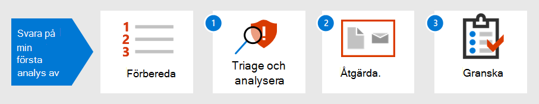

# Introduktion till att svara på din första incidentIntroduction to responding to your first incident

[!INCLUDE [Microsoft 365 Defender rebranding](../includes/microsoft-defender.md)]

**Gäller för:****Applies to:**
- Microsoft 365 DefenderMicrosoft 365 Defender

Organisationens strategi för incidentåtgärder avgör om organisationen kan hantera allt störande säkerhetstillbud och cyberbrott.An organization's incident response strategy determines its ability to deal with increasingly disruptive security incidents and cybercrime. Att vidta preventativa åtgärder är viktigt, men möjligheten att agera snabbt för att begränsa, radera och återställa efter identifierade incidenter kan minimera skador och affärsförluster.While taking preventative measures is important, the ability to act quickly to contain, eradicate, and recover from detected incidents can minimize damage and business losses.

Den här genomgången av incidentåtgärder visar hur du som en del av ett team för säkerhetsåtgärder kan utföra de flesta viktiga åtgärder för incidenter i Microsoft 365 Defender.This incident response walkthrough shows how you, as part of a security operations team, can perform most of the key incident response steps within Microsoft 365 Defender. Här är stegen:Here are the steps:

- Förberedelse av din säkerhetsstatusPreparation of your security posture
- För varje incident:For each incident:
  - Steg 1: Triage och analysStep 1: Triage and analysis
  - Steg 2: Åtgärd (inneslutning, överläggning och återställning)Step 2: Remediation (containment, eradication, and recovery)
  - Steg 3: Granskning efter incidentStep 3: Post-incident review

Ett säkerhetsincident definieras av National Institute of Standards and Technology (NIST) som "en förekomst som faktiskt eller potentiellt uppfyller sekretess, integritet eller tillgänglighet för ett informationssystem. eller den information som systemet bearbetar, lagrar eller överför; eller som utgör en överträdelse eller omedelbart hot om brott mot säkerhetsprinciper, säkerhetsmetoder eller principer för acceptabel användning."A security incident is defined by National Institute of Standards and Technology (NIST) as "an occurrence that actually or potentially jeopardizes the confidentiality, integrity, or availability of an information system; or the information the system processes, stores, or transmits; or that constitutes a violation or imminent threat of violation of security policies, security procedures, or acceptable use policies."

Incidenter i Microsoft 365 Defender är den logiska utgångspunkten för analys och incidentsvar.Incidents in Microsoft 365 Defender are the logical starting points for analysis and incident response. Att analysera och åtgärda incidenter utgör vanligtvis de flesta av ett säkerhetsoperationsteams uppgifter.Analyzing and remediating incidents typically makes up most of a security operations team's tasks.

## Nästa stegNext step

Se till att din organisation Microsoft 365 klientorganisationen är [förberedda för incidenthantering.](first-incident-prepare.md)Make sure your organization and Microsoft 365 tenant is [prepared for incident handling](first-incident-prepare.md).

## Se ävenSee also

Vägledning om incidentsvar för Microsoft 365 Defender:Incident response guidance for Microsoft 365 Defender:

- [Översikt över incidenterIncidents overview](incidents-overview.md)
- [Undersöka incidenterInvestigate incidents](investigate-incidents.md)
- [Hantera incidenterManage incidents](manage-incidents.md)

Ytterligare exempel på svar på första incidenter:Additional examples of first incident responses:

- [Nätfiske-e-postPhishing email](first-incident-path-phishing.md)
- [IdentitetsbasattackIdentity-base attack](first-incident-path-identity.md)

[Detaljerade spelböcker för incidentsvarDetailed incident response playbooks](/security/compass/incident-response-playbooks)

