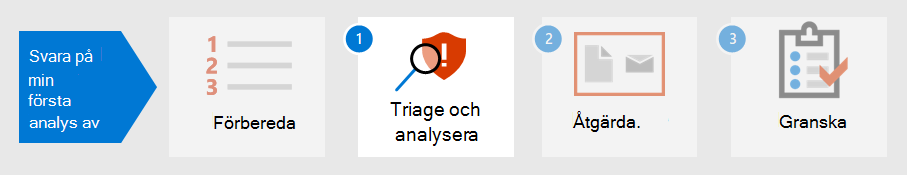

# Förbered säkerheten för den första händelsenPrepare your security posture for your first incident

[!INCLUDE [Microsoft 365 Defender rebranding](../includes/microsoft-defender.md)]

**Gäller för:****Applies to:**
- Microsoft 365 DefenderMicrosoft 365 Defender

Förberedelse för incidenthantering omfattar att konfigurera tillräckligt skydd av organisationens nätverk från olika typer av säkerhetsincidenter.Preparing for incident handling involves setting up sufficient protection of an organization's network from different kinds of security incidents. För att minska risken för säkerhetsincidenter rekommenderar National Institute of Standards and Technology (NIST) flera säkerhetsmetoder, bland annat riskbedömning, hårdnande värdsäkerhet, konfigurera nätverk säkert och förhindra skadlig programvara.To reduce the risk of security incidents, National Institute of Standards and Technology (NIST) recommends several security practices including risk assessments, hardening host security, configuring networks securely, and preventing malware. 

Microsoft 365 Defender kan åtgärda flera aspekter av incidentskydd:Microsoft 365 Defender can help address several aspects of incident prevention: 

- Implementera ett [Zero Trust Framework](https://docs.microsoft.com/security/zero-trust/)Implementing a [Zero Trust](https://docs.microsoft.com/security/zero-trust/) framework
- Fastställa din säkerhet genom att tilldela ett poäng med [Microsoft Secure Score](microsoft-secure-score.md)Determining your security posture by assigning a score with [Microsoft Secure Score](microsoft-secure-score.md)
- Förhindra hot genom sårbarhetsutvärderingar i [hot- och sårbarhetshantering](../defender-endpoint/next-gen-threat-and-vuln-mgt.md)Preventing threats through vulnerability assessments in [Threat and Vulnerability Management](../defender-endpoint/next-gen-threat-and-vuln-mgt.md)
- Förstå de senaste säkerhetshoten så att du kan förbereda demUnderstanding the latest security threats so you can prepare for them

## Steg 1.Step 1. Implementera nollförtroendeImplement Zero Trust

[Zero Trust](https://docs.microsoft.com/security/zero-trust/) är en integrerad säkerhetsstrategi som tar hänsyn till hur komplex en modern miljö är, inklusive den mobila arbetsstyrkan och användare, enheter, program och data, var de än befinner sig.[Zero Trust](https://docs.microsoft.com/security/zero-trust/) is an integrated security philosophy and end-to-end strategy that considers the complex nature of any modern environment, including the mobile workforce and the users, devices, applications and data, wherever they may be located. Genom att ha ett enda fönster med fönster för att hantera alla identifieringar på ett konsekvent sätt  kan Microsoft 365 Defender göra det enklare för din säkerhetsgrupp att implementera de vägledande principerna för Zero Trust.By providing a single pane of glass to manage all detections in a consistent way, Microsoft 365 Defender can make it easier for your security operations team to implement the [guiding principles](https://docs.microsoft.com/security/zero-trust/#guiding-principles-of-zero-trust) of Zero Trust. 

Komponenter i Microsoft 365 Defender kan visa överträdelser av regler som har implementerats för att upprätta villkorsstyrda åtkomstprinciper för Zero Trust genom att integrera data från Microsoft Defender för slutpunkt (MDE) eller andra mobila säkerhetsleverantörer som en informationskälla för principer för enhetsefterlevnad och implementering av enhetsbaserade villkorsbaserade principer.Components of Microsoft 365 Defender can display violations of rules that have been implemented to establish Conditional Access policies for Zero Trust by integrating data from Microsoft Defender for Endpoint (MDE) or other mobile security vendors as an information source for device compliance policies and implementation of device-based Conditional Access policies. 

Enhetsrisker påverkar direkt vilka resurser som är tillgängliga för användaren av enheten.Device risk directly influences what resources will be accessible by the user of that device. Denial of access to resources based on certain criteria is the main theme of Zero Trust and Microsoft 365 Defender provides information needed to determine the trust level criteria.The denial of access to resources based on certain criteria is the main theme of Zero Trust and Microsoft 365 Defender provides information needed to determine the trust level criteria. Till exempel kan Microsoft 365 Defender tillhandahålla programvaruversionsnivån för en enhet via sidan Threat and Vulnerability Management medan villkorsstyrd åtkomst begränsar enheter som har inaktuella eller sårbara versioner.For example, Microsoft 365 Defender can provide the software version level of a device through the Threat and Vulnerability Management page while Conditional Access policies restrict devices that have outdated or vulnerable versions.

Automation är en viktig del i implementeringen och underhållet av en nollförtroendemiljö samtidigt som antalet aviseringar som potentiellt skulle leda till incidentåtgärdshändelser (IR-händelser) minskar.Automation is a crucial part of implementing and maintaining a Zero Trust environment while also reducing the number of alerts that would potentially lead to incident response (IR) events. Komponenter i Microsoft 365 Defender kan automatiseras, till exempel åtgärder [(kallas](m365d-autoir.md) undersökningar för en incident i säkerhetscentret i Microsoft 365), aviseringsåtgärder och till och med skapandet av supportärenden i [ServiceNow.](https://microsoft.service-now.com/sp/)Components of Microsoft 365 Defender can be automated such as [remediation actions](m365d-autoir.md) (known as investigations for an incident in the Microsoft 365 security center), notification actions, and even the creation of support tickets such as in [ServiceNow](https://microsoft.service-now.com/sp/).

## Steg 2.Step 2. Fastställa säkerheten i din organisationDetermine your organization’s security posture

Därefter kan organisationer använda [Microsoft Secure Score](microsoft-secure-score.md) i Microsoft 365 Defender för att avgöra vilken säkerhetsrisk du har och fundera på rekommendationer om hur du kan förbättra den.Next, organizations can use the [Microsoft Secure Score](microsoft-secure-score.md) in Microsoft 365 Defender to determine your current security posture and consider recommendations on how to improve it. Ju högre poäng desto fler säkerhetsrekommendationer och förbättringsåtgärder har genomförts av organisationen.The higher the score is, the more security recommendations and improvement actions have been taken by the organization. Rekommendationer om Secure Score kan användas i olika produkter och organisationer kan höja sina resultat ännu högre.Secure Score recommendations can be taken across different products and allow organizations to raise their scores even higher. 

:::image type="content" source="../../media/first-incident-prepare/first-incident-secure-score.png" alt-text="Exempel på Microsoft Secure Score i Microsofts säkerhetscenter":::
 
## Steg 3.Step 3. Utvärdera exponering av risker för din organisationAssess your organization’s vulnerability exposure

Att förhindra incidenter kan effektivisera arbetet med säkerhetsåtgärder för att fokusera på viktiga säkerhetsincidenter som är viktiga i det här processen.Preventing incidents can help streamline security operations efforts to focus on on-going critical and important security incidents. Säkerhetsproblem av programvara är ofta en startpunkt som kan förhindras för attacker som kan leda till datastöld, dataförlust eller störningar i affärsåtgärder.Software vulnerabilities are often a preventable entry point for attacks that can lead to data theft, data loss, or disruption of business operations. Om inga attacker är i gång måste säkerhetsåtgärder strävar efter att uppnå och upprätthålla en godtagbar nivå av [exponering](../defender-endpoint/tvm-exposure-score.md) av sårbarheter i organisationen.If no attacks are on-going, security operations must strive to achieve and maintain an acceptable level of [vulnerability exposure](../defender-endpoint/tvm-exposure-score.md) in their organization.

Om du vill kontrollera förloppet  för programkorrigeringar går du till sidan Hantering av hot och sårbarhet i Defender för slutpunkt, som du kan komma åt från Microsoft 365 Defender på **fliken Fler** resurser.To check your software patching progress, visit the [Threat and Vulnerability Management](../defender-endpoint/next-gen-threat-and-vuln-mgt.md) page in Defender for Endpoint, which you can access from Microsoft 365 Defender through the **More resources** tab.

:::image type="content" source="../../media/first-incident-prepare/first-incident-vulnerability.png" alt-text="Exempel på sidan Hot och sårbarhet i Microsofts säkerhetscenter"::: 
 
## 4. Förstå nya hot4. Understand emerging threats

Använd [hotanalyser](threat-analytics.md) i Microsoft 365 säkerhetscenter för att hålla dig uppdaterad om de aktuella hot landskapen.Use [threat analytics](threat-analytics.md) in the Microsoft 365 security center to keep up-to-date with the current security threat landscape. En expert som Microsoft-säkerhetsexpert skapar rapporter som beskriver de senaste cyberhoten i detalj så att du förstår hur de kan påverka Microsoft 365 prenumeration, enheter och användare.Expert Microsoft security researchers create reports that describe the latest cyber-threats in detail so you can understand how they might affect your Microsoft 365 subscription, devices, and users. Dessa rapporter kan innehålla:These reports can include:

- Aktiva hot-aktör och deras kampanjerActive threat actors and their campaigns
- Populära och nya attackteknikerPopular and new attack techniques
- Kritiska säkerhetsproblemCritical vulnerabilities
- Vanliga attackytorCommon attack surfaces
- Vanligast förekommande skadlig programvaraPrevalent malware

Hotanalyser tittar också på din konfiguration och aviseringar för att fastställa hur riskabel du är och om det finns aktiva aviseringar som gäller för en rapport.Threat analytics also looks at your configuration and alerts to determine how at-risk you are and if there are active alerts applicable to a report.

Du kan implementera rekommendationerna om ett framväxande hot för att stärka din säkerhetsrisk och minimera ditt attackområde.You can implement the recommendations of an emerging threat to strengthen your security posture and minimize your attack surface area.

Se till att ha tid i schemat för att [regelbundet kontrollera avsnittet om](threat-analytics.md) hotanalys Microsoft 365 säkerhetscenter.Make time in your schedule to regularly check the [Threat Analytics](threat-analytics.md) section of the Microsoft 365 security center.

## Nästa stegNext step

Lär dig att [undersöka och analysera incidenter.](first-incident-analyze.md)Learn how to [triage and analyze incidents](first-incident-analyze.md).

## Se ävenSee also

- [Översikt över incidenterIncidents overview](incidents-overview.md)
- [Undersöka incidenterInvestigate incidents](investigate-incidents.md)
- [Hantera incidenterManage incidents](manage-incidents.md)
