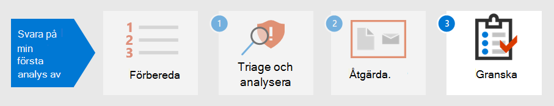

# Steg 2.Step 2. Åtgärda den första incidentenRemediate your first incident

[!INCLUDE [Microsoft 365 Defender rebranding](../includes/microsoft-defender.md)]

**Gäller för:****Applies to:**
- Microsoft 365 DefenderMicrosoft 365 Defender

Microsoft 365 Defender tillhandahåller inte bara funktioner för identifiering och analys, utan erbjuder även inneslutning och intrång i skadlig programvara.Microsoft 365 Defender not only provides detection and analysis capabilities but also provides containment and eradication of malware. Inneslutning innehåller åtgärder för att minska attackens påverkan, medan säkerställer att alla spårningar av attackersaktivitet tas bort från nätverket.Containment includes steps to reduce the impact of the attack while eradication ensures all traces of attacker activity are removed from the network.  Microsoft 365 I Defender finns flera åtgärder som du  kan konfigurera för att åtgärda automatiskt beroende på operativsystem och attacktyp.Microsoft 365 Defender offers several remediation actions which can be configured to [auto-remediate](m365d-autoir.md) depending on your operating system and the attack type.

Microsoft 365 Defender erbjuder flera åtgärder som analytiker kan initiera manuellt.Microsoft 365 Defender offers several remediation actions that analysts can manually initiate. Åtgärder är indelade i två kategorier: Åtgärder på enheter och Åtgärder på filer.Actions are separated into two categories, Actions on devices and Actions on files. Vissa åtgärder kan användas för att omedelbart stoppa hoten medan andra åtgärder bidrar till ytterligare analys av konsekvensanalyser.Some actions can be used to immediately stop the threat while other actions assist in further forensic analysis.

## Åtgärder på enheterActions on devices

- **Isolera enheten** – Den här aktiviteten blockerar omedelbart all nätverkstrafik (Internet och intern) för att minimera spridningen av skadlig programvara och tillåta analytiker att fortsätta analysen utan att en illvillig aktör kan fortsätta en attack.**Isolate the device** - This activity immediately blocks all network traffic (internet and internal) to minimize the spread of malware and allow analysts to continue analysis without a malicious actor being able to continue an attack. Den enda anslutning som tillåts är till Microsoft Defender för identitetstjänstmoln så att Microsoft Defender för identitet kan fortsätta att övervaka enheten.The only connection allowed is to the Microsoft Defender for Identity service cloud so Microsoft Defender for Identity can continue to monitor the device. 
- **Begränsa programkörning** – För att hindra ett program från att köras tillämpas en kodintegritetsprincip som bara tillåter att filer körs om de är signerade av ett certifikat som utfärdats av Microsoft.**Restrict app execution** - To restrict an application from running, a code integrity policy is applied that only allows files to run if they are signed by a Microsoft-issued certificate. Den här begränsningsmetoden kan förhindra att en attack kontrollerar komprometterade enheter och utför ytterligare skadliga aktiviteter.This method of restriction can help prevent an attacker from controlling compromised devices and performing further malicious activities.
- **Kör antivirussökning** – en Microsoft Defender Antivirus kan köras tillsammans med andra antivirusprogram, oavsett om Defender Antivirus är den aktiva antiviruslösningen eller inte.**Run Antivirus scan** - A Microsoft Defender Antivirus scan can run alongside other antivirus solutions, whether Defender Antivirus is the active antivirus solution or not. Om en annan antivirusleverantör är den primära lösning för slutpunktsskydd kan du köra Defender Antivirus i passivt läge.If another antivirus vendor product is the primary endpoint protection solution, you can run Defender Antivirus in Passive mode.
- **Initiera automatisk undersökning** – Du kan påbörja en ny, allmän automatisk undersökning på enheten.**Initiate automated investigation** - You can start a new general purpose automated investigation on the device. Medan en undersökning körs kommer alla andra aviseringar som genereras från enheten att läggas till i en pågående automatiserad undersökning tills undersökningen har slutförts.While an investigation is running, any other alert generated from the device will be added to an ongoing automated investigation until that investigation is completed. Om samma hot visas på andra enheter läggs dessa enheter dessutom till i undersökningen.In addition, if the same threat is seen on other devices, those devices are added to the investigation.
- **Initiera livesvar** – Live-svar är en funktion som ger dig omedelbar åtkomst till en enhet med hjälp av en fjärranslutning med skal.**Initiate live response** - Live response is a capability that gives you instantaneous access to a device by using a remote shell connection. Det gör att du kan utföra djupgående undersökningsarbete och vidta omedelbart åtgärder för att snabbt identifiera hot i realtid.This gives you the ability to do in-depth investigative work and take immediate response actions to promptly contain identified threats in real time. Med live-svar kan du förbättra undersökningar genom att samla in tekniska data, köra skript, skicka misstänkta enheter för analys, åtgärda hot och proaktivt leta efter nya hot.Live response is designed to enhance investigations by enabling you to collect forensic data, run scripts, send suspicious entities for analysis, remediate threats, and proactively hunt for emerging threats.
- **Paket för insamling** av undersökning – Som en del av undersökningen eller svarsprocessen kan du samla in ett undersökningspaket från en enhet.**Collect investigation package** - As part of the investigation or response process, you can collect an investigation package from a device. Genom att samla in undersökningspaketet kan du identifiera enhetens aktuella status och ytterligare förstå de verktyg och tekniker som används av attackeraren.By collecting the investigation package, you can identify the current state of the device and further understand the tools and techniques used by the attacker. 
- **Kontakta en** expert på hot (finns i både åtgärder på enheter och filer) – Du kan kontakta en Expert på Microsoft-hot för att få mer information om potentiellt komprometterade enheter eller enheter som redan har komprometterats.**Consult a threat expert** (available in both Actions on devices and files) - You can consult a Microsoft threat expert for more insights regarding potentially compromised devices or devices that are already compromised. Microsofts experter kan vara engagerade direkt från Microsoft Defender Säkerhetscenter för att få ett snabbt och korrekt svar.Microsoft threat experts can be engaged directly from within the Microsoft Defender Security Center for a timely and accurate response. 

## Åtgärder för filerActions on files

- **Stoppa och sätt filen** i karantän – Den här åtgärden innefattar att stoppa processer, kvartilfiler och ta bort beständiga data, till exempel registernycklar.**Stop and quarantine file** - This action includes stopping running processes, quarantining files, and deleting persistent data, such as any registry keys. Den här åtgärden gäller på enheter med Windows 10, version 1703 eller senare, där filen har observerats de senaste 30 dagarna.This action takes effect on devices with Windows 10, version 1703 or later, where the file was observed in the last 30 days. 
- **Lägga till indikatorer för att blockera eller** tillåta fil – Förhindra ytterligare spridning av en attack i organisationen genom att spärra potentiellt skadliga filer eller misstänkt skadlig kod.**Add indicators to block or allow file** - Prevent further propagation of an attack in your organization by banning potentially malicious files or suspected malware. Med den här åtgärden förhindras att filen läses, skrivs eller körs på enheter i organisationen.This operation will prevent the file from being read, written, or executed on devices in your organization.
- **Ladda ned eller samla** in fil – Med den här åtgärden kan analytiker ladda ned en fil i en lösenordsskyddad .zip-arkivfil för vidare analys av organisationen.**Download or collect file** – This action allows analysts to download a file in a password protected .zip archive file for further analysis by the organization.
- **Djupanalys** – Med den här åtgärden körs en fil i en säker, fullständigt instrumenterad molnmiljö.**Deep analysis** – This action executes a file in a secure, fully instrumented cloud environment. Djupanalysresultat visar filens aktiviteter, observerade beteenden och tillhörande artefakter, till exempel neds ignorerade filer, registerändringar och kommunikation med IP-adresser.Deep analysis results show the file's activities, observed behaviors, and associated artifacts, such as dropped files, registry modifications, and communication with IP addresses. 

Vi fortsätter med exemplet [i Identifiera, hantera och analysera incidenter](first-incident-analyze.md#analyze-your-first-incident)– en analytiker kan åtgärda problemet med följande åtgärder:Continuing the example in [Detect, triage, and analyze incidents](first-incident-analyze.md#analyze-your-first-incident), an analyst can remediate this incident with these actions:

1. Återställa lösenordet för användarkontot omedelbartImmediately reset the user account password
2. Identifiera enheten i Microsoft 365 Defender tills djupanalys är klarIsolate the device in Microsoft 365 Defender until deep analysis is complete
3. Kontrollera att den skadliga filen satts i karantän från SharePointEnsure the malicious file was quarantined from SharePoint
4. Kontrollera vilka slutpunkter som påverkades av skadlig programvaraCheck which endpoints were affected by malware
5. Bygga om systemRebuild systems
6. Sök efter liknande Microsoft Cloud App Security aviseringar för andra användareCheck for similar Microsoft Cloud App Security alerts for other users
7. Skapa en anpassad indikator i Microsoft Defender för Slutpunkt för att blockera en Tor IP-adressCreate a custom indicator in Microsoft Defender for Endpoint to block a Tor IP address
8. Skapa en styrningsåtgärd i Microsoft Cloud App Security för den här typen av avisering, till exempel de som visas i följande bild:Create a governance action in Microsoft Cloud App Security for this type of alert such as those shown in the following image:

   :::image type="content" source="../../media/first-incident-remediate/first-incident-mcas-governance.png" alt-text="Exempel på styrningsåtgärder i Microsoft Cloud App Security portalen"::: 
 
De flesta åtgärder kan tillämpas och spåras i Microsoft 365 Defender.Most of the remediation actions can be applied and tracked in Microsoft 365 Defender. 

## Använda spelböckerUsing Playbooks

Dessutom kan du skapa automatisk åtgärd med hjälp av spelböcker.In addition, automated remediation can be created using playbooks. För närvarande har Microsoft [Playbook-mallar GitHub](https://github.com/microsoft/Microsoft-Cloud-App-Security/tree/master/Playbooks) spelböcker som ger spelböcker för följande scenarier:Currently, Microsoft has [Playbook templates on GitHub](https://github.com/microsoft/Microsoft-Cloud-App-Security/tree/master/Playbooks) that provide playbooks for the following scenarios:

- Ta bort känslig fildelning efter begäran om användarverifieringRemove sensitive file sharing after requesting user validation
- Auto-triage oregelade landaviseringarAuto-triage infrequent country alerts
- Begära åtgärder för chefen innan du inaktiverar ett kontoRequest for manager action before disabling an account
- Inaktivera regler för skadlig inkorgDisable malicious inbox rules

Spelböcker använder Power Automate för att skapa anpassade automatiseringsflöden för process för att automatisera vissa aktiviteter när vissa villkor har utlösts.Playbooks use Power Automate to create custom robotic process automation flows to automate certain activities once specific criteria have been triggered. Organisationer kan skapa spelböcker från befintliga mallar eller från grunden.Organizations can create playbooks either from existing templates or from scratch. 

Här är ett exempel.Here's an example.
 
:::image type="content" source="../../media/first-incident-remediate/first-incident-power-automate.png" alt-text="Exempel på ett Power Automate anpassat automatiseringsprocessflöde för processer"::: 
 
Spelböcker kan också skapas under granskning [efter incidenter](first-incident-post.md) för att skapa åtgärdsåtgärder från incidenter för snabbare åtgärder.Playbooks can also be created during [post-incident review](first-incident-post.md) to create remediation actions from incidents for faster remediation actions. 

## Nästa stegNext step

Lär dig hur [du granskar ett incidenter efter ett incident.](first-incident-post.md)Learn how to [perform a post-incident review of an incident](first-incident-post.md).

## Se ävenSee also

- [Översikt över incidenterIncidents overview](incidents-overview.md)
- [Undersöka incidenterInvestigate incidents](investigate-incidents.md)
- [Hantera incidenterManage incidents](manage-incidents.md)
