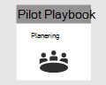
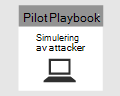

# Stänga och sammanfatta din Microsoft 365 Defender-pilotClosing and summarizing your Microsoft 365 Defender pilot  

[!INCLUDE [Microsoft 365 Defender rebranding](../includes/microsoft-defender.md)]

**Gäller för:****Applies to:**
- Microsoft 365 DefenderMicrosoft 365 Defender

| [PlaneringPlanning](m365d-pilot-plan.md) | [FörberedelsePreparation](prepare-m365d-eval.md) |  [Simulera attackSimulate attack](m365d-pilot-simulate.md) |  Stäng och sammanfattaClose and summarize|
|--|--|--|--|
|| | |*Du är här!**You are here!*|

Du befinner dig för närvarande i den sista och sammanfattande fasen.You're currently in the closing and summarizing phase.

Du har precis kört en avancerad simulering av minnes endast minne-attack som körde kod på en domänkontrollant.You’ve just ran an advanced memory-only attack simulation that executed code remotely on a domain controller. Du har sett hur Microsoft Defender för Endpoint och Microsoft Defender för identitet identifierar och skapar aviseringar om skadlig aktivitet.You’ve seen how Microsoft Defender for Endpoint and Microsoft Defender for Identity detect and create alerts on stealthy malicious activity. Du ser också hur aviseringar från olika källor levereras tillsammans med annan sammanhangsberoende information till ett enskilt incident i Microsoft 365 Säkerhetscenter-portalen.You’ve also seen how alerts from different sources are delivered along with other contextual information into a single incident in the Microsoft 365 Security Center portal. Då sådan integrering gör det möjligt för SOC-analytiker att undersöka och vidta nödvändiga åtgärder.Experiencing such integration enables SOC analysts to investigate and take necessary action. Du har också skapat en avancerad fråga för sökning som identifierar inkommande e-postmeddelanden där användaren öppnade eller sparade den bifogade filen och skapade identifiering baserat på den frågan.You’ve also created an advanced hunting query that will identify inbound emails where the user opened or saved the attachment and created detection based on that query.

Du har nått slutet av processen när alla tester är slutförda.You’ve reached the end of the process after all tests have concluded.

De slutliga resultaten bör vara:The final output should be:

- Ett slutfört styrkortA completed scorecard
- En detaljerad rapport över pilotens resultatA detailed report of the findings of the pilot
- Ett beslut om hur du ska gå framåtA decision on how to move forward

Presentera rapporter från dina slutliga utdata till interna intressenter (som du har identifierat under [förberedelsefasen)](./prepare-m365d-eval.md) och Microsoft-kontakter.Present the reports from your final output to internal stakeholders (which you’ve identified during the [preparation](./prepare-m365d-eval.md) phase) and Microsoft contacts. Ett sådant arbete säkerställer att all feedback kan användas för att förbättra produkter och dokumentation.Such an effort ensures that any feedback can be used to improve products and documentation.

Vi hoppas att du gillade den här simuleringen.We hope you enjoyed this simulation. Börja implementera det du har lärt dig i större skala i din organisation för att få ut mesta mesta av den integrerade säkerhetslösningen.Start implementing what you've learned on a larger scale in your organization to get the most out of the integrated security solution.

## Nästa stegNext step
Läs mer om Microsoft 365 Defender-pelarna genom följande interaktiva guider:Learn more about the Microsoft 365 Defender pillars through the following interactive guides:
- [Skydda din organisation med Microsoft Defender för Office 365Safeguard your organization with Microsoft Defender for Office 365](https://aka.ms/O365ATP-Interactive-Guide)
- [Identifiera misstänkta aktiviteter och potentiella attacker med Microsoft Defender för identitetDetect suspicious activities and potential attacks with Microsoft Defender for Identity](https://aka.ms/AATP-Interactive-Guide)
- [Upptäcka hot och hantera aviseringar med Microsoft Cloud App SecurityDetect threats and manage alerts with Microsoft Cloud App Security](https://aka.ms/DetectThreatsAndAlertsMCAS-InteractiveGuide)
- [Undersöka och åtgärda hot med Microsoft Defender för EndpointInvestigate and remediate threats with Microsoft Defender for Endpoint](https://aka.ms/MDATP-IR-Interactive-Guide)