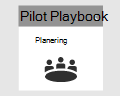
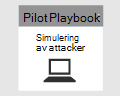
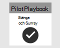

# Planera ditt Microsoft 365 Defender-pilotprojektPlanning your pilot Microsoft 365 Defender project 

[!INCLUDE [Microsoft 365 Defender rebranding](../includes/microsoft-defender.md)]

**Gäller för:****Applies to:**
- Microsoft 365 DefenderMicrosoft 365 Defender

| PlaneringPlanning| [FörberedelsePreparation](prepare-m365d-eval.md) |  [Simulera attackSimulate attack](m365d-pilot-simulate.md) |  [Stäng och sammanfattaClose and summarize](m365d-pilot-close.md)|
|--|--|--|--|
|*Du är här!**You are here!*| | | |

Du befinner dig för närvarande i planeringsfasen.You're currently in the planning phase.

För att pilotprojektet ska vara lyckat måste du planera i detalj och få godkännanden från intressenter från början.To ensure that your pilot project is a success, it is essential to plan thoroughly with and get approvals from your stakeholders in the beginning. Planeringselementen omfattar att identifiera omfattning, användningsfall, krav och kriterier för framgång.Elements of planning include identifying scope, use cases, requirements, and success criteria.

I den här guiden får du hjälp med att planera ditt pilotprojekt.This guide walks you through how to plan your pilot project. 

>[!IMPORTANT]
>För bästa resultat bör du följa pilotinstruktionerna så nära som möjligt.For optimum results, follow the pilot instructions as closely as possible.

## OmfattningScope

Pilotens omfattning avgör hur omfattande testet ska vara, baserat på din miljö och godtagbara testmetoder.The scope of the pilot will determine how broad the test will be, based on your environment and acceptable testing methods. Här är några exempel på omfattningar att tänka på:Here are some example scopes to consider:
- Utvecklings- eller testmiljö som omfattar slutpunkter, servrar och domänkontrollanter.Development or test environment which includes endpoints, servers, domain controllers.
- Produktionsmiljö med Microsoft 365, Azure, Active Directory-tjänster, slutpunkter och servrarProduction environment with Microsoft 365, Azure, Active Directory services, endpoints, and servers

>[!NOTE]
>Om du inte har fullständiga licenser ännu kan du få utvärderingslicenser för att utvärdera [Microsoft 365 Defender](m365d-evaluation.md?ocid=cx-docs-MTPtriallab) – planera, förbereda, konfigurera, konfigurera och köra ditt pilotprojekt.If you don’t have the full licenses yet, you can get trial licenses to [evaluate Microsoft 365 Defender](m365d-evaluation.md?ocid=cx-docs-MTPtriallab) – plan, prepare, setup, configure, and run your pilot project. Intressenterna kommer att ha en stor roll för att underlätta processen från början till slut.Your stakeholders will play a big role in helping facilitate the process from start to finish.

Vilka typer av operativsystem som ska utvärderas bör också definieras utifrån organisationsstruktur.The types of operating systems to be evaluated should also be defined based on the organizational makeup. Detta kan inkludera följande: [Mac-slutpunkter,](/windows/security/threat-protection/microsoft-defender-atp/microsoft-defender-atp-mac#system-requirements) [Linux-servrar,](/windows/security/threat-protection/microsoft-defender-atp/microsoft-defender-atp-linux#system-requirements) [Windows 10-slutpunkter](/windows/security/threat-protection/microsoft-defender-atp/minimum-requirements#supported-windows-versions), [Windows Server 2016](/windows/security/threat-protection/microsoft-defender-atp/minimum-requirements#supported-windows-versions).This may include the following: [Mac endpoints](/windows/security/threat-protection/microsoft-defender-atp/microsoft-defender-atp-mac#system-requirements), [Linux Servers](/windows/security/threat-protection/microsoft-defender-atp/microsoft-defender-atp-linux#system-requirements), [Windows 10 endpoints](/windows/security/threat-protection/microsoft-defender-atp/minimum-requirements#supported-windows-versions), [Windows Server 2016](/windows/security/threat-protection/microsoft-defender-atp/minimum-requirements#supported-windows-versions).

## AnvändningsfallUse cases

Användningsfall representerar instruktioner om hur verktyget som testas är avsett att användas av de avsedda användarna.Use cases represent statements of how the tool being tested is meant to be consumed by its intended users. De kan utformas som användarberättelser ur perspektiv hos en viss person, till exempel som SOC-analytiker.These can be formulated as user stories from the point of view of a particular persona, such as a SOC analyst. Till exempel:For example:
- Som SOC-analytiker behöver jag visa, korrelera, bedöma och hantera aviseringar och händelser för olika enheter, användare och postlådor i nätverket.As a SOC analyst, I need to view, correlate, assess and manage alerts and events across devices, users, and mailboxes in my network. [Incidenthantering][Incident management]
- Som SOC-analytiker måste jag ha verktyget och processen för att automatiskt undersöka och svara på skadliga händelser i nätverket.As a SOC analyst, I must have the tool and process to automatically investigate and respond to malicious events in my network. [Automatisk IR][Auto IR]
- Som SOC-analytiker måste jag söka efter data från min miljö för att hitta kända och potentiella hot och misstänkta aktiviteter.As a SOC analyst, I must search data from my environment to find known and potential threats, and suspicious activities. [Advanced Hunting][Advanced Hunting]

Kom ihåg att dessa användningsfall bör skapas inom parametrarna för den definierade omfattningen.Keep in mind that these use cases should be created within the parameters of the defined scope. Om till exempel omfattningen av testningen inte omfattar en utvärdering av verktyg som Microsoft Cloud App Security ska du inte skapa ärenden som förlitar sig på detta som datakälla.If, for example, the scope of testing does not include an evaluation of tools such as Microsoft Cloud App Security, then use cases that rely on this as a data source should not be created.

## KravRequirements

Från listan över användningsfall kan du börja skapa krav.From the list of use cases, you can start to create requirements. Kraven omfattar funktioner som ett verktyg måste ha för att uppfylla användningsfallen.Requirements include features a tool must have to satisfy the use cases. De här kraven kan delas in i kategorier som konfiguration och underhåll, stöd för integrationer och funktionsspecifika krav som möjligheten att hitta och möjligheten att skapa anpassade aviseringar.These requirements can be broken down into categories such as configuration and maintenance, support for integrations, and feature-specific requirements like hunting ability and the ability to build custom alerts.

## TestplanTest plan

Olika testmetoder kan vara lämpliga beroende på kraven.Depending on the requirements, different methods of testing may be appropriate. Om kravet till exempel är att utvärdera hur effektiv Automatiserad åtgärd är, måste testplanen innehålla steg för att generera beteendet som utlöser en automatiserad åtgärd inom Microsoft 365 Defender.For instance, if the requirement is to evaluate the efficacy of Automated Remediation, the test plan needs to include steps to generate the behavior(s) that would trigger an automated remediation action within Microsoft 365 Defender. Om kravet är att identifiera ett visst beteende eller en viss attack kan testet innebära fler steg.If the requirement is to detect a particular behavior or attack, then the test may involve more steps. Poängen är att ha en plan för att testa mot dina krav korrekt.The point is to have a plan in place to accurately test against your requirements.

## Kriterier för framgångSuccess criteria

Framgångskriterierna är i slutänden den stapel som mäter mot det du testar.Success criteria is ultimately the bar set to measure against what you are testing. Oavsett om du testar Microsoft 365 Defender (eller någon annan teknik för den delen) mot andra verktyg eller för sig själv, måste det finnas några kvantifierbara villkor för att fastställa vilket värde verktyget tillhandahåller.Whether you are testing Microsoft 365 Defender (or any other technology for that matter) against other tools or by itself, there must be some quantifiable criteria to determine the value the tool provides. Utifrån omfattningen, kraven och testplanen avgör framgångskriterierna hur testet ska betygstesta.Based on the scope, requirements, and testing plan, the success criteria will determine how to score the test. Det bör vara mindre godkänt eller misslyckat och mer av en viktad poäng baserat på dina behov.This should be less of a pass or fail and more of a weighted scoring based on your needs. Ett verktyg kan till exempel behöva poäng över 80 % i vissa kritiska områden som du identifierar.For example, to be successful, a tool may need to score above 80% in certain critical areas you identify.

## StyrkortScorecard

Ett sätt att samla alla delar av planen kan vara att skapa ett styrkort.One way to bring all elements of your plan together can be to create a scorecard. Se ett exempel på styrkort nedan:See a sample scorecard below:

| AnvändningsfallUse case | KravRequirements | KonfigurationskravConfiguration requirements | TestplanTest plan | Förväntat resultatExpected outcome | TeststatusTest status | PoängScore | KommentarerNotes |
|:-------|:-------|:-------|:-------|:-------|:-------|:-------|:-------|
|IncidenthanteringIncident management|- Microsoft 365 Defender-  Microsoft 365 Defender    - Microsoft Defender för identitet- Microsoft Defender for Identity   - Microsoft Defender för Slutpunkt- Microsoft Defender for Endpoint   - Microsoft Cloud App Security (valfritt)- Microsoft Cloud App Security (optional)|Mer information [finns i](m365d-evaluation.md?ocid=cx-docs-MTPtriallab) förutsättningarna för att förbereda, konfigurera och konfigureraSee the [prerequisites](m365d-evaluation.md?ocid=cx-docs-MTPtriallab) for preparation, set-up, and configuration for details |[Simulera attackSimulate attack](m365d-pilot-simulate.md)   [Undersök incidentenInvestigate the incident](./m365d-pilot-simulate.md#investigate-an-incident) |En verksamhet kan förstå händelsens omfattning och påverkan och hur den hanterasInvestigators can understand the scope and impact of the incident and manage the incident||||
|AutoIRAutoIR|- Microsoft 365 Defender-   Microsoft 365 Defender   - Microsoft Defender för identitet- Microsoft Defender for Identity   - Microsoft Defender för Slutpunkt- Microsoft Defender for Endpoint |Mer information [finns i](m365d-evaluation.md?ocid=cx-docs-MTPtriallab) förutsättningarna för att förbereda, konfigurera och konfigureraSee the [prerequisites](m365d-evaluation.md?ocid=cx-docs-MTPtriallab) for preparation, set-up, and configuration for details  Aktivera AutoIREnable AutoIR  |[Simulera attackSimulate attack](m365d-pilot-simulate.md)   [Automatiserad undersökningAutomated investigation](m365d-pilot-simulate.md#automated-investigation-and-remediation) |Aviseringar och incidenter åtgärdas automatiskt av Microsoft 365 DefenderAlerts and incidents are automatically remediated by Microsoft 365 Defender||||
|Avancerad jaktAdvanced hunting|- Microsoft 365 Defender- Microsoft 365 Defender   - Microsoft Defender för Slutpunkt- Microsoft Defender for Endpoint   -Microsoft Defender för Office 365-Microsoft Defender for Office 365 |Mer information [finns i](m365d-evaluation.md?ocid=cx-docs-MTPtriallab) förutsättningarna för att förbereda, konfigurera och konfigureraSee the [prerequisites](m365d-evaluation.md?ocid=cx-docs-MTPtriallab) for preparation, set-up, and configuration for details|[Avancerat sökningsscenarioAdvanced hunting scenario](./m365d-pilot-simulate.md#advanced-hunting-scenario) |Funktioner kan hitta data via avancerad sökning, pivotering till berörda enheter och genom att skapa anpassade identifieringarInvestigators can find data through advanced hunting, pivoting to impacted entities, and by creating custom detections||||

## Nästa stegNext step
|  [FörberedelsefasPreparation phase](prepare-m365d-eval.md) | Förbereda pilotmiljön i Microsoft 365 DefenderPrepare your Microsoft 365 Defender pilot environment
|:-------|:-----|
