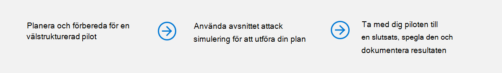
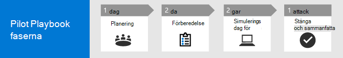

# Kör ditt pilotprojekt i Microsoft 365 Defender 

[!INCLUDE [Microsoft 365 Defender rebranding](../includes/microsoft-defender.md)]

**Gäller för:**
- Microsoft 365 Defender

Den här guiden hjälper dig att köra ett pilotprojekt genom att lägga till pekare för att säkerställa att du har en välstrukturerad plan så att du kan vägleda dig genom att använda attack simuleringsfunktionen och slutligen göra en avslutande beräkning av piloten med viktiga take-aways så att du kan reflektera över och dokumentera resultaten.

Genom att köra ett pilottest kan du effektivt avgöra fördelarna med att använda Microsoft 365 Defender. Innan du aktiverar Microsoft 365 Defender i produktionsmiljön och startar dina användningsfall är det bäst att planera för att fastställa vilka uppgifter som ska utföras för ditt pilotprojekt och ange framgångskriterier. 

## Så här använder du den här pilotspelboken

Den här guiden innehåller en översikt över Microsoft 365 Defender och stegvisa instruktioner om hur du ställer in ditt pilotprojekt. 

Microsoft 365 Defender är en enhetlig företagsskyddssvit före och efter intrång som inbyggt koordinerar skydd, identifiering, skydd, undersökning och svar mellan slutpunkter, identiteter, e-post och program för att tillhandahålla integrerat skydd mot avancerade attacker. Det gör det genom att kombinera och lösa följande funktioner till en enda säkerhetslösning:
  - Microsoft Defender för Slutpunkt (slutpunkter)
  - Microsoft Defender för Office 365 (e-post) 
  - Microsoft Defender för identitet (identitet) 
  - Microsoft Cloud App Security (appar)

Med den integrerade Microsoft 365 Defender-lösningen kan säkerhetsexperter hantera hoten som Microsoft Defender för Endpoint, Microsoft Defender för Office 365, Microsoft Defender för identitet och Microsoft Cloud App-säkerhet tar emot och fastställa hotens fullständiga omfattning och påverkan, hur det kommit in i miljön, vad det påverkas och hur det för närvarande påverkar organisationen. Microsoft 365 Defender vidtar automatisk åtgärd för att förhindra eller stoppa attacken och självutmanade postlådor, slutpunkter och användaridentiteter. Mer information [finns i Översikt över Microsoft 365 Defender.](microsoft-365-defender.md)

Följande exempel på tidslinjen varierar beroende på rätt resurser i din miljö. Vissa identifieringar och arbetsflöden kan behöva mer utbildningstid än de andra.

>[!IMPORTANT]
>För bästa resultat bör du följa pilotinstruktionerna så nära som möjligt.

### Pilotspelboksfaser 

Det finns fyra faser i ett Microsoft 365 Defender-pilottest:

|Fas | Beskrivning | 
|:-------|:-----|
| [Planering](m365d-pilot-plan.md)  ~ 1 dag| Läs om vad du behöver tänka på innan du kör pilotprojektet i Microsoft 365 Defender:   - Omfattning   - Användningsfall  - Krav  - Testplan   - Kriterier för framgång   - Styrkort 
| [Förberedelse](m365d-evaluation.md)  ~2 dagar|  Access Microsoft 365 Säkerhetscenter för att konfigurera din Microsoft 365 Defender-pilotmiljö. Du vägleds till:  – Identifiera intressenter och be om att få ett pilottecken   - Att tänka på när det gäller miljön  - Access  - Azure Active Directory-konfiguration   - Konfigurationsordning   - Registrera dig för utvärderingsversionen av Microsoft 365 E5   - Konfigurera domän  - Tilldela Microsoft 365 E5-licenser   - Slutför installationsguiden i portalen|
| [Attack simulering](m365d-pilot-simulate.md)  ~2 dagar| Om du vill simulera en attack får du vägledning genom att:  - Kontrollera testmiljökraven  - Kör simuleringen  - Undersöka en händelse  - lösa problemet 
| [Avslutande och sammanfattande](m365d-pilot-close.md)  ~ 1 dag| När du har kommit till slutet av processen vägleds du till:  - Gå igenom dina slutliga utdata - Presentera dina utdata för dina intressenter  - Ge feedback  - Gör nästa steg 

## Nästa steg
|[Planeringsfas](m365d-pilot-plan.md) | Planera ditt pilotprojekt i Microsoft 365 Defender 
|:-------|:-----|
