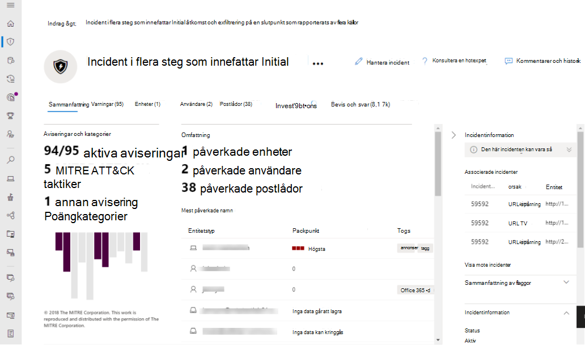
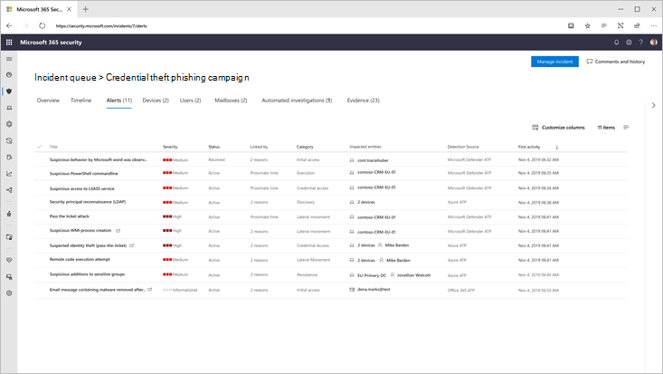
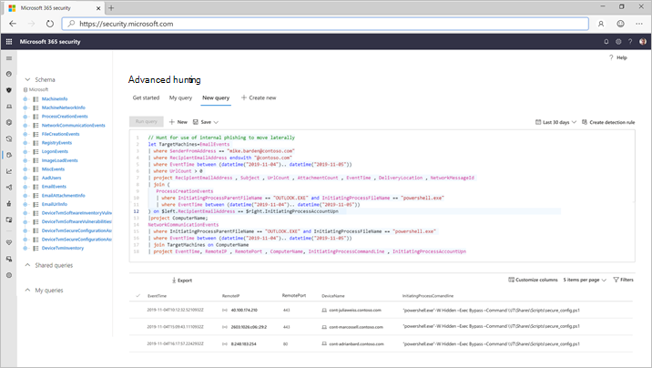

# Microsoft 365 DefenderMicrosoft 365 Defender

[!INCLUDE [Microsoft 365 Defender rebranding](../includes/microsoft-defender.md)]

**Gäller för:****Applies to:**
- Microsoft 365 DefenderMicrosoft 365 Defender

> Vill du uppleva Microsoft 365 Defender?Want to experience Microsoft 365 Defender? Du kan [utvärdera det i en laboratoriemiljö](m365d-evaluation.md?ocid=cx-docs-MTPtriallab) eller [köra ett pilotprojekt i produktionen](m365d-pilot.md?ocid=cx-evalpilot).You can [evaluate it in a lab environment](m365d-evaluation.md?ocid=cx-docs-MTPtriallab) or [run your pilot project in production](m365d-pilot.md?ocid=cx-evalpilot).
>

Microsoft 365 Defender är en enhetlig företagsskyddssvit före och efter intrång som inbyggt koordinerar identifiering, skydd, undersökning och svar mellan slutpunkter, identiteter, e-post och program för att tillhandahålla integrerat skydd mot avancerade attacker.Microsoft 365 Defender is a unified pre- and post-breach enterprise defense suite that natively coordinates detection, prevention, investigation, and response across endpoints, identities, email, and applications to provide integrated protection against sophisticated attacks.

Med den integrerade Microsoft 365 Defender-lösningen kan säkerhetsexperter samarbeta om hoten som signalerar att var och en av dessa produkter får och fastställa hotens fullständiga omfattning och påverkan. hur det angavs i miljön, vad det påverkades och hur det för närvarande påverkar organisationen.With the integrated Microsoft 365 Defender solution, security professionals can stitch together the threat signals that each of these products receive and determine the full scope and impact of the threat; how it entered the environment, what it's affected, and how it's currently impacting the organization. Microsoft 365 Defender vidtar automatisk åtgärd för att förhindra eller stoppa attacken och själv berörda postlådor, slutpunkter och användaridentiteter.Microsoft 365 Defender takes automatic action to prevent or stop the attack and self-heal affected mailboxes, endpoints, and user identities.  

<h2>Microsoft 365 Defender-tjänster
Microsoft 365 Defender services
</h2>
<table><tr><td>
<b><a href="/windows/security/threat-protection/microsoft-defender-atp/microsoft-defender-advanced-threat-protection"><b>Microsoft Defender för Slutpunkt</b>

<b><a href="/windows/security/threat-protection/microsoft-defender-atp/microsoft-defender-advanced-threat-protection"><b>Microsoft Defender for Endpoint</b>
</a></td>
<td>
<b><a href="/office365/securitycompliance/office-365-atp"><b>Microsoft Defender för Office 365</b>

<b><a href="/office365/securitycompliance/office-365-atp"><b>Microsoft Defender for Office 365</b>
</a></td>
<td>
<b><a href="/azure-advanced-threat-protection/"><b>Microsoft Defender för identitet</b></a>

<b><a href="/azure-advanced-threat-protection/"><b>Microsoft Defender for Identity</b></a>
</td>
<td>
<b><a href="/cloud-app-security/"><b>Microsoft Cloud App Security</b></a>

<b><a href="/cloud-app-security/"><b>Microsoft Cloud App Security</b></a>
</td>
</tr>
</table>
 

## Microsoft 365 Interaktiv guide för DefenderMicrosoft 365 Defender interactive guide

I den här interaktiva guiden får du lära dig hur du skyddar organisationen med Microsoft 365 Defender.In this interactive guide, you'll learn how to protect your organization with Microsoft 365 Defender. Du ser hur Microsoft 365 Defender kan hjälpa dig att identifiera säkerhetsrisker, undersöka attacker mot din organisation och förhindra skadliga aktiviteter automatiskt.You'll see how Microsoft 365 Defender can help you detect security risks, investigate attacks to your organization, and prevent harmful activities automatically.

[Ta del av den interaktiva guidenCheck out the interactive guide](https://aka.ms/M365Defender-InteractiveGuide)

Microsoft 365 Defender Suite skyddar:Microsoft 365 Defender suite protects: 
- **Slutpunkter med Microsoft Defender** för slutpunkt – Microsoft Defender för Slutpunkt är en enhetlig slutpunktsplattform för förebyggande skydd, identifiering efter intrång, automatisk undersökning och svar.**Endpoints with Microsoft Defender for Endpoint** - Microsoft Defender for Endpoint is a unified endpoint platform for preventative protection, post-breach detection, automated investigation, and response. 
- **E-post** och samarbete med Microsoft Defender för Office 365 – Defender för Office 365 skyddar organisationen mot skadliga hot som kan orsakas av e-postmeddelanden, länkar (URL:er) och samarbetsverktyg.**Email and collaboration with Microsoft Defender for Office 365** - Defender for Office 365 safeguards your organization against malicious threats posed by email messages, links (URLs) and collaboration tools. 
- **Identiteter** med Microsoft Defender för identitet och Azure AD-identitetsskydd – Microsoft Defender för identitet använder Active Directory-signaler för att identifiera, identifiera och undersöka avancerade hot, komprometterade identiteter och skadliga Insider-åtgärder som vidtas i organisationen.**Identities with Microsoft Defender for Identity and Azure AD Identity Protection** - Microsoft Defender for Identity uses Active Directory signals to identify, detect, and investigate advanced threats, compromised identities, and malicious insider actions directed at your organization. 
- **Program med Microsoft Cloud App-säkerhet** – Microsoft Cloud App-säkerhet är en omfattande SaaS-lösning som ger djup synlighet, starka datakontroller och förbättrat skydd av hot i dina molnappar.**Applications with Microsoft Cloud App security** - Microsoft Cloud App security is a comprehensive cross-SaaS solution bringing deep visibility, strong data controls, and enhanced threat protection to your cloud apps. 

>[!VIDEO https://www.microsoft.com/en-us/videoplayer/embed/RE4Bzww] 

Microsoft 365 I Defenders unika lager utökas de enskilda programsvitens komponenter så att de:Microsoft 365 Defender's unique cross-product layer augments the individual suite components to:
- Skydda mot attacker och koordinera skydd av skydd i hela programsviten med signaldelning och automatiserade åtgärderHelp protect against attacks and coordinate defensive responses across the suite through signal sharing and automated actions
- Berätta en fullständig historia om attackerna för produktaviseringar, beteenden och sammanhang för säkerhetsteam genom att sammanfoga data om aviseringar, misstänkta händelser och påverkade tillgångar till "incidenter"Narrate the full story of the attack across product alerts, behaviors, and context for security teams by joining data on alerts, suspicious events and impacted assets to 'incidents'
- Automatisera svar på kompromett genom att självutlösa självbetjäning för påverkade tillgångar genom automatiserad åtgärdAutomate response to compromise by triggering self-healing for impacted assets through automated remediation
- Gör det möjligt för säkerhetsteam att utföra detaljerade och effektiva hot efter hot i endpoint och Office dataEnable security teams to perform detailed and effective threat hunting across endpoint and Office data

  
Incident med flera produkter (översikt)Cross-product incident (Overview)

 
Alla relaterade aviseringar i programsvitens produkter korreleras till ett enskilt incident (vyn Aviseringar)All related alerts across the suite products correlated together into a single incident (alerts view)

 
Frågebaserad sökning ovanpå e-post- och slutpunktens rådataQuery-based hunting on top of email and endpoint raw data

Microsoft 365 Defenders funktioner för flera produkter omfattar:Microsoft 365 Defender cross-product features include: 
- **Enstaka fönsterruta** med flera produkter – central vy med all information för identifieringar, påverkade tillgångar, automatiserade åtgärder och relaterade bevis i en enda kö och ett enda fönster [i security.microsoft.com](https://security.microsoft.com).**Cross-product single pane of glass** - Central view all information for detections, impacted assets, automated actions taken, and related evidence in a single queue and a single pane in [security.microsoft.com](https://security.microsoft.com). 
- **Kö för kombinerade** incidenter – För att hjälpa säkerhetspersonal att fokusera på vad som är viktigt genom att säkerställa hela attackomfånget grupperas påverkade tillgångar och automatiserade åtgärdsåtgärder tillsammans och visas i tid.**Combined incidents queue** - To help security professionals focus on what is critical by ensuring the full attack scope, impacted assets and automated remediation actions are grouped together and surfaced in a timely manner. 
- **Automatiskt svar på hot** – Viktig information om hot delas i realtid mellan Microsoft 365 Defender-produkterna för att stoppa attackens förlopp.**Automatic response to threats** - Critical threat information is shared in real time between the Microsoft 365 Defender products to help stop the progression of an attack. Om till exempel en skadlig fil upptäcks på en slutpunkt som skyddas av Microsoft Defender för Endpoint, instrueras Defender för Office 365 att söka igenom och ta bort filen från alla e-postmeddelanden.For example, if a malicious file is detected on an endpoint protected by Microsoft Defender for Endpoint, it will instruct Defender for Office 365 to scan and remove the file from all e-mail messages. Filen blockeras av hela säkerhetspaketet i Microsoft 365 synhåll.The file will be blocked on sight by the entire Microsoft 365 security suite.
- **Självhjälp** för komprometterade enheter, användaridentiteter och postlådor – Microsoft 365 Defender använder automatiska åtgärder och spelböcker med AI-drivna medel för att åtgärda påverkade tillgångar i ett säkert tillstånd.**Self-healing for compromised devices, user identities, and mailboxes** - Microsoft 365 Defender uses AI-powered automatic actions and playbooks to remediate impacted assets back to a secure state. Microsoft 365 Defender utnyttjar de automatiska åtgärdsfunktionerna i programsvitens produkter för att säkerställa att alla påverkade tillgångar relaterade till ett incidenter åtgärdas automatiskt om det är möjligt.Microsoft 365 Defender leverages automatic remediation capabilities of the suite products to ensure all impacted assets related to an incident are automatically remediated where possible.
- **Produkter** med hot på flera platser – Säkerhetsteam kan utnyttja sin unika kunskap om organisationen för att leta efter tecken på kompromisser genom att skapa egna anpassade frågor över rådata som samlas in av olika skyddsprodukter.**Cross-product threat hunting** - Security teams can leverage their unique organizational knowledge to hunt for signs of compromise by creating their own custom queries over the raw data collected by the various protection products. Microsoft 365 Defender ger frågebaserad åtkomst till 30 dagars historiska rådata och aviseringsdata över slutpunkten och Microsoft Defender för Office 365 data.Microsoft 365 Defender provides query-based access to 30 days of historic raw signals and alert data across endpoint and Microsoft Defender for Office 365 data. 

## Komma igångGet started
Microsoft 365 Licenskraven för Defender måste vara uppfyllda innan du kan aktivera tjänsten i Microsoft 365 säkerhetscenter [på security.microsoft.com](https://security.microsoft.com).Microsoft 365 Defender licensing requirements must be met before you can enable the service in the Microsoft 365 security center at [security.microsoft.com](https://security.microsoft.com). Mer information finns i:For more information, read:
- [LicensieringskravLicensing requirements](prerequisites.md#licensing-requirements)
- [Aktivera Microsoft 365 DefenderTurn on Microsoft 365 Defender](m365d-enable.md)

## Se ävenSee also
- [Distribuera skyddsfunktioner för hot i hela Microsoft 365 E5Deploy threat protection capabilities across Microsoft 365 E5](/microsoft-365/solutions/deploy-threat-protection)
