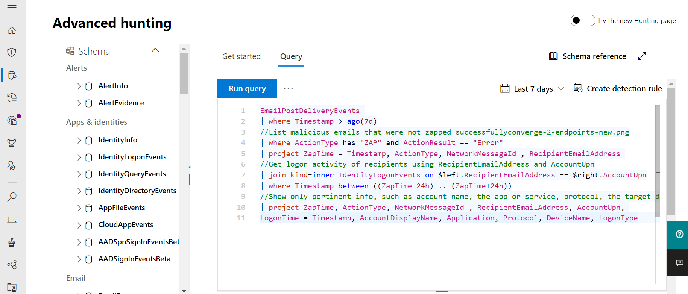

# Microsoft 365 Defender

[!INCLUDE [Microsoft 365 Defender rebranding](../includes/microsoft-defender.md)]

**Gäller för:**
- Microsoft 365 Defender

> Vill du uppleva Microsoft 365 Defender? Du kan [utvärdera det i en laboratoriemiljö](m365d-evaluation.md?ocid=cx-docs-MTPtriallab) eller [köra ett pilotprojekt i produktionen](m365d-pilot.md?ocid=cx-evalpilot).
>

Microsoft 365 Defender är en enhetlig företagsskyddssvit före och efter intrång som inbyggt koordinerar identifiering, skydd, undersökning och svar mellan slutpunkter, identiteter, e-post och program för att ge integrerat skydd mot avancerade attacker.

Med den integrerade Microsoft 365 Defender-lösningen kan säkerhetsexperter hantera hoten som utgör en signal att var och en av dessa produkter får och fastställa hotens fullständiga omfattning och påverkan. hur det angavs i miljön, vad det påverkades och hur det för närvarande påverkar organisationen. Microsoft 365 Defender vidtar automatisk åtgärd för att förhindra eller stoppa attacken och självutmanade postlådor, slutpunkter och användaridentiteter.  

<h2>Microsoft 365 Defender-tjänster
</h2>
<table><tr><td>
<b><a href="https://docs.microsoft.com/windows/security/threat-protection/microsoft-defender-atp/microsoft-defender-advanced-threat-protection"><b>Microsoft Defender för Slutpunkt</b>
</a></td>
<td>
<b><a href="https://docs.microsoft.com/office365/securitycompliance/office-365-atp"><b>Microsoft Defender för Office 365</b>
</a></td>
<td>
<b><a href="/azure-advanced-threat-protection/"><b>Microsoft Defender för identitet</b></a>
</td>
<td>
<b><a href="/cloud-app-security/"><b>Microsoft Cloud App Security</b></a>
</td>
</tr>
</table>
 

## Interaktiv guide för Microsoft 365 Defender

I den här interaktiva guiden får du lära dig hur du skyddar organisationen med Microsoft 365 Defender. Du ser hur Microsoft 365 Defender kan hjälpa dig att identifiera säkerhetsrisker, undersöka attacker mot din organisation och förhindra skadliga aktiviteter automatiskt.

[Ta en titta på den interaktiva guiden](https://aka.ms/M365Defender-InteractiveGuide)

Microsoft 365 Defender-paketet skyddar: 
- **Slutpunkter med Microsoft Defender** för slutpunkt – Microsoft Defender för Slutpunkt är en enhetlig slutpunktsplattform för förebyggande skydd, identifiering efter intrång, automatisk undersökning och svar. 
- E-post och samarbete med Microsoft Defender för **Office 365** – Defender för Office 365 skyddar organisationen mot skadliga hot som kan orsakas av e-postmeddelanden, länkar och samarbetsverktyg. 
- **Identiteter** med Microsoft Defender för identitet och Azure AD-identitetsskydd – Microsoft Defender för identitet använder Active Directory-signaler för att identifiera, identifiera och undersöka avancerade hot, komprometterade identiteter och skadliga Insider-åtgärder som vidtas i organisationen. 
- **Program med Microsoft Cloud App-säkerhet** – Microsoft Cloud App-säkerhet är en omfattande SaaS-lösning som ger djup synlighet, starka datakontroller och förbättrat skydd av hot i dina molnappar. 

>[!VIDEO https://www.microsoft.com/en-us/videoplayer/embed/RE4Bzww] 

I det unika lagret i Microsoft 365 Defender utökas de enskilda programsvitens komponenter så att de:
- Skydda mot attacker och koordinera skydd av skydd i hela programsviten med signaldelning och automatiserade åtgärder
- Berätta en fullständig historia om attackerna för produktaviseringar, beteenden och sammanhang för säkerhetsteam genom att sammanfoga data om aviseringar, misstänkta händelser och påverkade tillgångar till "incidenter"
- Automatisera svar på kompromett genom att självutlösa självbetjäning för påverkade tillgångar genom automatiserad åtgärd
- Gör det möjligt för säkerhetsteam att utföra detaljerade och effektiva hot efter hot i slutpunkts- och Office-data

  
Incident med flera produkter (översikt)

 
Alla relaterade aviseringar i programsvitens produkter korreleras till ett enskilt incident (vyn Aviseringar)

 
Frågebaserad sökning ovanpå e-post- och slutpunktens rådata

Microsoft 365 Defender-funktioner för flera produkter omfattar: 
- **Enstaka fönsterruta** med flera produkter – central vy med all information för identifieringar, påverkade tillgångar, automatiserade åtgärder och relaterade bevis i en enda kö och ett enda fönster [i security.microsoft.com](https://security.microsoft.com). 
- **Kö för kombinerade** incidenter – För att hjälpa säkerhetspersonal att fokusera på vad som är viktigt genom att säkerställa hela attackomfånget grupperas påverkade tillgångar och automatiserade åtgärdsåtgärder tillsammans och visas i tid. 
- **Automatiskt svar på hot** – Viktig information om hot delas i realtid mellan Microsoft 365 Defender-produkterna för att stoppa attackens förlopp. Om till exempel en skadlig fil identifieras på en slutpunkt som skyddas av Microsoft Defender för Endpoint, instrueras Defender för Office 365 att söka igenom och ta bort filen från alla e-postmeddelanden. Filen blockeras av hela Microsoft 365-säkerhetspaketet.
- **Självhjälp** för komprometterade enheter, användaridentiteter och postlådor – Microsoft 365 Defender använder AI-drivna automatiska åtgärder och spelböcker för att åtgärda påverkade tillgångar i ett säkert tillstånd. Microsoft 365 Defender utnyttjar de automatiska åtgärdsfunktionerna i programsvitens produkter för att se till att alla påverkade tillgångar relaterade till ett incidenter åtgärdas automatiskt om det är möjligt.
- **Produkter** med hot på flera platser – Säkerhetsteam kan utnyttja sin unika kunskap om organisationen för att leta efter tecken på kompromisser genom att skapa egna anpassade frågor över rådata som samlas in av olika skyddsprodukter. Microsoft 365 Defender ger frågebaserad åtkomst till 30 dagars historiska rådata och aviseringsdata över slutpunkten och Microsoft Defender för Office 365-data. 

## Komma igång
Licenskraven för Microsoft 365 Defender måste uppfyllas innan du kan aktivera tjänsten i säkerhetscentret för Microsoft 365 [på security.microsoft.com.](https://security.microsoft.com) Mer information finns i:
- [Licenskrav](prerequisites.md#licensing-requirements)
- [Aktivera Microsoft 365 Defender](m365d-enable.md)
