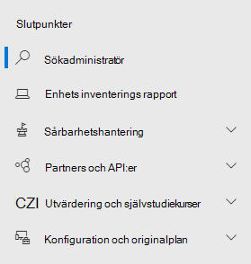
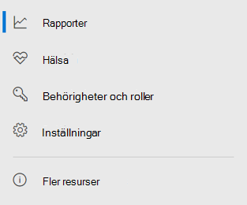

# Microsoft Defender för slutpunkt i Microsoft 365 DefenderMicrosoft Defender for Endpoint in Microsoft 365 Defender

[!INCLUDE [Microsoft 365 Defender rebranding](../includes/microsoft-defender.md)]

**Gäller för:****Applies to:**

- [Microsoft 365 DefenderMicrosoft 365 Defender](microsoft-365-defender.md)
- [Microsoft Defender för EndpointMicrosoft Defender for Endpoint](https://go.microsoft.com/fwlink/p/?linkid=2154037)

## SnabbreferensQuick reference

I bilden och i tabellen nedan visas ändringar i navigeringen mellan Microsoft Defender Säkerhetscenter och Microsoft 365 Defender.The image and the table below lists the changes in navigation between the Microsoft Defender Security Center and Microsoft 365 Defender.

> [!div class="mx-imgBorder"]
> 

| Microsoft Defender SäkerhetscenterMicrosoft Defender Security Center | Microsoft 365 DefenderMicrosoft 365 Defender |
|---------|---------|
| InstrumentpanelerDashboards <ul><li>SäkerhetsåtgärderSecurity Operations</li><li>Analys av hotThreat Analytics</li></ul>  |homeHome <ul><li>Analys av hotThreat analytics</li></ul>   |
| IncidenterIncidents | Incidenter & aviseringarIncidents & alerts |
| EnhetsinventeringDevice inventory | EnhetsinventeringDevice inventory |
| VarningsköAlerts queue | Incidenter & aviseringarIncidents & alerts |
| Automatiserade undersökningarAutomated investigations | ÅtgärdscenterAction center |
| Avancerad jaktAdvanced hunting | JaktHunting |
| RapporterReports | RapporterReports |
| Partners & API:erPartners & APIs | Partners & API:erPartners & APIs |
| Hot & sårbarhetshanteringThreat & Vulnerability Management | SårbarhetshanteringVulnerability management |
| Utvärdering och självstudiekurserEvaluation and tutorials | Utvärderingskurser & självstudiekurserEvaluation & tutorials |
| KonfigurationshanteringConfiguration management | KonfigurationshanteringConfiguration management |
| InställningarSettings | InställningarSettings | 

Den förbättrade [Microsoft 365 Defender](overview-security-center.md) kombinerar säkerhetsfunktioner som skyddar, identifierar, undersöker och svarar på e-post, [https://security.microsoft.com](https://security.microsoft.com) samarbete, identitet och enhetshot.The improved [Microsoft 365 Defender](overview-security-center.md) at [https://security.microsoft.com](https://security.microsoft.com) combines security capabilities that protect, detect, investigate, and respond to email, collaboration, identity, and device threats. Detta sammanför funktioner från befintliga Microsoft-säkerhetsportaler, Microsoft Defender Säkerhetscenter och säkerhets- Office 365 säkerhets- & efterlevnadscenter.This  brings together functionality from existing Microsoft security portals, including Microsoft Defender Security Center and the Office 365 Security & Compliance center.

Om du är bekant med Microsoft Defender Säkerhetscenter här artikeln beskriver vi några av de ändringar och förbättringar som Microsoft 365 Defender.If you're familiar with the Microsoft Defender Security Center, this article helps describe some of the changes and improvements in Microsoft 365 Defender. Det finns dock några nya och uppdaterade element som du bör känna till.However there are some new and updated elements to be aware of.

Historiskt sett har [Microsoft Defender Säkerhetscenter](/windows/security/threat-protection/microsoft-defender-atp/portal-overview) varit hemmet för Microsoft Defender för Endpoint.Historically, the [Microsoft Defender Security Center](/windows/security/threat-protection/microsoft-defender-atp/portal-overview) has been the home for Microsoft Defender for Endpoint. Företagssäkerhetsteam har använt det för att övervaka och hjälpa till att svara på varningar om potentiella avancerade fortlöpande hot eller databrott.Enterprise security teams have used it to monitor and help responding to alerts of potential advanced persistent threat activity or data breaches. För att minska antalet portaler är Microsoft 365 Defender ett hem för övervakning och hantering av säkerhet i dina Microsoft-identiteter, data, enheter, appar och infrastruktur.To help reduce the number of portals, Microsoft 365 Defender will be the home for monitoring and managing security across your Microsoft identities, data, devices, apps, and infrastructure.

Microsoft Defender för slutpunkt i Microsoft 365 Defender har stöd för att bevilja åtkomst till hanterade säkerhetstjänstleverantörer [(MSSP: er)](/windows/security/threat-protection/microsoft-defender-atp/grant-mssp-access) på samma sätt som åtkomst beviljas i [Microsoft Defender säkerhetscenter.](mssp-access.md)Microsoft Defender for Endpoint in Microsoft 365 Defender supports [granting access to managed security service providers (MSSPs)](/windows/security/threat-protection/microsoft-defender-atp/grant-mssp-access) in the same way [access is granted in the Microsoft Defender security center](mssp-access.md).

> [!IMPORTANT]
> Vad som visas i Microsoft 365 Defender beror på dina aktuella prenumerationer.What you see in Microsoft 365 Defender depends on your current subscriptions. Om du till exempel inte har en licens för Microsoft Defender för Office 365 visas inte avsnittet E& samarbete.For example, if you don't have a license for Microsoft Defender for Office 365, then the Email & Collaboration section will not be shown.

> [!Note]
> Microsoft 365 Defender är inte tillgängligt för:Microsoft 365 Defender is not available for:
>- Us Government Community Cloud (GCC)US Government Community Cloud (GCC)
>- Us Government Community Cloud High (GCC High)US Government Community Cloud High (GCC High)
>- US Department of DefenseUS Department of Defense
>- Alla amerikanska statliga myndigheter med kommersiella licenserAll US government institutions with commercial licenses

Ta en titt på Microsoft 365 Defender: [https://security.microsoft.com](https://security.microsoft.com) .Take a look at Microsoft 365 Defender: [https://security.microsoft.com](https://security.microsoft.com).

Läs mer om fördelarna: [Översikt över Microsoft 365 Defender](overview-security-center.md)Learn more about the benefits: [Overview of Microsoft 365 Defender](overview-security-center.md)

## Se vad som har ändratsWhat's changed

Den här tabellen är en snabbreferens för ändringarna mellan Microsoft Defender Säkerhetscenter och Microsoft 365 Defender.This table is a quick reference of the changes between the Microsoft Defender Security Center and Microsoft 365 Defender.

### Aviseringar och åtgärderAlerts and actions

| OmrådeArea | Beskrivning av ändringDescription of change |
|---------|---------|
| [Incidenter & aviseringarIncidents & alerts](incidents-overview.md)  | I Microsoft 365 Defender kan du hantera incidenter och aviseringar för alla dina slutpunkter, e-post och identiteter.In Microsoft 365 Defender, you can manage incidents and alerts across all of your endpoints, email, and identities. Vi har konvergerat upplevelsen för att lättare hitta relaterade händelser.We've converged the experience to help you find related events more easily. Mer information finns i [Incidentöversikt.](incidents-overview.md)For more information, see [Incidents Overview](incidents-overview.md).   |
| [JaktHunting](advanced-hunting-overview.md)  |  Om du ändrar regler för anpassad identifiering som skapats i Microsoft Defender för Endpoint för att inkludera identitets- och e-posttabeller flyttas de automatiskt till Microsoft 365 Defender.Modifying custom detection rules created in Microsoft Defender for Endpoint to include identity and email tables automatically moves them to Microsoft 365 Defender. Motsvarande aviseringar visas också i Microsoft 365 Defender.Their corresponding alerts will also appear in Microsoft 365 Defender. Mer information om dessa ändringar finns i [Migrera regler för anpassad identifiering.](advanced-hunting-migrate-from-mde.md#migrate-custom-detection-rules)For more details about these changes, read [Migrate custom detection rules](advanced-hunting-migrate-from-mde.md#migrate-custom-detection-rules).   Tabellen `DeviceAlertEvents` för avancerad sökning är inte tillgänglig i Microsoft 365 Defender.The `DeviceAlertEvents` table for advanced hunting isn't available in Microsoft 365 Defender. Om du vill söka efter enhetsspecifik aviseringsinformation i Microsoft 365 Defender kan du använda tabellerna och dem för att ge utrymme för ännu mer information från `AlertInfo` `AlertEvidence` en rad olika källor.To query device-specific alert information in Microsoft 365 Defender, you can use the `AlertInfo` and `AlertEvidence` tables to accommodate even more information from a diverse set of sources. Skapa nästa enhetsrelaterade fråga genom att följa [Skrivfrågor utan DeviceAlertEvents.](advanced-hunting-migrate-from-mde.md#write-queries-without-devicealertevents)Craft your next device-related query by following [Write queries without DeviceAlertEvents](advanced-hunting-migrate-from-mde.md#write-queries-without-devicealertevents).|
|[ÅtgärdscenterAction center](m365d-action-center.md)    | Listor med väntande och slutförda åtgärder som utförts efter automatiserade undersökningar och åtgärdsåtgärder.Lists pending and completed actions that were taken following automated investigations and remediation actions. Åtgärdscenter i den Microsoft Defender Säkerhetscenter listade väntande och slutförda åtgärder för åtgärder som utförts endast på enheter, medan automatiska undersökningar listade aviseringar och status.Formerly, the Action center in the Microsoft Defender Security Center listed pending and completed actions for remediation actions taken on devices only, while Automated investigations listed alerts and status. I den förbättrade Microsoft 365 Defender sammanför Åtgärdscenter åtgärder och undersökningar mellan e-post, enheter och användare – allt på en och samma plats.In the  improved Microsoft 365 Defender, the Action center brings together remediation actions and investigations across email, devices, and users—all in one location.  |
| [Analys av hotThreat analytics](threat-analytics.md) |  Flyttad högst upp i navigeringsfältet så att det blir lättare att hitta och använda den.Moved to the top of the navigation bar for easier discovery and use. Innehåller nu information om hot för både slutpunkter och e-post och samarbete.Now includes threat information for both endpoints and email and collaboration.    |

### SlutpunkterEndpoints

| OmrådeArea | Beskrivning av ändringDescription of change |
|---------|---------|
|SökaSearch   |  I stället för att visas som rubrik flyttas sökfältet i Microsoft Defender för slutpunkt under avsnittet Slutpunkter.Instead of being in the heading, Microsoft Defender for Endpoint search bar is moving under the Endpoints section. Du kan fortsätta att söka efter enheter, filer, användare, URL:er, IP-adresser, säkerhetsproblem, programvara och rekommendationer.You can continue to search for devices, files, users, URLs, IPs, vulnerabilities, software, and recommendations.  |
|[InstrumentpanelenDashboard](/windows/security/threat-protection/microsoft-defender-atp/security-operations-dashboard)   |  Det här är din instrumentpanel för säkerhetsåtgärder.This is your security operations dashboard. Se en översikt över hur många aktiva aviseringar som utlöstes, vilka enheter som är i risktagande, vilka användare som är i riskzonen och allvarlighetsnivå för aviseringar, enheter och användare.See an overview of how many active alerts were triggered, which devices are at risk, which users are at risk, and severity level for alerts, devices, and users. Du kan också se om några enheter har sensorproblem, din allmänna tjänsthälsa och hur omatchade aviseringar har upptäckts.You can also see if any devices have sensor issues, your overall service health, and how any unresolved alerts were detected. |
|EnhetsinventeringDevice inventory | Inga ändringar.No changes. |
|[SårbarhetshanteringVulnerability management](/windows/security/threat-protection/microsoft-defender-atp/next-gen-threat-and-vuln-mgt)    |    Namnet förkortades så att det passar i navigeringsfönstret.Name was shortened to fit in the navigation pane. Det är samma som Hantering av hot och säkerhetsrisker, med alla sidor undertill.It's the same as the threat and vulnerability management section, with all the pages underneath.     |
| Partners och API:erPartners and APIs | Inga ändringar.No changes. |
| Utvärderingar & självstudiekurserEvaluations & tutorials    |     Nya test- och inlärningsfunktioner.New testing and learning capabilities.     |
| KonfigurationshanteringConfiguration management   |  Inga ändringar.No changes.  |

> [!NOTE]
> **Automatisk undersökning och åtgärder är** nu en del av incidenter.**Automatic investigation and remediation** is now a part of  incidents. Du kan se Automatiserad undersökning och åtgärdshändelser på fliken **> Undersökning.**You can see Automated  investigation and remediation events in the **Incident > Investigation** tab.

> [!TIP]
> Enhetssökning görs från slutpunkter > Sökning.Device search is done from Endpoints > Search.

### Access och rapporteringAccess and reporting

| OmrådeArea | Beskrivning av ändringDescription of change |
|---------|---------|
| RapporterReports  | Se rapporter för slutpunkter och e& för samarbete, inklusive skydd mot hot, enhetshälsa och efterlevnad och sårbara enheter.See reports for endpoints and email & collaboration, including Threat protection, Device health and compliance, and Vulnerable devices. |
| HälsaHealth  |  Länkar för närvarande till sidan "Tjänstens hälsa" i [Microsoft 365 administrationscentret](https://admin.microsoft.com/).Currently links out to the "Service health" page in the [Microsoft 365 admin center](https://admin.microsoft.com/). |
| InställningarSettings |  Hantera dina inställningar för Microsoft 365 Defender, Slutpunkter, E& samarbete, identiteter och enhetsidentifiering.Manage your settings for Microsoft 365 Defender, Endpoints, Email & collaboration, Identities, and Device discovery.   |

## Microsoft 365 säkerhetsnavigering och funktionerMicrosoft 365 security navigation and capabilities

Det vänstra navigeringsfältet eller snabbstartsfältet ser bekant ut.The left navigation, or quick launch bar, will look familiar. Det finns dock några nya och uppdaterade element i det här säkerhetscentret.However, there are some new and updated elements in this security center.

### Incidenter och aviseringarIncidents and alerts

Samlar incidenter och aviseringar för e-post, enheter och identiteter.Brings together incident and alert management across your email, devices, and identities. Aviseringssidan ger fullständig kontext till aviseringen genom att kombinera attacksignaler för att konstruera en detaljerad berättelse.The alert page provides full context to the alert by combining attack signals to construct a detailed story. I en ny, enhetlig upplevelse samlas nu en enhetlig vy av aviseringar för arbetsbelastningar.A new, unified experience now brings together a consistent view of alerts across workloads. Du kan snabbt göra triage, undersöka och vidta effektiva åtgärder.You can quickly triage, investigate, and take effective action.

- [Läs mer om incidenterLearn more about incidents](incidents-overview.md)
- [Läs mer om hur du hanterar varningarLearn more about managing alerts](investigate-alerts.md)

### JaktHunting

Sök proaktivt efter hot, skadlig programvara och skadlig aktivitet i dina slutpunkter, Office 365-postlådor med mera med hjälp av [avancerade sökfrågor](advanced-hunting-overview.md).Proactively search for threats, malware, and malicious activity across your endpoints, Office 365 mailboxes, and more by using [advanced hunting queries](advanced-hunting-overview.md). Dessa kraftfulla frågor kan användas för att hitta och granska hotindikatorer och enheter för både kända och potentiella hot.These powerful queries can be used to locate and review threat indicators and entities for both known and potential threats.

[Anpassade identifieringsregler kan](custom-detection-rules.md) byggas från avancerade sökfrågor för att proaktivt bevaka händelser som kan vara på grund av intrångsaktivitet och felkonfigurerade enheter.[Custom detection rules](custom-detection-rules.md) can be built from advanced hunting queries to help you proactively watch for events that might be indicative of breach activity and misconfigured devices.

### ÅtgärdscenterAction center

Åtgärdscenter visar de undersökningar som skapats med automatiska undersöknings- och svarsfunktioner.Action center shows you the investigations created by automated investigation and response capabilities. Den här automatiserade självläkningen i Microsoft 365 Defender kan hjälpa säkerhetsteam genom att automatiskt svara på specifika händelser.This automated, self-healing in Microsoft 365 Defender can help security teams by automatically responding to specific events.

[Läs mer om Åtgärdscenter](m365d-action-center.md).[Learn more about the Action center](m365d-action-center.md).

### Analys av hotThreat Analytics

Få information om hot från Microsofts säkerhetsexpert.Get threat intelligence from expert Microsoft security researchers. Hotanalys hjälper säkerhetsteam att bli mer effektiva när de står inför nya hot.Threat Analytics helps security teams be more efficient when facing emerging threats. Hotanalys omfattar:Threat Analytics includes:

- E-postrelaterade identifieringar och metoder från Microsoft Defender för Office 365.Email-related detections and mitigations from Microsoft Defender for Office 365. Det här är ett tillägg till de slutpunktsdata som redan är tillgängliga från Microsoft Defender för Endpoint.This is in addition to the endpoint data already available from Microsoft Defender for Endpoint.
- Incidenter visas relaterat till hoten.Incidents view related to the threats.
- Förbättrad upplevelse för att snabbt identifiera och använda hanterbar information i rapporterna.Enhanced experience for quickly identifying and using actionable information in the reports.

Du kan komma åt hotanalyser antingen från det övre vänstra navigeringsfältet i Microsoft 365 Defender eller från ett dedikerat instrumentpanelskort som visar de viktigaste hoten för din organisation.You can access threat analytics either from the upper left navigation bar in Microsoft 365 Defender, or from a dedicated dashboard card that shows the top threats for your organization.

Läs mer om hur du [spårar och svarar på nya hot med hotanalyser.](./threat-analytics.md)Learn more about how to [track and respond to emerging threats with threat analytics](./threat-analytics.md).

### Avsnittet SlutpunkterEndpoints section

Visa och hantera säkerheten för slutpunkter i din organisation.View and manage the security of endpoints in your organization. Om du har använt Microsoft Defender Säkerhetscenter ser det bekant ut.If you've used the Microsoft Defender Security Center, it will look familiar.

### Access och rapporterAccess and reports

Visa rapporter, ändra dina inställningar och ändra användarroller.View reports, change your settings, and modify user roles.

### SIEM API-anslutningarSIEM API connections

Om du använder [Defender för slutpunkt SIEM API](../defender-endpoint/enable-siem-integration.md)kan du fortsätta att göra det.If you use the [Defender for Endpoint SIEM API](../defender-endpoint/enable-siem-integration.md), you can continue to do so. Vi har lagt till nya länkar i API-nyttolasten som pekar på aviseringssidan eller incidentsidan i Microsoft 365 säkerhetsportalen.We’ve added new links on the API payload that point to the alert page or the incident page in the Microsoft 365 security portal. Nya API-fält innehåller LinkToMTP och IncidentLinkToMTP.New API fields include LinkToMTP and IncidentLinkToMTP. Mer information finns i Omdirigera [konton från Microsoft Defender för Slutpunkt till Microsoft 365 Defender.](./microsoft-365-security-mde-redirection.md)For more information, see [Redirecting accounts from Microsoft Defender for Endpoint to Microsoft 365 Defender](./microsoft-365-security-mde-redirection.md).

### E-postaviseringarEmail alerts

Du kan fortsätta att använda e-postaviseringar för Defender för Endpoint.You can continue to use email alerts for Defender for Endpoint. Vi har lagt till nya länkar i e-postmeddelandena som pekar på aviseringssidan eller incidentsidan i Microsoft 365 Defender.We've added new links in the emails that point to the alert page or the incident page in Microsoft 365 Defender. Mer information finns i Omdirigera [konton från Microsoft Defender för Slutpunkt till Microsoft 365 Defender.](./microsoft-365-security-mde-redirection.md)For more information, see [Redirecting accounts from Microsoft Defender for Endpoint to Microsoft 365 Defender](./microsoft-365-security-mde-redirection.md).

### Tjänstleverantörer för hanterade säkerhetstjänster (MSSP)Managed Security Service Providers (MSSP)

Det går för närvarande inte att logga in på flera klientorganisationar samtidigt i samma webbläsarsession i den enhetliga portalen.Logging in to multiple tenants simultaneously in the same browsing session is currently not supported in the unified portal. Du kan avanmäla dig från den automatiska omdirigeringen genom att återgå till den tidigare Microsoft Defender för [Endpoint-portalen](microsoft-365-security-mde-redirection.md#can-i-go-back-to-using-the-former-portal), så att funktionen bibehålls tills problemet är löst.You can opt-out of the automatic redirection by [reverting to the former Microsoft Defender for Endpoint portal](microsoft-365-security-mde-redirection.md#can-i-go-back-to-using-the-former-portal), to maintain this functionality until the issue is resolved.

## Relaterad informationRelated information

- [Microsoft 365 DefenderMicrosoft 365 Defender](overview-security-center.md)
- [Microsoft Defender för slutpunkt i Microsoft 365 DefenderMicrosoft Defender for Endpoint in Microsoft 365 Defender](microsoft-365-security-center-mde.md)
- [Omdirigera konton från Microsoft Defender för Slutpunkt till Microsoft 365 DefenderRedirecting accounts from Microsoft Defender for Endpoint to Microsoft 365 Defender](microsoft-365-security-mde-redirection.md)
