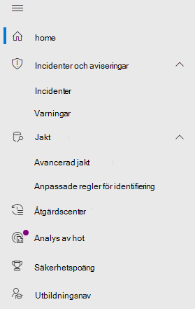

# Microsoft Defender för Office 365 i Microsoft 365 DefenderMicrosoft Defender for Office 365 in Microsoft 365 Defender

[!INCLUDE [Microsoft 365 Defender rebranding](../includes/microsoft-defender.md)]

**Gäller för:****Applies to:**
- [Microsoft 365 DefenderMicrosoft 365 Defender](microsoft-365-defender.md)
- [Microsoft Defender för Office 365Microsoft Defender for Office 365](/microsoft-365/security/office-365-security/defender-for-office-365)

## SnabbreferensQuick reference

I tabellen nedan visas ändringar i navigeringen mellan Office 365 säkerhets- & och Microsoft 365 Defender.The table below lists the changes in navigation between the Office 365 Security & Compliance Center and Microsoft 365 Defender.

 

****

|[Office 365 Säkerhets- & efterlevnadOffice 365 Security & Compliance](https://protection.office.com)|[Microsoft 365 DefenderMicrosoft 365 Defender](https://security.microsoft.com)|[Microsoft 365 EfterlevnadscenterMicrosoft 365 compliance center](https://compliance.microsoft.com/homepage)|[Administrationscentret för ExchangeExchange admin center](https://admin.exchange.microsoft.com/#/)|
|---|---|---|---|
|VarningarAlerts|<ul><li>[AviseringsprinciperAlert Policies](https://security.microsoft.com/alertpolicies)</li><li>[Incidenter & aviseringarIncidents & alerts](https://security.microsoft.com/alerts)</li></ul>|[Sidan AviseringarAlerts page](https://compliance.microsoft.com/homepage)||
|KlassificeringClassification||Se [Microsoft 365 Efterlevnadscenter](https://compliance.microsoft.com/homepage)See [Microsoft 365 compliance center](https://compliance.microsoft.com/homepage)||
|Skydd mot dataförlustData loss prevention||Se [Microsoft 365 Efterlevnadscenter](https://compliance.microsoft.com/homepage)See [Microsoft 365 compliance center](https://compliance.microsoft.com/homepage)||
|Hantering av arkivhandlingarRecords management||Se [Microsoft 365 Efterlevnadscenter](https://compliance.microsoft.com/homepage)See [Microsoft 365 compliance center](https://compliance.microsoft.com/homepage)||
|InformationsstyrningInformation governance||Se [Microsoft 365 Efterlevnadscenter](https://compliance.microsoft.com/homepage)See [Microsoft 365 compliance center](https://compliance.microsoft.com/homepage)||
|HothanteringThreat management|[E-& samarbeteEmail & Collaboration](https://security.microsoft.com/homepage)|||
|BehörigheterPermissions|[Behörigheter & rollerPermissions & roles](https://security.microsoft.com/emailandcollabpermissions)|Se [Microsoft 365 Efterlevnadscenter](https://compliance.microsoft.com/homepage)See [Microsoft 365 compliance center](https://compliance.microsoft.com/homepage)||
|E-postflödeMail flow|||Se [Exchange administrationscenter](https://admin.exchange.microsoft.com/#/)See [Exchange admin center](https://admin.exchange.microsoft.com/#/)|
|DatasekretessData privacy||Se [Microsoft 365 Efterlevnadscenter](https://compliance.microsoft.com/homepage)See [Microsoft 365 compliance center](https://compliance.microsoft.com/homepage)||
|SökaSearch|[GranskningAudit](https://security.microsoft.com/auditlogsearch?viewid=Async%20Search)|Sökning (innehållssökning)Search (content search)||
|RapporterReports|[RapportReport](https://security.microsoft.com/emailandcollabreport)|||
|TjänstgranskningService assurance||Se [Microsoft 365 Efterlevnadscenter](https://compliance.microsoft.com/homepage)See [Microsoft 365 compliance center](https://compliance.microsoft.com/homepage)||
|ÖverövervakningSupervision||Se [Microsoft 365 Efterlevnadscenter](https://compliance.microsoft.com/homepage)See [Microsoft 365 compliance center](https://compliance.microsoft.com/homepage)||
|eDiscoveryeDiscovery||Se [Microsoft 365 Efterlevnadscenter](https://compliance.microsoft.com/homepage)See [Microsoft 365 compliance center](https://compliance.microsoft.com/homepage)||

[Microsoft 365 Defender](./overview-security-center.md) på kombinerar säkerhetsfunktioner från befintliga <https://security.microsoft.com> Microsoft-säkerhetsportaler, inklusive säkerhets- Office 365 säkerhets- & efterlevnadscenter.[Microsoft 365 Defender](./overview-security-center.md) at <https://security.microsoft.com> combines security capabilities from existing Microsoft security portals, including the Office 365 Security & Compliance Center. Det här förbättrade centret hjälper säkerhetsteam att skydda organisationen från hot mer produktivt och effektivt.This improved center helps security teams protect their organization from threats more effectively and efficiently.

Om du är bekant med Office 365 säkerhets- och efterlevnadsportalen (protection.office.com) beskriver den här artikeln några av de ändringar och förbättringar Microsoft 365 Defender.If you are familiar with the Office 365 Security and Compliance portal (protection.office.com), this article describes some of the changes and improvements in Microsoft 365 Defender.

Läs mer om fördelarna: [Översikt över Microsoft 365 Defender](overview-security-center.md)Learn more about the benefits: [Overview of Microsoft 365 Defender](overview-security-center.md)

Om du letar efter efterlevnadsrelaterade objekt kan du gå till [Microsoft 365 Efterlevnadscenter](https://compliance.microsoft.com/homepage).If you are looking for compliance-related items, visit the [Microsoft 365 compliance center](https://compliance.microsoft.com/homepage).

## Nya och förbättrade funktionerNew and improved capabilities

Det vänstra navigeringsfältet eller snabbstartsfältet ser bekant ut.The left navigation, or quick launch bar, will look familiar. Det finns dock några nya och uppdaterade element i det här säkerhetscentret.However, there are some new and updated elements in this security center.

Med den enhetliga Microsoft 365 Defender lösningen kan du samlas ihop hot signalerna och fastställa hotens fullständiga omfattning och påverkan, och hur det för närvarande påverkar organisationen.With the unified Microsoft 365 Defender solution, you can stitch together the threat signals and determine the full scope and impact of the threat, and how it's currently impacting the organization.

:::image type="content" source="../../media/M365-defender-converge-experience.png" alt-text="Bild av Microsoft 365 Defender konvergerad upplevelse":::

Defender för Office 365 skyddar organisationen mot skadliga hot som kan orsakas av e-postmeddelanden, länkar (URL:er) och samarbetsverktyg.Defender for Office 365 safeguards your organization against malicious threats posed by email messages, links (URLs), and collaboration tools.

:::image type="content" source="../../media/Defender-for-O365.png" alt-text="Bild på Defender för Office 365":::

### Incidenter och aviseringarIncidents and alerts

Samlar incidenter och aviseringar för e-post, enheter och identiteter.Brings together incident and alert management across your email, devices, and identities. Aviseringar är nu tillgängliga under noden Undersökning och bidrar till att ge en bredare bild av ett angrepp.Alerts are now available under the Investigation node, and help provide a broader view of an attack. Aviseringssidan ger en fullständig kontext till aviseringen genom att kombinera attackerande signaler för att skapa en detaljerad historia.The alert page provides full context to the alert, by combining attack signals to construct a detailed story. Tidigare var aviseringar specifika för olika arbetsbelastningar.Previously, alerts were specific to different workloads. I en ny, enhetlig upplevelse samlas nu en enhetlig vy av aviseringar för arbetsbelastningar.A new, unified experience now brings together a consistent view of alerts across workloads. Du kan snabbt göra triage, undersöka och vidta effektiva åtgärder.You can quickly triage, investigate, and take effective action.

- [Läs mer om undersökningarLearn more about Investigations](incidents-overview.md)
- [Läs mer om hur du hanterar varningarLearn more about managing alerts](/windows/security/threat-protection/microsoft-defender-atp/review-alerts)

### JaktHunting

Sök proaktivt efter hot, skadlig programvara och skadlig aktivitet i dina slutpunkter, Office 365-postlådor med mera med hjälp av [avancerade sökfrågor](advanced-hunting-overview.md).Proactively search for threats, malware, and malicious activity across your endpoints, Office 365 mailboxes, and more by using [advanced hunting queries](advanced-hunting-overview.md). De här kraftfulla frågorna kan användas för att hitta och granska hotindikatorer och -enheter för både kända och potentiella hot.These powerful queries can be used to  locate and review threat indicators and entities for both known and potential threats.

[Anpassade identifieringsregler kan](/windows/security/threat-protection/microsoft-defender-atp/custom-detection-rules) byggas från avancerade sökfrågor för att proaktivt bevaka händelser som kan vara på grund av intrångsaktivitet och felkonfigurerade enheter.[Custom detection rules](/windows/security/threat-protection/microsoft-defender-atp/custom-detection-rules) can be built from advanced hunting queries to help you proactively watch for events that might be indicative of breach activity and misconfigured devices.

Här är ett [exempel på avancerad sökning](advanced-hunting-example.md) i Microsoft Defender för Office 365.Here is an [example on advanced hunting](advanced-hunting-example.md) in Microsoft Defender for Office 365.  

### ÅtgärdscenterAction center

Åtgärdscenter visar de undersökningar som skapats med automatiska undersöknings- och svarsfunktioner.Action center shows you the investigations created by automated investigation and response capabilities. Den här automatiserade självläkningen i Microsoft 365 Defender kan hjälpa säkerhetsteam genom att automatiskt svara på specifika händelser.This automated, self-healing in Microsoft 365 Defender can help security teams by automatically responding to specific events.

Läs mer om [Åtgärdscenter](m365d-action-center.md).Learn more about [Action center](m365d-action-center.md).

#### Analys av hotThreat Analytics

Få information om hot från Microsofts säkerhetsexpert.Get threat intelligence from expert Microsoft security researchers. Hotanalys hjälper säkerhetsteam att bli mer effektiva när de står inför nya hot.Threat Analytics helps security teams be more efficient when facing emerging threats. Hotanalys omfattar:Threat Analytics includes:

- E-postrelaterade identifieringar och metoder från Microsoft Defender för Office 365.Email-related detections and mitigations from Microsoft Defender for Office 365. Det här är ett tillägg till de slutpunktsdata som redan är tillgängliga från Microsoft Defender för Endpoint.This is in addition to the endpoint data already available from Microsoft Defender for Endpoint.
- Incidenter visas relaterat till hoten.Incidents view related to the threats.
- Förbättrad upplevelse för att snabbt identifiera och använda hanterbar information i rapporterna.Enhanced experience for quickly identifying and using actionable information in the reports.

Du kan komma åt hotanalyser antingen från det övre vänstra navigeringsfältet i Microsoft 365 Defender eller från ett dedikerat instrumentpanelskort som visar de viktigaste hoten för organisationen.You can access Threat analytics either from the upper left navigation bar in Microsoft 365 Defender, or from a dedicated dashboard card that shows the top threats for your organization.

Läs mer om hur du [spårar och svarar på nya hot med hotanalyser.](./threat-analytics.md)Learn more about how to [track and respond to emerging threats with threat analytics](./threat-analytics.md).

### E-post och samarbeteEmail & collaboration

Spåra och undersöka hot mot användarnas e-post, spåra kampanjer med mera.Track and investigate threats to your users' email, track campaigns, and more. Om du har använt Säkerhets- och efterlevnadscenter för Office 365 känner du igen det här.If you've used the Office 365 Security and Compliance center, this will be familiar.

:::image type="content" source="../../media/converge-3-email-and-collab-new.png" alt-text="Snabbstartsmenyn för e& postmeddelande med Collab (eller MSDO) på vänster sida Microsoft 365 Defender.":::

#### Sidan E-postenhetEmail entity page 

Sidan [E-post](../office-365-security/mdo-email-entity-page.md) *entitet ger* en enhetlig e-postinformation som har varit utspridd över olika sidor eller vyer tidigare.The [Email entity page](../office-365-security/mdo-email-entity-page.md) *unifies* email information that had been scattered across different pages or views in the past. Undersökning av e-post efter hot och trender är *centraliserat*.Investigating email for threats and trends is *centralized*. Rubrikinformation och förhandsgranskning av e-post kan nås via samma e-postsida och annan användbar e-postrelaterad information.Header information and email preview are accessible through the same email page, along with other useful email-related information. På samma sätt kan detonationsstatus för skadliga bifogade filer eller URL-adresser finnas på en flik på samma sida.Likewise, the detonation status for malicious file attachments or URLs can be found on a tab of the same page. Sidan E-postenhet ger administratörer och säkerhetsteam möjlighet att förstå ett hot via e-postmeddelande och dess status, snabbt, och sedan agera för att snabbt avgöra hur hanteringen ska hanteras.The Email entity page empowers admins and security operations teams to understand an email threat and its status, fast, and then act quickly determine handling.

### Åtkomst och rapporterAccess and Reports

Visa rapporter, ändra dina inställningar och ändra användarroller.View reports, change your settings, and modify user roles.

:::image type="content" source="../../media/converge-4-access-and-reporting-new.png" alt-text="Snabbstartsmenyn för Microsoft 365 Defender behörigheter och rapportering, till vänster i säkerhetscentret.":::

> [!NOTE]
> DKIM (DomainKeys Identified Mail) säkerställer att mål-e-postsystem litar på meddelanden som skickas utgående från din egen domän.DomainKeys Identified Mail (DKIM) ensures that destination email systems trust messages sent outbound from your custom domain.
> För Defender för Office 365-användare kan  du nu hantera och rotera DKIM-tangenter genom Microsoft 365 Defender: eller gå till <https://security.microsoft.com/threatpolicy> Policy & **Threat** \> **policies** \> **DKIM**.For Defender for Office 365 users, you can now *manage and rotate* DKIM keys through Microsoft 365 Defender: <https://security.microsoft.com/threatpolicy>, or navigate to **Policy & rules** \> **Threat policies** \> **DKIM**.
> 
> Mer information finns i Use [DKIM to validate outbound email sent from your custom domain](/microsoft-365/security/office-365-security/use-dkim-to-validate-outbound-email).For more information, see [Use DKIM to validate outbound email sent from your custom domain](/microsoft-365/security/office-365-security/use-dkim-to-validate-outbound-email).

## Se vad som har ändratsWhat's changed

Den här tabellen är en snabbreferens om hantering av hot där ändringar har gjorts mellan Säkerhets- & **efterlevnadscenter** och **Microsoft 365 Defender-portalen.**This table is a quick reference of Threat management where change has occurred between the **Security & Compliance center** and the **Microsoft 365 Defender** portal. Klicka på länkarna om du vill läsa mer om dessa områden.Click the links to read more about these areas.

 

****

|OmrådeArea|Beskrivning av ändringDescription of change|
|---|---|
|[UndersökningInvestigation](../office-365-security/office-365-air.md#changes-are-coming-soon-in-your-microsoft-365-defender-portal)|Samlar AIR-funktioner i [Defender för Office 365](/microsoft-365/security/office-365-security/defender-for-office-365) och [Defender för Endpoint](../defender-endpoint/automated-investigations.md).Brings together AIR capabilities in [Defender for Office 365](/microsoft-365/security/office-365-security/defender-for-office-365) and [Defender for Endpoint](../defender-endpoint/automated-investigations.md). Med de här uppdateringarna och förbättringarna kommer säkerhetsgruppen att kunna visa information om automatiska undersökningar och åtgärder som gäller för e-post, samarbetsinnehåll, användarkonton och enheter, allt på ett och samma ställe.With these updates and improvements, your security operations team will be able to view details about automated investigations and remediation actions across your email, collaboration content, user accounts, and devices, all in one place.|
|[AviseringsköAlert queue](../../compliance/alert-policies.md)|Den **utfällcentret** för Visa aviseringar i Office säkerhets- och efterlevnadscenter innehåller nu länkar till Microsoft 365 Defender.The **View alerts** flyout pane in the Office Security and Compliance center now includes links to Microsoft 365 Defender. Klicka på länken **Öppna aviseringssida** så Microsoft 365 Defender öppnas.Click on the **Open Alert Page** link and Microsoft 365 Defender opens. Du kan öppna sidan **Visa varningar** genom att klicka på en Office 365-avisering i kön Aviseringar.You can access the **View alerts** page by clicking on any Office 365 alert in the Alerts queue.|
|[Attacksimulering-utbildningAttack Simulation training](../office-365-security/attack-simulation-training-insights.md)|Använd Attacksimulering-utbildning för att köra realistiska attackscenarier i din organisation.Use Attack Simulation training to run realistic attack scenarios in your organization. De här simulerade attackerna kan utbilda din personal innan ett riktigt angrepp påverkar din organisation.These simulated attacks can help train your workforce before a real attack impacts your organization. Attacksimulering-utbildning innehåller fler alternativ, förbättrade rapporter och förbättrade utbildningsflöden som gör det enklare att leverera och hantera dina attacker samt utbildningsscenarier.Attack simulation training includes, more options, enhanced reports, and improved training flows help make your attack simulation and training scenarios easier to deliver and manage.|
|

Inga ändringar i dessa områden:No changes to these areas:

- [ExplorerExplorer](../office-365-security/threat-explorer.md)
- [Principer och reglerPolicies & Rules](../../compliance/alert-policies.md)
- [KampanjCampaign](../office-365-security/campaigns.md)
- [InsändningSubmissions](../office-365-security/admin-submission.md)
- [GranskaReview](./m365d-action-center.md)
- [HotspårareThreat Tracker](../office-365-security/threat-trackers.md)

Titta också i avsnittet **Relaterad information** längst ned i den här artikeln.Also, check the **Related Information** section at the bottom of this article.

> [!IMPORTANT]
> I Microsoft 365 Defender <https://security.microsoft.com> () kombineras säkerhetsfunktioner i <https://securitycenter.windows.com> och <https://protection.office.com> .The Microsoft 365 Defender portal (<https://security.microsoft.com>) combines security features in <https://securitycenter.windows.com>, and <https://protection.office.com>. Vad som visas beror dock på din prenumeration.However, what you see will depend on your subscription. Om du bara har Microsoft Defender för Office 365 Abonnemang 1 eller 2, som fristående prenumerationer, visas inte funktioner för säkerhet för slutpunkter och Defender för Office Abonnemang 1-kunder, ser inte objekt som hotanalys.If you only have Microsoft Defender for Office 365 Plan 1 or 2, as standalone subscriptions, for example, you won't see capabilities around Security for Endpoints and Defender for Office Plan 1 customers won't see items such as Threat Analytics.

> [!TIP]
> Alla Exchange Online Protection (EOP) ingår i Microsoft 365 Defender, eftersom EOP är huvudelementet i Defender för Office 365.All Exchange Online Protection (EOP) functions will be included in Microsoft 365 Defender, as EOP is a core element of Defender for Office 365.

## Microsoft 365 Defender StartsidaMicrosoft 365 Defender Home page

Startsidan i portalen visar viktig sammanfattningsinformation om säkerhetsstatus för din Microsoft 365 miljö.The Home page of the portal surfaces important summary information about the security status of your Microsoft 365 environment.

Använd den **Guidade rundturen** för att ta en snabb rundtur på sidorna endpoint eller e-post och samarbete.Using the **Guided tour** you can take a quick tour of Endpoint or Email & collaboration pages. Observera att det du ser här beror på om du har licens för Defender för Office 365 och/eller Defender för Endpoint.Note that what you see here will depend on if you have license for Defender for Office 365 and/or Defender for Endpoint.

Den innehåller en länk till **Office 365 Säkerhets- och efterlevnadscenter** att jämföra.Also included is a link to the **Office 365 Security and Compliance center** for comparison. Den sista länken är till sidan **Nyheter** beskriver de senaste uppdateringarna.The last link is to the **What's New** page that describes recent updates.

## Relaterad informationRelated information

- [Omdirigera Säkerhets- och efterlevnadscenter för Office 365 till Microsoft 365 DefenderRedirecting Office 365 Security and Compliance Center to Microsoft 365 Defender](microsoft-365-security-mdo-redirection.md)
- [ÅtgärdscentretThe Action center](./m365d-action-center.md)
- [E-post- och samarbetsaviseringarEmail & collaboration alerts](../../compliance/alert-policies.md#default-alert-policies)
- [Anpassade regler för identifieringCustom detection rules](/microsoft-365/security/defender-endpoint/custom-detection-rules)
- [Skapa en simulering av ett nätfiskeangrepp](../office-365-security/attack-simulation-training.md) och [skapa en nyttolast för utbildning av personerna](../office-365-security/attack-simulation-training-payloads.md)[Create a phishing attack simulation](../office-365-security/attack-simulation-training.md) and [create a payload for training your people](../office-365-security/attack-simulation-training-payloads.md)
