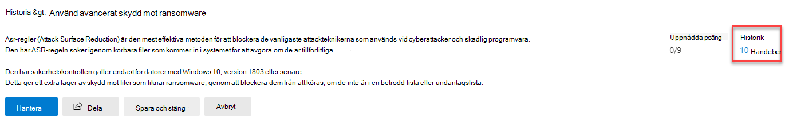
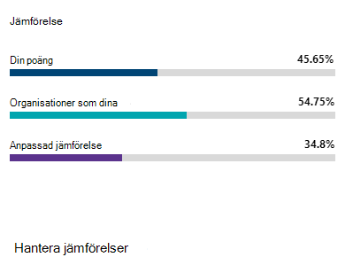

# Spåra din Microsoft Secure Score-historik och nå dina mål

[!INCLUDE [Microsoft 365 Defender rebranding](../includes/microsoft-defender.md)]

[Microsoft Secure Score](microsoft-secure-score.md) är ett mått på en organisations säkerhetssäkerhet, med ett högre tal som anger fler förbättringsåtgärder som vidtas. Den finns på Microsoft 365 https://security.microsoft.com/securescore [Säkerhetscenter.](overview-security-center.md)

## Få insikter i aktivitet som har påverkat din poäng

Visa ett diagram över organisationens poäng över tid på fliken **Historik.**

Under diagrammet finns en lista över alla åtgärder som har vidtagits för det valda tidsperioden och deras attribut, till exempel resulterande punkter och kategori. Du kan anpassa ett datumintervall och filtrera efter kategori.

Om du väljer förbättringsåtgärden som är kopplad till en aktivitet visas den utfällande åtgärden för fullständig förbättring.

Om du vill visa all historik för den specifika förbättringsåtgärden väljer du länken Historik i den utfäll vy som visas.

## Upptäck trender och ange mål

På fliken **Mått & trender** finns det flera grafer och diagram som ger dig bättre insyn i trender och sätta upp mål. Du kan ange datumintervallet för hela sidan med visualiseringar. Visualiseringarna omfattar:

* **Din Zone Secure Score** – anpassad baserat på organisationens mål och definitioner av bra, bra och dåliga resultatintervall.
* **Regressionstrend** – En tidslinje med punkter som har regrerats på grund av konfigurations-, användar- eller enhetsändringar.  
* **Jämförelsetrend** – Hur organisationens Secure Score står sig jämfört med andras över tid. Den här vyn kan innehålla linjer som representerar medelvärdet för poäng för organisationer med liknande antal platser och en anpassad jämförelsevy som du kan ange.
* **Riskacceptanstrend** – Tidslinje för förbättringsåtgärder som markerats som "accepterad risk".
* **Poängändringar** – Antalet poäng som har uppnåtts, poäng som har regerats och ändringar av poäng i det angivna datumintervallet.

### Jämför poäng med organisationer som ditt

Det finns två platser där du kan se hur resultaten fungerar jämfört med organisationer som påminner om dig. I båda diagrammen kan du välja Hantera jämförelser för att visa och redigera **organisationens** information. Du kan också skapa en anpassad jämförelse baserat på bransch, organisationsstorlek, licenser och regioner.

#### Stapeldiagram med jämförelse

Jämförelsestapeldiagrammet är **fliken** Översikt. Hovra över diagrammet för att visa poäng- och poäng affärsmöjlighet. Jämförelsedata anonymiseras så vi vet inte exakt vilka andra klientorganisationar som ingår i mixen.

- **Organisationer som din :** en genomsnittlig poäng för andra klientorganisationer (förutsatt att vi har minst fem eller fler klientorganisationer att jämföra) som uppfyller följande kriterier:
    1. Samma bransch
    2. Samma organisationsstorlek
    3. Alla regioner
    4. Microsoft-produkter som används liknar 80 %
    5. Affärsmöjlighet (max poäng som kan uppnås med aktuell licens) inom 20 % intervall från klientorganisationen

- **Anpassad jämförelse:** du måste konfigurera en anpassad jämförelse **genom att välja Hantera** jämförelse baserat på följande kriterier:
    1. Valda bransch(er)
    2. Valda organisationsstorlekar
    3. Valda områden
    4. Valda licenser
    5. Microsoft-produkter som används liknar 80 %
    6. Affärsmöjlighet (max poäng som kan uppnås med aktuell licens) inom 20 % intervall från klientorganisationen

Om du har gjort ett anpassat val men resultatet har färre än fem andra klientorganisationar som vi kan jämföra med visas "Inte tillgängligt på grund av begränsade data".

#### Jämförelsetrend

På fliken mått & trender kan du se hur **organisationens** Secure Score står sig jämfört med andras över tid.

## Vi vill höra från dig

Om du har problem kan du meddela oss genom att publicera i communityn [säkerhet, & sekretess och](https://techcommunity.microsoft.com/t5/Security-Privacy-Compliance/bd-p/security_privacy) efterlevnad. Vi övervakar communityn och kommer att hjälpa dig.

## Relaterade resurser

- [Översikt över Microsoft Secure Score](microsoft-secure-score.md)
- [Utvärdera din säkerhetsstatus](microsoft-secure-score-improvement-actions.md)
- [Kommer snart](microsoft-secure-score-whats-coming.md)
- [Vad är det senaste](microsoft-secure-score-whats-new.md)
