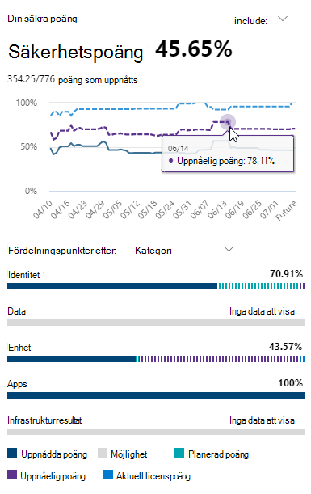

# Utvärdera din säkerhet med Microsoft Secure Score

[!INCLUDE [Microsoft 365 Defender rebranding](../includes/microsoft-defender.md)]

Microsoft Secure Score är ett mått på en organisations säkerhetssäkerhet, med ett högre tal som anger fler förbättringsåtgärder som vidtas. Den finns på https://security.microsoft.com/securescore Säkerhetscenter för [Microsoft 365.](overview-security-center.md)

Åtgärder för Microsoft-förbättringar är ordnade i grupper så att du snabbare kan hitta den information du behöver:

* Identitet (Azure Active Directory-konton & roller)
* Enhet (Microsoft Defender för slutpunkt, som kallas [Microsoft Secure Score för enheter](/windows/security/threat-protection/microsoft-defender-atp/tvm-microsoft-secure-score-devices))
* App (e-post- och molnappar, inklusive Office 365 och Microsoft Cloud App Security)

>[!NOTE]
>I den senaste versionen av Microsoft Secure Score har en förbättrad poängmodell släppts som gjort att Microsoft Secure Score tillfälligt inte är kompatibelt med Identity Secure Score och Graph API. [Visa information](microsoft-secure-score-whats-new.md)

På översiktssidan för Microsoft Secure Score kan du se hur punkterna delas upp mellan grupperna och vilka punkter som är tillgängliga. Du kan också få en fullständig uppfattning om totalresultatet, en historisk trend för ditt säkra resultat med jämförelser av riktmärken och prioriterade förbättringsåtgärder som kan vidtas för att förbättra ditt resultat.

## Kontrollera ditt aktuella poängresultat

Om du vill kontrollera ditt aktuella resultat går du till översiktssidan för Microsoft Secure Score och letar efter panelen där det **står Ditt säkra resultat.** Poängen visas som procent tillsammans med antalet poäng som du har uppnått av det totala antalet möjliga poäng.

Om du väljer knappen Inkludera **bredvid** resultatet kan du dessutom välja olika vyer av poängen. Dessa olika poängvyer visas i diagrammet på poängpanelen och punktfördelningsdiagrammet.

Följande är resultat som du kan lägga till i vyn över ditt övergripande resultat för att ge dig en mer fullständig bild av ditt övergripande resultat:

- **Planerat resultat:** Visa projekterat resultat när planerade åtgärder har slutförts
- **Aktuellt licensresultat:** Visa poäng som kan uppnås med din aktuella Microsoft-licens
- **Uppnåbart resultat: Visa** poäng som kan uppnås med dina Microsoft-licenser och aktuellt riskgodkännande

Den här vyn ser ut så här om du har tagit med alla möjliga poängvyer:

## Vidta åtgärder för att förbättra ditt resultat

På **fliken Förbättringsåtgärder** visas säkerhetsrekommendationer som åtgärdar möjliga attackytor. Den innehåller även deras status (för att hantera, planerade, godkända risker, lösas genom tredje part, lösas genom alternativ minskning och slutföras). Du kan söka, filtrera och gruppera alla förbättringsåtgärder.  

### Rankning

Rangordningen baseras på antalet punkter som återstår att uppnå, implementeringssvårigheter, användareffekter och komplexitet. De förbättringsåtgärder som rangordnas högst har ett stort antal punkter som återstår med låg komplexitet, påverkan på användare och komplexitet.

### Visa information om förbättringsåtgärder

När du väljer en specifik förbättringsåtgärd visas en utfällig helsida.  

Det finns några alternativ för att slutföra åtgärden:

- Välj **Hantera** för att gå till konfigurationsskärmen och göra ändringen. Sedan får du de poäng som åtgärden är värd, synlig i det flyg ut. Det brukar ta ungefär 24 timmar innan poäng har uppdaterats.

- Välj **Dela** för att kopiera den direkta länken till förbättringsåtgärden. Du kan också välja plattformen för att dela länken, till exempel e-post, Microsoft Teams, Microsoft Planner eller ServiceNow. Om du väljer ServiceNow kan du skapa en ändrings biljett som visas i ServiceNow och säkerhetscentret för Microsoft 365. Mer information finns i [Microsoft 365 säkerhetscenter och ServiceNow-integrering.](./tickets.md)

Lägg **till anteckningar** för att hålla reda på förloppet eller något annat du vill kommentera. Om du lägger till egna **taggar i** förbättringsåtgärden kan du filtrera efter de taggarna.

### Välj status för en förbättringsåtgärd

Välj eventuella statusar och spela in anteckningar som är specifika för förbättringsåtgärden.

- **Åtgärda detta** – du känner igen att förbättringsåtgärden är nödvändig och planerar att åtgärda den vid något tillfälle i framtiden. Det här tillståndet gäller även för åtgärder som identifieras som delvis, men inte helt slutförda.
- **Planerat** – Det finns betongplaner på plats för att genomföra förbättringsåtgärden.
- **Accepterad** risk – Säkerheten bör alltid balanseras med användbarheten, och alla rekommendationer fungerar inte för din miljö. När så är fallet kan du välja att acceptera risken, eller den återstående risken, och inte vidta någon förbättringsåtgärd. Du får inga poäng men åtgärden visas inte längre i listan över förbättringsåtgärder. Du kan visa den här åtgärden i historiken eller ångra den när som helst.
- **Löst genom tredje part** och **löst** genom alternativ minskning – Förbättringsåtgärden har redan åtgärdats av ett program eller en programvara från tredje part eller ett internt verktyg. Då får du poäng som är värda åtgärden, så att poängen bättre speglar den övergripande säkerhetsåtgärden. Om en tredje part eller ett internt verktyg inte längre täcker kontrollen kan du välja en annan status. Kom ihåg att Microsoft inte kommer att ha någon insyn i implementeringens fullständighet om förbättringsåtgärden markeras som någon av dessa statusar.

#### Hot & åtgärder för att förbättra sårbarhetshantering

För förbättringsåtgärder i kategorin "Enhet" kan du inte välja status. I stället hänvisas du till rekommendationen om [associerad](/windows/security/threat-protection/microsoft-defender-atp/tvm-security-recommendation) säkerhetsrisk och säkerhetshantering i Microsoft [Defender Säkerhetscenter för](/windows/security/threat-protection/microsoft-defender-atp/use) att vidta åtgärder. Det undantag du väljer och justering du skriver är specifikt för den portalen. Den finns inte i Microsoft Secure Score-portalen.

#### Slutförda förbättringsåtgärder

Förbättringsåtgärder har statusen "slutförd" när alla möjliga punkter för förbättringsåtgärden har uppnåtts. Slutförda förbättringsåtgärder bekräftas via Microsoft-data och du kan inte ändra status.

### Utvärdera information och granska användarnas påverkan

I avsnittet som **heter Kort sagt** får du veta kategorin, attacker den kan skydda mot och produkten.

**Användarens** påverkan är vad användarna kommer att uppleva om  förbättringsåtgärden vidtas och Användare som påverkas är de personer som kommer att påverkas.

### Implementera förbättringsåtgärden

I **avsnittet** Implementering visas eventuella krav, stegvisa nästa steg för att slutföra förbättringsåtgärden, aktuell implementeringsstatus för förbättringsåtgärden och eventuella mer informationslänkar.

Kraven omfattar alla licenser som behövs eller åtgärder som ska slutföras innan förbättringsåtgärden åtgärdas. Kontrollera att du har tillräckligt med platser i licensen för att slutföra förbättringsåtgärden och att licenserna tillämpas på nödvändiga användare.  

## Vi vill höra från dig

Om du har problem kan du meddela oss genom att publicera i communityn [säkerhet, & sekretess och](https://techcommunity.microsoft.com/t5/Security-Privacy-Compliance/bd-p/security_privacy) efterlevnad. Vi övervakar communityn och kommer att hjälpa dig.

## Relaterade resurser

- [Översikt över Microsoft Secure Score](microsoft-secure-score.md)
- [Spåra din Microsoft Secure Score-historik och nå dina mål](microsoft-secure-score-history-metrics-trends.md)
- [Kommer snart](microsoft-secure-score-whats-coming.md)
- [Nyheter](microsoft-secure-score-whats-new.md)