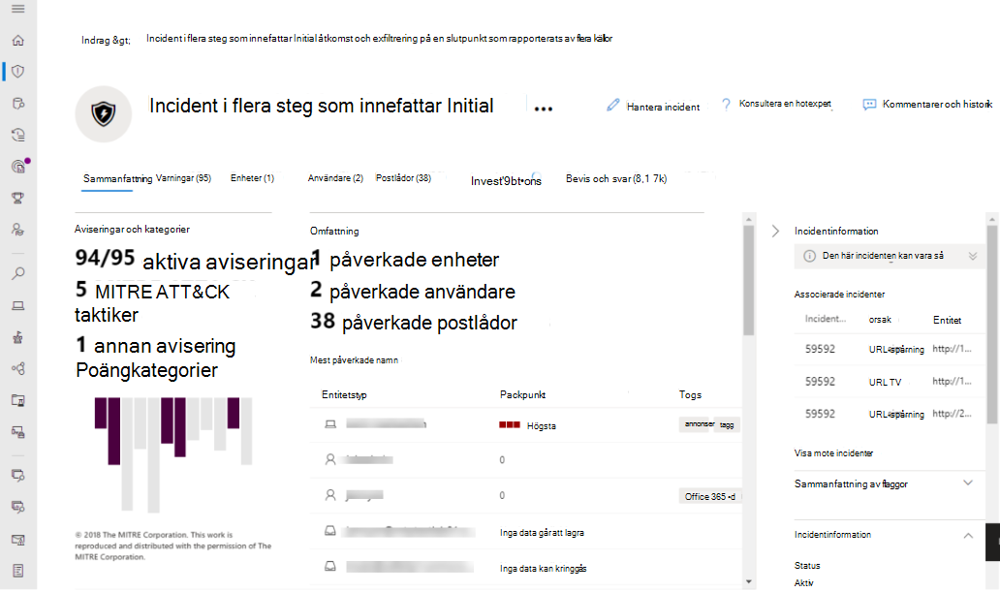
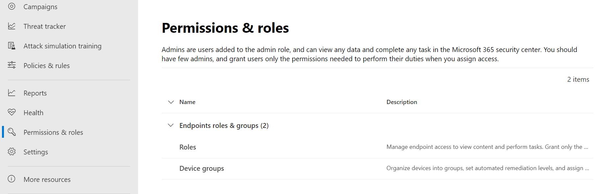

# Översikt över det enhetliga säkerhetscentret för Microsoft 365The unified Microsoft 365 security center overview

[!INCLUDE [Microsoft 365 Defender rebranding](../includes/microsoft-defender.md)]

**Gäller för:****Applies to:**

- [Microsoft 365 DefenderMicrosoft 365 Defender](microsoft-365-defender.md)
- [Microsoft Defender för EndpointMicrosoft Defender for Endpoint](https://go.microsoft.com/fwlink/p/?linkid=2154037)
- [Microsoft Defender för Office 365Microsoft Defender for Office 365](/microsoft-365/security/office-365-security/defender-for-office-365)

> Vill du uppleva Microsoft 365 Defender?Want to experience Microsoft 365 Defender? Du kan [utvärdera det i en laboratoriemiljö](m365d-evaluation.md?ocid=cx-docs-MTPtriallab) eller [köra ett pilotprojekt i produktionen](m365d-pilot.md?ocid=cx-evalpilot).You can [evaluate it in a lab environment](m365d-evaluation.md?ocid=cx-docs-MTPtriallab) or [run your pilot project in production](m365d-pilot.md?ocid=cx-evalpilot).

Det förbättrade säkerhetscentret för **Microsoft 365** () kombinerar skydd, identifiering, undersökning och svar på e-post, samarbete, identitet och enhetshot i [https://security.microsoft.com](https://security.microsoft.com) en central portal.    The improved **Microsoft 365 security center** ([https://security.microsoft.com](https://security.microsoft.com)) combines protection, detection, investigation, and response to *email*, *collaboration*, *identity*, and *device* threats, in a central portal.

Microsoft 365 säkerhetscenter samlar funktioner från befintliga Microsoft-säkerhetsportaler, som Microsoft Defender Säkerhetscenter och Office 365 säkerhets- & efterlevnadscenter.Microsoft 365 security center brings together functionality from existing Microsoft security portals, like Microsoft Defender Security Center and the Office 365 Security & Compliance center. Säkerhetscenter betonar snabb åtkomst till information, enklare layouter och att sammanföra relaterad information för enklare användning.The security center emphasizes quick access to information, simpler layouts, and bringing related information together for easier use. Detta center omfattar:This center includes:

- **[Microsoft Defender för Office 365](/microsoft-365/security/office-365-security/defender-for-office-365)** Med Microsoft Defender för Office 365 kan organisationer skydda sitt företag med en uppsättning funktioner för skydd mot identifiering, undersökning och spårning för att skydda e-post och Office 365-resurser.**[Microsoft Defender for Office 365](/microsoft-365/security/office-365-security/defender-for-office-365)** Microsoft Defender for Office 365 helps organizations secure their enterprise with a set of prevention, detection, investigation and hunting features to protect email, and Office 365 resources.
- **[Microsoft Defender för Endpoint](/microsoft-365/security/defender-endpoint/microsoft-defender-advanced-threat-protection)** tillhandahåller förebyggande skydd, identifiering efter intrång, automatisk undersökning och svar för enheter i organisationen.**[Microsoft Defender for Endpoint](/microsoft-365/security/defender-endpoint/microsoft-defender-advanced-threat-protection)** delivers preventative protection, post-breach detection, automated investigation, and response for devices in your organization.
- **[Microsoft 365 Defender](microsoft-365-defender.md)** är en del av Microsofts XDR-lösning *(Extended Detection and Response)* som utnyttjar Microsoft 365-säkerhetsportföljen för att automatiskt analysera hotdata över domäner och skapa en bild av en attack på en enskild instrumentpanel.**[Microsoft 365 Defender](microsoft-365-defender.md)** is part of Microsoft’s *Extended Detection and Response* (XDR) solution that leverages the Microsoft 365 security portfolio to automatically analyze threat data across domains, and build a picture of an attack on a single dashboard.

Om du behöver information om vad som har ändrats från Säkerhets- och efterlevnadscentret för Office 365 & eller Microsoft Defender Säkerhetscenter kan du läsa:If you need information about what's changed from the Office 365 Security & Compliance center or the Microsoft Defender Security Center, see:

- [Defender för Office 365 i Microsoft 365 SäkerhetscenterDefender for Office 365 in the Microsoft 365 security center](microsoft-365-security-center-mdo.md)
- [Defender för Endpoint i Microsoft 365 SäkerhetscenterDefender for Endpoint in the Microsoft 365 security center](microsoft-365-security-center-mde.md)

## Vad du kan förvänta digWhat to expect

Allt säkerhetsinnehåll som du använder i Säkerhets- och efterlevnadscenter för Office 365 (protection.office.com) och Microsoft Defender säkerhetscenter (securitycenter.microsoft.com) finns nu i Säkerhetscenter för *Microsoft 365.*All the security content that you use in the Office 365 Security and Compliance Center (protection.office.com) and the Microsoft Defender security center (securitycenter.microsoft.com) can now be found in the *Microsoft 365 security center*.

Microsoft 365 säkerhetscenter hjälper säkerhetsteam att undersöka och svara på attacker genom att ta in signaler från olika arbetsbelastningar i en uppsättning enhetliga upplevelser för:Microsoft 365 security center helps security teams investigate and respond to attacks by bringing in signals from different workloads into a set of unified experiences for:

- Incidenter & aviseringarIncidents & alerts
- JaktHunting
- ÅtgärdscenterAction Center
- Analys av hotThreat analytics

Säkerhetscentret i Microsoft 365 framhäver *enhet, tydlighet* och gemensamma mål när Microsoft Defender för Office 365 och Microsoft Defender för Slutpunkt sammanfogas.The Microsoft 365 security center emphasizes *unity, clarity, and common goals* as it merges Microsoft Defender for Office 365 and Microsoft Defender for Endpoint. Kopplingen gjordes utifrån de prioriteringar som anges nedan och skapade utan att ha tagit av de funktioner som respektive säkerhetssvit hade i kombination av:The merge was based on the priorities listed below, and made without sacrificing the capabilities that each security suite brought to the combination of:

- Vanliga byggblockCommon building blocks
- Vanlig terminologiCommon terminology
- Vanliga enheterCommon entities
- Funktionsparitet med andra arbetsbelastningarFeature parity with other workloads

## Enhetliga undersökningarUnified investigations

Konvergerande säkerhetscenter skapar en enda plats för att undersöka säkerhetstillbud i Microsoft 365.Converging security centers creates a single place for investigating security incidents across Microsoft 365. Ett primärt exempel är **Incidenter** under **& aviseringar** i snabbstarten av Microsoft 365 Säkerhetscenter.A primary example is **Incidents** under **Incidents & alerts** on the quick launch of the Microsoft 365 security center.

:::image type="content" source="../../media/converged-incidents-2.png.png" alt-text="Sidan Incidenter i Säkerhetscenter för Microsoft 365.":::

När du väljer ett incidentnamn visas en sida som visar värdet på konvergerande säkerhetscenter.Selecting an incident name displays a page that demonstrates the value of converging security centers.

:::image type="content" source="../../media/converged-incident-info-3.png" alt-text="Exempel på sidan Sammanfattning för en incident i säkerhetscentret i Microsoft 365":::

<!--

--> 

Längst upp på en incidentsida visas flikarna Sammanfattning **,** Aviseringar **,** Enheter **,** Användare **,** **Postlådor,** Undersökningar **och** Bevis.Along the top of an incident page, you'll see the **Summary**, **Alerts**, **Devices**, **Users**, **Mailboxes**, **Investigations**, and **Evidence** tabs. Välj de här flikarna om du vill ha mer detaljerad information.Select these tabs for more detailed information. På fliken  Användare visas till exempel information om användare från konvergerade arbetsbelastningar (Microsoft Defender för slutpunkt, Microsoft Defender för identitet och Microsoft Cloud App Security) och ett antal källor, till exempel AD DS (Active Directory Domain Services), Azure Active Directory (Azure AD) och tredjepartsidentitetsproviders.For example, the **Users** tab displays information for users from converged workloads (Microsoft Defender for Endpoint, Microsoft Defender for Identity, and Microsoft Cloud App Security) and a range of sources such as on-premises Active Directory Domain Services (AD DS), Azure Active Directory (Azure AD), and third-party identity providers. Mer information finns i [undersöka användare](investigate-users.md).For more information, see [investigate users](investigate-users.md).

Ta dig tid att granska alla incidenter i din miljö, gå in på följande flikar och öva på att bygga upp en förståelse för hur du får åtkomst till informationen för incidenter för olika typer av hot.Take the time to review the incidents in your environment, drill down into these tabs, and practice building an understanding of how to access the information provided for incidents for different kinds of threats.

Mer information finns i [incidenter i Säkerhetscenter för Microsoft 365.](incidents-overview.md)For more information, see [incidents in the Microsoft 365 security center](incidents-overview.md).

## Förbättrade processerImproved processes

Vanliga kontroller och innehåll visas antingen på samma plats eller komprimeras till en feed med data som gör det lättare att hitta.Common controls and content either appear in the same place, or are condensed into one feed of data making it easier to find. Till exempel enhetliga inställningar.For example, unified settings.

### Enhetliga inställningarUnified settings

### Behörigheter & rollerPermissions & roles

 Access Microsoft 365 Säkerhetscenter är konfigurerat med globala Azure Active Directory-roller eller med hjälp av anpassade roller.Access the Microsoft 365 security center is configured with Azure Active Directory global roles or by using custom roles. Information om Defender för slutpunkt finns [i Tilldela användaråtkomst till Microsoft Defender Säkerhetscenter.](/microsoft-365/security/defender-endpoint/assign-portal-access)For Defender for Endpoint, see [Assign user access to Microsoft Defender Security Center](/microsoft-365/security/defender-endpoint/assign-portal-access). Mer information om Defender för Office 365 finns i Behörigheter i Efterlevnadscenter för [Microsoft 365 och Säkerhetscenter för Microsoft 365.](../office-365-security/permissions-microsoft-365-compliance-security.md)For Defender for Office 365, see [Permissions in the Microsoft 365 compliance center and Microsoft 365 security center](../office-365-security/permissions-microsoft-365-compliance-security.md).

- Läs mer om hur du [hanterar åtkomst till Microsoft 365 Defender](m365d-permissions.md)Learn more about how to [manage access to Microsoft 365 Defender](m365d-permissions.md)
- Läs mer om hur du [skapar anpassade roller](custom-roles.md) i Säkerhetscenter för Microsoft 365Learn more about how to [create custom roles](custom-roles.md) in Microsoft 365 security center

> [!NOTE]
> Microsoft Defender för slutpunkt i Säkerhetscenter i Microsoft 365 har stöd för att bevilja åtkomst till tjänstleverantörer av hanterade säkerhetstjänster [(MSSP)](/windows/security/threat-protection/microsoft-defender-atp/grant-mssp-access) på samma sätt som åtkomst beviljas i [Microsoft Defender säkerhetscenter.](./mssp-access.md)Microsoft Defender for Endpoint in the Microsoft 365 security center supports [granting access to managed security service providers (MSSPs)](/windows/security/threat-protection/microsoft-defender-atp/grant-mssp-access) in the same that way access is [granted in the Microsoft Defender security center](./mssp-access.md).

### Integrerade rapporterIntegrated reports

Rapporter är även enhetliga i Säkerhetscenter för Microsoft 365.Reports are also unified in the Microsoft 365 security center. Administratörer kan börja med en allmän säkerhetsrapport och förgrena till specifika rapporter om slutpunkter, skicka e-& samarbete.Admins can start with a general security report, and branch into specific reports about endpoints, email & collaboration. Länkarna här genereras dynamiskt utifrån konfigurationen av arbetsbelastningen.The links here are dynamically generated based upon workload configuration.

### Visa din Microsoft 365-miljö snabbtQuickly view your Microsoft 365 environment

På **startsidan** visas många av de vanliga korten som säkerhetsteam behöver.The **Home** page shows many of the common cards that security teams need. Sammansättning av kort och data är beroende av användarrollen.The composition of cards and data is dependent on the user role. Eftersom Säkerhetscenter för Microsoft 365 använder rollbaserad åtkomstkontroll kommer olika roller att se kort som är mer relevanta för deras dagliga jobb.Because the Microsoft 365 security center uses role-based access control, different roles will see cards that are more meaningful to their day to day jobs.  

Med den här snabb översiktsinformationen kan du hålla dig informerad om de senaste aktiviteterna i organisationen.This at-a-glance information helps you keep up with the latest activities in your organization. I Microsoft 365 säkerhetscenter samlas signaler från olika källor för att presentera en vy över din Microsoft 365-miljö.The Microsoft 365 security center brings together signals from different sources to present a holistic view of your Microsoft 365 environment.

Korten delas in i följande kategorier:The cards fall into these categories:

- **Identiteter**– övervaka identiteterna i organisationen och håll reda på misstänkta eller riskfyllda beteenden.**Identities**- Monitor the identities in your organization and keep track of suspicious or risky behaviors. [Läs mer om identitetsskydd](/azure/active-directory/identity-protection/overview-identity-protection).[Learn more about identity protection](/azure/active-directory/identity-protection/overview-identity-protection).
- **Data** – Hjälper till att spåra användaraktivitet som kan leda till obehörig information.**Data** - Help track user activity that could lead to unauthorized data disclosure.
- **Enheter** – få uppdaterad information om aviseringar, intrångsaktivitet och andra hot på dina enheter.**Devices** - Get up-to-date information on alerts, breach activity, and other threats on your devices.
- **Appar** – få insyn i hur molnappar används i organisationen.**Apps** - Gain insight into how cloud apps are being used in your organization. [Läs mer om Cloud App Security- identifierade appar](/cloud-app-security/discovered-apps).[Learn more about Cloud App Security discovered apps](/cloud-app-security/discovered-apps).

## Hotanalyser med bättre datatäckningThreat analytics with better data coverage
Spåra och svara på nya hot med hjälp av följande integrerade funktioner för hotanalys i Microsoft 365 Defender:Track and respond to emerging threats with the following Microsoft 365 Defender threat analytics integrated experience:

- Bättre datatäckning mellan Microsoft Defender för Endpoint och Microsoft Defender för Office 365, vilket gör kombinerad incidenthantering, automatisk undersökning, åtgärder och proaktiv eller reaktiv hotering över hela domänen möjlig.Better data coverage between Microsoft Defender for Endpoint and Microsoft Defender for Office 365, making combined incident management, automatic investigation, remediation, and proactive or reactive threat hunting across-domain possible. 
- E-postrelaterade identifieringar och åtgärder från Microsoft Defender för Office 365, utöver de slutpunktsdata som redan är tillgängliga från Microsoft Defender för Slutpunkt.Email-related detections and mitigations from Microsoft Defender for Office 365, in addition to the endpoint data already available from Microsoft Defender for Endpoint.
- En vy över hotrelaterade incidenter som sammanställer aviseringar i hela attackberättelser om Microsoft Defender för Endpoint och Microsoft Defender för Office 365 för att minska arbetskön, samt förenkla och snabba upp din undersökning.A view of threat-related incidents which aggregate alerts into end-to-end attack stories across Microsoft Defender for Endpoint and Microsoft Defender for Office 365 to reduce the work queue, as well as simplify and speed up your investigation.
- Attackförsök som upptäckts och blockerats av Microsoft 365 Defender-lösningar.Attack attempts detected and blocked by Microsoft 365 Defender solutions. Det finns även data som du kan använda för att vidta förebyggande åtgärder som minimerar risken för ytterligare exponering och ökar motståndskraft.There's also data that you can use to drive preventive actions that mitigate the risk of further exposure and increase resilience. 
- Förbättrad design som placerar åtgärdbar information i spotlight så att du snabbt kan identifiera data och brådskande fokusera på, undersöka och dra nytta av rapporterna.Enhanced design that puts actionable information in the spotlight to help you  quickly identify data to urgently focus on, investigate, and leverage from the reports.

## Ett centraliserat utbildningsnavA centralized Learning Hub

I Microsoft 365 säkerhetscenter finns ett utbildningsnav som tar upp officiell vägledning från resurser som Microsofts säkerhetsblogg, Microsofts säkerhets community på YouTube och den officiella dokumentationen på docs.microsoft.com.The Microsoft 365 security center includes a learning hub that bubbles up official guidance from resources such as the Microsoft security blog, the Microsoft security community on YouTube, and the official documentation at docs.microsoft.com.

I utbildningshubben finns vägledning för e-&-samarbete (Microsoft Defender för Office 365 eller MDO) sida vid sida med Slutpunkt (Microsoft Defender för slutpunkt eller MDE) och Utbildningsresurser för Microsoft 365 Defender.Inside the learning hub, Email & Collaboration (Microsoft Defender for Office 365 or MDO) guidance is side-by-side with Endpoint (Microsoft Defender for Endpoint or MDE), and Microsoft 365 Defender learning resources.

Utbildningshubben öppnas med utbildningsvägar ordnade kring ämnen som "Så här undersöker du användning av Microsoft 365 Defender?"The learning hub opens with Learning paths organized around topics such as “How to Investigate Using Microsoft 365 Defender?” och "Metodtips för Microsoft Defender för Office 365".and “Microsoft Defender for Office 365 Best Practices”. Det här avsnittet används för närvarande av säkerhetsproduktgruppen i Microsoft.This section is currently curated by the security Product Group inside Microsoft. Varje utbildningsväg återspeglar den tid det tar att gå igenom begreppen.Each Learning path reflects a projected time it takes to get through the concepts. Till exempel beräknas "Åtgärder att vidta när ett Microsoft Defender för Office 365-användarkonto har komprometterats" ta 8 minuter, och är värdefull inlärning i farten.For example 'Steps to take when a Microsoft Defender for Office 365 user account is compromised' is projected to take 8 minutes, and is valuable learning on the fly.

När du har klickat till innehållet kan det vara bra att bokmärka den här webbplatsen och ordna bokmärken i en "Säkerhetsmapp" eller "Kritisk"-mapp.After clicking through to the content, it may be useful to bookmark this site and organize bookmarks into a 'Security' or 'Critical' folder. Om du vill se alla utbildningsvägar klickar du på länken Visa alla i huvudpanelen.To see all Learning paths, click the Show all link in the main panel.

> [!NOTE]
> Det finns användbara **filter** högst upp på utbildningshubben för Microsoft 365 Säkerhetscenter som gör att du kan välja mellan produkter (för närvarande Microsoft 365 Defender, Microsoft Defender för slutpunkt och Microsoft Defender för Office 365).There are helpful **filters** along the top of the Microsoft 365 security center learning hub that will let you choose between products (currently Microsoft 365 Defender, Microsoft Defender for Endpoint, and Microsoft Defender for Office 365). Observera att antalet utbildningsresurser för varje avsnitt visas, vilket kan hjälpa eleverna att hålla reda på hur många resurser de har till hands för utbildning och inlärning.Notice that the number of learning resources for each section is listed, which can help learners keep track of how many resources they have at hand for training and learning.
>
> Tillsammans med produktfiltret visas aktuella ämnen, typer av resurser (från videoklipp till webbsportaler), kunskapsnivåer eller erfarenhet inom säkerhetsområden, säkerhetsroller och produktfunktioner.Along with the Product filter, current topics, types of resources (from videos to webinars), levels of familiarity or experience with security areas, security roles, and product features are listed.

> [!TIP]
> Det finns massor av andra utbildningsmöjligheter i [Microsoft Learn.](https://docs.microsoft.com/e/learn/)There are lots of other learning opportunities in [Microsoft Learn](https://docs.microsoft.com/e/learn/). Du kommer att hitta certifieringsutbildning, till exempel [Course MS-500T02-A: Implementera Microsoft 365 Threat Protection.](https://docs.microsoft.com/learn/certifications/courses/ms-500t02)You'll find certification training such as [Course MS-500T02-A: Implementing Microsoft 365 Threat Protection](https://docs.microsoft.com/learn/certifications/courses/ms-500t02).

## Skicka oss dina synpunkterSend us your feedback

Vi behöver din feedback.We need your feedback. Vi vill alltid bli bättre, så om du skulle vilja se något kan du skicka oss feedback om [Microsoft 365 Defender.](https://www.microsoft.com/videoplayer/embed/RE4K5Ci)We're always looking to improve, so if there's something you'd like to see, [send us your Microsoft 365 Defender feedback](https://www.microsoft.com/videoplayer/embed/RE4K5Ci).

Du kan också lämna feedback från den här artikeln.You can also leave feedback from this article. I avsnittet "Feedback" i slutet under "Skicka och visa feedback om" är alternativen Den *här* produkten eller *Den här sidan*.In the 'Feedback' section at the end under 'Submit and view feedback for', the options are *This product*, or *This page*.

Använd knappen **Den här produkten** för *produktfeedback:*Use the **This product** button for *product* feedback:

1. Välj *Den här* produkten längst ned i artikeln.Select *This product* at the bottom of the article.
    1. Högerklicka på knappen och "Öppna i en ny flik" om du vill fortsätta läsa de här anvisningarna.Right-click the button and 'Open in a new tab' if you want to keep reading these directions.
2. Detta navigerar till **UserVoice-forumet**.This will navigate to the **UserVoice forum**.
3. Du har två alternativ:You have 2 options:
    1. Rulla ned till textrutan Hur kan vi förbättra efterlevnad eller skydda dina användare bättre i *Office 365?* och klistra in i *Säkerhetscenter för Microsoft 365.*Scroll down to the text box *How can we improve compliance or protect your users better in Office 365?* and paste in *Microsoft 365 security center*. Du kan söka i resultaten efter en idé som din och rösta om den, eller använda knappen för **Publicera en ny idé**.You can search the results for an idea like yours and up-vote it, or use the button for **Post a new idea**.
    1. Om du känner att det här problemet redan har rapporterats och vill höja sin profil med en röst (eller röster) använder du rutan Ge *feedback* på höger sida uservoice.If you feel certain this issue is already reported, and want to raise its profile with a vote (or votes), use the *Give Feedback* box on the right side of UserVoice. Sök efter *Microsoft 365 Säkerhetscenter*, hitta problemet och använd **röstknappen för att** höja dess status.Search for *Microsoft 365 security center*, **find the issue, and use the vote button** to raise its status.

Använd *den här* sidan för feedback om själva artikeln.Use *This page* for feedback on the article itself. Tack för din feedback.Thanks for your feedback. Din röst hjälper oss att förbättra produkterna.Your voice helps us improve products.

### Se vad säkerhetscentret har att erbjudaExplore what the security center has to offer

Utforska funktionerna i Säkerhetscenter för Microsoft 365:Keep exploring the features and capabilities in the Microsoft 365 security center:

- [Hantera incidenter och aviseringarManage incidents and alerts](manage-incidents.md)
- [Spåra och svara på nya hot med hotanalyserTrack and respond to emerging threats with threat analytics](threat-analytics.md)
- [ÅtgärdscentretThe Action center](m365d-action-center.md)
- [Jaga efter hot på olika enheter, e-postmeddelanden, appar och identiteterHunt for threats across devices, emails, apps, and identities](./advanced-hunting-query-emails-devices.md)
- [Anpassade regler för identifieringCustom detection rules](./custom-detection-rules.md)
- [E-post- och samarbetsaviseringarEmail & collaboration alerts](../../compliance/alert-policies.md#default-alert-policies)
- [Skapa en simulering av nätfiskeattacker](../office-365-security/attack-simulation-training.md) [och skapa en nyttolast för utbildning av dina team](/microsoft-365/security/office-365-security/attack-simulation-training-payloads)[Create a phishing attack simulation](../office-365-security/attack-simulation-training.md) and [create a payload for training your teams](/microsoft-365/security/office-365-security/attack-simulation-training-payloads)
 
### Relaterad informationRelated information
- [Microsoft 365 SäkerhetscenterMicrosoft 365 security center](overview-security-center.md)
- [Microsoft Defender för Office 365 i Microsoft 365 SäkerhetscenterMicrosoft Defender for Office 365 in the Microsoft 365 security center](microsoft-365-security-center-mdo.md)
- [Microsoft Defender för Slutpunkt i Säkerhetscenter för Microsoft 365Microsoft Defender for Endpoint in the Microsoft 365 security center](microsoft-365-security-center-mde.md)
- [Omdirigera konton från Microsoft Defender för Slutpunkt till Säkerhetscenter för Microsoft 365Redirecting accounts from Microsoft Defender for Endpoint to the Microsoft 365 security center](microsoft-365-security-mde-redirection.md)