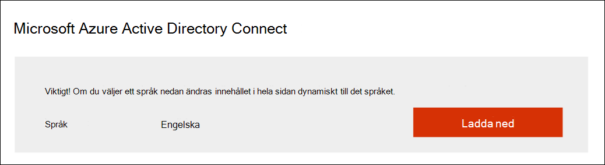

# Förbereda din Microsoft 365 Defender-testlabb eller pilotmiljö

[!INCLUDE [Microsoft 365 Defender rebranding](../includes/microsoft-defender.md)]

**Gäller för:**
- Microsoft 365 Defender

Att skapa Microsoft 365 Defender-testlabb eller testmiljö och distribuera den är en process i tre steg:

| Fas 1: Förbereda | [Fas 2: Konfigurera](setup-m365deval.md) | [Fas 3: Introduktion](config-m365d-eval.md) |  [Tillbaka till pilotspelboken](m365d-pilot.md) |
|--|--|--|--|
|*Du är här!* | || |

Du befinner dig för närvarande i förberedelsefasen.

Förberedelse är avgörande för en lyckad distribution. Det här avsnittet vägleder dig genom vad du behöver tänka på när du förbereder för att skapa ett testlabb eller pilotmiljö för din Microsoft 365 Defender-distribution.

## Förutsättningar
Läs mer om licens-, maskinvaru- och programvarukraven och andra konfigurationsinställningar för att tillhandahålla och använda Microsoft 365 Defender. Se minimikraven för [Microsoft 365 Defender](/microsoft-365/security/defender/prerequisites), Microsoft Defender för [slutpunkt](/windows/security/threat-protection/microsoft-defender-atp/minimum-requirements), Microsoft Defender för [Office 365](/office365/servicedescriptions/office-365-advanced-threat-protection-service-description), Microsoft Defender för [identitet](/azure-advanced-threat-protection/atp-prerequisites) [och Microsoft Cloud App Security](/azure-advanced-threat-protection/atp-prerequisites).

## Intressenter och av inloggning
Identifiera alla intressenter som är inblandade i projektet och vem som kan behöva signera, granska eller hålla sig informerad, oavsett om det gäller utvärdering eller ett pilotprojekt.

>[!NOTE]
>Det är inte alla organisationer som har förfallodagen för säkerhetsorganisationen som har sådana roller. Om så är fallet bör du rådgöra med din ledning om konto för granskning och godkännande.

Lägg till intressenter i tabellen nedan efter behov för din organisation.

-   SO = Sign-off på det här projektet

-   R = Granska det här projektet och ge input

-   I = Informeras om projektet

| Namn                 | Roll                                                                                                                                                                                                          | Åtgärd |
|----------------------|---------------------------------------------------------------------------------------------------------------------------------------------------------------------------------------------------------------|--------|
| Ange namn och e-postadress | **CISO (Chief Information Security Officer)** En chef som fungerar som *sponsor inom organisationen för den nya teknikdistributionen.*                                                  | SO     |
| Ange namn och e-postadress | **Chef för Cyber Defense Operations Center (CDOC)** En representant från *CDOC-teamet* som ansvarar för att definiera hur ändringen justeras mot processerna i kundens säkerhetsoperationsteam.       | SO     |
| Ange namn och e-postadress | **Säkerhetsarkitekt** En representant för säkerhetsgruppen som ansvarar för att definiera hur ändringen överensstämmer med organisationens *kärnarkitektur inom säkerhet.*                         | R      |
| Ange namn och e-postadress | **Arbetsplatsarkitekt** *En representant för IT-teamet* som ansvarar för att definiera hur förändringen är i linje med organisationens kärnarkitektur på arbetsplatsen.                             | R      |
| Ange namn och e-postadress | **Säkerhetsanalytiker En** representant för CDOC-teamet som kan ge feedback om identifieringsfunktioner, användarupplevelse och hur användbar den här ändringen är ur ett *säkerhetsperspektiv.* | I      |

## Förbered Azure Active Directory
Hoppa över det här steget om du redan har aktiverat synkronisering mellan Active Directory och Azure Active Directory lokalt. Gå igenom dokumentationen för befintliga metodtips från Azure Active Directory. Följande steg är optimerade för att utvärdera eller köra ett Microsoft 365 Defender-projekt.

1. Gå till [Azure Active Directory-portalen](https://portal.azure.com/#blade/Microsoft_AAD_IAM/ActiveDirectoryMenuBlade) > Azure **AD Anslut**. 
   

2. Klicka **på** Ladda **Microsoft Azure Active Directory Anslut** ladda ned från och överför den till din domänkontrollant.
  

3. Följ domänkontrollanten på domänkontrollanten Azure Active Directory Anslut domänkontrollanten. Läs licensvillkoren och sekretesspolicyn och markera kryssrutan om du samtycker. Klicka på **Fortsätt**.
  

4. Navigera till **Express-Inställningar**.
  

5. Ange dina autentiseringsuppgifter som global administratör. Klicka på **Nästa**.
  

6. Ange dina autentiseringsuppgifter som företagsadministratör för Active Directory Domain Services. Klicka på **Nästa**.
  

7. Bekräfta **konfigurationen genom** att klicka på Installera.
  

8. Grattis! Du har konfigurerat Azure Active Directory Anslut.
  

Nu kan du [lägga till användare och grupper i Active Directory och](/azure-advanced-threat-protection/atp-playbook-setup-lab#bkmk_hydrate) konfigurera en [SAM-R-princip.](/azure-advanced-threat-protection/atp-playbook-setup-lab#configure-sam-r-capabilities-from-contosodc)  

## Konfigurationsordning
I följande tabell visas den ordning som Microsoft rekommenderar för konfigurering av Microsoft 365 Defender-komponenter för testlabb- eller pilotmiljödistributionen.

| Komponent                               | Beskrivning                                                                                                                                                                                                                                                                                                                                                                                                                                                                                                                                                                                                                                                                                              | Rangordning för konfigurationsordning |
|-----------------------------------------|----------------------------------------------------------------------------------------------------------------------------------------------------------------------------------------------------------------------------------------------------------------------------------------------------------------------------------------------------------------------------------------------------------------------------------------------------------------------------------------------------------------------------------------------------------------------------------------------------------------------------------------------------------------------------------------------------------|---------------------|
|Microsoft Defender för Office 365|Microsoft Defender för Office 365 skyddar din organisation mot skadliga hot från e-postmeddelanden, länkar (URL: er) och samarbetsverktyg.   [Lära sig mer.](/microsoft-365/security/office-365-security/defender-for-office-365)                                                                                                                                                                                                                                             | 1                   |
|Microsoft Defender for Identity|Microsoft Defender för identitet använder Active Directory-signaler för att identifiera, identifiera och undersöka avancerade hot, komprometterade identiteter och skadliga Insider-åtgärder riktade till organisationen.   [Mer information](/azure-advanced-threat-protection/).| 2 |
|Microsoft Cloud App Security| Microsoft Cloud App Security är en CASB (Cloud Access Security Broker) som fungerar i flera moln. Det ger full insyn, kontroll över data färdas och avancerad analys för att identifiera och bekämpa cyberhot i alla dina molntjänster.   [Mer information](/cloud-app-security/).                                                                                                                                                                                                                                                                                                                                                                       |3                   |
|Microsoft Defender för Endpoint | Microsoft Defender för Endpointslutpunktsidentifiering och svarsfunktioner tillhandahåller avancerad identifiering av attacker som finns i närheten och kan vidtas. Säkerhetsanalytiker kan effektivt prioritera varningar, få synlighet över helheten av ett intrång och vidta åtgärder för att åtgärda hot.   [Lära sig mer.](/windows/security/threat-protection/microsoft-defender-atp/microsoft-defender-advanced-threat-protection)                                     |4                   |                                                                                                                                                                                                                                    

## Nästa steg
|  [Fas 2: Installation](setup-m365deval.md) | Konfigurera din testlabb eller pilotmiljö i Microsoft 365 Defender
|:-------|:-----|
