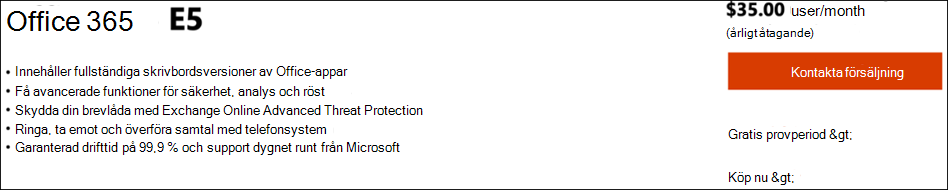
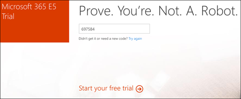

# Konfigurera utvärderingslabbmiljön i Microsoft 365 Defender 

[!INCLUDE [Microsoft 365 Defender rebranding](../includes/microsoft-defender.md)]

**Gäller för:**
- Microsoft 365 Defender 

Det är en process i tre steg att skapa en provlabb eller pilotmiljö med Microsoft 365 Defender:

| [Fas 1: Förbereda](prepare-m365d-eval.md) | Fas 2: Konfigurera | [Fas 3: Introduktion](config-m365d-eval.md) |  [Tillbaka till pilotspelboken](m365d-pilot.md) |
|--|--|--|--|
||*Du är här!*  | | |

Du befinner dig för närvarande i ställ in fas. Gör de första stegen för att komma åt Microsoft 365 Säkerhetscenter och konfigurera sedan testlabb eller pilotmiljö.

Registrera dig för en Office 365- eller Azure Active Directory-prenumeration om du vill generera en *.onmicrosoft.com-klientorganisation* som du kan använda för att registrera dig för din Microsoft 365 E5-licens. 

>[!NOTE]
>Om du redan har en befintlig Office 365- eller Azure Active Directory-prenumeration kan du hoppa över stegen för att skapa klientorganisation eller utvärderingsversionen av Office 365 E5.

I den här fasen får du vägledning genom att:
- Skapa en utvärderingsversion av Office 365 E5
- Aktivera utvärderingsprenumeration på Microsoft 365

## Skapa en utvärderingsversion av Office 365 E5
>[!NOTE]
>Om du redan har en befintlig Office 365- eller Azure Active Directory-prenumeration kan du hoppa över stegen för att skapa klientorganisationens klientorganisation i Office 365 E5.

1. Gå till Office [365 E5-produktportalen och](https://www.microsoft.com/microsoft-365/business/office-365-enterprise-e5-business-software?activetab=pivot%3aoverviewtab) välj **Kostnadsfri utvärderingsversion**.

   
  
2. Slutför utvärderingsversionen genom att ange din e-postadress (personlig eller företagsadress). Klicka **på Konfigurera konto.**

   

3. Fyll i ditt förnamn, efternamn, telefonnummer, företagsnamn, företagsstorlek och land eller region.  

   
   
   > [!NOTE]
   > Landet eller regionen du anger här bestämmer vilken datacenterregion som Office 365 kommer att vara värd för.
  
4. Välj verifieringsinställning: via ett sms eller samtal. Klicka **på Skicka verifieringskod**. 

   

5. Ange eget domännamn för klientorganisationen och klicka sedan på **Nästa.**

   
 
6. Konfigurera den första identiteten, som blir global administratör för klientorganisationen. Fyll i **Namn** och **Lösenord.** Klicka **på Registrera dig.**

   

7. Klicka **på Gå till installationsprogrammet** för att slutföra klientorganisationsetablering för Office 365 E5.

   

8. Anslut företagsdomänen till Office 365-klientorganisationen. [Valfritt] Välj **Anslut en domän som du redan äger** och skriv in domännamnet. Klicka på **Nästa**.

   
 
9. Lägg till en TXT- eller MX-post för att verifiera domänägarskapet. När du har lagt till TXT- eller MX-posten i din domän väljer du **Verifiera**.

   
 
10. [Valfritt] Skapa fler användarkonton för klientorganisationen. Du kan hoppa över det här steget genom att klicka **på Nästa.**

    
 
11. [Valfritt] Ladda ned Office-appar. Hoppa **över det här** steget genom att klicka på Nästa. 

    

12. [Valfritt] Migrera e-postmeddelanden. Du kan hoppa över det här steget.

    
 
13. Välj onlinetjänster. Välj **Exchange** och klicka på **Nästa.** 

    

14. Lägg till MX-, CNAME- och TXT-poster i din domän. När det är klart väljer **du Verifiera**.

    
 
15. Grattis! Du har slutfört etableringen av din Office 365-klientorganisation.

    

## Aktivera utvärderingsprenumeration på Microsoft 365

>[!NOTE]
>När du registrerar dig för en utvärderingsversion får du 25 användarlicenser att använda under en månad. Mer [information finns i Prova eller köpa en M365-prenumeration.](../../commerce/try-or-buy-microsoft-365.md)

1. I [administrationscentret för Microsoft 365 klickar](https://admin.microsoft.com/)du **på Fakturering** och går sedan till **Köp tjänster.**

2. Välj **Microsoft 365 E5 och** klicka på Starta kostnadsfri **utvärderingsversion**. 

   

3. Välj verifieringsinställning: via ett sms eller samtal. När du har bestämt dig anger du telefonnumret och väljer **Skicka sms eller** Ring **mig** beroende på ditt val.

   
 
4. Ange verifieringskoden och klicka på **Starta den kostnadsfria utvärderingsversionen**.

   

5. Klicka **på Prova nu** för att bekräfta utvärderingsversionen av Microsoft 365 E5.

   
 
6. Gå till Microsoft **365 Admin Center Användare**  >    >  **aktiva användare.** Välj ditt användarkonto, välj **Hantera produktlicenser och** byt sedan licensen från Office 365 E5 till **Microsoft 365 E5.** Klicka på **Spara**.

   
 
7. Välj det globala administratörskontot igen och klicka sedan **på Hantera användarnamn**.

   

8. [Valfritt] Ändra domänen från *onmicrosoft.com* till din egen domän, beroende på vad du valde i föregående steg. Klicka på **Spara ändringar**.

   

## Nästa steg
|[Fas 3: Konfigurera & onboard](config-m365d-eval.md) | Konfigurera varje Microsoft 365 Defender-pilotversion för provlabb eller pilotmiljö med Microsoft 365 Defender och registrera slutpunkterna.
|:-------|:-----|
