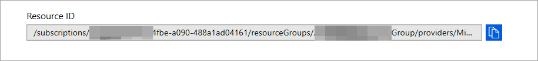

# <a name="configure-microsoft-365-defender-to-stream-advanced-hunting-events-to-your-azure-event-hub"></a>Konfigurera Microsoft 365 Defender för att strömma Advanced Hunting-händelser till Azure Event Hub

[!INCLUDE [Microsoft 365 Defender rebranding](../../includes/microsoft-defender.md)]


**Gäller för:**
- [Microsoft 365 Defender](https://go.microsoft.com/fwlink/?linkid=2118804)

[!include[Prerelease information](../../includes/prerelease.md)]

## <a name="before-you-begin"></a>Innan du börjar

1. Skapa ett [händelsenav](/azure/event-hubs/) i klientorganisationen.

2. Logga in på [din Azure-klientorganisation](https://ms.portal.azure.com/)och **gå till Prenumerationer > din > eller resursleverantörer > Registrera dig i Microsoft.Insights.**

3. Skapa ett namnområde för händelsehubben, gå till Händelsehubben **>** Lägg till och välj prissättningsnivå, dataflödesenheter och Automatisk härdning som är lämpligt för förväntad belastning. Mer information finns i Priser [– | Microsoft Azure](https://azure.microsoft.com/en-us/pricing/details/event-hubs/).  

### <a name="add-contributor-permissions"></a>Lägga till deltagarbehörigheter 
När namnområdet i Händelsehubben har skapats måste du:
1. Definiera den användare som ska loggas in på Microsoft 365 Defender som deltagare.

2. Om du ansluter till ett program lägger du till Tjänsten för registrering av appar som läsare, Azure Event Hub Data Receiver (detta kan också göras på resursgrupp- eller prenumerationsnivå). 

    Gå till **namnområdet i händelsehubben > i Access-kontroll (IAM) > Lägg** till och verifiera under **Rolltilldelningar.**

## <a name="enable-raw-data-streaming"></a>Aktivera direktuppspelning av rådata

1. Logga in på Microsoft 365 [Defender säkerhetscenter](https://security.microsoft.com) som en ***global administratör** _ eller _*_säkerhetsadministratör_**.

2. Gå till [inställningssidan för Streaming API.](https://security.microsoft.com/settings/mtp_settings/raw_data_export)

3. Klicka på Lägg **till**.

4. Välj ett namn för de nya inställningarna.

5. Välj **Vidarebefordra händelser till Azure Event Hub.**

6. Du kan välja om du vill exportera händelsedata till ett enskilt händelsenav eller exportera varje händelsetabell till ett annat händelsenav i namnområdet i händelsehubben. 

7. Om du vill exportera händelsedata till ett enskilt händelsehubben anger du ditt **namn för Händelsehubben** och **resurs-ID för Händelsehubben.**

   Om du vill **hämta ditt resurs-ID** för Händelsehubben går du till namnområdet i Azure-händelsehubben på fliken [Azure-egenskaper](https://ms.portal.azure.com/)> kopierar texten  >   under **Resurs-ID:**

   

8. Välj de händelser du vill strömma och klicka på **Spara**.

## <a name="the-schema-of-the-events-in-azure-event-hub"></a>Schemat för händelserna i Azure Event Hub

```JSON
{
    "records": [
                    {
                        "time": "<The time Microsoft 365 Defender received the event>"
                        "tenantId": "<The Id of the tenant that the event belongs to>"
                        "category": "<The Advanced Hunting table name with 'AdvancedHunting-' prefix>"
                        "properties": { <Microsoft 365 Defender Advanced Hunting event as Json> }
                    }
                    ...
                ]
}
```

- Varje meddelande i händelsehubben i Azure Event Hub innehåller en lista över poster.

- Varje post innehåller händelsenamnet, tiden då Microsoft 365 Defender tog emot händelsen, den klientorganisation som den tillhör (du får bara händelser från klientorganisationen) och händelsen i JSON-format i en egenskap med namnet "**egenskaper**".

- Mer information om schemat för de Microsoft 365 Defender-händelser finns i Avancerad sökning [– översikt.](advanced-hunting-overview.md)

- I tabellen Avancerad sökning finns en kolumn med namnet **MachineGroup** som innehåller enhetens grupp i tabellen **DeviceInfo.** Här är alla händelser dekorerade med den här kolumnen. 


## <a name="data-types-mapping"></a>Mappning av datatyper

Så här hämtar du datatyperna för händelseegenskaper:

1. Logga in på [Microsoft 365 säkerhetscenter](https://security.microsoft.com) och gå till [sidan Advanced Hunting](https://security.microsoft.com/hunting-package).

2. Kör följande fråga för att hämta mappningen av datatyper för varje händelse:
 
   ```kusto
   {EventType}
   | getschema
   | project ColumnName, ColumnType 
   ```

- Här är ett exempel för enhetsinfohändelsen: 

  

## <a name="related-topics"></a>Relaterade ämnen
- [Översikt över Avancerad sökning](advanced-hunting-overview.md)
- [Microsoft 365 Defender-streaming-API](streaming-api.md)
- [Strömma Microsoft 365 Defender-händelser till ditt Azure Storage-konto](streaming-api-storage.md)
- [Azure Event Hub-dokumentation](/azure/event-hubs/)
- [Felsöka anslutningsproblem – Azure Event Hub](/azure/event-hubs/troubleshooting-guide)
