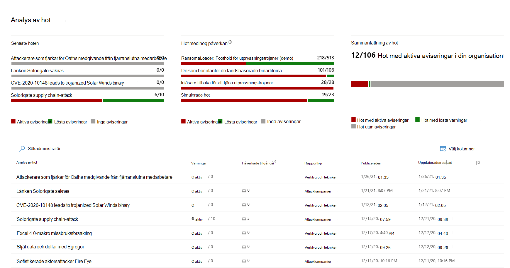
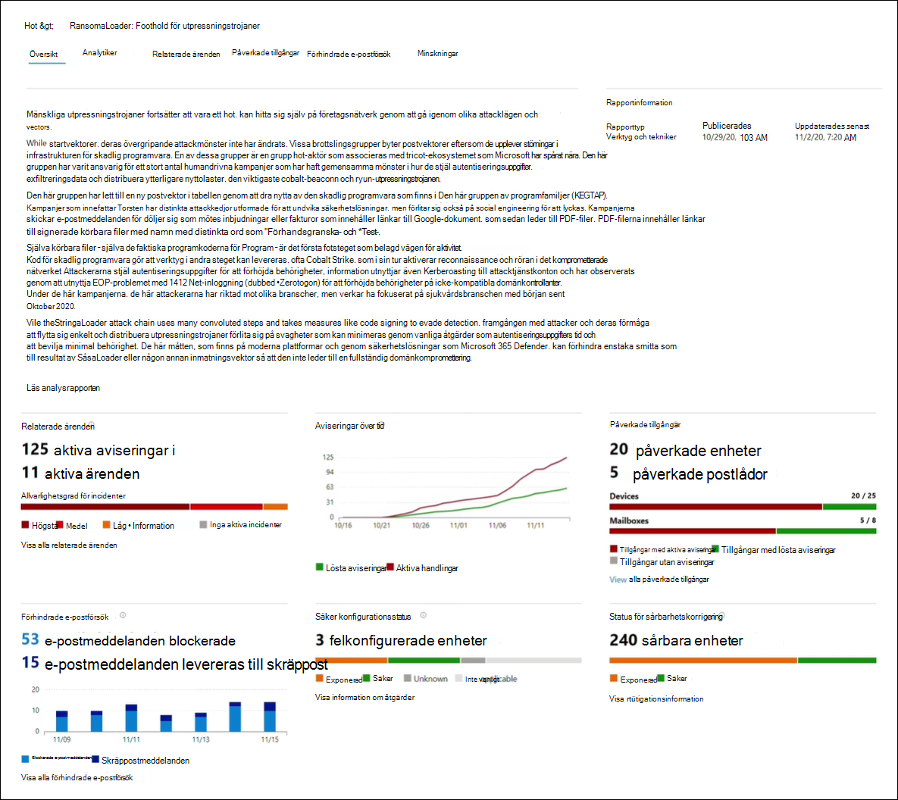
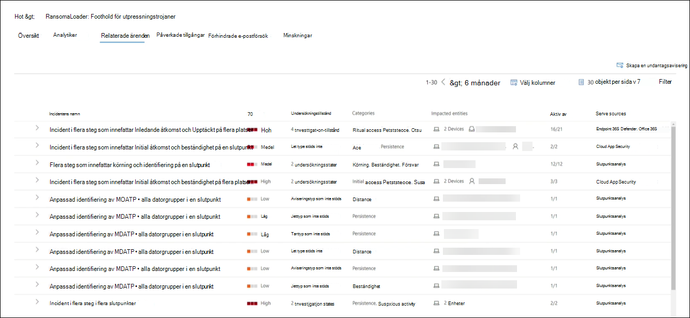
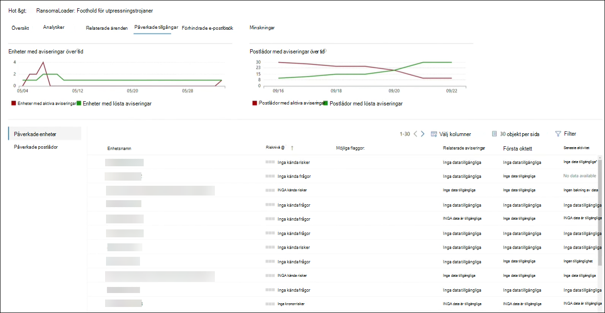
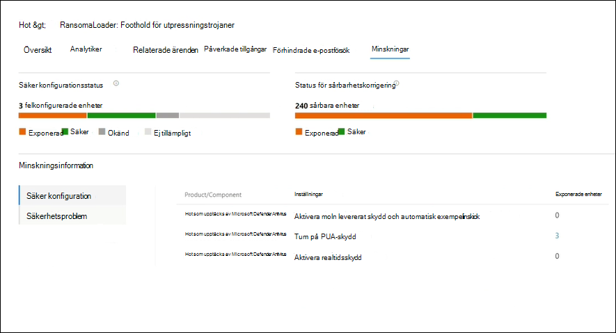
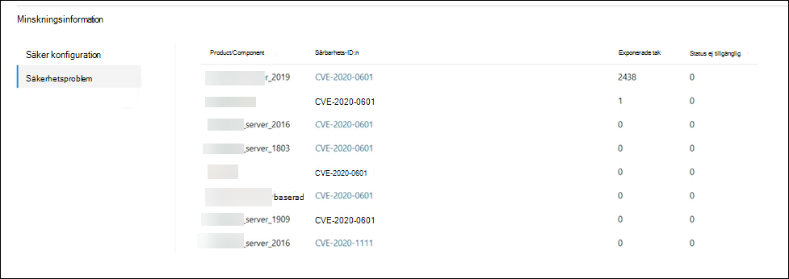

# Spåra och svara på nya hot med hotanalyser 

[!INCLUDE [Microsoft 365 Defender rebranding](../includes/microsoft-defender.md)]

**Gäller för:**
- Microsoft 365 Defender

> Vill du uppleva Microsoft 365 Defender? Du kan [utvärdera det i en laboratoriemiljö](m365d-evaluation.md?ocid=cx-docs-MTPtriallab) eller [köra ett pilotprojekt i produktionen](m365d-pilot.md?ocid=cx-evalpilot).
>

[!INCLUDE [Prerelease](../includes/prerelease.md)]

Hotanalyser är vår in-product threat intelligence-lösning från en expert på Microsoft-säkerhet som utformats för att hjälpa säkerhetsteam att bli så effektiva som möjligt samtidigt som de står inför nya hot, inklusive:

- Aktiva hot-aktör och deras kampanjer
- Populära och nya attacktekniker
- Kritiska säkerhetsproblem
- Vanliga attackytor
- Vanligast förekommande skadlig programvara

Titta på den här korta videon om du vill lära dig mer om hur hotanalyser kan hjälpa dig att spåra de senaste hoten och stoppa dem.

>[!VIDEO https://www.microsoft.com/en-us/videoplayer/embed/RWwJfU]

Du kan komma åt hotanalyser antingen från den övre vänstra sidan i Microsoft 365-säkerhetsportalens navigeringsfält eller från ett dedikerat instrumentpanelskort som visar de viktigaste hoten i din organisation. Att få insyn i aktiva eller pågående kampanjer och veta vad du kan göra med hjälp av hotanalyser kan hjälpa din säkerhetsgrupp att hantera välgrundade beslut. 

_Var du kan komma åt hotanalyser_

Med mer avancerade adversaries och nya hot som dyker upp ofta och ofta är det viktigt att kunna snabbt:

- Identifiera och reagera på nya hot 
- Ta reda på om du är under attack
- Utvärdera effekterna av hoten på dina tillgångar
- Granska din motståndskraft mot eller exponering för hoten
- Identifiera åtgärder för minskning, återställning eller förebyggande åtgärder som du kan vidta för att stoppa eller begränsa hoten

Varje rapport innehåller en analys av ett spårat hot och omfattande vägledning om hur man skyddar mot dessa hot. Dessutom införlivas data från ditt nätverk, som anger om hoten är aktiva och om du har tillämpliga skydd.

## Visa instrumentpanelen för hotanalyser

Instrumentpanelen för hotanalys[(security.microsoft.com/threatanalytics3)](https://security.microsoft.com/threatanalytics3)markerar de rapporter som är mest relevanta för din organisation. Den sammanfattar hoten i följande avsnitt:

- **De senaste hoten**– visar de senast publicerade eller uppdaterade hotrapporterna, tillsammans med antalet aktiva och lösta varningar.
- **Hot med stor påverkan**– här listas de hot som påverkar din organisation mest. I det här avsnittet visas hot med det högsta antalet aktiva och lösta aviseringar först.
- **Sammanfattning av** hot – ger den övergripande effekten av alla spårade hot genom att visa antalet hot med aktiva och lösta varningar.

Välj ett hot från instrumentpanelen för att visa rapporten för det hotet.

_Instrumentpanel för hotanalyser. Du kan också klicka på sökikonen för att hitta ett nyckelord som är relaterat till den rapport över hotanalyser som du vill läsa._ 

## Visa en rapport över hotanalyser

Varje rapport om hotanalyser innehåller information i flera avsnitt: 

- [**Översikt**](#overview-quickly-understand-the-threat-assess-its-impact-and-review-defenses) 
- [**Analytiker**](#analyst-report-get-expert-insight-from-microsoft-security-researchers)
- [**Relaterade ärenden**](#related-incidents-view-and-manage-related-incidents)
- [**Påverkade tillgångar**](#impacted-assets-get-list-of-impacted-devices-and-mailboxes)
- [**Förhindrade e-postförsök**](#prevented-email-attempts-view-blocked-or-junked-threat-emails)
- [**Minskningar**](#mitigations-review-list-of-mitigations-and-the-status-of-your-devices)

### Översikt: Förstå snabbt hot, utvärdera dess påverkan och granska försvar

I **avsnittet** Översikt finns en förhandsgranskning av den detaljerade analytikerrapporten. Dessutom finns diagram som belyser effekterna av risken för organisationen och exponeringen via felkonfigurerade och icke-kompatibla enheter.

_Översiktsavsnitt i en rapport om hotanalyser_

#### Utvärdera påverkan på organisationen
Varje rapport innehåller diagram som är utformade för att ge information om hur ett hot påverkar organisationen:
- **Relaterade incidenter**– ger en översikt över effekterna av de spårade hoten för din organisation med följande data:
  - Antalet aktiva aviseringar och antalet aktiva incidenter de är associerade med
  - Allvarlighetsgrad för aktiva incidenter
- **Aviseringar över tid**– visar antalet relaterade aviseringar **som är aktiva** och **lösta** över tid. Antalet lösta aviseringar anger hur snabbt din organisation svarar på aviseringar som är associerade med ett hot. Under idealiska tider ska diagrammet visa aviseringar som lösts inom några dagar.
- **Påverkade tillgångar –** visar antalet distinkta enheter och e-postkonton (postlådor) som för närvarande har minst en aktiv avisering kopplad till de spårade hoten. Aviseringar utlöses för postlådor som har fått e-postmeddelanden om hot. Läs både organisations- och användarprinciper om åsidosättningar som orsakar leverans av hotmeddelanden.
- **Förhindrade e-postförsök**– visar antalet e-postmeddelanden från de senaste sju dagarna som antingen har blockerats före leveransen eller levererats till mappen Skräppost.

#### Granska motståndskraften hos säkerhet och utvärdering
Varje rapport innehåller diagram som ger en översikt över hur flexibel din organisation är mot ett givet hot:
- **Säker konfigurationsstatus**– visar antalet enheter med felkonfigurerade säkerhetsinställningar. Använd de rekommenderade säkerhetsinställningarna för att minska risken. Enheter anses vara **säkra** om de har _tillämpat alla_ spårade inställningar.
- **Status för sårbarhetskorrigering**– visar antalet sårbara enheter. Tillämpa säkerhetsuppdateringar eller korrigeringar för att åtgärda säkerhetsproblem som utnyttjas av risken.

### Analytikerrapport: Få expertinsikter från Microsoft-säkerhetsanalytiker
I avsnittet **Analytikerrapport** kan du läsa igenom den detaljerade expertens uppskrivning. De flesta rapporter ger detaljerade beskrivningar av attackkedjor, inklusive taktiker och tekniker som mappats till MITRE ATT&CK-ramverket, uttömmande listor med rekommendationer och kraftfulla vägledningar för hot [efter](advanced-hunting-overview.md) hot.

[Läs mer om analytiker](threat-analytics-analyst-reports.md)

### Relaterade ärenden: Visa och hantera relaterade ärenden
På **fliken Relaterade** incidenter visas en lista över alla incidenter som är relaterade till de spårade hoten. Du kan tilldela incidenter eller hantera aviseringar som är kopplade till varje incident. 

_Avsnittet relaterade incidenter i en rapport om hotanalys_

### Påverkade tillgångar: Hämta en lista över påverkade enheter och postlådor
En tillgång anses påverkas om den påverkas av en aktiv, omatchad avisering. På **fliken Påverkade tillgångar** visas följande typer av påverkade tillgångar:
- **Påverkade enheter –** slutpunkter som har omatchade Microsoft Defender för slutpunktsaviseringar. Dessa varningar kan i regel uppmärksamma syn på kända hotindikatorer och -aktiviteter.
- **Påverkade postlådor – postlådor** som har tagit emot e-postmeddelanden som har utlöst Microsoft Defender för Office 365-aviseringar. Även om de flesta meddelanden som utlöser aviseringar vanligtvis blockeras, kan principer på användar- eller organisationsnivå åsidosätta filter.

_Avsnittet Påverkade tillgångar i en rapport om hotanalys_

### Förhindrade e-postförsök: Visa blockerade eller skräppostade hotmeddelanden
Microsoft Defender för Office 365 blockerar vanligtvis e-postmeddelanden med kända hotindikatorer, inklusive skadliga länkar eller bifogade filer. I vissa fall kommer proaktiva filtreringsmetoder som söker efter misstänkt innehåll i stället att skicka e-postmeddelanden med hot till skräppostmappen. I båda fallen minskar risken för att skadlig kod ska startas på enheten.

På **fliken Förhindrade e-postförsök** visas alla e-postmeddelanden som antingen har blockerats före leveransen eller skickats till skräppostmappen av Microsoft Defender för Office 365. 

_Avsnittet Förhindrade e-postförsök i en rapport om hotanalyser_

### Minskningar: Granska en lista över åtgärder och status för dina enheter
Granska listan **över specifika åtgärdsbara** rekommendationer i avsnittet Minskningar som kan hjälpa dig att öka organisationens motståndskraft mot risken. Listan över spårade åtgärder omfattar:

- **Säkerhetsuppdateringar**– distribution av säkerhetsuppdateringar av programvara som stöds för säkerhetsproblem som påträffas på enheter som är ombord
- **Säkerhetskonfigurationer som stöds**
  - Moln levererat skydd  
  - Potentiellt oönskat programskydd (PUA)
  - Realtidsskydd
 
I information om åtgärder i det här avsnittet ingår data från hantering av hot och [risker,](/windows/security/threat-protection/microsoft-defender-atp/next-gen-threat-and-vuln-mgt)som också innehåller detaljerad information om åtgärder från olika länkar i rapporten.

 

_Avsnittet Åtgärder i en rapport om hotanalys_

## Ytterligare rapportinformation och begränsningar
>[!NOTE]
>Som en del av den enhetliga säkerhetsupplevelsen är hotanalyser nu inte bara tillgängliga för Microsoft Defender för Endpoint, utan även för Microsoft Defender för Office E5-licensinnehavare.
>Om du inte använder Microsoft 365-säkerhetsportalen (Microsoft 365 Defender) kan du även se rapportinformationen (utan Microsoft Defender för Office-data) i Microsoft Defender Säkerhetscenter-portalen (Microsoft Defender för slutpunkt). 

För att komma åt rapporten över hotanalyser behöver du vissa roller och behörigheter. Mer [information finns i Anpassade roller i rollbaserad åtkomstkontroll för Microsoft 365 Defender.](custom-roles.md)
  - Om du vill visa aviseringar, incidenter eller data om påverkade tillgångar måste du ha behörighet till Microsoft Defender för Office eller Microsoft Defender för data om slutpunktsaviseringar eller båda.
  - Om du vill visa förhindrade e-postförsök måste du ha behörighet till Microsoft Defender för Office för att kunna söka efter data. 
  - Om du vill visa minskningar måste du ha behörighet till data om hot och sårbarhetshantering i Microsoft Defender för Slutpunkt.

När du tittar på data från hotanalyser ska du tänka på följande faktorer:
- Diagram återspeglar endast minskningar som spåras. Kontrollera rapportens översikt för ytterligare åtgärder som inte visas i diagrammen.
- Minskningar garanterar inte fullständig motståndskraft. Tillhandahållna minskningar återspeglar bästa möjliga åtgärder som krävs för att förbättra motståndskraften.
- Enheter räknas som "inte tillgängliga" om de inte har överfört data till tjänsten.
- Antivirusrelaterad statistik baseras på inställningarna för Microsoft Defender Antivirus. Enheter med antiviruslösningar från tredje part kan visas som "exponerade".

## Relaterade ämnen
- [Hitta hot proaktivt med avancerad sökning](advanced-hunting-overview.md) 
- [Förstå analytikernas rapportavsnitt](threat-analytics-analyst-reports.md)
- [Utvärdera och lösa säkerhetsbrister och exponeringar](/windows/security/threat-protection/microsoft-defender-atp/next-gen-threat-and-vuln-mgt)