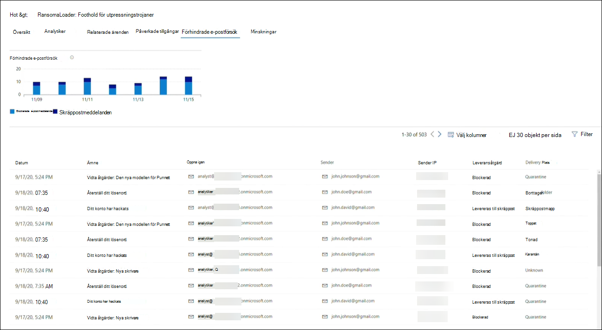

# Spåra och svara på nya hot med hotanalyserTrack and respond to emerging threats with threat analytics 

[!INCLUDE [Microsoft 365 Defender rebranding](../includes/microsoft-defender.md)]

**Gäller för:****Applies to:**
- Microsoft 365 DefenderMicrosoft 365 Defender

> Vill du uppleva Microsoft 365 Defender?Want to experience Microsoft 365 Defender? Du kan [utvärdera det i en laboratoriemiljö](m365d-evaluation.md?ocid=cx-docs-MTPtriallab) eller [köra ett pilotprojekt i produktionen](m365d-pilot.md?ocid=cx-evalpilot).You can [evaluate it in a lab environment](m365d-evaluation.md?ocid=cx-docs-MTPtriallab) or [run your pilot project in production](m365d-pilot.md?ocid=cx-evalpilot).
>

[!INCLUDE [Prerelease](../includes/prerelease.md)]

Hotanalyser är vår in-product threat intelligence-lösning från en expert på Microsoft-säkerhet som utformats för att hjälpa säkerhetsteam att bli så effektiva som möjligt samtidigt som de står inför nya hot, inklusive:Threat analytics is our in-product threat intelligence solution from expert Microsoft security researchers, designed to assist security teams to be as efficient as possible while facing emerging threats, including:

- Aktiva hot-aktör och deras kampanjerActive threat actors and their campaigns
- Populära och nya attackteknikerPopular and new attack techniques
- Kritiska säkerhetsproblemCritical vulnerabilities
- Vanliga attackytorCommon attack surfaces
- Vanligast förekommande skadlig programvaraPrevalent malware

Titta på den här korta videon om du vill lära dig mer om hur hotanalyser kan hjälpa dig att spåra de senaste hoten och stoppa dem.Watch this short video to learn more about how threat analytics can help you track the latest threats and stop them.

>[!VIDEO https://www.microsoft.com/en-us/videoplayer/embed/RWwJfU]

Du kan komma åt hotanalyser antingen från den övre vänstra sidan av Microsoft 365-säkerhetsportalens navigeringsfält eller från ett dedikerat instrumentpanelskort som visar de viktigaste hoten i din organisation. Att få insyn i aktiva eller pågående kampanjer och veta vad du kan göra med hjälp av hotanalyser kan hjälpa din säkerhetsgrupp att hantera välgrundade beslut.You can access threat analytics either from the upper left-hand side of Microsoft 365 security portal’s navigation bar, or from a dedicated dashboard card which shows the top threats in your org. Getting visibility on active or ongoing campaigns and knowing what to do through threat analytics can help equip your security operations team with informed decisions. 

_Var du kan komma åt hotanalyser__Where to access threat analytics_

Med mer avancerade adversaries och nya hot som dyker upp ofta och ofta är det viktigt att kunna snabbt:With more sophisticated adversaries and new threats emerging frequently and prevalently, it's critical to be able to quickly:

- Identifiera och reagera på nya hotIdentify and react to emerging threats
- Ta reda på om du är under attackLearn if you are currently under attack
- Utvärdera effekterna av hoten på dina tillgångarAssess the impact of the threat to your assets
- Granska din motståndskraft mot eller exponering för hotenReview your resilience against or exposure to the threats
- Identifiera åtgärder för minskning, återställning eller förebyggande åtgärder som du kan vidta för att stoppa eller begränsa hotenIdentify the mitigation, recovery, or prevention actions you can take to stop or contain the threats

Varje rapport innehåller en analys av ett spårat hot och omfattande vägledning om hur man skyddar mot dessa hot.Each report provides an analysis of a tracked threat and extensive guidance on how to defend against that threat. Dessutom införlivas data från ditt nätverk, som anger om hoten är aktiva och om du har tillämpliga skydd.It also incorporates data from your network, indicating whether the threat is active and if you have applicable protections in place.

## Visa instrumentpanelen för hotanalyserView the threat analytics dashboard

Instrumentpanelen för hotanalys[(security.microsoft.com/threatanalytics3)](https://security.microsoft.com/threatanalytics3)markerar de rapporter som är mest relevanta för din organisation.The threat analytics dashboard ([security.microsoft.com/threatanalytics3](https://security.microsoft.com/threatanalytics3)) highlights the reports that are most relevant to your organization. Den sammanfattar hoten i följande avsnitt:It summarizes the threats in the following sections:

- **De senaste hoten**– visar de senast publicerade eller uppdaterade hotrapporterna, tillsammans med antalet aktiva och lösta varningar.**Latest threats**—lists the most recently published or updated threat reports, along with the number of active and resolved alerts.
- **Hot med stor påverkan**– här listas de hot som påverkar din organisation mest.**High-impact threats**—lists the threats that have the highest impact to your organization. I det här avsnittet visas hot med det högsta antalet aktiva och lösta aviseringar först.This section lists threats with the highest number of active and resolved alerts first.
- **Sammanfattning av** hot – ger den övergripande effekten av alla spårade hot genom att visa antalet hot med aktiva och lösta varningar.**Threat summary**—provides the overall impact of all tracked threats by showing the number of threats with active and resolved alerts.

Välj ett hot från instrumentpanelen för att visa rapporten för det hotet.Select a threat from the dashboard to view the report for that threat.

_Instrumentpanel för hotanalyser. Du kan också klicka på sökikonen för att hitta ett nyckelord som är relaterat till den rapport över hotanalyser som du vill läsa.__Threat analytics dashboard. You can also click the Search icon to key in a keyword related to the threat analytics report that you'd like to read._ 

## Visa en rapport över hotanalyserView a threat analytics report

Varje rapport om hotanalyser innehåller information i flera avsnitt:Each threat analytics report provides information in several sections:

- [**Översikt****Overview**](#overview-quickly-understand-the-threat-assess-its-impact-and-review-defenses)
- [**Analytiker****Analyst report**](#analyst-report-get-expert-insight-from-microsoft-security-researchers)
- [**Relaterade ärenden****Related incidents**](#related-incidents-view-and-manage-related-incidents)
- [**Påverkade tillgångar****Impacted assets**](#impacted-assets-get-list-of-impacted-devices-and-mailboxes)
- [**Förhindrade e-postförsök****Prevented email attempts**](#prevented-email-attempts-view-blocked-or-junked-threat-emails)
- [**Minskningar****Mitigations**](#mitigations-review-list-of-mitigations-and-the-status-of-your-devices)

### Översikt: Förstå snabbt hot, utvärdera dess påverkan och granska försvarOverview: Quickly understand the threat, assess its impact, and review defenses

I **avsnittet** Översikt finns en förhandsgranskning av den detaljerade analytikerrapporten.The **Overview** section provides a preview of the detailed analyst report. Dessutom finns diagram som belyser effekterna av risken för organisationen och exponeringen via felkonfigurerade och icke-kompatibla enheter.It also provides charts that highlight the impact of the threat to your organization and your exposure through misconfigured and unpatched devices.

_Översiktsavsnitt i en rapport om hotanalyser__Overview section of a threat analytics report_

#### Utvärdera påverkan på organisationenAssess impact on your organization

Varje rapport innehåller diagram som är utformade för att ge information om hur ett hot påverkar organisationen:Each report includes charts designed to provide information about the organizational impact of a threat:

- **Relaterade incidenter**– ger en översikt över effekterna av de spårade hoten för din organisation med följande data:**Related incidents**—provides an overview of the impact of the tracked threat to your organization with the following data:
  - Antalet aktiva aviseringar och antalet aktiva incidenter de är associerade medNumber of active alerts and the number of active incidents they are associated with
  - Allvarlighetsgrad för aktiva incidenterSeverity of active incidents
- **Aviseringar över tid**– visar antalet relaterade aviseringar **som är aktiva** och **lösta** över tid.**Alerts over time**—shows the number of related **Active** and **Resolved** alerts over time. Antalet lösta aviseringar anger hur snabbt din organisation svarar på aviseringar som är associerade med ett hot.The number of resolved alerts indicates how quickly your organization responds to alerts associated with a threat. Under idealiska tider ska diagrammet visa aviseringar som lösts inom några dagar.Ideally, the chart should be showing alerts resolved within a few days.
- **Påverkade tillgångar –** visar antalet distinkta enheter och e-postkonton (postlådor) som för närvarande har minst en aktiv avisering kopplad till de spårade hoten.**Impacted assets**—shows the number of distinct devices and email accounts (mailboxes) that currently have at least one active alert associated with the tracked threat. Aviseringar utlöses för postlådor som har fått e-postmeddelanden om hot.Alerts are triggered for mailboxes that received threat emails. Läs både organisations- och användarprinciper om åsidosättningar som orsakar leverans av hotmeddelanden.Review both org- and user-level policies for overrides that cause the delivery of threat emails.
- **Förhindrade e-postförsök**– visar antalet e-postmeddelanden från de senaste sju dagarna som antingen har blockerats före leveransen eller levererats till mappen Skräppost.**Prevented email attempts**—shows the number of emails from the past seven days that were either blocked before delivery or delivered to the junk mail folder.

#### Granska motståndskraften hos säkerhet och utvärderingReview security resilience and posture

Varje rapport innehåller diagram som ger en översikt över hur flexibel din organisation är mot ett givet hot:Each report includes charts that provide an overview of how resilient your organization is against a given threat:

- **Säker konfigurationsstatus**– visar antalet enheter med felkonfigurerade säkerhetsinställningar.**Secure configuration status**—shows the number of devices with misconfigured security settings. Använd de rekommenderade säkerhetsinställningarna för att minska risken.Apply the recommended security settings to help mitigate the threat. Enheter anses vara **säkra** om de har _tillämpat alla_ spårade inställningar.Devices are considered **Secure** if they have applied _all_ the tracked settings.
- **Status för sårbarhetskorrigering**– visar antalet sårbara enheter.**Vulnerability patching status**—shows the number of vulnerable devices. Tillämpa säkerhetsuppdateringar eller korrigeringar för att åtgärda säkerhetsproblem som utnyttjas av risken.Apply security updates or patches to address vulnerabilities exploited by the threat.

#### Visa rapporter per hottaggarView reports per threat tags

Du kan filtrera listan med hotrapporter och visa de mest relevanta rapporterna enligt en specifik hottagg (kategori) eller en rapporttyp.You can filter the threat report list and view the most relevant reports according to a specific threat tag (category) or a report type.

- **Hottaggar**– hjälper dig att visa de mest relevanta rapporterna utifrån en specifik hotkategori.**Threat tags**—assist you in viewing the most relevant reports according to a specific threat category. Till exempel alla rapporter relaterade till utpressningstrojaner.For example, all reports related to ransomware.
- **Rapporttyper**– hjälper dig att visa de mest relevanta rapporterna enligt en viss rapporttyp.**Report types**—assist you in viewing the most relevant reports according to a specific report type. Till exempel alla rapporter som täcker verktyg och tekniker.For example, all reports that cover tools and techniques. 
- **Filter**– hjälper dig att effektivt granska hotrapportlistan och filtrera vyn baserat på en specifik hottagg eller rapporttyp.**Filters**—assist you in efficiently reviewing the threat report list and filtering the view based on a specific threat tag or report type. Granska till exempel alla rapporter om hot relaterade till utpressningstrojaner eller hotrapporter som täcker säkerhetsproblem.For example, review all threat reports related to ransomware category, or threat reports that cover vulnerabilities.

##### Hur fungerar det?How does it work?

Microsoft Threat Intelligence-teamet har lagt till hottaggar i varje hotrapport:The Microsoft Threat Intelligence team has added threat tags to each threat report:

- Fyra hottaggar är nu tillgängliga:Four threat tags are now available:
  - UtpressningstrojanerRansomware
  - FiskePhishing
  - SårbarhetVulnerability
  - AktivitetsgruppActivity group
- Hottaggar visas högst upp på sidan för hotanalys, med räknare för antalet tillgängliga rapporter under varje tagg.Threat tags are presented at the top of the threat analytics page, with counters for the number of available reports under each tag.

  

- Listan kan också sorteras efter hottaggar:The list can also be sorted by threat tags:

  

- Filter är tillgängliga per hottagg och rapporttyp:Filters are available per threat tag and report type:

  

### Analytikerrapport: Få expertinsikter från Microsoft-säkerhetsanalytikerAnalyst report: Get expert insight from Microsoft security researchers

I avsnittet **Analytikerrapport** kan du läsa igenom den detaljerade expertens uppskrivning.In the **Analyst report** section, read through the detailed expert write-up. De flesta rapporter ger detaljerade beskrivningar av attackkedjor, inklusive taktiker och tekniker som mappats till MITRE ATT&CK-ramverket, uttömmande listor med rekommendationer och kraftfulla vägledningar för hot [efter](advanced-hunting-overview.md) hot.Most reports provide detailed descriptions of attack chains, including tactics and techniques mapped to the MITRE ATT&CK framework, exhaustive lists of recommendations, and powerful [threat hunting](advanced-hunting-overview.md) guidance.

[Läs mer om analytikerLearn more about the analyst report](threat-analytics-analyst-reports.md)

### Relaterade ärenden: Visa och hantera relaterade ärendenRelated incidents: View and manage related incidents

På **fliken Relaterade** incidenter visas en lista över alla incidenter som är relaterade till de spårade hoten.The **Related incidents** tab provides the list of all incidents related to the tracked threat. Du kan tilldela incidenter eller hantera aviseringar som är kopplade till varje incident.You can assign incidents or manage alerts linked to each incident. 

_Avsnittet relaterade incidenter i en rapport om hotanalys__Related incidents section of a threat analytics report_

### Påverkade tillgångar: Hämta en lista över påverkade enheter och postlådorImpacted assets: Get list of impacted devices and mailboxes

En tillgång anses påverkas om den påverkas av en aktiv, omatchad avisering.An asset is considered impacted if it is affected by an active, unresolved alert. På **fliken Påverkade tillgångar** visas följande typer av påverkade tillgångar:The **Impacted assets** tab lists the following types of impacted assets:

- **Påverkade enheter –** slutpunkter som har omatchade Microsoft Defender för slutpunktsaviseringar.**Impacted devices**—endpoints that have unresolved Microsoft Defender for Endpoint alerts. Dessa varningar kan i regel uppmärksamma syn på kända hotindikatorer och -aktiviteter.These alerts typically fire on sightings of known threat indicators and activities.
- **Påverkade postlådor –** postlådor som har tagit emot e-postmeddelanden som har utlöst Microsoft Defender för Office 365 postmeddelanden.**Impacted mailboxes**—mailboxes that have received email messages that have triggered Microsoft Defender for Office 365 alerts. Även om de flesta meddelanden som utlöser aviseringar vanligtvis blockeras, kan principer på användar- eller organisationsnivå åsidosätta filter.While most messages that trigger alerts are typically blocked, user- or org-level policies can override filters.

_Avsnittet Påverkade tillgångar i en rapport om hotanalys__Impacted assets section of a threat analytics report_

### Förhindrade e-postförsök: Visa blockerade eller skräppostade hotmeddelandenPrevented email attempts: View blocked or junked threat emails

Microsoft Defender för Office 365 blockerar vanligtvis e-postmeddelanden med kända hotindikatorer, inklusive skadliga länkar eller bifogade filer.Microsoft Defender for Office 365 typically blocks emails with known threat indicators, including malicious links or attachments. I vissa fall kommer proaktiva filtreringsmetoder som söker efter misstänkt innehåll i stället att skicka e-postmeddelanden med hot till skräppostmappen.In some cases, proactive filtering mechanisms that check for suspicious content will instead send threat emails to the junk mail folder. I båda fallen minskar risken för att skadlig kod ska startas på enheten.In either case, the chances of the threat launching malware code on the device is reduced.

På **fliken Förhindrade e-postförsök** visas alla e-postmeddelanden som antingen har blockerats före leveransen eller skickats till skräppostmappen av Microsoft Defender för Office 365.The **Prevented email attempts** tab lists all the emails that have either been blocked before delivery or sent to the junk mail folder by Microsoft Defender for Office 365. 

_Avsnittet Förhindrade e-postförsök i en rapport om hotanalyser__Prevented email attempts section of a threat analytics report_

### Minskningar: Granska en lista över åtgärder och status för dina enheterMitigations: Review list of mitigations and the status of your devices

Granska listan **över specifika åtgärdsbara** rekommendationer i avsnittet Minskningar som kan hjälpa dig att öka organisationens motståndskraft mot risken.In the **Mitigations** section, review the list of specific actionable recommendations that can help you increase your organizational resilience against the threat. Listan över spårade åtgärder omfattar:The list of tracked mitigations includes:

- **Säkerhetsuppdateringar**– distribution av säkerhetsuppdateringar av programvara som stöds för säkerhetsproblem som påträffas på enheter som är ombord**Security updates**—deployment of supported software security updates for vulnerabilities found on onboarded devices
- **Säkerhetskonfigurationer som stöds****Supported security configurations**
  - Molnbaserat skyddCloud-delivered protection  
  - Potentiellt oönskat programskydd (PUA)Potentially unwanted application (PUA) protection
  - RealtidsskyddReal-time protection

I den här informationen ingår data från [Hantering av hot och säkerhetsrisker](/windows/security/threat-protection/microsoft-defender-atp/next-gen-threat-and-vuln-mgt), som också innehåller detaljerad information om åtgärder från olika länkar i rapporten.Mitigation information in this section incorporates data from [threat and vulnerability management](/windows/security/threat-protection/microsoft-defender-atp/next-gen-threat-and-vuln-mgt), which also provides detailed drill-down information from various links in the report.

_Avsnittet Åtgärder i en rapport om hotanalys__Mitigations section of a threat analytics report_

## Ytterligare rapportinformation och begränsningarAdditional report details and limitations

> [!NOTE]
> Som en del av den enhetliga säkerhetsupplevelsen är hotanalyser nu inte bara tillgängliga för Microsoft Defender för Endpoint, utan även för Microsoft Defender för Office E5-licensinnehavare.As part of the unified security experience, threat analytics is now available not just for Microsoft Defender for Endpoint, but also for Microsoft Defender for Office E5 license holders.
>
> Om du inte använder säkerhetsportalen för Microsoft 365 (Microsoft 365 Defender) kan du även se rapportinformationen (utan Microsoft Defender för Office-data) i Microsoft Defender Säkerhetscenter-portalen (Microsoft Defender för slutpunkt).If you are not using the Microsoft 365 security portal (Microsoft 365 Defender), you can also see the report details (without the Microsoft Defender for Office data) in the Microsoft Defender Security Center portal (Microsoft Defender for Endpoint).

För att komma åt rapporten över hotanalyser behöver du vissa roller och behörigheter.To access threat analytics report you need certain roles and permissions. Mer [information finns i Anpassade roller i rollbaserad åtkomstkontroll Microsoft 365 Defender](custom-roles.md) mer information.See [Custom roles in role-based access control for Microsoft 365 Defender](custom-roles.md) for details.

- Om du vill visa aviseringar, incidenter eller data om påverkade tillgångar måste du ha behörighet till Microsoft Defender för Office eller Microsoft Defender för data om slutpunktsaviseringar, eller både och.To view alerts, incidents, or impacted assets data, you need to have permissions to Microsoft Defender for Office or Microsoft Defender for Endpoint alerts data, or both.
- Om du vill visa förhindrade e-postförsök måste du ha behörighet till Microsoft Defender för Office med data om du vill söka.To view prevented email attempts, you need to have permissions to Microsoft Defender for Office hunting data. 
- Om du vill visa minskningar måste du ha behörighet att Hantering av hot och säkerhetsrisker data i Microsoft Defender för Slutpunkt.To view mitigations, you need to have permissions to threat and vulnerability management data in Microsoft Defender for Endpoint.

När du tittar på data från hotanalyser ska du tänka på följande faktorer:When looking at the threat analytics data, remember the following factors:

- Diagram återspeglar endast minskningar som spåras.Charts reflect only mitigations that are tracked. Kontrollera rapportens översikt för ytterligare åtgärder som inte visas i diagrammen.Check the report overview for additional mitigations that are not shown in the charts.
- Minskningar garanterar inte fullständig motståndskraft.Mitigations don't guarantee complete resilience. Tillhandahållna minskningar återspeglar bästa möjliga åtgärder som krävs för att förbättra motståndskraften.The provided mitigations reflect the best possible actions needed to improve resiliency.
- Enheter räknas som "inte tillgängliga" om de inte har överfört data till tjänsten.Devices are counted as "unavailable" if they have not transmitted data to the service.
- Antivirusrelaterad statistik baseras på de Microsoft Defender Antivirus inställningarna.Antivirus-related statistics are based on Microsoft Defender Antivirus settings. Enheter med antiviruslösningar från tredje part kan visas som "exponerade".Devices with third-party antivirus solutions can appear as "exposed".

## Relaterade ämnenRelated topics

- [Hitta hot proaktivt med avancerad sökningProactively find threats with advanced hunting](advanced-hunting-overview.md) 
- [Förstå analytikernas rapportavsnittUnderstand the analyst report section](threat-analytics-analyst-reports.md)
- [Utvärdera och lösa säkerhetsbrister och exponeringarAssess and resolve security weaknesses and exposures](/windows/security/threat-protection/microsoft-defender-atp/next-gen-threat-and-vuln-mgt)
