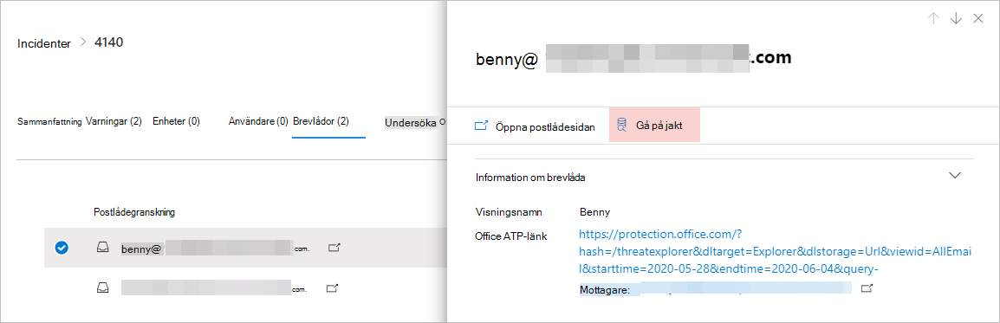
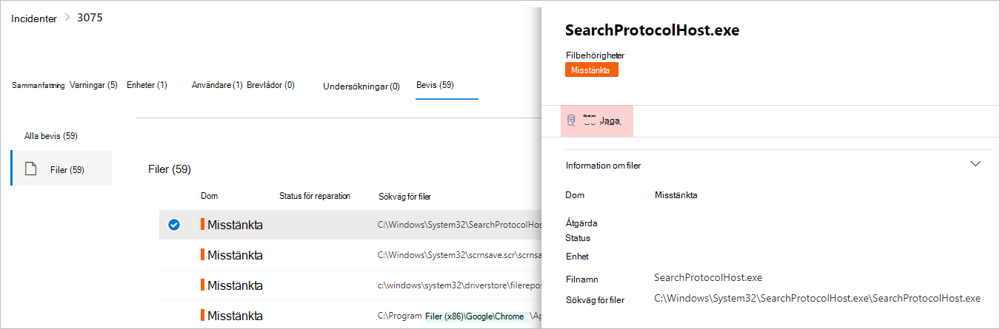
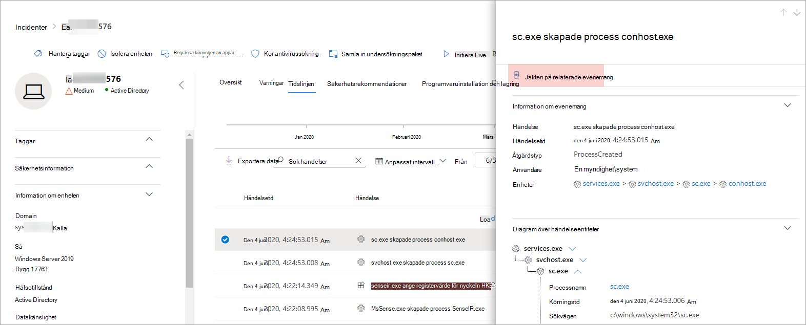

# <a name="quickly-hunt-for-entity-or-event-information-with-go-hunt"></a><span data-ttu-id="67648-104">Snabbt jaga enhet eller händelse information med go hunt</span><span class="sxs-lookup"><span data-stu-id="67648-104">Quickly hunt for entity or event information with go hunt</span></span>

<span data-ttu-id="67648-105">**Gäller:**</span><span class="sxs-lookup"><span data-stu-id="67648-105">**Applies to:**</span></span>
- <span data-ttu-id="67648-106">Microsoft Hotskydd</span><span class="sxs-lookup"><span data-stu-id="67648-106">Microsoft Threat Protection</span></span>

[!INCLUDE [Prerelease information](../includes/prerelease.md)]

<span data-ttu-id="67648-107">Med *åtgärden Go Hunt* kan du snabbt undersöka händelser och olika entitetstyper med hjälp av kraftfulla frågebaserade [avancerade jaktfunktioner.](advanced-hunting-overview.md)</span><span class="sxs-lookup"><span data-stu-id="67648-107">With the *go hunt* action, you can quickly investigate events and various entity types using powerful query-based [advanced hunting](advanced-hunting-overview.md) capabilities.</span></span> <span data-ttu-id="67648-108">Den här åtgärden kör automatiskt en avancerad jaktfråga för att hitta relevant information om den valda händelsen eller entiteten.</span><span class="sxs-lookup"><span data-stu-id="67648-108">This action automatically runs an advanced hunting query to find relevant information about the selected event or entity.</span></span>

<span data-ttu-id="67648-109">Go *hunt-åtgärden* är tillgänglig i olika delar av säkerhetscentret när händelse- eller entitetsinformation visas.</span><span class="sxs-lookup"><span data-stu-id="67648-109">The *go hunt* action is available in various sections of the security center whenever event or entity details are displayed.</span></span> <span data-ttu-id="67648-110">Du kan till exempel använda *go hunt* från följande avsnitt:</span><span class="sxs-lookup"><span data-stu-id="67648-110">For example, you can use *go hunt* from the following sections:</span></span>

- <span data-ttu-id="67648-111">På [incidentsidan](investigate-incidents.md#incident-overview)kan du granska information om användare, enheter och många andra entiteter som är associerade med en incident.</span><span class="sxs-lookup"><span data-stu-id="67648-111">In the [incident page](investigate-incidents.md#incident-overview), you can review details about users, devices, and many other entities associated with an incident.</span></span> <span data-ttu-id="67648-112">När du väljer en entitet får du ytterligare information samt olika åtgärder som du kan vidta på den berättigande.</span><span class="sxs-lookup"><span data-stu-id="67648-112">As you select an entity, you get additional information as well as various actions you could take on that entitity.</span></span> <span data-ttu-id="67648-113">I exemplet nedan väljs en postlåda som visar information om postlådan samt möjlighet att söka efter mer information om postlådan.</span><span class="sxs-lookup"><span data-stu-id="67648-113">In the example below, a mailbox is selected, showing details about the mailbox as well the option to hunt for more information about the mailbox.</span></span>

    

- <span data-ttu-id="67648-115">På incidentsidan kan du också komma åt en lista över entiteter under fliken Bevis.</span><span class="sxs-lookup"><span data-stu-id="67648-115">In the incident page, you can also access a list of entities under the evidence tab. Selecting one of those entities provides an option to quickly hunt for information about that entity.</span></span>

    


- <span data-ttu-id="67648-117">När du visar tidslinjen för en enhet kan du välja en händelse på tidslinjen för att visa ytterligare information om händelsen.</span><span class="sxs-lookup"><span data-stu-id="67648-117">When viewing the timeline for a device, you can select an event in the timeline to view additional information about that event.</span></span> <span data-ttu-id="67648-118">När ett evenemang har valts får du möjlighet att jaga efter andra relevanta evenemang i avancerad jakt.</span><span class="sxs-lookup"><span data-stu-id="67648-118">Once an event is selected, you get the option to hunt for other relevant events in advanced hunting.</span></span>

    

<span data-ttu-id="67648-120">Om du väljer **Gå jakt** eller Jakt efter **relaterade händelser** skickas olika frågor, beroende på om du har valt en entitet eller en händelse.</span><span class="sxs-lookup"><span data-stu-id="67648-120">Selecting **Go hunt** or **Hunt for related events** passes different queries, depending on whether you've selected an entity or an event.</span></span>

## <a name="query-for-entity-information"></a><span data-ttu-id="67648-121">Fråga efter entitetsinformation</span><span class="sxs-lookup"><span data-stu-id="67648-121">Query for entity information</span></span>
<span data-ttu-id="67648-122">När du använder *gå jaga* till fråga efter information om en användare, enhet eller någon annan typ av entitet, kontrollerar frågan alla relevanta schematabeller för alla händelser som involverar den entiteten.</span><span class="sxs-lookup"><span data-stu-id="67648-122">When using *go hunt* to query for information about a user, device, or any other type of entity, the query checks all relevant schema tables for any events involving that entity.</span></span> <span data-ttu-id="67648-123">För att hålla resultaten hanterbara begränsas frågan till ungefär samma tidsperiod som den tidigaste aktiviteten under de senaste 30 dagarna som involverar entiteten och är associerad med incidenten.</span><span class="sxs-lookup"><span data-stu-id="67648-123">To keep the results manageable, the query is scoped to around the same time period as the earliest activity in the past 30 days that involves the entity and is associated with the incident.</span></span>

<span data-ttu-id="67648-124">Här är ett exempel på go hunt-frågan för en enhet:</span><span class="sxs-lookup"><span data-stu-id="67648-124">Here is an example of the go hunt query for a device:</span></span>

```kusto
let selectedTimestamp = datetime(2020-06-02T02:06:47.1167157Z);
let deviceName = "fv-az770.example.com";
let deviceId = "device-guid";
search in (DeviceLogonEvents, DeviceProcessEvents, DeviceNetworkEvents, DeviceFileEvents, DeviceRegistryEvents, DeviceImageLoadEvents, DeviceEvents, DeviceImageLoadEvents, IdentityLogonEvents, IdentityQueryEvents)
Timestamp between ((selectedTimestamp - 1h) .. (selectedTimestamp + 1h))
and DeviceName == deviceName
// or RemoteDeviceName == deviceName
// or DeviceId == deviceId
| take 100
```
### <a name="supported-entity-types"></a><span data-ttu-id="67648-125">Typer av entitet som stöds</span><span class="sxs-lookup"><span data-stu-id="67648-125">Supported entity types</span></span>
<span data-ttu-id="67648-126">Du kan använda *go hunt* efter att ha valt någon av dessa entitetstyper:</span><span class="sxs-lookup"><span data-stu-id="67648-126">You can use *go hunt* after selecting any of these entity types:</span></span>

- <span data-ttu-id="67648-127">filer</span><span class="sxs-lookup"><span data-stu-id="67648-127">Files</span></span>
- <span data-ttu-id="67648-128">Email</span><span class="sxs-lookup"><span data-stu-id="67648-128">Emails</span></span>
- <span data-ttu-id="67648-129">E-postkluster</span><span class="sxs-lookup"><span data-stu-id="67648-129">Email clusters</span></span>
- <span data-ttu-id="67648-130">Postlådor</span><span class="sxs-lookup"><span data-stu-id="67648-130">Mailboxes</span></span>
- <span data-ttu-id="67648-131">Användare</span><span class="sxs-lookup"><span data-stu-id="67648-131">Users</span></span>
- <span data-ttu-id="67648-132">Enheter</span><span class="sxs-lookup"><span data-stu-id="67648-132">Devices</span></span>
- <span data-ttu-id="67648-133">IP-adresser</span><span class="sxs-lookup"><span data-stu-id="67648-133">IP addresses</span></span>
- <span data-ttu-id="67648-134">Webbadresser</span><span class="sxs-lookup"><span data-stu-id="67648-134">URLs</span></span>

## <a name="query-for-event-information"></a><span data-ttu-id="67648-135">Fråga efter händelseinformation</span><span class="sxs-lookup"><span data-stu-id="67648-135">Query for event information</span></span>
<span data-ttu-id="67648-136">När du använder *gå jaga* till fråga efter information om en tidslinjehändelse kontrollerar frågan alla relevanta schematabeller för andra händelser runt tiden för den valda händelsen.</span><span class="sxs-lookup"><span data-stu-id="67648-136">When using *go hunt* to query for information about a timeline event, the query checks all relevant schema tables for other events around the time of the selected event.</span></span> <span data-ttu-id="67648-137">Följande fråga visar till exempel händelser i olika schematabeller som inträffade ungefär samma tidsperiod på samma enhet:</span><span class="sxs-lookup"><span data-stu-id="67648-137">For example, the following query lists events in various schema tables that occured around the same time period on the same device:</span></span>

```kusto
// List relevant events 30 minutes before and after selected LogonAttempted event
let selectedEventTimestamp = datetime(2020-06-04T01:29:09.2496688Z);
search in (DeviceFileEvents, DeviceProcessEvents, DeviceEvents, DeviceRegistryEvents, DeviceNetworkEvents, DeviceImageLoadEvents, DeviceLogonEvents)
    Timestamp between ((selectedEventTimestamp - 30m) .. (selectedEventTimestamp + 30m))
    and DeviceId == "079ecf9c5798d249128817619606c1c47369eb3e"
| sort by Timestamp desc
| extend Relevance = iff(Timestamp == selectedEventTimestamp, "Selected event", iff(Timestamp < selectedEventTimestamp, "Earlier event", "Later event"))
| project-reorder Relevance
```

## <a name="adjust-the-query"></a><span data-ttu-id="67648-138">Justera frågan</span><span class="sxs-lookup"><span data-stu-id="67648-138">Adjust the query</span></span>
<span data-ttu-id="67648-139">Med viss kunskap om [frågespråket](advanced-hunting-query-language.md)kan du justera frågan efter dina önskemål.</span><span class="sxs-lookup"><span data-stu-id="67648-139">With some knowledge of the [query language](advanced-hunting-query-language.md), you can adjust the query to your preference.</span></span> <span data-ttu-id="67648-140">Du kan till exempel justera den här raden, som bestämmer storleken på tidsfönstret:</span><span class="sxs-lookup"><span data-stu-id="67648-140">For example, you can adjust this line, which determines the size of the time window:</span></span>

```kusto
Timestamp between ((selectedTimestamp - 1h) .. (selectedTimestamp + 1h))
```

<span data-ttu-id="67648-141">Förutom att ändra frågan för att få mer relevanta resultat kan du också:</span><span class="sxs-lookup"><span data-stu-id="67648-141">In addition to modifying the query to get more relevant results, you can also:</span></span>
- [<span data-ttu-id="67648-142">Visa resultaten som diagram</span><span class="sxs-lookup"><span data-stu-id="67648-142">View the results as charts</span></span>](advanced-hunting-query-results.md#view-query-results-as-a-table-or-chart)
- [<span data-ttu-id="67648-143">Skapa en anpassad identifieringsregel</span><span class="sxs-lookup"><span data-stu-id="67648-143">Create a custom detection rule</span></span>](custom-detection-rules.md)

## <a name="related-topics"></a><span data-ttu-id="67648-144">Relaterade ämnen</span><span class="sxs-lookup"><span data-stu-id="67648-144">Related topics</span></span>
- [<span data-ttu-id="67648-145">Översikt över avancerad jakt</span><span class="sxs-lookup"><span data-stu-id="67648-145">Advanced hunting overview</span></span>](advanced-hunting-overview.md)
- [<span data-ttu-id="67648-146">Lär dig frågespråket</span><span class="sxs-lookup"><span data-stu-id="67648-146">Learn the query language</span></span>](advanced-hunting-query-language.md)
- [<span data-ttu-id="67648-147">Arbeta med frågeresultat</span><span class="sxs-lookup"><span data-stu-id="67648-147">Work with query results</span></span>](advanced-hunting-query-results.md)
- [<span data-ttu-id="67648-148">Regler för anpassad identifiering</span><span class="sxs-lookup"><span data-stu-id="67648-148">Custom detection rules</span></span>](custom-detection-rules.md)