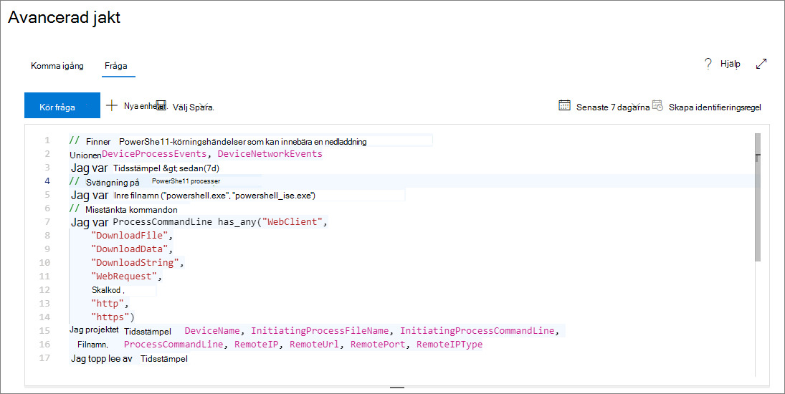

# <a name="learn-the-advanced-hunting-query-language"></a><span data-ttu-id="e0ad7-104">Lär dig det avancerade jaktfrågespråket</span><span class="sxs-lookup"><span data-stu-id="e0ad7-104">Learn the advanced hunting query language</span></span>

<span data-ttu-id="e0ad7-105">**Gäller:**</span><span class="sxs-lookup"><span data-stu-id="e0ad7-105">**Applies to:**</span></span>
- <span data-ttu-id="e0ad7-106">Microsoft Hotskydd</span><span class="sxs-lookup"><span data-stu-id="e0ad7-106">Microsoft Threat Protection</span></span>

<span data-ttu-id="e0ad7-107">Avancerad jakt baseras på [Kusto-frågespråket](https://docs.microsoft.com/azure/kusto/query/).</span><span class="sxs-lookup"><span data-stu-id="e0ad7-107">Advanced hunting is based on the [Kusto query language](https://docs.microsoft.com/azure/kusto/query/).</span></span> <span data-ttu-id="e0ad7-108">Du kan använda Kusto-syntax och operatorer för att konstruera frågor som hittar information i [schemat](advanced-hunting-schema-tables.md) som är särskilt strukturerat för avancerad jakt.</span><span class="sxs-lookup"><span data-stu-id="e0ad7-108">You can use Kusto syntax and operators to construct queries that locate information in the [schema](advanced-hunting-schema-tables.md) specifically structured for advanced hunting.</span></span> <span data-ttu-id="e0ad7-109">Om du vill förstå dessa begrepp bättre kör du din första fråga.</span><span class="sxs-lookup"><span data-stu-id="e0ad7-109">To understand these concepts better, run your first query.</span></span>

## <a name="try-your-first-query"></a><span data-ttu-id="e0ad7-110">Prova din första fråga</span><span class="sxs-lookup"><span data-stu-id="e0ad7-110">Try your first query</span></span>

<span data-ttu-id="e0ad7-111">I Microsoft 365 security center går du till **Jakt** för att köra din första fråga.</span><span class="sxs-lookup"><span data-stu-id="e0ad7-111">In Microsoft 365 security center, go to **Hunting** to run your first query.</span></span> <span data-ttu-id="e0ad7-112">Använd följande exempel:</span><span class="sxs-lookup"><span data-stu-id="e0ad7-112">Use the following example:</span></span>

```kusto
// Finds PowerShell execution events that could involve a download
union DeviceProcessEvents, DeviceNetworkEvents
| where Timestamp > ago(7d)
// Pivoting on PowerShell processes
| where FileName in~ ("powershell.exe", "powershell_ise.exe")
// Suspicious commands
| where ProcessCommandLine has_any("WebClient",
 "DownloadFile",
 "DownloadData",
 "DownloadString",
"WebRequest",
"Shellcode",
"http",
"https")
| project Timestamp, DeviceName, InitiatingProcessFileName, InitiatingProcessCommandLine, 
FileName, ProcessCommandLine, RemoteIP, RemoteUrl, RemotePort, RemoteIPType
| top 100 by Timestamp
```

<span data-ttu-id="e0ad7-113">Så här kommer det att se ut i avancerad jakt.</span><span class="sxs-lookup"><span data-stu-id="e0ad7-113">This is how it will look like in advanced hunting.</span></span>



### <a name="describe-the-query-and-specify-the-tables-to-search"></a><span data-ttu-id="e0ad7-115">Beskriv frågan och ange vilka tabeller som ska sökas</span><span class="sxs-lookup"><span data-stu-id="e0ad7-115">Describe the query and specify the tables to search</span></span>
<span data-ttu-id="e0ad7-116">En kort kommentar har lagts till i början av frågan för att beskriva vad den är till för.</span><span class="sxs-lookup"><span data-stu-id="e0ad7-116">A short comment has been added to the beginning of the query to describe what it is for.</span></span> <span data-ttu-id="e0ad7-117">Detta hjälper om du senare bestämmer dig för att spara frågan och dela den med andra i organisationen.</span><span class="sxs-lookup"><span data-stu-id="e0ad7-117">This helps if you later decide to save the query and share it with others in your organization.</span></span> 

```kusto
// Finds PowerShell execution events that could involve a download
```

<span data-ttu-id="e0ad7-118">Själva frågan börjar vanligtvis med ett tabellnamn följt av en serie element som startats av en pipe ( `|` ).</span><span class="sxs-lookup"><span data-stu-id="e0ad7-118">The query itself will typically start with a table name followed by a series of elements started by a pipe (`|`).</span></span> <span data-ttu-id="e0ad7-119">I det här exemplet börjar vi med att skapa en union med två tabeller `DeviceProcessEvents` och `DeviceNetworkEvents` lägga till rörelement efter behov.</span><span class="sxs-lookup"><span data-stu-id="e0ad7-119">In this example, we start by creating a union of two tables,  `DeviceProcessEvents` and `DeviceNetworkEvents`, and add piped elements as needed.</span></span>

```kusto
union DeviceProcessEvents, DeviceNetworkEvents
```
### <a name="set-the-time-range"></a><span data-ttu-id="e0ad7-120">Ange tidsintervall</span><span class="sxs-lookup"><span data-stu-id="e0ad7-120">Set the time range</span></span>
<span data-ttu-id="e0ad7-121">Det första rörelementet är ett tidsfilter som har scopets till de föregående sju dagarna.</span><span class="sxs-lookup"><span data-stu-id="e0ad7-121">The first piped element is a time filter scoped to the previous seven days.</span></span> <span data-ttu-id="e0ad7-122">Om du håller tidsintervallet så smalt som möjligt säkerställer du att frågor fungerar bra, returnerar hanterbara resultat och inte time out.</span><span class="sxs-lookup"><span data-stu-id="e0ad7-122">Keeping the time range as narrow as possible ensures that queries perform well, return manageable results, and don't time out.</span></span>

```kusto
| where Timestamp > ago(7d)
```

### <a name="check-specific-processes"></a><span data-ttu-id="e0ad7-123">Kontrollera specifika processer</span><span class="sxs-lookup"><span data-stu-id="e0ad7-123">Check specific processes</span></span>
<span data-ttu-id="e0ad7-124">Tidsintervallet följs omedelbart av en sökning efter processfilnamn som representerar PowerShell-programmet.</span><span class="sxs-lookup"><span data-stu-id="e0ad7-124">The time range is immediately followed by a search for process file names representing the PowerShell application.</span></span>

```kusto
// Pivoting on PowerShell processes
| where FileName in~ ("powershell.exe", "powershell_ise.exe")
```

### <a name="search-for-specific-command-strings"></a><span data-ttu-id="e0ad7-125">Sök efter specifika kommandosträngar</span><span class="sxs-lookup"><span data-stu-id="e0ad7-125">Search for specific command strings</span></span>
<span data-ttu-id="e0ad7-126">Därefter söker frågan efter strängar på kommandorader som vanligtvis används för att hämta filer med PowerShell.</span><span class="sxs-lookup"><span data-stu-id="e0ad7-126">Afterwards, the query looks for strings in command lines that are typically used to download files using PowerShell.</span></span>

```kusto
// Suspicious commands
| where ProcessCommandLine has_any("WebClient",
    "DownloadFile",
    "DownloadData",
    "DownloadString",
    "WebRequest",
    "Shellcode",
    "http",
    "https")
```

### <a name="customize-result-columns-and-length"></a><span data-ttu-id="e0ad7-127">Anpassa resultatkolumner och längd</span><span class="sxs-lookup"><span data-stu-id="e0ad7-127">Customize result columns and length</span></span> 
<span data-ttu-id="e0ad7-128">Nu när frågan tydligt identifierar de data du vill hitta kan du lägga till element som definierar hur resultaten ser ut.</span><span class="sxs-lookup"><span data-stu-id="e0ad7-128">Now that your query clearly identifies the data you want to locate, you can add elements that define what the results look like.</span></span> <span data-ttu-id="e0ad7-129">`project`returnerar specifika kolumner och `top` begränsar antalet resultat.</span><span class="sxs-lookup"><span data-stu-id="e0ad7-129">`project` returns specific columns, and `top` limits the number of results.</span></span> <span data-ttu-id="e0ad7-130">Dessa operatörer hjälper till att säkerställa att resultaten är välformaterade och någorlunda stora och lätta att bearbeta.</span><span class="sxs-lookup"><span data-stu-id="e0ad7-130">These operators help ensure the results are well-formatted and reasonably large and easy to process.</span></span>

```kusto
| project Timestamp, DeviceName, InitiatingProcessFileName, InitiatingProcessCommandLine, 
FileName, ProcessCommandLine, RemoteIP, RemoteUrl, RemotePort, RemoteIPType
| top 100 by Timestamp
```

<span data-ttu-id="e0ad7-131">Klicka på **Kör fråga** om du vill se resultatet.</span><span class="sxs-lookup"><span data-stu-id="e0ad7-131">Click **Run query** to see the results.</span></span> <span data-ttu-id="e0ad7-132">Välj ikonen expandera längst upp till höger i frågeredigeraren för att fokusera på din jaktfråga och resultaten.</span><span class="sxs-lookup"><span data-stu-id="e0ad7-132">Select the expand icon at the top right of the query editor to focus on your hunting query and the results.</span></span> 


>[!TIP]
><span data-ttu-id="e0ad7-134">Du kan visa frågeresultat som diagram och snabbt justera filter.</span><span class="sxs-lookup"><span data-stu-id="e0ad7-134">You can view query results as charts and quickly adjust filters.</span></span> <span data-ttu-id="e0ad7-135">Om du vill ha vägledning [kan du läsa om hur du arbetar med frågeresultat](advanced-hunting-query-results.md)</span><span class="sxs-lookup"><span data-stu-id="e0ad7-135">For guidance, [read about working with query results](advanced-hunting-query-results.md)</span></span>

## <a name="learn-common-query-operators-for-advanced-hunting"></a><span data-ttu-id="e0ad7-136">Lär dig vanliga frågeoperatorer för avancerad jakt</span><span class="sxs-lookup"><span data-stu-id="e0ad7-136">Learn common query operators for advanced hunting</span></span>

<span data-ttu-id="e0ad7-137">Nu när du har kört din första fråga och har en allmän uppfattning om dess komponenter, är det dags att backa lite och lära sig grunderna.</span><span class="sxs-lookup"><span data-stu-id="e0ad7-137">Now that you've run your first query and have a general idea of its components, it's time to backtrack a little bit and learn some basics.</span></span> <span data-ttu-id="e0ad7-138">Kusto-frågespråket som används av avancerad jakt stöder en rad operatörer, inklusive följande vanliga.</span><span class="sxs-lookup"><span data-stu-id="e0ad7-138">The Kusto query language used by advanced hunting supports a range of operators, including the following common ones.</span></span>

| <span data-ttu-id="e0ad7-139">Operatör</span><span class="sxs-lookup"><span data-stu-id="e0ad7-139">Operator</span></span> | <span data-ttu-id="e0ad7-140">Beskrivning och användning</span><span class="sxs-lookup"><span data-stu-id="e0ad7-140">Description and usage</span></span> |
|--|--|
| `where` | <span data-ttu-id="e0ad7-141">Filtrera en tabell till den delmängd av rader som uppfyller ett predikat.</span><span class="sxs-lookup"><span data-stu-id="e0ad7-141">Filter a table to the subset of rows that satisfy a predicate.</span></span> |
| `summarize` | <span data-ttu-id="e0ad7-142">Skapa en tabell som sammanställer innehållet i indatatabellen.</span><span class="sxs-lookup"><span data-stu-id="e0ad7-142">Produce a table that aggregates the content of the input table.</span></span> |
| `join` | <span data-ttu-id="e0ad7-143">Sammanfoga raderna med två tabeller för att skapa en ny tabell med matchande värden för de angivna kolumnerna från varje tabell.</span><span class="sxs-lookup"><span data-stu-id="e0ad7-143">Merge the rows of two tables to form a new table by matching values of the specified column(s) from each table.</span></span> |
| `count` | <span data-ttu-id="e0ad7-144">Returnera antalet poster i indatapostuppsättningen.</span><span class="sxs-lookup"><span data-stu-id="e0ad7-144">Return the number of records in the input record set.</span></span> |
| `top` | <span data-ttu-id="e0ad7-145">Returnera de första N-posterna sorterade efter de angivna kolumnerna.</span><span class="sxs-lookup"><span data-stu-id="e0ad7-145">Return the first N records sorted by the specified columns.</span></span> |
| `limit` | <span data-ttu-id="e0ad7-146">Returnera upp till angivet antal rader.</span><span class="sxs-lookup"><span data-stu-id="e0ad7-146">Return up to the specified number of rows.</span></span> |
| `project` | <span data-ttu-id="e0ad7-147">Markera de kolumner som ska inkluderas, byta namn på eller släppa och infoga nya beräknade kolumner.</span><span class="sxs-lookup"><span data-stu-id="e0ad7-147">Select the columns to include, rename or drop, and insert new computed columns.</span></span> |
| `extend` | <span data-ttu-id="e0ad7-148">Skapa beräknade kolumner och lägg till dem i resultatuppsättningen.</span><span class="sxs-lookup"><span data-stu-id="e0ad7-148">Create calculated columns and append them to the result set.</span></span> |
| `makeset` |  <span data-ttu-id="e0ad7-149">Returnera en dynamisk (JSON) matris för uppsättningen distinkta värden som Uttr tar i gruppen.</span><span class="sxs-lookup"><span data-stu-id="e0ad7-149">Return a dynamic (JSON) array of the set of distinct values that Expr takes in the group.</span></span> |
| `find` | <span data-ttu-id="e0ad7-150">Hitta rader som matchar ett predikat över en uppsättning tabeller.</span><span class="sxs-lookup"><span data-stu-id="e0ad7-150">Find rows that match a predicate across a set of tables.</span></span> |

<span data-ttu-id="e0ad7-151">Om du vill se ett levande exempel på dessa operatörer kör du dem från avsnittet **Kom igång** i avancerad jakt.</span><span class="sxs-lookup"><span data-stu-id="e0ad7-151">To see a live example of these operators, run them from the **Get started** section in advanced hunting.</span></span>

## <a name="understand-data-types-and-their-query-syntax-implications"></a><span data-ttu-id="e0ad7-152">Förstå datatyper och deras frågesyntax implicationer</span><span class="sxs-lookup"><span data-stu-id="e0ad7-152">Understand data types and their query syntax implications</span></span>

<span data-ttu-id="e0ad7-153">Uppgifter i avancerade jakttabeller är i allmänhet indelade i följande datatyper.</span><span class="sxs-lookup"><span data-stu-id="e0ad7-153">Data in advanced hunting tables are generally classified into the following data types.</span></span>

| <span data-ttu-id="e0ad7-154">Datatyp</span><span class="sxs-lookup"><span data-stu-id="e0ad7-154">Data type</span></span> | <span data-ttu-id="e0ad7-155">Beskrivnings- och frågekonsekvenser</span><span class="sxs-lookup"><span data-stu-id="e0ad7-155">Description and query implications</span></span> |
|--|--|
| `datetime` | <span data-ttu-id="e0ad7-156">Data- och tidsinformation som vanligtvis representerar händelsetidsstämplar</span><span class="sxs-lookup"><span data-stu-id="e0ad7-156">Data and time information typically representing event timestamps</span></span> |
| `string` | <span data-ttu-id="e0ad7-157">Teckensträng</span><span class="sxs-lookup"><span data-stu-id="e0ad7-157">Character string</span></span> |
| `bool` | <span data-ttu-id="e0ad7-158">Sant eller falskt</span><span class="sxs-lookup"><span data-stu-id="e0ad7-158">True or false</span></span> |
| `int` | <span data-ttu-id="e0ad7-159">32-bitars numeriskt värde</span><span class="sxs-lookup"><span data-stu-id="e0ad7-159">32-bit numeric value</span></span>  |
| `long` | <span data-ttu-id="e0ad7-160">64-bitars numeriskt värde</span><span class="sxs-lookup"><span data-stu-id="e0ad7-160">64-bit numeric value</span></span> |

## <a name="get-help-as-you-write-queries"></a><span data-ttu-id="e0ad7-161">Få hjälp när du skriver frågor</span><span class="sxs-lookup"><span data-stu-id="e0ad7-161">Get help as you write queries</span></span>
<span data-ttu-id="e0ad7-162">Dra nytta av följande funktioner för att skriva frågor snabbare:</span><span class="sxs-lookup"><span data-stu-id="e0ad7-162">Take advantage of the following functionality to write queries faster:</span></span>
- <span data-ttu-id="e0ad7-163">**Autosuggest** - när du skriver frågor, avancerad jakt ger förslag från IntelliSense.</span><span class="sxs-lookup"><span data-stu-id="e0ad7-163">**Autosuggest** — as you write queries, advanced hunting provides suggestions from IntelliSense.</span></span> 
- <span data-ttu-id="e0ad7-164">**Schematräd** – en schemarepresentation som innehåller listan över tabeller och deras kolumner finns bredvid arbetsområdet.</span><span class="sxs-lookup"><span data-stu-id="e0ad7-164">**Schema tree** — a schema representation that includes the list of tables and their columns is provided next to your working area.</span></span> <span data-ttu-id="e0ad7-165">Om du vill ha mer information håller du muspekaren över ett objekt.</span><span class="sxs-lookup"><span data-stu-id="e0ad7-165">For more information, hover over an item.</span></span> <span data-ttu-id="e0ad7-166">Dubbelklicka på ett objekt om du vill infoga det i frågeredigeraren.</span><span class="sxs-lookup"><span data-stu-id="e0ad7-166">Double-click an item to insert it to the query editor.</span></span>
- <span data-ttu-id="e0ad7-167">**[Schemareferens](advanced-hunting-schema-tables.md#get-schema-information-in-the-security-center)** – i portalreferens med tabell- och kolumnbeskrivningar samt händelsetyper som stöds `ActionType` (värden) och exempelfrågor</span><span class="sxs-lookup"><span data-stu-id="e0ad7-167">**[Schema reference](advanced-hunting-schema-tables.md#get-schema-information-in-the-security-center)** — in-portal reference with table and column descriptions as well as supported event types (`ActionType` values) and sample queries</span></span>

## <a name="work-with-multiple-queries-in-the-editor"></a><span data-ttu-id="e0ad7-168">Arbeta med flera frågor i redigeraren</span><span class="sxs-lookup"><span data-stu-id="e0ad7-168">Work with multiple queries in the editor</span></span>
<span data-ttu-id="e0ad7-169">Frågeredigeraren kan fungera som din scratch pad för att experimentera med flera frågor.</span><span class="sxs-lookup"><span data-stu-id="e0ad7-169">The query editor can serve as your scratch pad for experimenting with multiple queries.</span></span> <span data-ttu-id="e0ad7-170">Så här använder du flera frågor:</span><span class="sxs-lookup"><span data-stu-id="e0ad7-170">To use multiple queries:</span></span>

- <span data-ttu-id="e0ad7-171">Avgränsa varje fråga med en tom rad.</span><span class="sxs-lookup"><span data-stu-id="e0ad7-171">Separate each query with an empty line.</span></span>
- <span data-ttu-id="e0ad7-172">Placera markören på någon del av en fråga för att markera frågan innan du kör den.</span><span class="sxs-lookup"><span data-stu-id="e0ad7-172">Place the cursor on any part of a query to select that query before running it.</span></span> <span data-ttu-id="e0ad7-173">Detta kommer bara att köra den valda frågan.</span><span class="sxs-lookup"><span data-stu-id="e0ad7-173">This will run only the selected query.</span></span> <span data-ttu-id="e0ad7-174">Om du vill köra en annan fråga flyttar du markören därefter och väljer **Kör fråga**.</span><span class="sxs-lookup"><span data-stu-id="e0ad7-174">To run another query, move the cursor accordingly and select **Run query**.</span></span>


## <a name="use-sample-queries"></a><span data-ttu-id="e0ad7-176">Använda exempelfrågor</span><span class="sxs-lookup"><span data-stu-id="e0ad7-176">Use sample queries</span></span>

<span data-ttu-id="e0ad7-177">Avsnittet **Kom igång** innehåller några enkla frågor med vanliga operatorer.</span><span class="sxs-lookup"><span data-stu-id="e0ad7-177">The **Get started** section provides a few simple queries using commonly used operators.</span></span> <span data-ttu-id="e0ad7-178">Prova att köra dessa frågor och göra små ändringar i dem.</span><span class="sxs-lookup"><span data-stu-id="e0ad7-178">Try running these queries and making small modifications to them.</span></span>


>[!NOTE]
><span data-ttu-id="e0ad7-180">Förutom de grundläggande frågeexemplen kan du också komma åt delade frågor för specifika [hotjaktsscenarier.](advanced-hunting-shared-queries.md)</span><span class="sxs-lookup"><span data-stu-id="e0ad7-180">Apart from the basic query samples, you can also access [shared queries](advanced-hunting-shared-queries.md) for specific threat hunting scenarios.</span></span> <span data-ttu-id="e0ad7-181">Utforska delade frågor till vänster på sidan eller GitHub-frågedatabasen.</span><span class="sxs-lookup"><span data-stu-id="e0ad7-181">Explore the shared queries on the left side of the page or the GitHub query repository.</span></span>

## <a name="access-query-language-documentation"></a><span data-ttu-id="e0ad7-182">Dokumentation för åtkomst till frågespråk</span><span class="sxs-lookup"><span data-stu-id="e0ad7-182">Access query language documentation</span></span>

<span data-ttu-id="e0ad7-183">Mer information om Kusto-frågespråk och operatörer som stöds finns i [Kusto-frågespråkdokumentation](https://docs.microsoft.com/azure/kusto/query/).</span><span class="sxs-lookup"><span data-stu-id="e0ad7-183">For more information on Kusto query language and supported operators, see [Kusto query language documentation](https://docs.microsoft.com/azure/kusto/query/).</span></span>

## <a name="related-topics"></a><span data-ttu-id="e0ad7-184">Relaterade ämnen</span><span class="sxs-lookup"><span data-stu-id="e0ad7-184">Related topics</span></span>
- [<span data-ttu-id="e0ad7-185">Översikt över avancerad jakt</span><span class="sxs-lookup"><span data-stu-id="e0ad7-185">Advanced hunting overview</span></span>](advanced-hunting-overview.md)
- [<span data-ttu-id="e0ad7-186">Arbeta med frågeresultat</span><span class="sxs-lookup"><span data-stu-id="e0ad7-186">Work with query results</span></span>](advanced-hunting-query-results.md)
- [<span data-ttu-id="e0ad7-187">Använda delade frågor</span><span class="sxs-lookup"><span data-stu-id="e0ad7-187">Use shared queries</span></span>](advanced-hunting-shared-queries.md)
- [<span data-ttu-id="e0ad7-188">Jakten på hot på olika enheter och e-postmeddelanden</span><span class="sxs-lookup"><span data-stu-id="e0ad7-188">Hunt for threats across devices and emails</span></span>](advanced-hunting-query-emails-devices.md)
- [<span data-ttu-id="e0ad7-189">Förstå schemat</span><span class="sxs-lookup"><span data-stu-id="e0ad7-189">Understand the schema</span></span>](advanced-hunting-schema-tables.md)
- [<span data-ttu-id="e0ad7-190">Använda metodtips för frågor</span><span class="sxs-lookup"><span data-stu-id="e0ad7-190">Apply query best practices</span></span>](advanced-hunting-best-practices.md)
