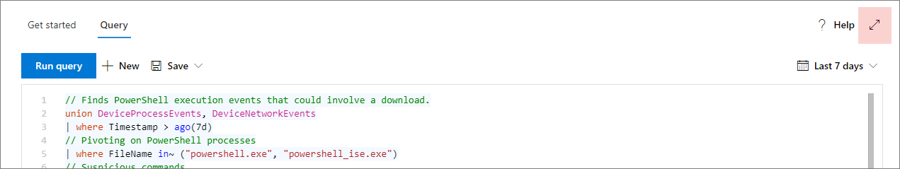
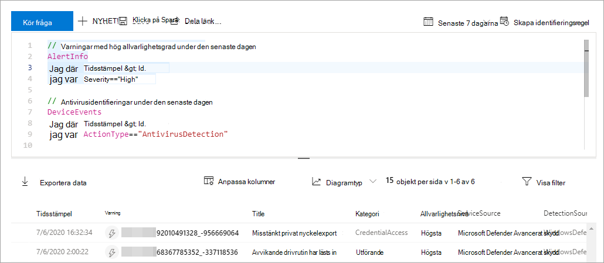
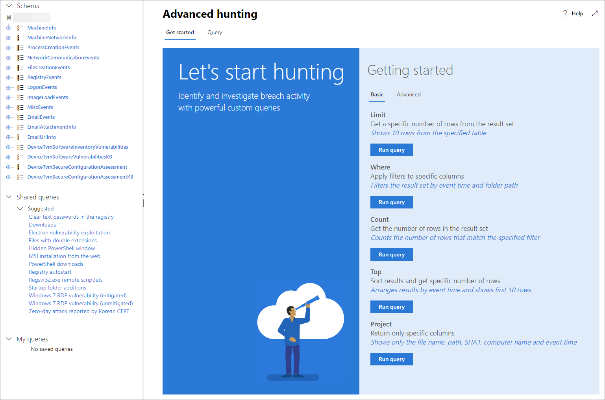

# <a name="learn-the-advanced-hunting-query-language"></a><span data-ttu-id="a006f-104">Lär dig mer om det avancerade frågespråket</span><span class="sxs-lookup"><span data-stu-id="a006f-104">Learn the advanced hunting query language</span></span>

[!INCLUDE [Microsoft 365 Defender rebranding](../includes/microsoft-defender.md)]


<span data-ttu-id="a006f-105">**Gäller för:**</span><span class="sxs-lookup"><span data-stu-id="a006f-105">**Applies to:**</span></span>
- <span data-ttu-id="a006f-106">Microsoft 365 Defender</span><span class="sxs-lookup"><span data-stu-id="a006f-106">Microsoft 365 Defender</span></span>

<span data-ttu-id="a006f-107">Avancerad jakt är baserat på [Kusto frågespråk](https://docs.microsoft.com/azure/kusto/query/).</span><span class="sxs-lookup"><span data-stu-id="a006f-107">Advanced hunting is based on the [Kusto query language](https://docs.microsoft.com/azure/kusto/query/).</span></span> <span data-ttu-id="a006f-108">Du kan använda Kusto-operatorer och-uttryck för att skapa frågor som visar information i ett specialiserat [schema](advanced-hunting-schema-tables.md).</span><span class="sxs-lookup"><span data-stu-id="a006f-108">You can use Kusto operators and statements to construct queries that locate information in a specialized [schema](advanced-hunting-schema-tables.md).</span></span> <span data-ttu-id="a006f-109">Kör den första frågan för att förstå de här begreppen bättre.</span><span class="sxs-lookup"><span data-stu-id="a006f-109">To understand these concepts better, run your first query.</span></span>

## <a name="try-your-first-query"></a><span data-ttu-id="a006f-110">Prova den första frågan</span><span class="sxs-lookup"><span data-stu-id="a006f-110">Try your first query</span></span>

<span data-ttu-id="a006f-111">I Microsoft 365 säkerhets Center går du till **jakt** för att köra den första frågan.</span><span class="sxs-lookup"><span data-stu-id="a006f-111">In Microsoft 365 security center, go to **Hunting** to run your first query.</span></span> <span data-ttu-id="a006f-112">Använd följande exempel:</span><span class="sxs-lookup"><span data-stu-id="a006f-112">Use the following example:</span></span>

```kusto
// Finds PowerShell execution events that could involve a download
union DeviceProcessEvents, DeviceNetworkEvents
| where Timestamp > ago(7d)
// Pivoting on PowerShell processes
| where FileName in~ ("powershell.exe", "powershell_ise.exe")
// Suspicious commands
| where ProcessCommandLine has_any("WebClient",
 "DownloadFile",
 "DownloadData",
 "DownloadString",
"WebRequest",
"Shellcode",
"http",
"https")
| project Timestamp, DeviceName, InitiatingProcessFileName, InitiatingProcessCommandLine, 
FileName, ProcessCommandLine, RemoteIP, RemoteUrl, RemotePort, RemoteIPType
| top 100 by Timestamp
```

<span data-ttu-id="a006f-113">**[Kör den här frågan i avancerad jakt](https://security.microsoft.com/hunting?query=H4sIAAAAAAAEAI2TW0sCURSF93PQfxh8Moisp956yYIgQtLoMaYczJpbzkkTpN_et_dcdPQkcpjbmrXXWftyetKTQG5lKqmMpeB9IJksJJKZDOWdZ8wKeP5wvcm3OLgZbMXmXCmIxjnYIfcAVgYvRi8w3TnfsXEDGAG47pCCZXyP5ViO4KeNbt-Up-hEuJmB6lvButnY8XSL-cDl0M2I-GwxVX8Fe2H5zMzHiKjEVB0eEsnBrszfBIWuXOLrxCJ7VqEBfM3DWUYTkNKrv1p5y3X0jwetemzOQ_NSVuuXZ1c6aNTKRaN8VvWhY9n7OS-o6J5r7mYeQypdEKc1m1qfiqpjCSuspsDntt2J61bEvTlXls5AgQfFl5bHM_gr_BhO2RF1rztoBv2tWahrso_TtzkL93KGMGZVr2pe7eWR-xeZl91f_113UOsx3nDR4Y9j5R6kaCq8ajr_YWfFeedsd27L7it-Z6dAZyxsJq1d9-2ZOSzK3y2NVd8-zUPjtZaJnYsIH4Md7AmdeAcd2Cl1XoURc5PzXlfU8U9P54WcswL6t_TW9Q__qX-xygQAAA&runQuery=true&timeRangeId=week)**</span><span class="sxs-lookup"><span data-stu-id="a006f-113">**[Run this query in advanced hunting](https://security.microsoft.com/hunting?query=H4sIAAAAAAAEAI2TW0sCURSF93PQfxh8Moisp956yYIgQtLoMaYczJpbzkkTpN_et_dcdPQkcpjbmrXXWftyetKTQG5lKqmMpeB9IJksJJKZDOWdZ8wKeP5wvcm3OLgZbMXmXCmIxjnYIfcAVgYvRi8w3TnfsXEDGAG47pCCZXyP5ViO4KeNbt-Up-hEuJmB6lvButnY8XSL-cDl0M2I-GwxVX8Fe2H5zMzHiKjEVB0eEsnBrszfBIWuXOLrxCJ7VqEBfM3DWUYTkNKrv1p5y3X0jwetemzOQ_NSVuuXZ1c6aNTKRaN8VvWhY9n7OS-o6J5r7mYeQypdEKc1m1qfiqpjCSuspsDntt2J61bEvTlXls5AgQfFl5bHM_gr_BhO2RF1rztoBv2tWahrso_TtzkL93KGMGZVr2pe7eWR-xeZl91f_113UOsx3nDR4Y9j5R6kaCq8ajr_YWfFeedsd27L7it-Z6dAZyxsJq1d9-2ZOSzK3y2NVd8-zUPjtZaJnYsIH4Md7AmdeAcd2Cl1XoURc5PzXlfU8U9P54WcswL6t_TW9Q__qX-xygQAAA&runQuery=true&timeRangeId=week)**</span></span>

### <a name="describe-the-query-and-specify-the-tables-to-search"></a><span data-ttu-id="a006f-114">Beskriv frågan och ange vilka tabeller som ska sökas igenom</span><span class="sxs-lookup"><span data-stu-id="a006f-114">Describe the query and specify the tables to search</span></span>
<span data-ttu-id="a006f-115">En kort kommentar har lagts till i början av frågan för att beskriva vad den är för.</span><span class="sxs-lookup"><span data-stu-id="a006f-115">A short comment has been added to the beginning of the query to describe what it is for.</span></span> <span data-ttu-id="a006f-116">Den här kommentaren hjälper dig om du senare bestämmer dig för att spara frågan och dela den med andra i organisationen.</span><span class="sxs-lookup"><span data-stu-id="a006f-116">This comment helps if you later decide to save the query and share it with others in your organization.</span></span> 

```kusto
// Finds PowerShell execution events that could involve a download
```

<span data-ttu-id="a006f-117">Frågan börjar normalt med ett tabell namn följt av flera element som börjar med ett vertikalstreck ( `|` ).</span><span class="sxs-lookup"><span data-stu-id="a006f-117">The query itself will typically start with a table name followed by several elements that start with a pipe (`|`).</span></span> <span data-ttu-id="a006f-118">I det här exemplet börjar vi med att skapa en union av två tabeller  `DeviceProcessEvents` och `DeviceNetworkEvents` lägga till piped-element efter behov.</span><span class="sxs-lookup"><span data-stu-id="a006f-118">In this example, we start by creating a union of two tables,  `DeviceProcessEvents` and `DeviceNetworkEvents`, and add piped elements as needed.</span></span>

```kusto
union DeviceProcessEvents, DeviceNetworkEvents
```
### <a name="set-the-time-range"></a><span data-ttu-id="a006f-119">Ange tidsintervall</span><span class="sxs-lookup"><span data-stu-id="a006f-119">Set the time range</span></span>
<span data-ttu-id="a006f-120">Det första piped-elementet är ett tids filter som är begränsat till de föregående sju dagarna.</span><span class="sxs-lookup"><span data-stu-id="a006f-120">The first piped element is a time filter scoped to the previous seven days.</span></span> <span data-ttu-id="a006f-121">Om du begränsar tidsintervallet ser du till att frågor fungerar bra, returnerar hanterbara resultat och inte tids gräns.</span><span class="sxs-lookup"><span data-stu-id="a006f-121">Limiting the time range helps ensure that queries perform well, return manageable results, and don't time out.</span></span>

```kusto
| where Timestamp > ago(7d)
```

### <a name="check-specific-processes"></a><span data-ttu-id="a006f-122">Kontrol lera specifika processer</span><span class="sxs-lookup"><span data-stu-id="a006f-122">Check specific processes</span></span>
<span data-ttu-id="a006f-123">Tidsintervallet följs omedelbart av en sökning efter process fil namn som representerar PowerShell-programmet.</span><span class="sxs-lookup"><span data-stu-id="a006f-123">The time range is immediately followed by a search for process file names representing the PowerShell application.</span></span>

```kusto
// Pivoting on PowerShell processes
| where FileName in~ ("powershell.exe", "powershell_ise.exe")
```

### <a name="search-for-specific-command-strings"></a><span data-ttu-id="a006f-124">Sök efter specifika kommando strängar</span><span class="sxs-lookup"><span data-stu-id="a006f-124">Search for specific command strings</span></span>
<span data-ttu-id="a006f-125">Därefter söker frågan efter strängar i kommando rader som vanligt vis används för att ladda ned filer med PowerShell.</span><span class="sxs-lookup"><span data-stu-id="a006f-125">Afterwards, the query looks for strings in command lines that are typically used to download files using PowerShell.</span></span>

```kusto
// Suspicious commands
| where ProcessCommandLine has_any("WebClient",
    "DownloadFile",
    "DownloadData",
    "DownloadString",
    "WebRequest",
    "Shellcode",
    "http",
    "https")
```

### <a name="customize-result-columns-and-length"></a><span data-ttu-id="a006f-126">Anpassa resultat kolumner och längd</span><span class="sxs-lookup"><span data-stu-id="a006f-126">Customize result columns and length</span></span> 
<span data-ttu-id="a006f-127">Nu när frågan tydligt identifierar de data som du vill hitta kan du ange hur resultatet ska se ut.</span><span class="sxs-lookup"><span data-stu-id="a006f-127">Now that your query clearly identifies the data you want to locate, you can define what the results look like.</span></span> <span data-ttu-id="a006f-128">`project` Returnerar specifika kolumner och `top` begränsar antalet resultat.</span><span class="sxs-lookup"><span data-stu-id="a006f-128">`project` returns specific columns, and `top` limits the number of results.</span></span> <span data-ttu-id="a006f-129">Dessa operatörer ser till att resultaten är välformaterade och rimligt stora och lätta att bearbeta.</span><span class="sxs-lookup"><span data-stu-id="a006f-129">These operators help ensure the results are well-formatted and reasonably large and easy to process.</span></span>

```kusto
| project Timestamp, DeviceName, InitiatingProcessFileName, InitiatingProcessCommandLine, 
FileName, ProcessCommandLine, RemoteIP, RemoteUrl, RemotePort, RemoteIPType
| top 100 by Timestamp
```

<span data-ttu-id="a006f-130">Välj **Kör fråga** för att visa resultatet.</span><span class="sxs-lookup"><span data-stu-id="a006f-130">Select **Run query** to see the results.</span></span> <span data-ttu-id="a006f-131">Använd ikonen Expandera längst upp till höger i Frågeredigeraren för att fokusera på frågan och resultaten.</span><span class="sxs-lookup"><span data-stu-id="a006f-131">Use the expand icon at the top right of the query editor to focus on your hunting query and the results.</span></span> 



>[!TIP]
><span data-ttu-id="a006f-133">Du kan visa frågeresultat som diagram och snabbt justera filter.</span><span class="sxs-lookup"><span data-stu-id="a006f-133">You can view query results as charts and quickly adjust filters.</span></span> <span data-ttu-id="a006f-134">[Läs mer om hur du arbetar med frågeresultat](advanced-hunting-query-results.md)</span><span class="sxs-lookup"><span data-stu-id="a006f-134">For guidance, [read about working with query results](advanced-hunting-query-results.md)</span></span>

## <a name="learn-common-query-operators"></a><span data-ttu-id="a006f-135">Lär dig vanliga frågor</span><span class="sxs-lookup"><span data-stu-id="a006f-135">Learn common query operators</span></span>

<span data-ttu-id="a006f-136">Du har precis kört den första frågan och har en allmän uppfattning om dess komponenter.</span><span class="sxs-lookup"><span data-stu-id="a006f-136">You've just run your first query and have a general idea of its components.</span></span> <span data-ttu-id="a006f-137">Det är dags att gå tillbaka något och lära dig grunderna.</span><span class="sxs-lookup"><span data-stu-id="a006f-137">It's time to backtrack slightly and learn some basics.</span></span> <span data-ttu-id="a006f-138">Kusto Query-språk som används i Advanced jakt har stöd för en rad operatörer, bland annat följande.</span><span class="sxs-lookup"><span data-stu-id="a006f-138">The Kusto query language used by advanced hunting supports a range of operators, including the following common ones.</span></span>

| <span data-ttu-id="a006f-139">Ansvaret</span><span class="sxs-lookup"><span data-stu-id="a006f-139">Operator</span></span> | <span data-ttu-id="a006f-140">Beskrivning och användning</span><span class="sxs-lookup"><span data-stu-id="a006f-140">Description and usage</span></span> |
|--|--|
| `where` | <span data-ttu-id="a006f-141">Filtrera en tabell till den del av rader som uppfyller ett predikat.</span><span class="sxs-lookup"><span data-stu-id="a006f-141">Filter a table to the subset of rows that satisfy a predicate.</span></span> |
| `summarize` | <span data-ttu-id="a006f-142">Skapa en tabell som aggregerar innehållet i inmatnings tabellen.</span><span class="sxs-lookup"><span data-stu-id="a006f-142">Produce a table that aggregates the content of the input table.</span></span> |
| `join` | <span data-ttu-id="a006f-143">Sammanfoga raderna i två tabeller för att skapa en ny tabell genom att matcha värden för de angivna kolumnerna från respektive tabell.</span><span class="sxs-lookup"><span data-stu-id="a006f-143">Merge the rows of two tables to form a new table by matching values of the specified column(s) from each table.</span></span> |
| `count` | <span data-ttu-id="a006f-144">Returnera antalet poster i Indataposten.</span><span class="sxs-lookup"><span data-stu-id="a006f-144">Return the number of records in the input record set.</span></span> |
| `top` | <span data-ttu-id="a006f-145">Returnera de första N posterna sorterade efter de angivna kolumnerna.</span><span class="sxs-lookup"><span data-stu-id="a006f-145">Return the first N records sorted by the specified columns.</span></span> |
| `limit` | <span data-ttu-id="a006f-146">Gå tillbaka till angivet antal rader.</span><span class="sxs-lookup"><span data-stu-id="a006f-146">Return up to the specified number of rows.</span></span> |
| `project` | <span data-ttu-id="a006f-147">Markera kolumnerna som du vill ta med, byta namn på eller ta bort och infoga nya beräknade kolumner.</span><span class="sxs-lookup"><span data-stu-id="a006f-147">Select the columns to include, rename or drop, and insert new computed columns.</span></span> |
| `extend` | <span data-ttu-id="a006f-148">Skapa beräknade kolumner och Lägg till dem i resultatet.</span><span class="sxs-lookup"><span data-stu-id="a006f-148">Create calculated columns and append them to the result set.</span></span> |
| `makeset` |  <span data-ttu-id="a006f-149">Returnera en dynamisk (JSON) matris av uppsättningen med distinkta värden som uttryck används i gruppen.</span><span class="sxs-lookup"><span data-stu-id="a006f-149">Return a dynamic (JSON) array of the set of distinct values that Expr takes in the group.</span></span> |
| `find` | <span data-ttu-id="a006f-150">Hitta rader som matchar ett predikat i en uppsättning tabeller.</span><span class="sxs-lookup"><span data-stu-id="a006f-150">Find rows that match a predicate across a set of tables.</span></span> |

<span data-ttu-id="a006f-151">Om du vill se ett exempel på dessa operatörer kan du köra det från avsnittet **komma igång** i avancerad jakt.</span><span class="sxs-lookup"><span data-stu-id="a006f-151">To see a live example of these operators, run them from the **Get started** section in advanced hunting.</span></span>

## <a name="understand-data-types"></a><span data-ttu-id="a006f-152">Förstå data typer</span><span class="sxs-lookup"><span data-stu-id="a006f-152">Understand data types</span></span>

<span data-ttu-id="a006f-153">Advanced jakt stöder Kusto-datatyper, inklusive följande vanliga typer:</span><span class="sxs-lookup"><span data-stu-id="a006f-153">Advanced hunting supports Kusto data types, including the following common types:</span></span>

| <span data-ttu-id="a006f-154">Datatyp</span><span class="sxs-lookup"><span data-stu-id="a006f-154">Data type</span></span> | <span data-ttu-id="a006f-155">Beskrivningar och frågor</span><span class="sxs-lookup"><span data-stu-id="a006f-155">Description and query implications</span></span> |
|--|--|
| `datetime` | <span data-ttu-id="a006f-156">Data-och tidsinformation representerar vanligt vis händelse tidsstämplar.</span><span class="sxs-lookup"><span data-stu-id="a006f-156">Data and time information typically representing event timestamps.</span></span> [<span data-ttu-id="a006f-157">Se datetime-format som stöds</span><span class="sxs-lookup"><span data-stu-id="a006f-157">See supported datetime formats</span></span>](https://docs.microsoft.com/azure/data-explorer/kusto/query/scalar-data-types/datetime) |
| `string` | <span data-ttu-id="a006f-158">Tecken sträng i UTF-8 som omges av enkla citat tecken ( `'` ) eller dubbla citat tecken ( `"` ).</span><span class="sxs-lookup"><span data-stu-id="a006f-158">Character string in UTF-8 enclosed in single quotes (`'`) or double quotes (`"`).</span></span> [<span data-ttu-id="a006f-159">Läs mer om strängar</span><span class="sxs-lookup"><span data-stu-id="a006f-159">Read more about strings</span></span>](https://docs.microsoft.com/azure/data-explorer/kusto/query/scalar-data-types/string) |
| `bool` | <span data-ttu-id="a006f-160">Denna datatyp stöder `true` eller `false` lägen.</span><span class="sxs-lookup"><span data-stu-id="a006f-160">This data type supports `true` or `false` states.</span></span> [<span data-ttu-id="a006f-161">Se litteraler och operatorer som stöds</span><span class="sxs-lookup"><span data-stu-id="a006f-161">See supported literals and operators</span></span>](https://docs.microsoft.com/azure/data-explorer/kusto/query/scalar-data-types/bool) |
| `int` | <span data-ttu-id="a006f-162">32-bitars heltal</span><span class="sxs-lookup"><span data-stu-id="a006f-162">32-bit integer</span></span>  |
| `long` | <span data-ttu-id="a006f-163">64-bitars heltal</span><span class="sxs-lookup"><span data-stu-id="a006f-163">64-bit integer</span></span> |

<span data-ttu-id="a006f-164">Mer information om de här data typerna finns i [om Kusto skalära data typer](https://docs.microsoft.com/azure/data-explorer/kusto/query/scalar-data-types/).</span><span class="sxs-lookup"><span data-stu-id="a006f-164">To learn more about these data types, [read about Kusto scalar data types](https://docs.microsoft.com/azure/data-explorer/kusto/query/scalar-data-types/).</span></span>

## <a name="get-help-as-you-write-queries"></a><span data-ttu-id="a006f-165">Få hjälp medan du skriver frågor</span><span class="sxs-lookup"><span data-stu-id="a006f-165">Get help as you write queries</span></span>
<span data-ttu-id="a006f-166">Dra nytta av följande funktioner när du vill skriva frågor snabbare:</span><span class="sxs-lookup"><span data-stu-id="a006f-166">Take advantage of the following functionality to write queries faster:</span></span>
- <span data-ttu-id="a006f-167">**Autoföreslå** – när du skriver frågor kan du med hjälp av en avancerad jakt förslag från IntelliSense.</span><span class="sxs-lookup"><span data-stu-id="a006f-167">**Autosuggest** —as you write queries, advanced hunting provides suggestions from IntelliSense.</span></span> 
- <span data-ttu-id="a006f-168">**Schema träd** – en schema representation som innehåller listan med tabeller och deras kolumner visas bredvid arbets ytan.</span><span class="sxs-lookup"><span data-stu-id="a006f-168">**Schema tree** —a schema representation that includes the list of tables and their columns is provided next to your working area.</span></span> <span data-ttu-id="a006f-169">För mer information, Hovra över ett objekt.</span><span class="sxs-lookup"><span data-stu-id="a006f-169">For more information, hover over an item.</span></span> <span data-ttu-id="a006f-170">Dubbelklicka på ett objekt om du vill infoga det i Frågeredigeraren.</span><span class="sxs-lookup"><span data-stu-id="a006f-170">Double-click an item to insert it to the query editor.</span></span>
- <span data-ttu-id="a006f-171">**[Schema referens](advanced-hunting-schema-tables.md#get-schema-information-in-the-security-center)** – i-Portal referens med tabell-och kolumn beskrivningar samt de händelse typer som stöds `ActionType` och urvals frågor</span><span class="sxs-lookup"><span data-stu-id="a006f-171">**[Schema reference](advanced-hunting-schema-tables.md#get-schema-information-in-the-security-center)** —in-portal reference with table and column descriptions as well as supported event types (`ActionType` values) and sample queries</span></span>

## <a name="work-with-multiple-queries-in-the-editor"></a><span data-ttu-id="a006f-172">Arbeta med flera frågor i redigeraren</span><span class="sxs-lookup"><span data-stu-id="a006f-172">Work with multiple queries in the editor</span></span>
<span data-ttu-id="a006f-173">Du kan använda Frågeredigeraren för att experimentera med flera frågor.</span><span class="sxs-lookup"><span data-stu-id="a006f-173">You can use the query editor to experiment with multiple queries.</span></span> <span data-ttu-id="a006f-174">Så här använder du flera frågor:</span><span class="sxs-lookup"><span data-stu-id="a006f-174">To use multiple queries:</span></span>

- <span data-ttu-id="a006f-175">Avgränsa varje fråga med en tom rad.</span><span class="sxs-lookup"><span data-stu-id="a006f-175">Separate each query with an empty line.</span></span>
- <span data-ttu-id="a006f-176">Placera markören på en del av en fråga för att välja frågan innan den körs.</span><span class="sxs-lookup"><span data-stu-id="a006f-176">Place the cursor on any part of a query to select that query before running it.</span></span> <span data-ttu-id="a006f-177">Detta kommer bara att köra den valda frågan.</span><span class="sxs-lookup"><span data-stu-id="a006f-177">This will run only the selected query.</span></span> <span data-ttu-id="a006f-178">Om du vill köra en ny fråga flyttar du markören i enlighet med den och väljer **Kör fråga**.</span><span class="sxs-lookup"><span data-stu-id="a006f-178">To run another query, move the cursor accordingly and select **Run query**.</span></span>



## <a name="use-sample-queries"></a><span data-ttu-id="a006f-180">Använda exempel frågor</span><span class="sxs-lookup"><span data-stu-id="a006f-180">Use sample queries</span></span>

<span data-ttu-id="a006f-181">Avsnittet **komma igång** innehåller några enkla frågor med vanliga operatorer.</span><span class="sxs-lookup"><span data-stu-id="a006f-181">The **Get started** section provides a few simple queries using commonly used operators.</span></span> <span data-ttu-id="a006f-182">Prova att köra de här frågorna och gör små ändringar i dem.</span><span class="sxs-lookup"><span data-stu-id="a006f-182">Try running these queries and making small modifications to them.</span></span>



>[!NOTE]
><span data-ttu-id="a006f-184">Förutom de grundläggande fråge exemplen kan du även komma åt [delade frågor](advanced-hunting-shared-queries.md) för speciella scenarier med hot.</span><span class="sxs-lookup"><span data-stu-id="a006f-184">Apart from the basic query samples, you can also access [shared queries](advanced-hunting-shared-queries.md) for specific threat hunting scenarios.</span></span> <span data-ttu-id="a006f-185">Utforska de delade frågorna på vänster sida av sidan eller i [GitHub](https://aka.ms/hunting-queries).</span><span class="sxs-lookup"><span data-stu-id="a006f-185">Explore the shared queries on the left side of the page or the [GitHub query repository](https://aka.ms/hunting-queries).</span></span>

## <a name="access-query-language-documentation"></a><span data-ttu-id="a006f-186">Dokumentation för Access-frågespråk</span><span class="sxs-lookup"><span data-stu-id="a006f-186">Access query language documentation</span></span>

<span data-ttu-id="a006f-187">Mer information om Kusto-frågespråk och operatorer som stöds finns i [dokumentationen om Kusto-språk](https://docs.microsoft.com/azure/kusto/query/).</span><span class="sxs-lookup"><span data-stu-id="a006f-187">For more information on Kusto query language and supported operators, see [Kusto query language documentation](https://docs.microsoft.com/azure/kusto/query/).</span></span>

## <a name="related-topics"></a><span data-ttu-id="a006f-188">Relaterade ämnen</span><span class="sxs-lookup"><span data-stu-id="a006f-188">Related topics</span></span>
- [<span data-ttu-id="a006f-189">Översikt över avancerad jakt</span><span class="sxs-lookup"><span data-stu-id="a006f-189">Advanced hunting overview</span></span>](advanced-hunting-overview.md)
- [<span data-ttu-id="a006f-190">Arbeta med frågeresultat</span><span class="sxs-lookup"><span data-stu-id="a006f-190">Work with query results</span></span>](advanced-hunting-query-results.md)
- [<span data-ttu-id="a006f-191">Använda delade frågor</span><span class="sxs-lookup"><span data-stu-id="a006f-191">Use shared queries</span></span>](advanced-hunting-shared-queries.md)
- [<span data-ttu-id="a006f-192">Jaga över olika enheter, e-postmeddelanden, appar och identiteter</span><span class="sxs-lookup"><span data-stu-id="a006f-192">Hunt across devices, emails, apps, and identities</span></span>](advanced-hunting-query-emails-devices.md)
- [<span data-ttu-id="a006f-193">Förstå schemat</span><span class="sxs-lookup"><span data-stu-id="a006f-193">Understand the schema</span></span>](advanced-hunting-schema-tables.md)
- [<span data-ttu-id="a006f-194">Använda metodtips för frågor</span><span class="sxs-lookup"><span data-stu-id="a006f-194">Apply query best practices</span></span>](advanced-hunting-best-practices.md)
