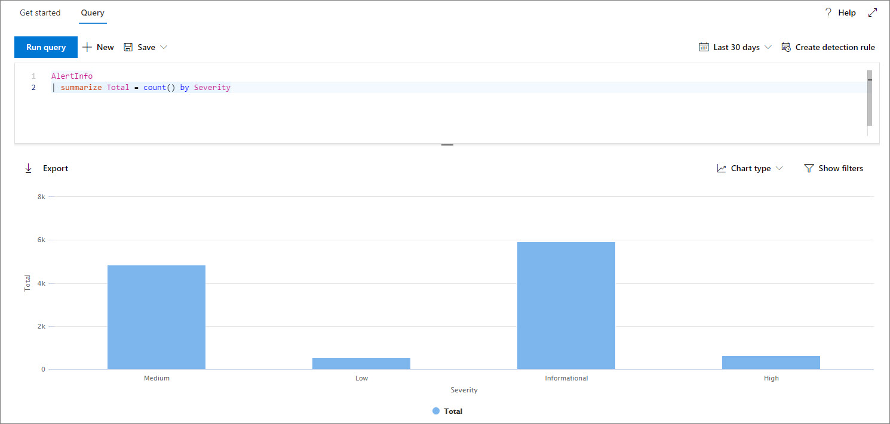

# <a name="work-with-advanced-hunting-query-results"></a>Arbeta med resultat från avancerad jakt fråga

[!INCLUDE [Microsoft 365 Defender rebranding](../includes/microsoft-defender.md)]


**Gäller för:**
- Microsoft 365 Defender

[!INCLUDE [Prerelease information](../includes/prerelease.md)]

Du kan också använda frågeresultatet för att få mer detaljerad information och undersöka specifika aktiviteter och indikatorer, samtidigt som du skapar frågor för de [avancerade jakt](advanced-hunting-overview.md) frågorna. Du kan utföra följande åtgärder i frågeresultatet:

- Visa resultat som en tabell eller ett diagram
- Exportera tabeller och diagram
- Öka detalj nivån till detaljerad entitetsinformation
- Justera dina frågor direkt från resultaten eller använda filter

## <a name="view-query-results-as-a-table-or-chart"></a>Visa frågeresultat som en tabell eller ett diagram
Som standard visar Advanced jakt frågeresultat som tabell data. Du kan också visa samma data som ett diagram. Avancerad jakt stöder följande vyer:

| Vytyp | Beskrivning |
| -- | -- |
| **Tabell** | Visar frågeresultaten i tabell format |
| **Stapeldiagram** | Återger en serie unika element på x-axeln som lodräta staplar vars höjder representerar numeriska värden från ett annat fält |
| **Staplat stapeldiagram** | Återger en serie unika element på x-axeln som staplade lodräta staplar vars höjder representerar numeriska värden från ett eller flera andra fält |
| **Cirkel diagram** | Återger avsnitts pajer som representerar unika objekt. Storleken på varje cirkel representerar numeriska värden från ett annat fält. |
| **Ring diagram** | Återger avsnitts bågar som representerar unika objekt. Längden på varje båge representerar numeriska värden från ett annat fält. |
| **Linje diagram** | Ritar numeriska värden för en serie unika objekt och kopplar de ritade värdena |
| **Punkt diagram** | Ritar numeriska värden för en serie unika objekt |
| **Ytdiagram** | Ritar numeriska värden för en serie unika element och fyller avsnitten nedanför de uppritade värdena |

### <a name="construct-queries-for-effective-charts"></a>Skapa frågor för effektiva diagram
Vid åter givning av diagram identifieras kolumner av intresse automatiskt och de numeriska värdena till aggregation. För att få meningsfulla diagram skapar du dina frågor för att returnera de specifika värden som du vill visa. Här är några exempel frågor och resulterande diagram.

#### <a name="alerts-by-severity"></a>Aviseringar efter allvarlighets grad
Använd `summarize` operatorn för att få ett numeriskt antal värden som du vill visa i diagrammet. I frågan nedan används `summarize` operatorn för att få antalet aviseringar efter allvarlighets grad.

```kusto
AlertInfo
| summarize Total = count() by Severity
```
När du återger resultaten visas varje allvarlighets värde som en separat kolumn i ett stapeldiagram:


 *Frågeresultat för aviseringar efter allvarlighets grad visas som ett stapeldiagram*

#### <a name="alert-severity-by-operating-system"></a>Aviserings allvarlighets grad per operativ system
Du kan också använda `summarize` operatorn för att förbereda resultat för diagram värden från flera fält. Du kanske till exempel vill förstå hur varnings allvarlighets grader distribueras för olika operativ system (OS). 

Frågan nedan använder en `join` operator för att hämta OS-information från `DeviceInfo` tabellen och använder sedan `summarize` för att räkna värden i både `OSPlatform` `Severity` kolumnerna och.

```kusto
AlertInfo
| join AlertEvidence on AlertId
| join DeviceInfo on DeviceId
| summarize Count = count() by OSPlatform, Severity 
```
De här resultaten är bäst visualiserade med ett staplat stapeldiagram:


 *Frågeresultat för aviseringar via OS och allvarlighets grad som visas som ett staplat diagram*

#### <a name="phishing-emails-across-top-ten-sender-domains"></a>Nät fiske meddelanden via de tio främsta avsändarenas domäner
Om du arbetar med en lista med värden som inte är begränsade kan du använda `Top` operatorn för att endast visa de värden som har flest förekomster. Om du till exempel vill få de tio främsta avsändare-domänerna med flest nätfiske-meddelanden använder du frågan nedan:

```kusto
EmailEvents
| where PhishFilterVerdict == "Phish"
| summarize Count = count() by SenderFromDomain
| top 10 by Count
```
Använd vyn cirkel diagram för att Visa fördelningen effektivt i de översta domänerna:


 *visar fördelningen av nät fiske meddelanden via överdelen översändare*

#### <a name="file-activities-over-time"></a>Fil aktiviteter över tid
Med `summarize` operatorn med `bin()` funktionen kan du söka efter händelser med en viss indikator över tiden. Frågan nedan räknar händelser som berör filen `invoice.doc` med 30 minuters mellanrum för att Visa mellanvara i en aktivitet som är relaterad till filen:

```kusto
AppFileEvents
| union DeviceFileEvents
| where FileName == "invoice.doc"
| summarize FileCount = count() by bin(Timestamp, 30m)
```
Linje diagrammet nedan tydligt markerar tids perioder med mer aktivitet som berör `invoice.doc` : 


 *diagram med linjer som visar antalet händelser som rör en fil över tid*


## <a name="export-tables-and-charts"></a>Exportera tabeller och diagram
När du har kört en fråga väljer du **Exportera** för att spara resultatet i en lokal fil. Den valda vyn bestämmer hur resultatet ska exporteras:

- **Tabellvy** – frågeresultaten exporteras i tabell form som en Microsoft Excel-arbetsbok
- **Ett diagram** – frågeresultaten exporteras som en JPEG-bild av det återgivna diagrammet

## <a name="drill-down-from-query-results"></a>Öka detalj nivån från frågeresultat
Om du snabbt vill inspektera en post i frågeresultatet markerar du motsvarande rad för att öppna panelen **Granska post** . Panelen innehåller följande information baserad på den valda posten:

- **Till gångar** – sammanfattad vy över huvud till gångar (post lådor, enheter och användare) som finns i posten, förföljda uppgifter, till exempel risk-och exponerings nivåer
- **Process träd** – genererat för poster med process information och som berikas med tillgängliga kontext uppgifter; i allmänhet kan frågor som returnerar fler kolumner leda till bättre process träd.
- **All information** – alla värden från kolumnerna i posten  


Om du vill visa mer information om en viss enhet i frågeresultatet, till exempel en dator, en fil, en användare, en IP-adress eller en URL, väljer du enhetens ID för att öppna en detaljerad profil sida för den enheten.

## <a name="tweak-your-queries-from-the-results"></a>Justera dina frågor från resultaten
Högerklicka på ett värde i resultatet för att snabbt förbättra din fråga. Du kan använda alternativen för att:

- Leta tydligt efter det markerade värdet ( `==` )
- Exkludera det markerade värdet från frågan ( `!=` )
- Få mer avancerade operatorer för att lägga till värdet i frågan, till `contains` exempel `starts with` och `ends with` 


## <a name="filter-the-query-results"></a>Filtrera frågeresultatet
De filter som visas till höger ger en sammanfattning av resultatet. Varje kolumn har ett eget avsnitt med en lista med de DISTINCT-värden som hittas för den kolumnen och antalet förekomster.

Förfina frågan genom att välja `+` knapparna eller `-` på de värden som du vill inkludera eller exkludera och sedan välja **Kör fråga**.


När du har tillämpat filtret för att ändra frågan och sedan kör frågan uppdateras resultaten.

## <a name="related-topics"></a>Relaterade ämnen
- [Översikt över avancerad jakt](advanced-hunting-overview.md)
- [Lär dig frågespråket](advanced-hunting-query-language.md)
- [Använda delade frågor](advanced-hunting-shared-queries.md)
- [Jaga över olika enheter, e-postmeddelanden, appar och identiteter](advanced-hunting-query-emails-devices.md)
- [Förstå schemat](advanced-hunting-schema-tables.md)
- [Använda metodtips för frågor](advanced-hunting-best-practices.md)
- [Översikt över anpassade identifieringar](custom-detections-overview.md)
