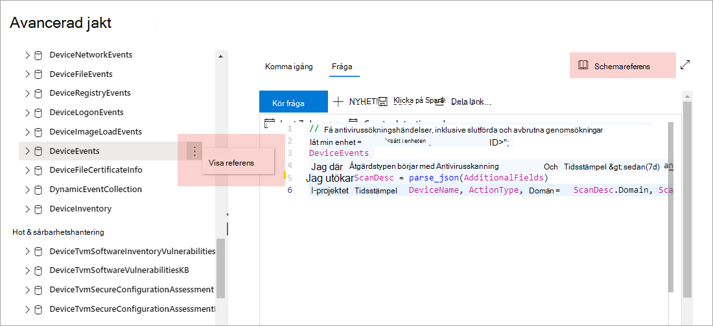

# Förstå det avancerade jakt schema

[!INCLUDE [Microsoft 365 Defender rebranding](../includes/microsoft-defender.md)]

**Gäller för:**
- Microsoft 365 Defender

[!INCLUDE [Prerelease information](../includes/prerelease.md)]

Det [avancerade jakt](advanced-hunting-overview.md) schemat består av flera tabeller som innehåller händelse information eller information om enheter, aviseringar, identiteter och andra entitetstyper. För att effektivt skapa frågor som sträcker sig över flera tabeller måste du förstå tabellerna och kolumnerna i det avancerade jakt schemat.

## Hämta schema information i säkerhets Center
När du konstruerar frågor kan du använda den inbyggda schema referensen för att snabbt få följande information om varje tabell i schemat:

- Tabell **Beskrivning** – en typ av data i tabellen och källan till dessa data.
- **Kolumner** – alla kolumner i tabellen.
- **Åtgärds typer** – möjliga värden i `ActionType` kolumnen som representerar de händelse typer som stöds av tabellen. Det här är endast angivet för tabeller som innehåller händelse information.
- **Exempel fråga** – exempel på frågor som kan användas för att utnyttja tabellen.

### Komma åt schema referensen
Om du snabbt vill komma åt schema referensen markerar du kryss rutan **Visa referens** bredvid tabell namnet i schema representationen. Du kan också välja **schema referens** för att söka efter en tabell.   

 

## Lär dig hur schema tabellerna
I följande referens visas alla tabeller i schemat. Varje tabell namn länkar till en sida som beskriver kolumn namnen för tabellen. Tabell-och kolumn namn visas också i säkerhets Center som en del av schema presentationen på den avancerade jakt skärmen.

| Tabellnamn | Beskrivning |
|------------|-------------|
| **[AlertEvidence](advanced-hunting-alertevidence-table.md)** | Filer, IP-adresser, URL: er, användare eller enheter associerade med aviseringar |
| **[AlertInfo](advanced-hunting-alertinfo-table.md)** | Aviseringar från Microsoft Defender för slut punkt, Microsoft Defender för Office 365, Microsoft Cloud App Security och Microsoft Defender för identitet, inklusive allvarlighets information och kategorisering av hotet  |
| **[AppFileEvents](advanced-hunting-appfileevents-table.md)** | Filrelaterade aktiviteter i moln program och-tjänster |
| **[DeviceEvents](advanced-hunting-deviceevents-table.md)** | Flera händelse typer, inklusive händelser som utlöses av säkerhets kontroller som Windows Defender Antivirus och sårbarhets skydd |
| **[DeviceFileCertificateInfo](advanced-hunting-DeviceFileCertificateInfo-table.md)** | Certifikat information för signerade filer som hämtats från certifikat verifierings händelser för slut punkter |
| **[DeviceFileEvents](advanced-hunting-devicefileevents-table.md)** | Skapa, ändra och andra fil Systems händelser |
| **[DeviceImageLoadEvents](advanced-hunting-deviceimageloadevents-table.md)** | DLL laddar in händelser |
| **[DeviceInfo](advanced-hunting-deviceinfo-table.md)** | Maskin information, inklusive OS-information |
| **[DeviceLogonEvents](advanced-hunting-devicelogonevents-table.md)** | Inloggnings händelser och andra autentiseringsförsök för enheter |
| **[DeviceNetworkEvents](advanced-hunting-devicenetworkevents-table.md)** | Nätverks anslutning och relaterade händelser |
| **[DeviceNetworkInfo](advanced-hunting-devicenetworkinfo-table.md)** | Nätverks egenskaper för datorer, inklusive adaptrar, IP-och MAC-adresser samt anslutna nätverk och domäner |
| **[DeviceProcessEvents](advanced-hunting-deviceprocessevents-table.md)** | Skapa och relaterade händelser |
| **[DeviceRegistryEvents](advanced-hunting-deviceregistryevents-table.md)** | Skapa och ändra register poster |
| **[DeviceTvmSecureConfigurationAssessment](advanced-hunting-devicetvmsecureconfigurationassessment-table.md)** | Hot & sårbarhet hantera utvärderings händelser som visar status för olika säkerhetskonfigurationer på enheter |
| **[DeviceTvmSecureConfigurationAssessmentKB](advanced-hunting-devicetvmsecureconfigurationassessmentkb-table.md)** | Kunskaps bas för olika säkerhetskonfigurationer som används av hotet & sårbarhets hantering för att utvärdera enheter; inkluderar mappningar till olika standarder och benchmarks  |
| **[DeviceTvmSoftwareInventoryVulnerabilities](advanced-hunting-devicetvmsoftwareinventoryvulnerabilities-table.md)** | Inventering av program vara på enheter samt eventuella kända säkerhets problem i dessa program varu produkter |
| **[DeviceTvmSoftwareVulnerabilitiesKB](advanced-hunting-devicetvmsoftwarevulnerabilitieskb-table.md)** | Kunskaps basen för offentligt avgivna säkerhets problem, inklusive om en utnyttjande-kod är allmänt tillgänglig |
| **[EmailAttachmentInfo](advanced-hunting-emailattachmentinfo-table.md)** | Information om bifogade filer i e-postmeddelanden |
| **[EmailEvents](advanced-hunting-emailevents-table.md)** | Microsoft 365-e-posthändelser, inklusive händelser för e-postleverans och blockering |
| **[EmailPostDeliveryEvents](advanced-hunting-emailpostdeliveryevents-table.md)** | Säkerhets händelser som inträffar efter leverans efter att Microsoft 365 har levererat e-postmeddelandet till mottagar post lådan |
| **[EmailUrlInfo](advanced-hunting-emailurlinfo-table.md)** | Information om URL: er för e-postmeddelanden |
| **[IdentityDirectoryEvents](advanced-hunting-identitydirectoryevents-table.md)** | Händelser som berör en lokal domänkontrollant som kör Active Directory (AD). I den här tabellen beskrivs ett område med identitetsrelaterade händelser samt systemhändelser på domänkontrollanten. |
| **[IdentityInfo](advanced-hunting-identityinfo-table.md)** | Konto information från olika källor, inklusive Azure Active Directory |
| **[IdentityLogonEvents](advanced-hunting-identitylogonevents-table.md)** | Autentiseringsproblem för Active Directory och Microsoft Online-tjänster |
| **[IdentityQueryEvents](advanced-hunting-identityqueryevents-table.md)** | Fråge aktiviteter utförs mot Active Directory-objekt, till exempel användare, grupper, enheter och domäner |

## Relaterade ämnen
- [Översikt över avancerad jakt](advanced-hunting-overview.md)
- [Lär dig frågespråket](advanced-hunting-query-language.md)
- [Arbeta med frågeresultat](advanced-hunting-query-results.md)
- [Använda delade frågor](advanced-hunting-shared-queries.md)
- [Jaga över olika enheter, e-postmeddelanden, appar och identiteter](advanced-hunting-query-emails-devices.md)
- [Använda metodtips för frågor](advanced-hunting-best-practices.md)
