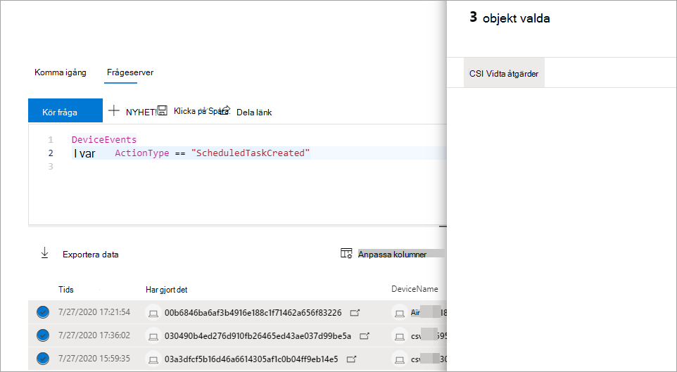

# Vidta åtgärder för avancerade frågeresultat för sökningTake action on advanced hunting query results

[!INCLUDE [Microsoft 365 Defender rebranding](../includes/microsoft-defender.md)]

**Gäller för:****Applies to:**
- Microsoft 365 DefenderMicrosoft 365 Defender

[!INCLUDE [Prerelease information](../includes/prerelease.md)]

Du kan snabbt innehålla hot eller hantera komprometterade tillgångar som du hittar på [avancerad](advanced-hunting-overview.md) sökning med hjälp av kraftfulla och omfattande åtgärdsalternativ.You can quickly contain threats or address compromised assets that you find in [advanced hunting](advanced-hunting-overview.md) using powerful and comprehensive action options. Med dessa alternativ kan du:With these options, you can:

- Vidta olika åtgärder på enheterTake various actions on devices
- Sätt filer i karantänQuarantine files

## Behörighet som krävsRequired permissions
För att kunna vidta åtgärder via avancerad sökning behöver du en roll i Microsoft Defender för Endpoint med behörighet att skicka [åtgärder på enheter.](https://docs.microsoft.com/windows/security/threat-protection/microsoft-defender-atp/user-roles#permission-options)To be able to take action through advanced hunting, you need a role in Microsoft Defender for Endpoint with [permissions to submit remediation actions on devices](https://docs.microsoft.com/windows/security/threat-protection/microsoft-defender-atp/user-roles#permission-options). Om du inte kan vidta någon åtgärd kan du kontakta en global administratör om att få följande behörighet:If you can't take action, contact a global administrator about getting the following permission:

*Aktiva åtgärder för > hantering av hot och sårbarhet – åtgärdshantering**Active remediation actions > Threat and vulnerability management - Remediation handling*

## Vidta olika åtgärder på enheterTake various actions on devices
Du kan vidta följande åtgärder på enheter som identifieras av `DeviceId` kolumnen i frågeresultat:You can take the following actions on devices identified by the `DeviceId` column in you query results:

- Isolera påverkade enheter som innehåller en smitta eller förhindra attacker från att röra sig frittIsolate affected devices to contain an infection or prevent attacks from moving laterally
- Samla in undersökningspaket för att få mer teknisk informationCollect investigation package to obtain more forensic information
- Kör en antivirussökning för att hitta och ta bort hot med de senaste säkerhetsintelligensuppdateringarnaRun an antivirus scan to find and remove threats using the latest security intelligence updates
- Initiera en automatiserad undersökning för att kontrollera och åtgärda hot på enheten och eventuellt andra enheter som påverkasInitiate an automated investigation to check and remediate threats on the device and possibly other affected devices
- Begränsa programkörningen till endast Microsoft-signerade körbara filer, förhindra efterföljande hotaktivitet genom skadlig kod eller andra körbara filer som inte är betroddaRestrict app execution to only Microsoft-signed executable files, preventing subsequent threat activity through malware or other untrusted executables

Mer information om hur dessa svarsåtgärder utförs via Microsoft Defender för Slutpunkt finns [i artikeln om svarsåtgärder på enheter.](https://docs.microsoft.com/windows/security/threat-protection/microsoft-defender-atp/respond-machine-alerts)To learn more about how these response actions are performed through Microsoft Defender for Endpoint, [read about response actions on devices](https://docs.microsoft.com/windows/security/threat-protection/microsoft-defender-atp/respond-machine-alerts).
   
## Sätt filer i karantänQuarantine files
Du kan distribuera *karantänåtgärden* för filer så att de sätts i karantän automatiskt när de påträffas.You can deploy the *quarantine* action on files so that they are automatically quarantined when encountered. När du väljer den här åtgärden kan du välja mellan följande kolumner för att identifiera vilka filer i frågan som ska karantäns:When selecting this action, you can choose between the following columns to identify which files in your query results to quarantine:

- `SHA1` — I de flesta avancerade söktabeller är det SHA-1 i filen som påverkades av den inspelade åtgärden.`SHA1` — In most advanced hunting tables, this is the SHA-1 of the file that was affected by the recorded action. Om en fil till exempel kopierades är det här den kopierade filen.For example, if a file was copied, this would be the copied file.
- `InitiatingProcessSHA1` – I de flesta avancerade söktabeller är det den fil som ansvarar för att initiera den inspelade åtgärden.`InitiatingProcessSHA1` — In most advanced hunting tables, this is the file responsible for initiating the recorded action. Om till exempel en underordnad process startades, skulle detta vara den överordnade processen.For example, if a child process was launched, this would be the parent process. 
- `SHA256` — Det här är SHA-256-motsvarigheten till filen som identifieras av `SHA1` kolumnen.`SHA256` — This is the SHA-256 equivalent of the file identified by the `SHA1` column.
- `InitiatingProcessSHA256` — Det här är SHA-256-motsvarigheten till filen som identifieras av `InitiatingProcessSHA1` kolumnen.`InitiatingProcessSHA256` — This is the SHA-256 equivalent of the file identified by the `InitiatingProcessSHA1` column.

Mer information om hur åtgärder i karantän vidtas och hur filer kan återställas finns [i svarsåtgärder för filer.](https://docs.microsoft.com/windows/security/threat-protection/microsoft-defender-atp/respond-file-alerts)To learn more about how quarantine actions are taken and how files can be restored, [read about response actions on files](https://docs.microsoft.com/windows/security/threat-protection/microsoft-defender-atp/respond-file-alerts).

>[!NOTE]
>För att hitta filer och sätta dem i karantän bör frågeresultaten också `DeviceId` innehålla värden som enhetsidentifierare.To locate files and quarantine them, the query results should also include `DeviceId` values as device identifiers.  

## Vidta åtgärderTake action
Om du vill utföra någon av de åtgärder som beskrivs markerar du en eller flera poster i frågeresultatet och väljer **sedan Vidta åtgärder.**To take any of the described actions, select one or more records in your query results and then select **Take actions**. En guide vägleder dig genom processen att välja och sedan skicka dina föredragna åtgärder.A wizard will guide you through the process of selecting and then submitting your preferred actions.

## Granska åtgärder som har vidtagitsReview actions taken
Varje åtgärd registreras individuellt i [åtgärdscenter](mtp-action-center.md) under **Historik för åtgärdscenter**  >   [(security.microsoft.com/action-center/history).](https://security.microsoft.com/action-center/history)Each action is individually recorded in the [action center](mtp-action-center.md) under **Action center** > **History** ([security.microsoft.com/action-center/history](https://security.microsoft.com/action-center/history)). Gå till åtgärdscenter och kontrollera status för varje åtgärd.Go to the action center to check the status of each action.
 
## Relaterade ämnenRelated topics
- [Översikt över avancerad jaktAdvanced hunting overview](advanced-hunting-overview.md)
- [Lär dig frågespråketLearn the query language](advanced-hunting-query-language.md)
- [Arbeta med frågeresultatWork with query results](advanced-hunting-query-results.md)
- [Förstå schematUnderstand the schema](advanced-hunting-schema-tables.md)
- [Översikt över ÅtgärdscenterAction center overview](mtp-action-center.md)
