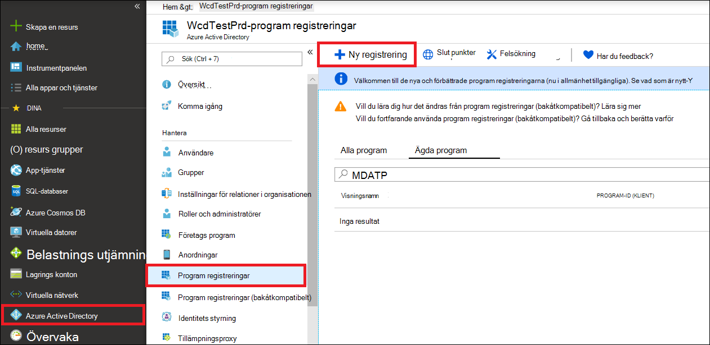
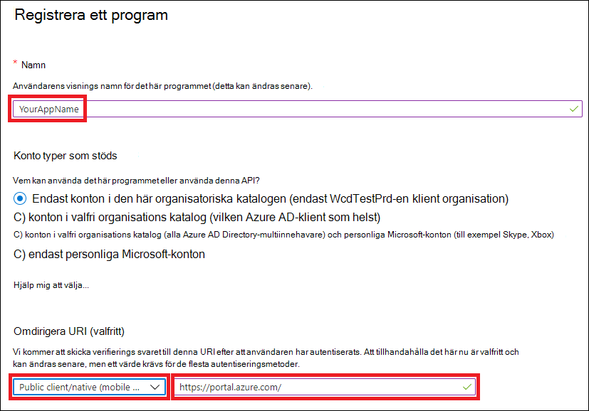
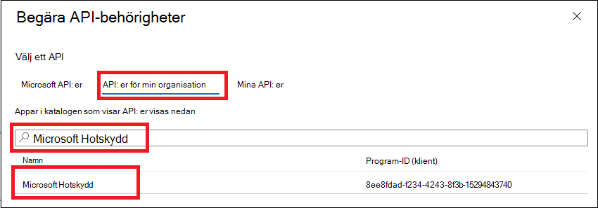
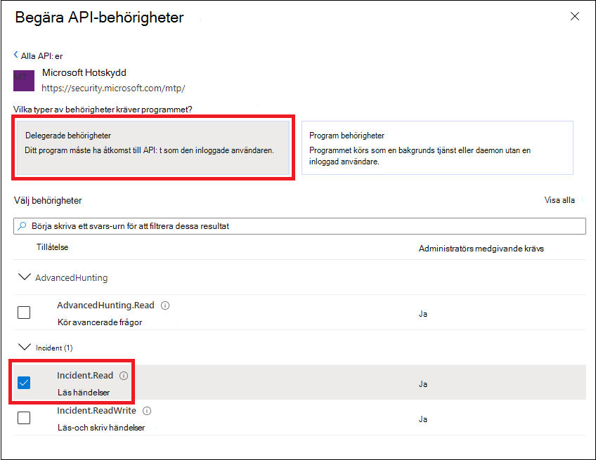
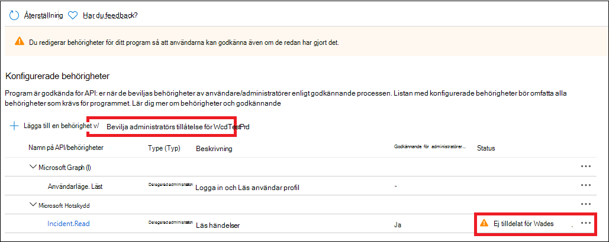
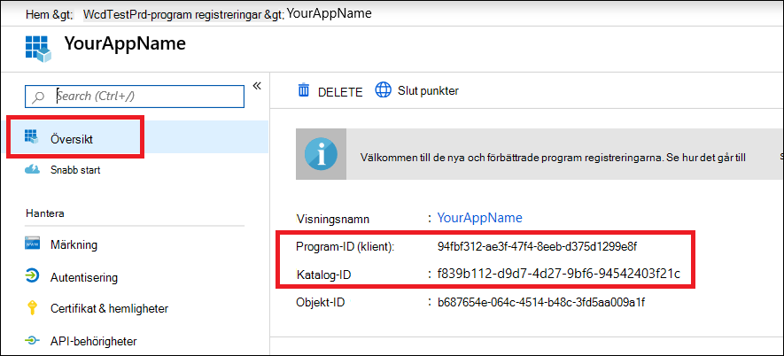

# <a name="access-microsoft-threat-protection-apis-on-behalf-of-user"></a>Åtkomst till Microsoft Threat Protection API: er för användare

**Gäller för:**
- Microsoft Hotskydd

>[!IMPORTANT] 
>Vissa uppgifter gäller för FÖRLANSERADE produkter som kan komma att ändras väsentligt innan de saluförs. Microsoft lämnar inga garantier, uttryckliga eller underförstådda, med avseende på informationen som tillhandahålls här.


På den här sidan beskrivs hur du skapar ett program för att få programmatisk åtkomst till Microsoft Threat Protection för en användares räkning.

Om du behöver program mässig åtkomst till Microsoft Threat Protection utan en användare kan du läsa [skapa en app för att få åtkomst till Microsoft Threat Protection utan en användare](api-create-app-web.md).

Om du inte är säker på vilken åtkomst du behöver läser du [komma åt Microsoft Threat Protection API: er](api-access.md).

Microsoft Threat Protection visar mycket av dess data och åtgärder genom en uppsättning API: er. Dessa API: er gör det möjligt för dig att automatisera arbets flöden och förnyande baserat på Microsoft Threat Protection-funktioner. För API-åtkomst krävs autentisering med OAuth 2.0. Mer information finns i [verifierings kod flödet för OAuth-2,0](https://docs.microsoft.com/azure/active-directory/develop/active-directory-v2-protocols-oauth-code).

I allmänhet måste du utföra följande steg för att använda API:
- Skapa ett AAD-program
- Skaffa en åtkomsttoken med det här programmet
- Använda token för att få åtkomst till Microsoft Threat Protection API

På den här sidan förklaras hur du skapar ett AAD-program, skaffar en åtkomsttoken till Microsoft Threat Protection och validerar token.

>[!NOTE]
> När du får åtkomst till Microsoft Threat Protection API för en användare behöver du rätt program behörighet och användar behörighet.


>[!TIP]
> Om du har behörighet att utföra en åtgärd i portalen har du behörighet att utföra åtgärden i API: t.

## <a name="create-an-app"></a>Skapa en app

1. Logga in på [Azure](https://portal.azure.com) med den användare som har rollen **Global administratör** .

2. Navigera till **Azure Active Directory**-  >  **programregistreringar**  >  **ny registrering**. 

   

3. Ange följande information i registreringen från och klicka sedan på **Registrera**.

   

   - **Namn:** Ditt program namn
   - **Program typ:** Offentlig klient
   - **OMDIRIGERA URI:**https://portal.azure.com

4. Om du vill göra det möjligt för din app att komma åt Microsoft Threat Protection och tilldela behörigheter kan du välja **API-behörigheter**  >  **Lägg till behörighets**-API: er för att lägga till behörigheter i > på din program sida  >  **APIs my organization uses** , och sedan välja **Microsoft Threat Protection** **Microsoft Threat Protection**.

    >[!NOTE]
    > Microsoft Threat Protection visas inte i den ursprungliga listan. Du måste börja skriva dess namn i text rutan för att se det.

      

    - Välj **delegerade behörigheter** > välja relevanta behörigheter för scenariot, **t. ex.** **Add permissions**

      

     >[!IMPORTANT]
     >Du måste välja relevanta behörigheter. 

    -  Ta reda på vilken behörighet du behöver genom att titta i avsnittet **behörigheter** i det API du är intresse rad av.

    - Klicka på **bevilja medgivande**

      >[!NOTE]
      >Varje gång du lägger till behörighet måste du klicka på **bevilja medgivande** för att den nya behörigheten ska börja gälla.

      

6. Skriv in ditt program-ID och ditt klient-ID:

   - Gå till **Översikt** och kopiera följande på program sidan:

   


## <a name="get-an-access-token-using-powershell"></a>Skaffa en åtkomsttoken med PowerShell

```
#Install the ADAL.PS package if it's not installed.
if(!(Get-Package adal.ps)) { Install-Package -Name adal.ps }

$authority = "https://login.windows.net/{tenant-id}" # replace {tenant-id} with your tenant ID.

$clientId = "{application-id}" #replace {application-id} with your application ID.

$redirectUri = "{redirect-uri}" # replace {redirect-uri} with your application redirect URI.

$resourceUrl = "https://api.security.microsoft.com"

$response = Get-ADALToken -Resource $resourceUrl -ClientId $clientId -RedirectUri $redirectUri -Authority $authority -PromptBehavior:Always
$response.AccessToken | clip
$response.AccessToken
```

## <a name="related-topics"></a>Relaterade ämnen
- [Komma åt API: erna för skydd mot Microsoft Threat](api-access.md)
- [Åtkomst till Microsoft Threat Protection med program kontext](api-create-app-web.md)
