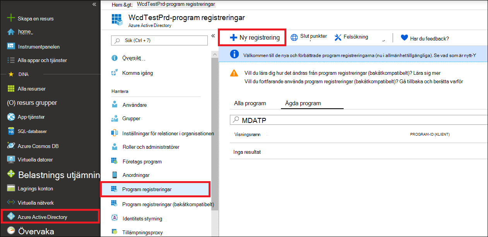
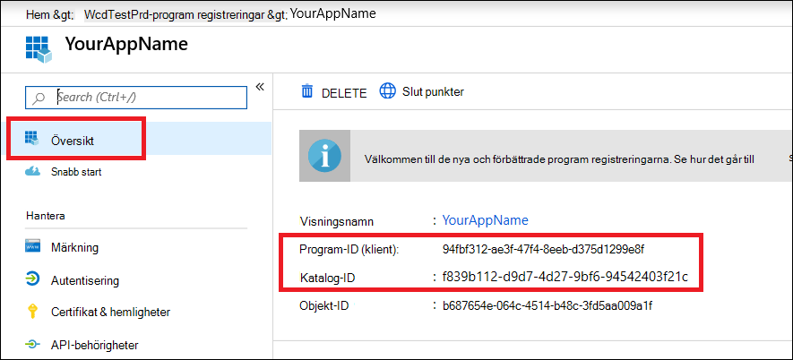

# <a name="create-an-app-to-access-microsoft-365-defender-without-a-user"></a>Skapa en app för åtkomst till Microsoft 365 Defender utan en användare

[!INCLUDE [Microsoft 365 Defender rebranding](../includes/microsoft-defender.md)]


**Gäller för:**
- Microsoft 365 Defender

>[!IMPORTANT] 
>Vissa uppgifter gäller för FÖRLANSERADE produkter som kan komma att ändras väsentligt innan de saluförs. Microsoft lämnar inga garantier, uttryckliga eller underförstådda, med avseende på informationen som tillhandahålls här.

På den här sidan beskrivs hur du skapar ett program för att få programmatisk åtkomst till Microsoft 365 Defender utan en användare. Om du behöver programmatisk åtkomst till Microsoft 365 Defender för en användare läser du [få åtkomst med användar kontext](api-create-app-user-context.md). Om du inte är säker på vilken åtkomst du behöver läser du [komma igång](api-access.md).

Microsoft 365 Defender visar mycket av dess data och åtgärder via en uppsättning API: er. Dessa API: er hjälper dig att automatisera arbets flöden och förnyas baserat på Microsoft 365 Defender-funktioner. För API-åtkomst krävs autentisering med OAuth 2.0. Mer information finns i [verifierings kod flödet för OAuth-2,0](https://docs.microsoft.com/azure/active-directory/develop/active-directory-v2-protocols-oauth-code).

I allmänhet måste du utföra följande steg för att använda API:
- Skapa ett Azure Active Directory (Azure AD)-program.
- Skaffa en åtkomsttoken med det här programmet.
- Använd token för att få åtkomst till Microsoft 365 Defender API.

I den här artikeln förklaras hur du skapar ett Azure AD-program, hämtar en åtkomsttoken till Microsoft 365 Defender och validerar token.

## <a name="create-an-app"></a>Skapa en app

1. Logga in på [Azure](https://portal.azure.com) med en användare som har rollen **Global administratör** .

2. Navigera till **Azure Active Directory** -  >  **programregistreringar**  >  **ny registrering**. 

   

3. I registrerings formuläret väljer du ett namn för ansökan och väljer sedan **Registrera**.

4. Om du vill göra det möjligt för din app att komma åt Microsoft 365 Defender och tilldela behörigheter, väljer du **API-behörigheter**  >  **Lägg till behörighets** -API: er för att lägga till behörigheter i  >  **APIs my organization uses** >, Skriv **Microsoft 365 Defender** och sedan **Microsoft 365 Defender**.

   > [!NOTE]
   > Microsoft 365 Defender visas inte i den ursprungliga listan. Du måste börja skriva dess namn i text rutan för att se det.

   

   - Välj **program behörigheter** > välja relevanta behörigheter för scenariot, till exempel. **incident. Read. all** och välj sedan **Add Permissions**.

   

    >[!NOTE]
    >Du måste välja relevanta behörigheter för scenariot, **"Läs alla händelser"** , är bara ett exempel. Ta reda på vilken behörighet du behöver genom att titta i avsnittet **behörigheter** i det API du är intresse rad av.

5. Välj **bevilja medgivande**.

     > [!NOTE]
     > Varje gång du lägger till en behörighet måste du välja **bevilja medgivande** för att den nya behörigheten ska börja gälla.

    

6. Om du vill lägga till en hemlighet i programmet väljer du **certifikat & hemligheter** , lägger till en beskrivning för hemligheten och väljer sedan **Lägg till**.

    > [!NOTE]
    > När du har valt **Lägg till** väljer **du kopiera det genererade hemliga värdet**. Du kommer inte att kunna hämta det här värdet efter att du har lämnat.

    

7. Skriv in ditt program-ID och ditt klient-ID. Gå till **Översikt** och kopiera följande på program sidan.

   

8. **Endast för Microsoft 365 Defender-partners**. [Följ instruktionerna här](https://docs.microsoft.com/microsoft-365/security/mtp/api-partner-access). Ställ in din app så att den är flertrådad (tillgänglig i alla innehavare efter medgivande). Detta är **obligatoriskt** för tredjepartsprogram (till exempel om du skapar ett program som är avsett att köras i flera kunders innehavare). Detta är **inte obligatoriskt** om du skapar en tjänst som du bara vill köra i klient organisationen (om du till exempel skapar ett program för ditt eget bruk som bara interagerar med dina egna data). Så här ställer du in appen så att den är flertrådad:

    - Gå till **inloggningsautentisering** och Lägg till https://portal.azure.com som **omdirigerings-URI**.

    - Under **konto typer som stöds** längst ned på sidan väljer du **konton i valfritt organisations katalog** program medgivande för appen med flera innehavare.

    Du behöver programmet vara godkänt för varje innehavare där du tänker använda det. Det beror på att ditt program interagerar med Microsoft 365 Defender åt din kund.

    Du (eller din kund om du skriver ett program från tredje part) måste välja medgivande länken och godkänna programmet. Godkännandet bör göras med en användare som har administratörs behörighet i Active Directory.

    Medgivande länken är utformad så här: 

    ```
    https://login.microsoftonline.com/common/oauth2/authorize?prompt=consent&client_id=00000000-0000-0000-0000-000000000000&response_type=code&sso_reload=true
    ```

    Där 00000000-0000-0000-0000-000000000000 ersätts med ditt program-ID.


**Åstadkomma!** Du har registrerat ett program! Se exemplen nedan för hämtning av token och verifiering.

## <a name="get-an-access-token"></a>Skaffa en åtkomsttoken

Mer information om Azure AD-tokens finns i [själv studie kursen för Azure AD](https://docs.microsoft.com/azure/active-directory/develop/active-directory-v2-protocols-oauth-client-creds).

### <a name="use-powershell"></a>Använda PowerShell

```
# That code gets the App Context Token and save it to a file named "Latest-token.txt" under the current directory
# Paste below your Tenant ID, App ID and App Secret (App key).

$tenantId = '' ### Paste your tenant ID here
$appId = '' ### Paste your Application ID here
$appSecret = '' ### Paste your Application key here

$resourceAppIdUri = 'https://api.security.microsoft.com'
$oAuthUri = "https://login.windows.net/$TenantId/oauth2/token"
$authBody = [Ordered] @{
    resource = "$resourceAppIdUri"
    client_id = "$appId"
    client_secret = "$appSecret"
    grant_type = 'client_credentials'
}
$authResponse = Invoke-RestMethod -Method Post -Uri $oAuthUri -Body $authBody -ErrorAction Stop
$token = $authResponse.access_token
Out-File -FilePath "./Latest-token.txt" -InputObject $token
return $token
```

### <a name="use-c"></a>Använda C#:

Följande kod har testats med NuGet Microsoft. IdentityModel. clients. ActiveDirectory 3.19.8.

1. Skapa ett nytt konsol program.
1. Installera NuGet [Microsoft. IdentityModel. clients. ActiveDirectory](https://www.nuget.org/packages/Microsoft.IdentityModel.Clients.ActiveDirectory/).
1. Lägg till följande:

    ```
    using Microsoft.IdentityModel.Clients.ActiveDirectory;
    ```

1. Kopiera och klistra in följande kod i programmet (Glöm inte att uppdatera de tre variablerna: ```tenantId, appId, appSecret``` ):

    ```
    string tenantId = "00000000-0000-0000-0000-000000000000"; // Paste your own tenant ID here
    string appId = "11111111-1111-1111-1111-111111111111"; // Paste your own app ID here
    string appSecret = "22222222-2222-2222-2222-222222222222"; // Paste your own app secret here for a test, and then store it in a safe place! 

    const string authority = "https://login.windows.net";
    const string wdatpResourceId = "https://api.security.microsoft.com";

    AuthenticationContext auth = new AuthenticationContext($"{authority}/{tenantId}/");
    ClientCredential clientCredential = new ClientCredential(appId, appSecret);
    AuthenticationResult authenticationResult = auth.AcquireTokenAsync(wdatpResourceId, clientCredential).GetAwaiter().GetResult();
    string token = authenticationResult.AccessToken;
    ```


### <a name="use-python"></a>Använd python 

```
import json
import urllib.request
import urllib.parse

tenantId = '00000000-0000-0000-0000-000000000000' # Paste your own tenant ID here
appId = '11111111-1111-1111-1111-111111111111' # Paste your own app ID here
appSecret = '22222222-2222-2222-2222-222222222222' # Paste your own app secret here

url = "https://login.windows.net/%s/oauth2/token" % (tenantId)

resourceAppIdUri = 'https://api.securitycenter.windows.com'

body = {
    'resource' : resourceAppIdUri,
    'client_id' : appId,
    'client_secret' : appSecret,
    'grant_type' : 'client_credentials'
}

data = urllib.parse.urlencode(body).encode("utf-8")

req = urllib.request.Request(url, data)
response = urllib.request.urlopen(req)
jsonResponse = json.loads(response.read())
aadToken = jsonResponse["access_token"]
```
### <a name="use-curl"></a>Använda sväng

> [!NOTE]
> I följande anvisningar förutsätts att bläddring för Windows redan är installerat på datorn.

1. Öppna en kommando tolk och ange CLIENT_ID till ditt Azure-program-ID.
1. Ange CLIENT_SECRET till din Azure Application Secret.
1. Ange TENANT_ID till det Azure TENANT ID för kunden som vill använda din app för att komma åt Microsoft 365 Defender.
1. Kör följande kommando:

```
curl -i -X POST -H "Content-Type:application/x-www-form-urlencoded" -d "grant_type=client_credentials" -d "client_id=%CLIENT_ID%" -d "scope=https://securitycenter.onmicrosoft.com/windowsatpservice/.default" -d "client_secret=%CLIENT_SECRET%" "https://login.microsoftonline.com/%TENANT_ID%/oauth2/v2.0/token" -k
```

Du får svaret i följande form:

```
{"token_type":"Bearer","expires_in":3599,"ext_expires_in":0,"access_token":"eyJ0eXAiOiJKV1QiLCJhbGciOiJSUzI1NiIsIn <truncated> aWReH7P0s0tjTBX8wGWqJUdDA"}
```

## <a name="validate-the-token"></a>Validera token

Kontrol lera att du har rätt token:

1. Kopiera och klistra in den token du fick i det föregående steget i [JWT](https://jwt.ms) för att avkoda den.
1. Verifiera att du får en "roles"-anspråk med de önskade behörigheterna
1. I följande bild kan du se ett avkodat token från en app med ```Incidents.Read.All``` ```Incidents.ReadWrite.All``` och ```AdvancedHunting.Read.All``` behörighet:


## <a name="use-the-token-to-access-microsoft-365-defender-api"></a>Använda token för att få åtkomst till Microsoft 365 Defender API

1. Välj det API du vill använda. Mer information finns i [Microsoft 365 Defender API: n](api-supported.md).

2. Ange auktorisations huvudet i http-begäran som du skickar till "Bearer {token}" (innehavaren är godkännandet).

3. Giltighets tiden för token är en timme. Du kan skicka mer än en begäran med samma token.

Nedan följer ett exempel på hur man skickar en begäran om att få en lista över incidenter **med C#** : 

```
    var httpClient = new HttpClient();

    var request = new HttpRequestMessage(HttpMethod.Get, "https://api.security.microsoft.com/api/incidents");

    request.Headers.Authorization = new AuthenticationHeaderValue("Bearer", token);

    var response = httpClient.SendAsync(request).GetAwaiter().GetResult();

    // Do something useful with the response
```

## <a name="related-topics"></a>Relaterade ämnen
- [Gå till API för Microsoft 365 Defender](api-access.md)
- [Åtkomst till Microsoft 365 Defender med program kontext](api-create-app-web.md)
- [Åtkomst till Microsoft 365 Defender med användar kontext](api-create-app-user-context.md)
