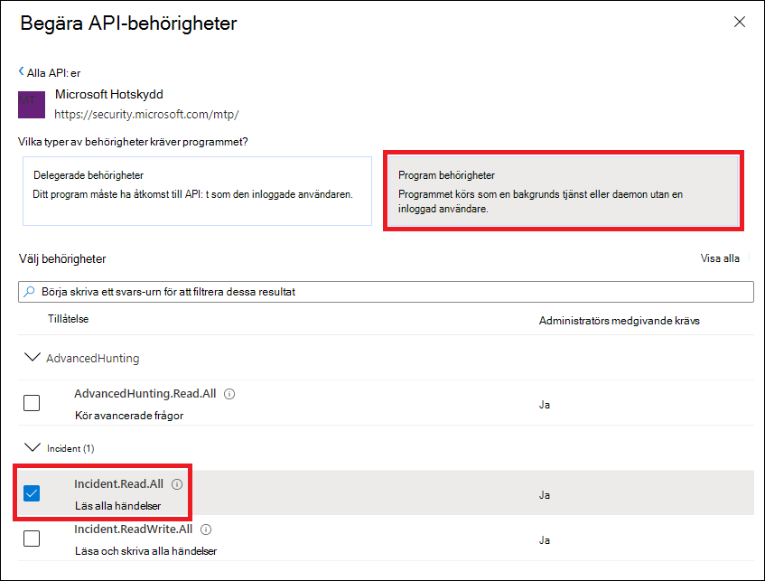

# <a name="hello-world-for-microsoft-threat-protection-rest-api"></a><span data-ttu-id="81f11-104">Hej världen för Microsoft Threat Protection REST API</span><span class="sxs-lookup"><span data-stu-id="81f11-104">Hello World for Microsoft Threat Protection REST API</span></span> 

<span data-ttu-id="81f11-105">**Gäller för:**</span><span class="sxs-lookup"><span data-stu-id="81f11-105">**Applies to:**</span></span>
- <span data-ttu-id="81f11-106">Microsoft Hotskydd</span><span class="sxs-lookup"><span data-stu-id="81f11-106">Microsoft Threat Protection</span></span>

>[!IMPORTANT] 
><span data-ttu-id="81f11-107">Vissa uppgifter gäller för FÖRLANSERADE produkter som kan komma att ändras väsentligt innan de saluförs.</span><span class="sxs-lookup"><span data-stu-id="81f11-107">Some information relates to prereleased product which may be substantially modified before it's commercially released.</span></span> <span data-ttu-id="81f11-108">Microsoft lämnar inga garantier, uttryckliga eller underförstådda, med avseende på informationen som tillhandahålls här.</span><span class="sxs-lookup"><span data-stu-id="81f11-108">Microsoft makes no warranties, express or implied, with respect to the information provided here.</span></span>


## <a name="get-incidents-using-a-simple-powershell-script"></a><span data-ttu-id="81f11-109">Få incidenter med hjälp av ett enkelt PowerShell-skript</span><span class="sxs-lookup"><span data-stu-id="81f11-109">Get incidents using a simple PowerShell script</span></span>

### <a name="how-long-it-takes-to-go-through-this-example"></a><span data-ttu-id="81f11-110">Hur lång tid tar det för det här exemplet?</span><span class="sxs-lookup"><span data-stu-id="81f11-110">How long it takes to go through this example?</span></span>
<span data-ttu-id="81f11-111">Det tar bara fem minuter i två steg:</span><span class="sxs-lookup"><span data-stu-id="81f11-111">It only takes 5 minutes done in two steps:</span></span>
- <span data-ttu-id="81f11-112">Program registrering</span><span class="sxs-lookup"><span data-stu-id="81f11-112">Application registration</span></span>
- <span data-ttu-id="81f11-113">Använda exempel: kräver bara kopiera/klistra in ett kort PowerShell-skript</span><span class="sxs-lookup"><span data-stu-id="81f11-113">Use examples: only requires copy/paste of a short PowerShell script</span></span>

### <a name="do-i-need-a-permission-to-connect"></a><span data-ttu-id="81f11-114">Behöver jag en behörighet för att ansluta?</span><span class="sxs-lookup"><span data-stu-id="81f11-114">Do I need a permission to connect?</span></span>
<span data-ttu-id="81f11-115">För program registrerings fasen måste du ha en **Global administratörs** roll i din Azure Active Directory (Azure AD)-klient organisation.</span><span class="sxs-lookup"><span data-stu-id="81f11-115">For the Application registration stage, you must have a **Global administrator** role in your Azure Active Directory (Azure AD) tenant.</span></span>

### <a name="step-1---create-an-app-in-azure-active-directory"></a><span data-ttu-id="81f11-116">Steg 1 – Skapa ett program i Azure Active Directory</span><span class="sxs-lookup"><span data-stu-id="81f11-116">Step 1 - Create an App in Azure Active Directory</span></span>

1. <span data-ttu-id="81f11-117">Logga in på [Azure](https://portal.azure.com) med din **globala administratörs** användare.</span><span class="sxs-lookup"><span data-stu-id="81f11-117">Log on to [Azure](https://portal.azure.com) with your **Global administrator** user.</span></span>

2. <span data-ttu-id="81f11-118">Navigera till **Azure Active Directory**-  >  **programregistreringar**  >  **ny registrering**.</span><span class="sxs-lookup"><span data-stu-id="81f11-118">Navigate to **Azure Active Directory** > **App registrations** > **New registration**.</span></span> 

   

3. <span data-ttu-id="81f11-120">I registrerings formuläret väljer du ett namn för ansökan och väljer sedan **Registrera**.</span><span class="sxs-lookup"><span data-stu-id="81f11-120">In the registration form, choose a name for your application and then select **Register**.</span></span>

4. <span data-ttu-id="81f11-121">Ge ditt program åtkomst till Microsoft Defender ATP och ge det behörigheten **läsa alla händelser** :</span><span class="sxs-lookup"><span data-stu-id="81f11-121">Allow your Application to access Microsoft Defender ATP and assign it **Read all incidents** permission:</span></span>

   - <span data-ttu-id="81f11-122">På din program sida väljer du **API-behörigheter**  >  **Add permission**  >  **API min organisation använder** > ange **Microsoft Threat Protection** och välj ett **skydd mot Microsoft Threat**.</span><span class="sxs-lookup"><span data-stu-id="81f11-122">On your application page, select **API Permissions** > **Add permission** > **APIs my organization uses** > type **Microsoft Threat Protection** and select on **Microsoft Threat Protection**.</span></span>

   >[!NOTE]
   ><span data-ttu-id="81f11-123">Microsoft Threat Protection visas inte i den ursprungliga listan.</span><span class="sxs-lookup"><span data-stu-id="81f11-123">Microsoft Threat Protection does not appear in the original list.</span></span> <span data-ttu-id="81f11-124">Du måste börja skriva dess namn i text rutan för att se det.</span><span class="sxs-lookup"><span data-stu-id="81f11-124">You need to start writing its name in the text box to see it appear.</span></span>

   

   - <span data-ttu-id="81f11-126">Välj **program behörigheter**  >  **incident. Läs. alla** > Välj i **lägga till behörigheter**</span><span class="sxs-lookup"><span data-stu-id="81f11-126">Choose **Application permissions** > **Incident.Read.All** > Select on **Add permissions**</span></span>

   

   >[!IMPORTANT]
   ><span data-ttu-id="81f11-128">Du måste välja relevanta behörigheter.</span><span class="sxs-lookup"><span data-stu-id="81f11-128">You need to select the relevant permissions.</span></span> 

     <span data-ttu-id="81f11-129">Till exempel:</span><span class="sxs-lookup"><span data-stu-id="81f11-129">For instance,</span></span>

     - <span data-ttu-id="81f11-130">Ta reda på vilken behörighet du behöver genom att titta i avsnittet **behörigheter** i det API du är intresse rad av.</span><span class="sxs-lookup"><span data-stu-id="81f11-130">To determine which permission you need, please look at the **Permissions** section in the API you are interested to call.</span></span>

5. <span data-ttu-id="81f11-131">Välj **bevilja administratörs tillåtelse**</span><span class="sxs-lookup"><span data-stu-id="81f11-131">Select **Grant admin consent**</span></span>

    - >[!NOTE]
      > <span data-ttu-id="81f11-132">Varje gång du lägger till behörighet måste du välja **medgivande** för att den nya behörigheten ska börja gälla.</span><span class="sxs-lookup"><span data-stu-id="81f11-132">Every time you add permission you must select on **Grant consent** for the new permission to take effect.</span></span>

    

6. <span data-ttu-id="81f11-134">Lägg till en hemlighet i programmet.</span><span class="sxs-lookup"><span data-stu-id="81f11-134">Add a secret to the application.</span></span>

    - <span data-ttu-id="81f11-135">Välj **certifikat & hemligheter**, Lägg till en beskrivning för hemligheten och välj **Lägg till**.</span><span class="sxs-lookup"><span data-stu-id="81f11-135">Select **Certificates & secrets**, add description to the secret and select **Add**.</span></span>

    >[!IMPORTANT]
    > <span data-ttu-id="81f11-136">När du har valt **Lägg till** **kopierar du det genererade hemliga värdet**.</span><span class="sxs-lookup"><span data-stu-id="81f11-136">After selecting **Add**, **copy the generated secret value**.</span></span> <span data-ttu-id="81f11-137">Du kommer inte att kunna hämta efter att du har lämnat!</span><span class="sxs-lookup"><span data-stu-id="81f11-137">You won't be able to retrieve after you leave!</span></span>

    

7. <span data-ttu-id="81f11-139">Skriv in ditt program-ID och ditt klient-ID:</span><span class="sxs-lookup"><span data-stu-id="81f11-139">Write down your application ID and your tenant ID:</span></span>

   - <span data-ttu-id="81f11-140">Gå till **Översikt** och kopiera följande på program sidan:</span><span class="sxs-lookup"><span data-stu-id="81f11-140">On your application page, go to **Overview** and copy the following:</span></span>

   


<span data-ttu-id="81f11-142">Åstadkomma!</span><span class="sxs-lookup"><span data-stu-id="81f11-142">Done!</span></span> <span data-ttu-id="81f11-143">Du har registrerat ett program.</span><span class="sxs-lookup"><span data-stu-id="81f11-143">You have successfully registered an application.</span></span>

### <a name="step-2---get-a-token-using-the-app-and-use-this-token-to-access-the-api"></a><span data-ttu-id="81f11-144">Steg 2-Hämta ett token med programmet och Använd denna token för att komma åt API: t.</span><span class="sxs-lookup"><span data-stu-id="81f11-144">Step 2 - Get a token using the App and use this token to access the API.</span></span>

-   <span data-ttu-id="81f11-145">Kopiera skriptet nedan till PowerShell ISE eller till en text redigerare och spara det som "**Get-Token.ps1**"</span><span class="sxs-lookup"><span data-stu-id="81f11-145">Copy the script below to PowerShell ISE or to a text editor, and save it as "**Get-Token.ps1**"</span></span>
-   <span data-ttu-id="81f11-146">Om du kör det här skriptet skapas ett token och det sparas i arbetsmappen under namnet "**Latest-token.txt**".</span><span class="sxs-lookup"><span data-stu-id="81f11-146">Running this script will generate a token and will save it in the working folder under the name "**Latest-token.txt**".</span></span>

```
# That code gets the App Context Token and save it to a file named "Latest-token.txt" under the current directory
# Paste below your Tenant ID, App ID and App Secret (App key).

$tenantId = '' ### Paste your tenant ID here
$appId = '' ### Paste your Application ID here
$appSecret = '' ### Paste your Application secret here

$resourceAppIdUri = 'https://api.security.microsoft.com'
$oAuthUri = "https://login.windows.net/$TenantId/oauth2/token"
$authBody = [Ordered] @{
    resource = "$resourceAppIdUri"
    client_id = "$appId"
    client_secret = "$appSecret"
    grant_type = 'client_credentials'
}
$authResponse = Invoke-RestMethod -Method Post -Uri $oAuthUri -Body $authBody -ErrorAction Stop
$token = $authResponse.access_token
Out-File -FilePath "./Latest-token.txt" -InputObject $token
return $token
```

-   <span data-ttu-id="81f11-147">Sanity:</span><span class="sxs-lookup"><span data-stu-id="81f11-147">Sanity Check:</span></span><br>
<span data-ttu-id="81f11-148">Kör skriptet.</span><span class="sxs-lookup"><span data-stu-id="81f11-148">Run the script.</span></span><br>
<span data-ttu-id="81f11-149">I webbläsaren går du till: https://jwt.ms/</span><span class="sxs-lookup"><span data-stu-id="81f11-149">In your browser go to: https://jwt.ms/</span></span> <br>
<span data-ttu-id="81f11-150">Kopiera token (innehållet i Latest-token.txt filen).</span><span class="sxs-lookup"><span data-stu-id="81f11-150">Copy the token (the content of the Latest-token.txt file).</span></span><br>
<span data-ttu-id="81f11-151">Klistra in i den övre rutan.</span><span class="sxs-lookup"><span data-stu-id="81f11-151">Paste in the top box.</span></span><br>
<span data-ttu-id="81f11-152">Leta efter avsnittet "roller".</span><span class="sxs-lookup"><span data-stu-id="81f11-152">Look for the "roles" section.</span></span> <span data-ttu-id="81f11-153">Hitta ```Incidents.Read.All``` rollen.</span><span class="sxs-lookup"><span data-stu-id="81f11-153">Find the ```Incidents.Read.All``` role.</span></span><br>
<span data-ttu-id="81f11-154">Exemplet nedan är från ett program som har ```Incidents.Read.All``` ```Incidents.ReadWrite.All``` och ```AdvancedHunting.Read.All``` behörigheter.</span><span class="sxs-lookup"><span data-stu-id="81f11-154">The below example is from an app that has ```Incidents.Read.All```, ```Incidents.ReadWrite.All``` and ```AdvancedHunting.Read.All``` permissions.</span></span>


### <a name="lets-get-the-incidents"></a><span data-ttu-id="81f11-156">Här kan du få ett problem!</span><span class="sxs-lookup"><span data-stu-id="81f11-156">Lets get the Incidents!</span></span>

-   <span data-ttu-id="81f11-157">Skriptet nedan använder **Get-Token.ps1** för att få åtkomst till API: t och får de händelser som senast uppdaterades tidigare 48 timmar.</span><span class="sxs-lookup"><span data-stu-id="81f11-157">The script below will use **Get-Token.ps1** to access the API and will get the incidents last updated in past 48 hours.</span></span>
-   <span data-ttu-id="81f11-158">Spara det här skriptet i samma mapp som du sparade föregående skript **Get-Token.ps1**.</span><span class="sxs-lookup"><span data-stu-id="81f11-158">Save this script in the same folder you saved the previous script **Get-Token.ps1**.</span></span> 
-   <span data-ttu-id="81f11-159">Skriptet en JSON-fil med data i samma mapp som skripten.</span><span class="sxs-lookup"><span data-stu-id="81f11-159">The script a json file with the data in the same folder as the scripts.</span></span>

```
# Returns Incidents last updated in the past 48 hours.

$token = ./Get-Token.ps1       #run the script Get-Token.ps1  - make sure you are running this script from the same folder of Get-Token.ps1

# Get Incidents from the last 48 hours. Make sure you have incidents in that time frame.
$dateTime = (Get-Date).ToUniversalTime().AddHours(-48).ToString("o")

# The URL contains the type of query and the time filter we created above
$url = "https://api.security.microsoft.com/api/incidents?$filter=lastUpdateTime+ge+$dateTime"

# Set the WebRequest headers
$headers = @{ 
    'Content-Type' = 'application/json'
    'Accept' = 'application/json'
    'Authorization' = "Bearer $token"
}

# Send the webrequest and get the results. 
$response = Invoke-WebRequest -Method Get -Uri $url -Headers $headers -ErrorAction Stop

# Extract the incidents from the results. 
$incidents =  ($response | ConvertFrom-Json).value | ConvertTo-Json -Depth 99

# Get string with the execution time. We concatenate that string to the output file to avoid overwrite the file
$dateTimeForFileName = Get-Date -Format o | foreach {$_ -replace ":", "."}    

# Save the result as json
$outputJsonPath = "./Latest Incidents $dateTimeForFileName.json"     

Out-File -FilePath $outputJsonPath -InputObject $incidents 
```

<span data-ttu-id="81f11-160">Nu är du klar!</span><span class="sxs-lookup"><span data-stu-id="81f11-160">You're all done!</span></span> <span data-ttu-id="81f11-161">Du har precis lyckats:</span><span class="sxs-lookup"><span data-stu-id="81f11-161">You have just successfully:</span></span>
-   <span data-ttu-id="81f11-162">Skapad och registrerad och Application</span><span class="sxs-lookup"><span data-stu-id="81f11-162">Created and registered and application</span></span>
-   <span data-ttu-id="81f11-163">Behörighet för det programmet att läsa aviseringar</span><span class="sxs-lookup"><span data-stu-id="81f11-163">Granted permission for that application to read alerts</span></span>
-   <span data-ttu-id="81f11-164">Anslöt till API</span><span class="sxs-lookup"><span data-stu-id="81f11-164">Connected the API</span></span>
-   <span data-ttu-id="81f11-165">Använde ett PowerShell-skript för att returnera incidenter som skapats under de senaste 48 timmarna</span><span class="sxs-lookup"><span data-stu-id="81f11-165">Used a PowerShell script to return incidents created in the past 48 hours</span></span>


## <a name="related-topic"></a><span data-ttu-id="81f11-166">Närliggande ämne</span><span class="sxs-lookup"><span data-stu-id="81f11-166">Related topic</span></span>
- [<span data-ttu-id="81f11-167">Komma åt API: erna för skydd mot Microsoft Threat</span><span class="sxs-lookup"><span data-stu-id="81f11-167">Access the Microsoft Threat Protection APIs</span></span>](api-access.md)
- [<span data-ttu-id="81f11-168">Åtkomst till Microsoft Threat Protection med program kontext</span><span class="sxs-lookup"><span data-stu-id="81f11-168">Access  Microsoft Threat Protection with application context</span></span>](api-create-app-web.md)
- [<span data-ttu-id="81f11-169">Åtkomst till Microsoft Threat Protection med användar kontext</span><span class="sxs-lookup"><span data-stu-id="81f11-169">Access  Microsoft Threat Protection with user context</span></span>](api-create-app-user-context.md)
