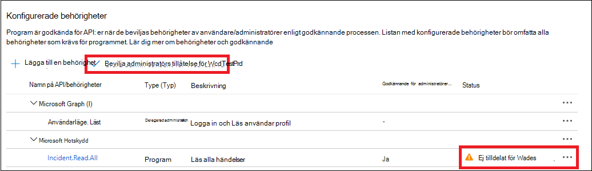
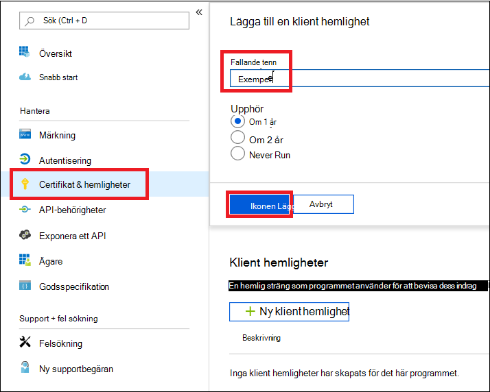

# <a name="hello-world-for-microsoft-365-defender-rest-api"></a>Hej världen för Microsoft 365 Defender REST API

[!INCLUDE [Microsoft 365 Defender rebranding](../includes/microsoft-defender.md)]

**Gäller för:**

- Microsoft 365 Defender

> [!IMPORTANT]
> Vissa uppgifter gäller för FÖRLANSERADE produkter som kan komma att ändras väsentligt innan de saluförs. Microsoft lämnar inga garantier, uttryckliga eller underförstådda, med avseende på informationen som tillhandahålls här.

## <a name="get-incidents-using-a-simple-powershell-script"></a>Få incidenter med hjälp av ett enkelt PowerShell-skript

Det bör ta 5-10 minuter för projektet att genomföras. I den här tids uppskattningen ingår att registrera programmet och tillämpa koden från PowerShell-exempelprogrammet.

### <a name="register-an-app-in-azure-active-directory"></a>Registrera ett program i Azure Active Directory

1. Logga in på [Azure](https://portal.azure.com) som en användare med rollen **Global administratör** .

2. Navigera till **Azure Active Directory**-  >  **programregistreringar**  >  **ny registrering**.

   

3. I registrerings formuläret väljer du ett namn för ansökan och väljer sedan **Registrera**. Det är valfritt att välja en URL för omdirigering. Du behöver ingen för att genomföra det här exemplet.

4. På din program sida väljer du **API-behörigheter**  >  **Add permission**  >  **API min organisation använder** >, Skriv **Microsoft Threat Protection** och välj **Microsoft Threat Protection**. Ditt program kan nu komma åt Microsoft 365 Defender.

   > [!TIP]
   > *Microsoft Threat Protection* är ett tidigare namn för Microsoft 365 Defender och kommer inte att synas i den ursprungliga listan. Du måste börja skriva dess namn i text rutan för att se det.
   

   - Välj **program behörigheter**  >  **incident. Read. all** och välj **Add Permissions**.

   

5. Välj **ge administratörs medgivande**. Varje gång du lägger till en behörighet måste du välja **bevilja administratörs medgivande** för att det ska börja gälla.

    

6. Lägg till en hemlighet i programmet. Välj **certifikat & hemligheter**, Lägg till en beskrivning till hemligheten och välj sedan **Lägg till**.

    > [!TIP]
    > När du har valt **Lägg till** väljer **du kopiera det genererade hemliga värdet**. Du kommer inte att kunna hämta det hemliga värdet efter att du har lämnat.

    

7. Spela in ditt program-ID och klient-ID något säkert. De visas under **Översikt** på din program sida.

   

### <a name="get-a-token-using-the-app-and-use-the-token-to-access-the-api"></a>Hämta ett token med appen och Använd token för att få åtkomst till API: t

Mer information om Azure Active Directory-tokens finns i [själv studie kursen för Azure AD](https://docs.microsoft.com/azure/active-directory/develop/active-directory-v2-protocols-oauth-client-creds).

> [!IMPORTANT]
> Även om exemplet i det här demo programmet uppmuntrar dig att klistra in ditt hemliga värde för testning bör du **aldrig hardcode hemligheter** i ett program som körs i produktion. En tredje part kan använda din hemlighet för att komma åt resurser. Du kan hålla dina programs hemligheter säkra genom att använda [Azure Key Vault](https://docs.microsoft.com/azure/key-vault/general/about-keys-secrets-certificates). Ett praktiskt exempel på hur du kan skydda din app finns i [Hantera hemligheter i dina serverprogram med Azure Key Vault](https://docs.microsoft.com/learn/modules/manage-secrets-with-azure-key-vault/).

1. Kopiera skriptet nedan och klistra in det i din text redigerare i Skype. Spara som **Get-Token.ps1**. Du kan också köra koden i PowerShell ISE, men du bör spara den eftersom vi måste köra den igen när vi använder skript för att hämta ett samtal i nästa avsnitt.

    Med det här skriptet skapas ett token och sparas i arbetsmappen under namnet *Latest-token.txt*.

    ```PowerShell
    # This script gets the app context token and saves it to a file named "Latest-token.txt" under the current directory.
    # Paste in your tenant ID, client ID and app secret (App key).

    $tenantId = '' # Paste your directory (tenant) ID here
    $clientId = '' # Paste your application (client) ID here
    $appSecret = '' # # Paste your own app secret here to test, then store it in a safe place!

    $resourceAppIdUri = 'https://api.security.microsoft.com'
    $oAuthUri = "https://login.windows.net/$tenantId/oauth2/token"
    $authBody = [Ordered] @{
      resource = $resourceAppIdUri
      client_id = $clientId
      client_secret = $appSecret
      grant_type = 'client_credentials'
    }
    $authResponse = Invoke-RestMethod -Method Post -Uri $oAuthUri -Body $authBody -ErrorAction Stop
    $token = $authResponse.access_token
    Out-File -FilePath "./Latest-token.txt" -InputObject $token
    return $token
    ```

#### <a name="validate-the-token"></a>Validera token

1. Kopiera och klistra in den token du tog emot i [JWT](https://jwt.ms) för att avkoda den.
1. *JWT* står för *JSON Web token*. Den kodade token innehåller ett antal JSON-formaterade objekt eller anspråk. Kontrol lera att de *roller* som är med i det kodade token innehåller de önskade behörigheterna.

    I följande bild kan du se ett avkodat token från en app, med ```Incidents.Read.All``` , ```Incidents.ReadWrite.All``` och ```AdvancedHunting.Read.All``` behörigheter:

    

### <a name="get-a-list-of-recent-incidents"></a>Få en lista över de senaste incidenterna

Skriptet nedan använder **Get-Token.ps1** för att komma åt API: t. Då hämtas en lista över de incidenter som senast uppdaterades inom 48 timmar, och listan sparas som en JSON-fil.

> [!IMPORTANT]
> Spara det här skriptet i samma mapp som du sparade **Get-Token.ps1**.

```PowerShell
# This script returns incidents last updated within the past 48 hours.

$token = ./Get-Token.ps1

# Get incidents from the past 48 hours.
# The script may appear to fail if you don't have any incidents in that time frame.
$dateTime = (Get-Date).ToUniversalTime().AddHours(-48).ToString("o")

# This URL contains the type of query and the time filter we created above.
# Note that `$filter` does not refer to a local variable in our script --
# it's actually an OData operator and part of the API's syntax.
$url = "https://api.security.microsoft.com/api/incidents?$filter=lastUpdateTime+ge+$dateTime"

# Set the webrequest headers
$headers = @{
    'Content-Type' = 'application/json'
    'Accept' = 'application/json'
    'Authorization' = "Bearer $token"
}

# Send the request and get the results.
$response = Invoke-WebRequest -Method Get -Uri $url -Headers $headers -ErrorAction Stop

# Extract the incidents from the results.
$incidents =  ($response | ConvertFrom-Json).value | ConvertTo-Json -Depth 99

# Get a string containing the execution time. We concatenate that string to the name 
# of the output file to avoid overwriting the file on consecutive runs of the script.
$dateTimeForFileName = Get-Date -Format o | foreach {$_ -replace ":", "."}

# Save the result as json
$outputJsonPath = "./Latest Incidents $dateTimeForFileName.json"

Out-File -FilePath $outputJsonPath -InputObject $incidents
```

Nu är du klar! Du har lyckats:

- Skapade och registrerade ett program.
- Har beviljats behörighet för det programmet att läsa meddelanden.
- Ansluten till API: t.
- Använde ett PowerShell-skript för att returnera incidenter som uppdaterats under de senaste 48 timmarna.

## <a name="related-articles"></a>Relaterade artiklar

- [Översikt över Microsoft 365 Defender API](api-overview.md)
- [Gå till API för Microsoft 365 Defender](api-access.md)
- [Skapa en app för åtkomst till Microsoft 365 Defender utan en användare](api-create-app-web.md)
- [Skapa en app för att få åtkomst till Microsoft 365 Defender API: er för en användares räkning](api-create-app-user-context.md)
- [Skapa en app med åtkomst för flera innehavare partner till Microsoft 365 Defender API: er](api-partner-access.md)
- [Hantera hemligheter i dina serverprogram med Azure Key Vault](https://docs.microsoft.com/learn/modules/manage-secrets-with-azure-key-vault/)
- [OAuth 2,0-auktorisering för användare inloggning och API-åtkomst](https://docs.microsoft.com/azure/active-directory/develop/active-directory-v2-protocols-oauth-code)
