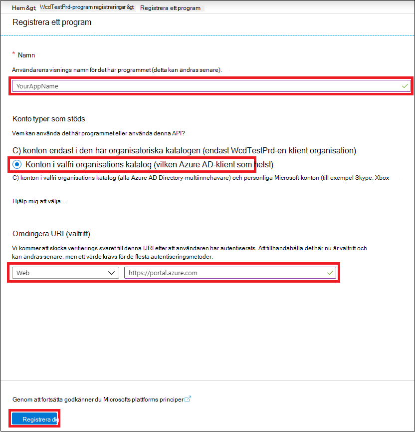
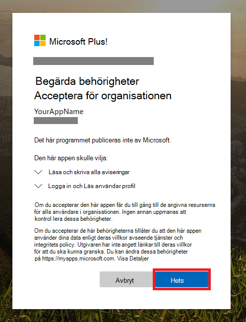

# <a name="create-an-app-with-partner-access-to-microsoft-365-defender-apis"></a>Skapa en app med partneråtkomst till Microsoft 365 Defender-API:er

[!INCLUDE [Microsoft 365 Defender rebranding](../includes/microsoft-defender.md)]

**Gäller för:**

- Microsoft 365 Defender

> [!IMPORTANT]
> Viss information gäller förhandsversioner av produkter som kan komma att ändras väsentligt innan de släpps till kommersiellt bruk. Microsoft ger inga garantier, uttryckliga eller underförstådda, med avseende på den information som anges här.

På den här sidan beskrivs hur du skapar en Azure Active Directory-app som har programmeringsåtkomst till Microsoft 365 Defender för användare i flera klientorganisationar. Appar med flera klientorganisationer är användbara när du arbetar med stora grupper av användare.

Om du behöver programmeringsåtkomst till Microsoft 365 Defender för en enskild användares räkning kan du gå till Skapa en app för att få åtkomst till [Microsoft 365 Defender-API:er för en användares räkning.](api-create-app-user-context.md) Om du behöver åtkomst utan att en användare uttryckligen definierats (till exempel om du skriver en bakgrundsapp eller ett bakgrundsljud) kan du gå till Skapa en app för att få åtkomst till [Microsoft 365 Defender](api-create-app-web.md)utan en användare. Om du är osäker på vilken typ av åtkomst du behöver kan du gå till [Komma igång.](api-access.md)

Microsoft 365 Defender visar mycket av sina data och åtgärder via en uppsättning programmässiga API:er. De HÄR API:erna hjälper dig att automatisera arbetsflöden och använda funktionerna i Microsoft 365 Defender. Den här API-åtkomsten kräver OAuth2.0-autentisering. Mer information finns i [OAuth 2.0 Authorization Code Flow.](https://docs.microsoft.com/azure/active-directory/develop/active-directory-v2-protocols-oauth-code)

I allmänhet måste du göra följande för att använda följande API:er:

- Skapa ett Azure Active Directory-program (Azure AD).
- Hämta en åtkomsttoken med hjälp av det här programmet.
- Använd token för att få åtkomst till Microsoft 365 Defender API.

Eftersom den här appen är en flera innehavare måste du också ha [administratörsmedgivande](https://docs.microsoft.com/azure/active-directory/develop/v2-permissions-and-consent#requesting-consent-for-an-entire-tenant) från varje klientorganisation för dess användares räkning.

I den här artikeln förklaras hur du:

- Skapa ett **Azure AD-program med** flera innehavare
- Få auktoriserat medgivande från din användaradministratör för ditt program för att få åtkomst till de Microsoft 365 Defender-resurser som behövs.
- Hämta en åtkomsttoken till Microsoft 365 Defender
- Verifiera token

Microsoft 365 Defender visar mycket av sina data och åtgärder via en uppsättning programmässiga API:er. De HÄR API:erna hjälper dig att automatisera arbetsflöden och nyfikna på microsoft 365 Defender-funktioner. API-åtkomsten kräver OAuth2.0-autentisering. Mer information finns i [OAuth 2.0 Authorization Code Flow.](https://docs.microsoft.com/azure/active-directory/develop/active-directory-v2-protocols-oauth-code)

I allmänhet måste du göra följande för att använda API:erna:

- Skapa ett **Azure AD-program med** flera innehavare.
- Få auktoriserat (godkännande) av din användaradministratör för programmet för att få åtkomst till de Microsoft 365 Defender-resurser som behövs.
- Hämta en åtkomsttoken med hjälp av det här programmet.
- Använd token för att få åtkomst till Microsoft 365 Defender API.

Följande steg med guide för hur du skapar ett Azure AD-program med flera innehavare, hämtar en åtkomsttoken till Microsoft 365 Defender och verifierar token.

## <a name="create-the-multi-tenant-app"></a>Skapa appen för flera innehavare

1. Logga in på [Azure](https://portal.azure.com) som användare med **rollen Global** administratör.

2. Gå till **Azure Active**  >  **Directory-appregistreringar**  >  **Ny registrering.**

   

3. I registreringsformuläret:

   - Välj ett namn för programmet.
   - Välj **Konton i valfri** organisationskatalog **(Azure AD-katalog) – Flera användare,** från kontotyper som stöds.
   - Fyll i avsnittet **Omdirigera URI.** Välj typ **av webb** och ange omdirigerings-URI **https://portal.azure.com** som.

   När du har fyllt i formuläret väljer du **Registrera.**

   

4. Välj API-behörigheter Lägg till **behörighets-API:er** som min organisation använder >, skriv Microsoft Threat Protection och  >    >   välj Microsoft **Threat Protection.**  Nu kan du komma åt Microsoft 365 Defender.

   > [!TIP]
   > *Microsoft Threat Protection* är ett tidigare namn för Microsoft 365 Defender och visas inte i den ursprungliga listan. Du måste börja skriva namnet i textrutan för att det ska visas.

   

5. Välj **programbehörigheter.** Välj de relevanta behörigheterna för ditt scenario (till exempel **Incident.Läsa.Alla)** och välj sedan Lägg **till behörigheter.**

   

    > [!NOTE]
    > Du måste välja relevant behörighet för ditt scenario. *Läs alla incidenter* är bara ett exempel. Ta reda på vilken behörighet du behöver i avsnittet **Behörigheter** i det API du vill anropa.
    >
    > Om du till exempel [vill köra avancerade frågor](api-advanced-hunting.md)väljer du behörigheten Kör avancerade frågor. om [du vill isolera en](https://docs.microsoft.com/windows/security/threat-protection/microsoft-defender-atp/isolate-machine)enhet väljer du behörigheten "Isolera dator".

6. Välj **Bevilja administratörsmedgivande.** Varje gång du lägger till en behörighet måste du välja **Ge administratörsmedgivande för** att den ska gälla.

    

7. Om du vill lägga till en hemligt i programmet väljer du **Certifikat & hemligheter,** lägger till en beskrivning till hemligheten och väljer sedan **Lägg till.**

    > [!TIP]
    > När du har **valt Lägg** till väljer du kopiera **det genererade hemliga värdet.** Du kommer inte att kunna hämta det hemliga värdet när du lämnar det.

    

8. Spela in ditt program-ID och ditt klient-ID någonstans säkert. De visas under Översikt **på** din programsida.

   

9. Lägg till programmet i användarens klientorganisation.

   Eftersom programmet interagerar med Microsoft 365 Defender åt dina användare behöver det godkännas för alla klientorganisationen du tänker använda det för.

   En **global administratör** från användarens klientorganisation måste visa medgivandelänken och godkänna programmet.

   Medgivande-länken är av formuläret:

   ```HTTP
   https://login.microsoftonline.com/common/oauth2/authorize?prompt=consent&client_id=00000000-0000-0000-0000-000000000000&response_type=code&sso_reload=true
   ```

   Siffrorna ska `00000000-0000-0000-0000-000000000000` ersättas med ditt Program-ID.

   När du har klickat på medgivandelänken loggar du in med den globala administratören för användarens klientorganisation och godkänner programmet.

   

   Du måste också be användaren om deras klientorganisations-ID. Klientorganisations-ID:t är en av identifierarna som används för att hämta åtkomsttoken.

- **Klart!** Du har registrerat ett program!
- Se exemplen nedan för insamling och validering av token.

## <a name="get-an-access-token"></a>Hämta en åtkomsttoken

Mer information om Azure AD-token finns i [självstudiekursen om Azure AD.](https://docs.microsoft.com/azure/active-directory/develop/active-directory-v2-protocols-oauth-client-creds)

> [!IMPORTANT]
> Även om exemplen i det här avsnittet uppmuntrar dig att klistra in i hemliga värden för teständamål, ska du **aldrig hårdkoda** hemligheter i ett program som körs i produktion. En tredje part kan använda din hemligt för att komma åt resurser. Du kan skydda dina appars hemligheter med hjälp av [Azure Key Vault.](https://docs.microsoft.com/azure/key-vault/general/about-keys-secrets-certificates) Ett praktiskt exempel på hur du kan skydda din app finns i Hantera hemligheter [i serverapparna med Azure-nyckelvalv.](https://docs.microsoft.com/learn/modules/manage-secrets-with-azure-key-vault/)

> [!TIP]
> I följande exempel använder du en användares klientorganisations-ID för att testa att skriptet fungerar.

### <a name="get-an-access-token-using-powershell"></a>Hämta en åtkomsttoken med hjälp av PowerShell

```PowerShell
# This code gets the application context token and saves it to a file named "Latest-token.txt" under the current directory.

$tenantId = '' # Paste your directory (tenant) ID here
$clientId = '' # Paste your application (client) ID here
$appSecret = '' # Paste your own app secret here to test, then store it in a safe place!

$resourceAppIdUri = 'https://api.security.microsoft.com'
$oAuthUri = "https://login.windows.net/$tenantId/oauth2/token"

$authBody = [Ordered] @{
    resource = $resourceAppIdUri
    client_id = $clientId
    client_secret = $appSecret
    grant_type = 'client_credentials'
}

$authResponse = Invoke-RestMethod -Method Post -Uri $oAuthUri -Body $authBody -ErrorAction Stop
$token = $authResponse.access_token

Out-File -FilePath "./Latest-token.txt" -InputObject $token

return $token
```

### <a name="get-an-access-token-using-c"></a>Hämta en åtkomsttoken med hjälp av C\#

> [!NOTE]
> Följande kod testades med Nuget Microsoft.IdentityModel.Clients.ActiveDirectory 3.19.8.

1. Skapa ett nytt konsolprogram.
1. Installera NuGet [Microsoft.IdentityModel.Clients.ActiveDirectory.](https://www.nuget.org/packages/Microsoft.IdentityModel.Clients.ActiveDirectory/)
1. Lägg till följande rad:

    ```C#
    using Microsoft.IdentityModel.Clients.ActiveDirectory;
    ```

1. Kopiera och klistra in följande kod i programmet (glöm inte att uppdatera de tre variablerna: `tenantId` , `clientId` , `appSecret` ):

    ```C#
    string tenantId = ""; // Paste your directory (tenant) ID here
    string clientId = ""; // Paste your application (client) ID here
    string appSecret = ""; // Paste your own app secret here to test, then store it in a safe place, such as the Azure Key Vault!

    const string authority = "https://login.windows.net";
    const string wdatpResourceId = "https://api.security.microsoft.com";

    AuthenticationContext auth = new AuthenticationContext($"{authority}/{tenantId}/");
    ClientCredential clientCredential = new ClientCredential(clientId, appSecret);
    AuthenticationResult authenticationResult = auth.AcquireTokenAsync(wdatpResourceId, clientCredential).GetAwaiter().GetResult();
    string token = authenticationResult.AccessToken;
    ```

### <a name="get-an-access-token-using-python"></a>Hämta en åtkomsttoken med Python

```Python
import json
import urllib.request
import urllib.parse

tenantId = '' # Paste your directory (tenant) ID here
clientId = '' # Paste your application (client) ID here
appSecret = '' # Paste your own app secret here to test, then store it in a safe place, such as the Azure Key Vault!

url = "https://login.windows.net/%s/oauth2/token" % (tenantId)

resourceAppIdUri = 'https://api.securitycenter.windows.com'

body = {
    'resource' : resourceAppIdUri,
    'client_id' : clientId,
    'client_secret' : appSecret,
    'grant_type' : 'client_credentials'
}

data = urllib.parse.urlencode(body).encode("utf-8")

req = urllib.request.Request(url, data)
response = urllib.request.urlopen(req)
jsonResponse = json.loads(response.read())
aadToken = jsonResponse["access_token"]
```

### <a name="get-an-access-token-using-curl"></a>Få en åtkomsttoken genom att avböja

> [!NOTE]
> Krullning är förinstallerat i Windows 10, versionerna 1803 och senare. För andra versioner av Windows laddar du ned och installerar verktyget direkt från den [officiella avbildningswebbplatsen.](https://curl.haxx.se/windows/)

1. Öppna en kommandotolk och ange CLIENT_ID ditt Azure-program-ID.
1. Ställ CLIENT_SECRET till Azure-programhemligheten.
1. Ange TENANT_ID Azure-klientorganisations-ID för den användare som vill använda appen för att få åtkomst till Microsoft 365 Defender.
1. Kör följande kommando:

```bash
curl -i -X POST -H "Content-Type:application/x-www-form-urlencoded" -d "grant_type=client_credentials" -d "client_id=%CLIENT_ID%" -d "scope=https://securitycenter.onmicrosoft.com/windowsatpservice/.default" -d "client_secret=%CLIENT_SECRET%" "https://login.microsoftonline.com/%TENANT_ID%/oauth2/v2.0/token" -k
```

Ett lyckat svar ser ut så här:

```bash
{"token_type":"Bearer","expires_in":3599,"ext_expires_in":0,"access_token":"eyJ0eXAiOiJKV1QiLCJhbGciOiJSUzI1NiIsIn <truncated> aWReH7P0s0tjTBX8wGWqJUdDA"}
```

## <a name="validate-the-token"></a>Verifiera token

1. Kopiera och klistra in tokenet på [webbplatsen för JSON-webbtokens validator, JWT,](https://jwt.ms) för att avkoda det.
1. Kontrollera att rollerna *gör* anspråk i den avkodade token innehåller de önskade behörigheterna.

I följande bild visas en avkodad token som förvärvats från en app, med ```Incidents.Read.All``` ```Incidents.ReadWrite.All``` och ```AdvancedHunting.Read.All``` behörigheter:


## <a name="use-the-token-to-access-the-microsoft-365-defender-api"></a>Använda token för att få åtkomst till Microsoft 365 Defender API

1. Välj det API du vill använda (ärenden eller avancerad sökning). Mer information finns i Microsoft [365 Defender-API:er som stöds.](api-supported.md)
2. I http-begäran som du ska skicka anger du rubriken för auktoriseringen till , Bearer är auktoriseringsschemat och token som `"Bearer" <token>` ditt verifierade  token. 
3. Tokenet förfaller inom en timme. Du kan skicka mer än en begäran under denna tid med samma token.

I följande exempel visas hur du skickar en begäran om att få en lista över incidenter **med hjälp av C#**.

```C#
   var httpClient = new HttpClient();
   var request = new HttpRequestMessage(HttpMethod.Get, "https://api.security.microsoft.com/api/incidents");

   request.Headers.Authorization = new AuthenticationHeaderValue("Bearer", token);

   var response = httpClient.SendAsync(request).GetAwaiter().GetResult();
```

## <a name="related-articles"></a>Relaterade artiklar

- [Översikt över API:er för Microsoft 365 Defender](api-overview.md)
- [Få åtkomst till API:er för Microsoft 365 Defender](api-access.md)
- [Skapa programmet Hello world](api-hello-world.md)
- [Skapa en app för att komma åt Microsoft 365 Defender utan en användare](api-create-app-web.md)
- [Skapa en app för att få åtkomst till Microsoft 365 Defender-API:er för en användares räkning](api-create-app-user-context.md)
- [Läs mer om API-begränsningar och -licensiering](api-terms.md)
- [Förstå felkoder](api-error-codes.md)
- [Hantera hemligheter i dina serverappar med Azure-nyckelvalv](https://docs.microsoft.com/learn/modules/manage-secrets-with-azure-key-vault/)
- [OAuth 2.0-autentisering för användar logga in och API-åtkomst](https://docs.microsoft.com/azure/active-directory/develop/active-directory-v2-protocols-oauth-code)
