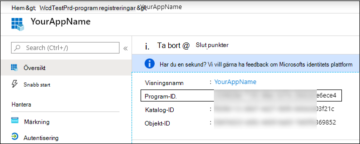

# <a name="partner-access-through-microsoft-365-defender-apis"></a>Partner åtkomst via Microsoft 365 Defender API: er

[!INCLUDE [Microsoft 365 Defender rebranding](../includes/microsoft-defender.md)]


**Gäller för:**
- Microsoft 365 Defender

>[!IMPORTANT] 
>Vissa uppgifter gäller för FÖRLANSERADE produkter som kan komma att ändras väsentligt innan de saluförs. Microsoft lämnar inga garantier, uttryckliga eller underförstådda, med avseende på informationen som tillhandahålls här.


På den här sidan beskrivs hur du skapar ett AAD-program för att få programmatisk åtkomst till Microsoft 365 Defender åt dina kunder.

Microsoft 365 Defender visar mycket av dess data och åtgärder via en uppsättning API: er. Dessa API: er hjälper dig att automatisera arbets flöden och förnyas baserat på Microsoft 365 Defender-funktioner. För API-åtkomst krävs autentisering med OAuth 2.0. Mer information finns i [verifierings kod flödet för OAuth-2,0](https://docs.microsoft.com/azure/active-directory/develop/active-directory-v2-protocols-oauth-code).

I allmänhet måste du utföra följande steg för att använda API:
- Skapa ett AAD **-program med flera innehavare** .
- Få godkännande (godkänt) av din kund administratör för ditt program för att få åtkomst till Microsoft 365 Defender-resurser som behövs.
- Skaffa en åtkomsttoken med det här programmet.
- Använd token för att få åtkomst till Microsoft 365 Defender API.

Här följer instruktioner för hur du skapar ett AAD-program, hämtar en åtkomsttoken till Microsoft 365 Defender och validerar token.

## <a name="create-the-multi-tenant-app"></a>Skapa appen för flera innehavare

1. Logga in på din [Azure-klient organisation](https://portal.azure.com) med en användare som har rollen **Global administratör** .

2. Navigera till **Azure Active Directory** -  >  **programregistreringar**  >  **ny registrering**. 

   

3. I registrerings formuläret:

    - Välj ett namn för programmet.

    - Konto typer som stöds-konton i valfri organisations katalog.

    - Omdirigera URI-typ: webb, URI: https://portal.azure.com

    


4. Ge ditt program åtkomst till Microsoft 365 Defender och tilldela det den minsta behörighet som krävs för att slutföra integrationen.

   - På din program sida klickar du på **API-behörigheter**  >  **Add permission**  >  **API min organisation använder** > **Microsoft 365 Defender** och klickar på **Microsoft 365 Defender**.

   >[!NOTE]
   >Microsoft 365 Defender visas inte i den ursprungliga listan. Du måste börja skriva dess namn i text rutan för att se det.

   
   
   ### <a name="request-api-permissions"></a>Begära API-behörigheter

   Ta reda på vilken behörighet du behöver genom att titta i avsnittet **behörigheter** i det API du är intresse rad av. 

   I följande exempel kommer vi att använda behörigheten **"Läs alla händelser"** :

   Välj incidenter för **program behörigheter**  >  **. Läs alla** > Klicka på **Lägg till behörigheter**

   


5. Klicka på **bevilja medgivande**

    >[!NOTE]
    >Varje gång du lägger till behörighet måste du klicka på **bevilja medgivande** för att den nya behörigheten ska börja gälla.

    

6. Lägg till en hemlighet i programmet.

    - Klicka på **certifikat & hemligheter** , Lägg till en beskrivning till hemligheten och klicka på **Lägg till**.

    >[!IMPORTANT]
    > När du har valt **Lägg till** **kopierar du det genererade hemliga värdet**. Du kommer inte att kunna hämta efter att du har lämnat!

    

7. Skriv in ditt program-ID:

   - Gå till **Översikt** och kopiera följande på program sidan:

   

8. Lägg till ansökan till kund innehavaren.

    Du behöver programmet vara godkänt i varje kund innehavare för att du ska kunna använda det. Detta beror på att ditt program interagerar med Microsoft 365 Defender-programmet åt din kund.

    En användare med **Global administratör** från kundens klient organisation måste klicka på medgivande länken och godkänna programmet.

    Godkännande länken är av formen:

    ```
    https://login.microsoftonline.com/common/oauth2/authorize?prompt=consent&client_id=00000000-0000-0000-0000-000000000000&response_type=code&sso_reload=true
    ```

    Där 00000000-0000-0000-0000-000000000000 ska ersättas med ditt program-ID

    När du har klickat på länken för godkännande loggar du in på den globala administratören för kundens klient organisation och godkänner programmet.

    

    Dessutom måste du be din kund om sitt klient-ID och spara det för framtida bruk när du hämtar token.

- **Åstadkomma!** Du har registrerat ett program! 
- Se exemplen nedan för hämtning av token och verifiering.

## <a name="get-an-access-token-examples"></a>Få ett exempel på en åtkomsttoken:

>[!NOTE]
> För att få till gång till din kunds räkning kan du använda kundens klient organisations-ID på följande token-hämtningar.

<br>Mer information om AAD-token finns i [artikeln om AAD-vägledning](https://docs.microsoft.com/azure/active-directory/develop/active-directory-v2-protocols-oauth-client-creds)

### <a name="using-powershell"></a>Använda PowerShell

```
# That code gets the App Context Token and save it to a file named "Latest-token.txt" under the current directory
# Paste below your Tenant ID, App ID and App Secret (App key).

$tenantId = '' ### Paste your tenant ID here
$appId = '' ### Paste your Application ID here
$appSecret = '' ### Paste your Application key here

$resourceAppIdUri = 'https://api.security.microsoft.com'
$oAuthUri = "https://login.windows.net/$TenantId/oauth2/token"
$authBody = [Ordered] @{
    resource = "$resourceAppIdUri"
    client_id = "$appId"
    client_secret = "$appSecret"
    grant_type = 'client_credentials'
}
$authResponse = Invoke-RestMethod -Method Post -Uri $oAuthUri -Body $authBody -ErrorAction Stop
$token = $authResponse.access_token
Out-File -FilePath "./Latest-token.txt" -InputObject $token
return $token
```

### <a name="using-c"></a>Använda C#:

>Koden nedan har testats med NuGet Microsoft. IdentityModel. clients. ActiveDirectory

- Skapa ett nytt konsol program
- Installera NuGet [Microsoft. IdentityModel. clients. ActiveDirectory](https://www.nuget.org/packages/Microsoft.IdentityModel.Clients.ActiveDirectory/)
- Lägg till nedan med

    ```
    using Microsoft.IdentityModel.Clients.ActiveDirectory;
    ```

- Kopiera/klistra in koden nedan i programmet (Glöm inte att uppdatera tre variabler: ```tenantId, appId, appSecret``` )

    ```
    string tenantId = "00000000-0000-0000-0000-000000000000"; // Paste your own tenant ID here
    string appId = "11111111-1111-1111-1111-111111111111"; // Paste your own app ID here
    string appSecret = "22222222-2222-2222-2222-222222222222"; // Paste your own app secret here for a test, and then store it in a safe place! 

    const string authority = "https://login.windows.net";
    const string mtpResourceId = "https://api.security.microsoft.com";

    AuthenticationContext auth = new AuthenticationContext($"{authority}/{tenantId}/");
    ClientCredential clientCredential = new ClientCredential(appId, appSecret);
    AuthenticationResult authenticationResult = auth.AcquireTokenAsync(mtpResourceId, clientCredential).GetAwaiter().GetResult();
    string token = authenticationResult.AccessToken;
    ```


### <a name="using-curl"></a>Använda sväng

> [!NOTE]
> Proceduren nedan som ska vara en sväng för Windows är redan installerad på datorn

- Öppna ett kommando fönster
- Ange CLIENT_ID till ditt Azure-program-ID
- Ange CLIENT_SECRET till din Azure Application Secret
- Ange TENANT_ID till det Azure TENANT ID för kunden som vill använda ditt program för att komma åt Microsoft 365 Defender-programmet
- Kör kommandot nedan:

```
curl -i -X POST -H "Content-Type:application/x-www-form-urlencoded" -d "grant_type=client_credentials" -d "client_id=%CLIENT_ID%" -d "scope=https://api.security.microsoft.com.default" -d "client_secret=%CLIENT_SECRET%" "https://login.microsoftonline.com/%TENANT_ID%/oauth2/v2.0/token" -k
```

Du får ett svar på formuläret:

```
{"token_type":"Bearer","expires_in":3599,"ext_expires_in":0,"access_token":"eyJ0eXAiOiJKV1QiLCJhbGciOiJSUzI1NiIsIn <truncated> aWReH7P0s0tjTBX8wGWqJUdDA"}
```

## <a name="validate-the-token"></a>Validera token

Sanity kontrol lera att du har rätt token:

- Kopiera/klistra in i [JWT](https://jwt.ms) det token du får i föregående steg för att avkoda det
- Verifiera att du får en "roles"-anspråk med de önskade behörigheterna
- I skärm bilden nedan kan du se ett avkodat token som hämtats från ett program med flera behörigheter till Microsoft 365 Defender:
- "Tid"-anspråk är det klient-ID som token tillhör.


## <a name="use-the-token-to-access-microsoft-365-defender-api"></a>Använda token för att få åtkomst till Microsoft 365 Defender API

- Välj det API du vill använda, mer information finns i [Microsoft 365 Defender API: er](api-supported.md)
- Ange auktorisations huvudet i http-begäran som du skickar till "Bearer {token}" (innehavaren är godkännandet)
- Giltighets tiden för token är 1 timme (du kan skicka mer än en begäran med samma token)

- Exempel på att skicka en begäran om att få en lista över incidenter **med C#** 
    ```
    var httpClient = new HttpClient();

    var request = new HttpRequestMessage(HttpMethod.Get, "https://api.security.microsoft.com/api/incidents");

    request.Headers.Authorization = new AuthenticationHeaderValue("Bearer", token);

    var response = httpClient.SendAsync(request).GetAwaiter().GetResult();

    // Do something useful with the response
    ```

## <a name="related-topics"></a>Relaterade ämnen 

- [Gå till API för Microsoft 365 Defender](api-access.md)
- [Åtkomst till Microsoft 365 Defender med program kontext](api-create-app-web.md)
- [Åtkomst till Microsoft 365 Defender med användar kontext](api-create-app-user-context.md)
