# Konfigurera Microsoft Threat Protection-pelare för testlabbeta

**Gäller:**
- Microsoft Hotskydd

Att skapa en testlabbmiljö för Microsoft Threat Protection och distribuera den är en trefasprocess:

 
<table border="0" width="100%" align="center">
  <tr style="text-align:center;">
    <td align="center" style="width:25%; border:0;" >
      <a href= "https://docs.microsoft.com/microsoft-365/security/mtp/prepare-mtpeval?view=o365-worldwide"> 
        
       Fas 1: Förbered</a> 
    </td>
     <td align="center">
      <a href="https://docs.microsoft.com/microsoft-365/security/mtp/setup-mtpeval?view=o365-worldwide">
        
       Fas 2: Installation</a> 
    </td>
    <td align="center" bgcolor="#d5f5e3">
      <a href="https://docs.microsoft.com/microsoft-365/security/mtp/config-mtpeval?view=o365-worldwide">
        
       Fas 3: Konfigurera & ombord</a> 
</td>

  </tr>
</table>

Du befinner dig för närvarande i konfigurationsfasen.

Förberedelse är nyckeln till en lyckad distribution. I den här artikeln får du vägledning om de punkter du behöver tänka på när du förbereder distributionen av Microsoft Defender ATP.

## Pelare för skydd av Microsofts hotskydd
Microsoft Threat Protection består av fyra pelare. Även om en pelare redan kan ge värde till nätverksorganisationens säkerhet, ger aktivering av de fyra Microsoft Threat Protection-pelarna din organisation mest värde.

  

Det här avsnittet hjälper dig att konfigurera:
-   Office 365 Avancerat skydd
-   Azure Advanced Threat Protection 
-   Microsoft Cloud App Security
-   Microsoft Defender Avancerat skydd

## Konfigurera avancerat hotskydd för Office 365
>[!NOTE]
>Hoppa över det här steget om du redan har aktiverat förhandsskydd för Office 365.Skip this step if you have already enabled Office 365 Advanced Threat Protection. 

Det finns en PowerShell-modul som kallas *Office 365 Advanced Threat Protection Recommended Configuration Analyzer (ORCA)* som hjälper till att avgöra några av dessa inställningar. När du kör som administratör i din klientorganisation, get-ORCAReport kommer att bidra till att generera en bedömning av anti-spam, anti-phish och andra inställningar meddelandehygien. Du kan ladda ner denna modul från https://www.powershellgallery.com/packages/ORCA/ . 

1. Navigera till [Office 365 Security & Compliance Center](https://protection.office.com/homepage)Threat  >  **management**  >  **Policy**.
  
 
2. Klicka på **ATP-anti-nätfiske,** välj **Skapa** och fyll i principnamnet och beskrivningen. Klicka på **Nästa**.
  

>[!NOTE]
>Redigera din avancerade ATP-policy mot nätfiske. Ändra **avancerad nätfisketröskel** till **2 - Aggressiv**.
 

3. Klicka på den nedrullningsbara menyn **Lägg till ett villkor** och välj domänen/domänerna som mottagardomän. Klicka på **Nästa**.
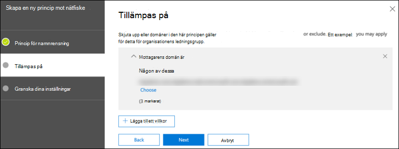  
 
4. Granska dina inställningar. Klicka på **Skapa den här principen** för att bekräfta. 
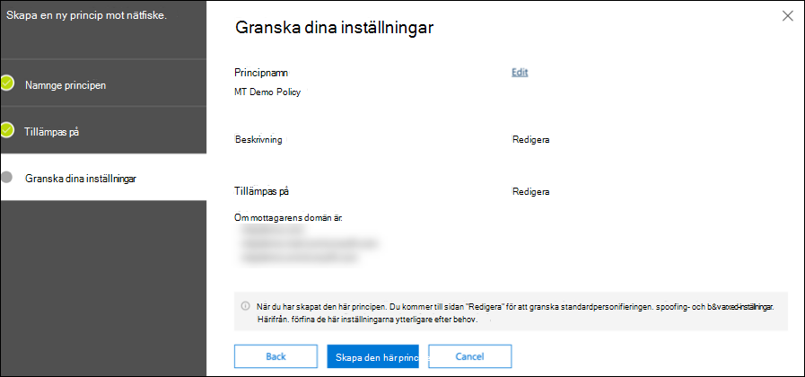  
 
5. Välj **ATP Säkra bilagor** och välj alternativet Aktivera **ATP för SharePoint, OneDrive och Microsoft Teams.**  
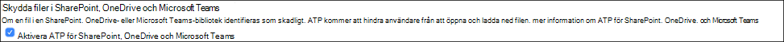  

6. Klicka på ikonen + om du vill skapa en ny princip för säker bifogade filer och tillämpa den som mottagaredomän på dina domäner. Klicka på **Spara**.
  
 
7. Välj sedan **atp-principen för säkra länkar** och klicka sedan på pennikonen för att redigera standardprincipen.

8. Kontrollera att alternativet **Spåra inte när användare klickar på säkra länkar** inte är markerat, medan resten av alternativen är markerade. Mer information finns i inställningar för [säkra länkar.](https://docs.microsoft.com/microsoft-365/security/office-365-security/recommended-settings-for-eop-and-office365-atp?view=o365-worldwide) Klicka på **Spara**. 
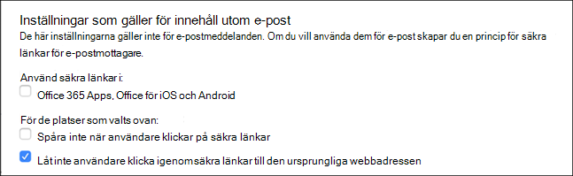  

9. Välj sedan policyn **mot skadlig kod,** välj standardikonen och välj pennikonen.

10. Klicka på **Inställningar** och välj **Ja och använd standardmeddelandetexten** för att aktivera **svar på identifiering av skadlig kod**. Aktivera **filtret Vanliga typer av bifogade filer.** Klicka på **Spara**.
   
  
11. Navigera till [Office 365 Security &](https://protection.office.com/homepage)  >  **Search**  >  **Audit-loggsökning för** efterlevnadscenter och aktivera granskning.  
  

12. Integrera Office 365 ATP med Microsoft Defender ATP. Navigera till [Office 365 Security & Compliance Center](https://protection.office.com/homepage)Threat  >  **management**  >  **Explorer** och välj **WDATP-inställningar** längst upp till höger på skärmen. Aktivera **Anslut till Windows ATP**i dialogrutan Microsoft Defender ATP-anslutning .
  

## Konfigurera Avancerat hotskydd för Azure
>[!NOTE]
>Hoppa över det här steget om du redan har aktiverat Azure Advanced Threat Protection

1. Navigera till [Microsoft 365 Security Center](https://security.microsoft.com/info) > välja Fler **resurser**Azure Advanced  >  **Threat Protection**.
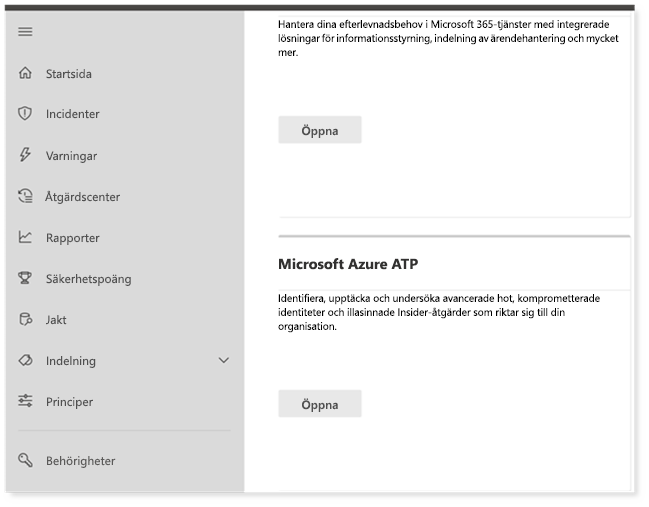  

2. Klicka på Skapa om du vill starta guiden Avancerat skydd mot Azure.Click **Create** to start the Azure Advanced Threat Protection wizard. 
 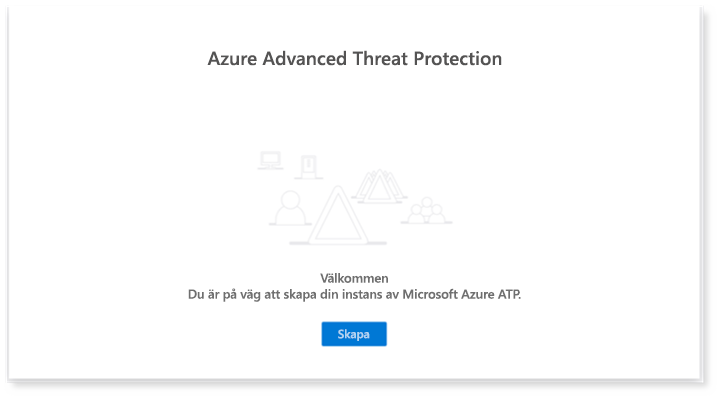  

3. Välj **Ange ett användarnamn och lösenord för att ansluta till Active Directory-skogen**.  
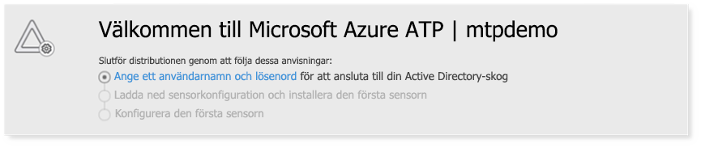  

4. Ange lokala autentiseringsuppgifter för Active Directory. Detta kan vara alla användarkonton som har läsbehörighet till Active Directory.
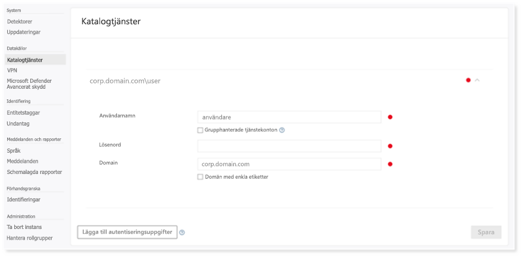  

5. Välj sedan **Hämta sensorinstallation och** överför filen till domänkontrollanten. 
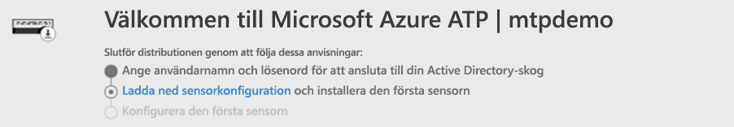  

6. Kör installationen av Azure ATP-sensor och börja följa guiden.
 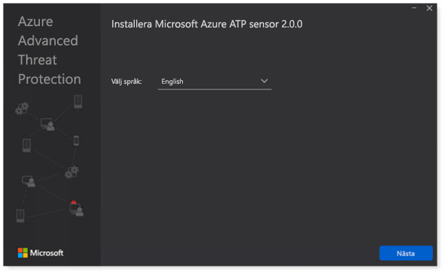  
 
7. Klicka på **Nästa** vid sensordistributionstypen.
   
 
8. Kopiera åtkomstnyckeln som du behöver för att ange den nästa i guiden.
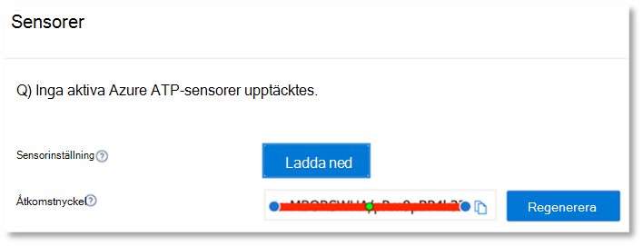  
 
9. Kopiera åtkomstnyckeln till guiden och klicka på **Installera**. 
 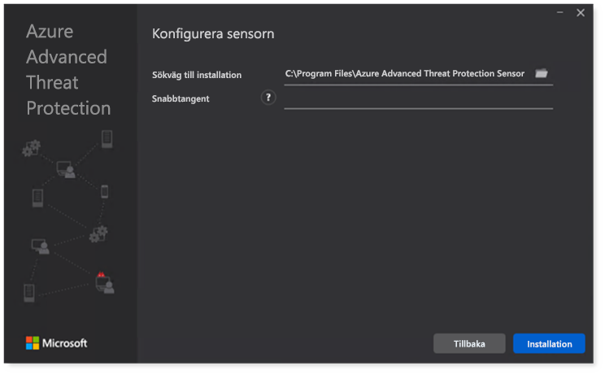  

10. Grattis, du har konfigurerat Azure Advanced Threat Protection på domänkontrollanten.
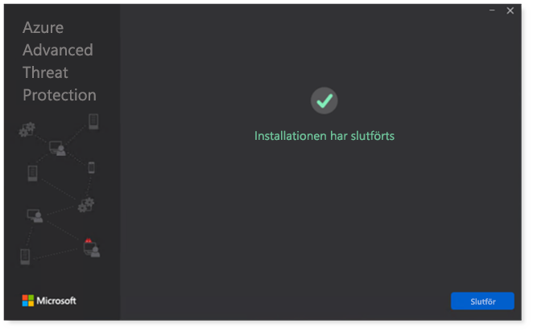  
 
11. Under avsnittet [Azure Azure ATP-inställningar](https://go.microsoft.com/fwlink/?linkid=2040449) väljer du **Windows Defender ATP**och aktiverar sedan växlingsknappen. Klicka på **Spara**. 
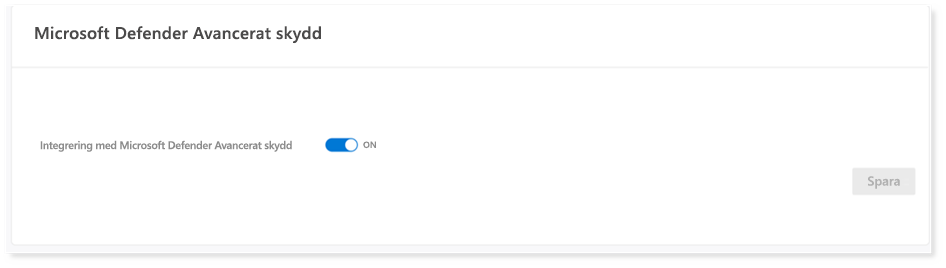  

>[!NOTE]
>Windows Defender ATP har bytt namn till Microsoft Defender ATP. Omprofilering förändringar över alla våra portaler håller på att rullas ut för konsekvens.

## Konfigurera Säkerhet för Microsoft Cloud-appar
>[!NOTE]
>Hoppa över det här steget om du redan har aktiverat Microsoft Cloud App Security. 

1. Navigera till [Microsoft 365 Security Center](https://security.microsoft.com/info)Fler  >  **resurser**Microsoft Cloud  >  **App Security**.
  

2. Vid informationsfrågan om att integrera Azure ATP väljer du **Aktivera Azure ATP-dataintegration**. 
 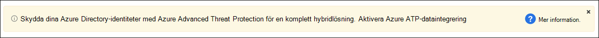  

>[!NOTE]
>Om du inte ser den här prompten kan det innebära att din Azure ATP-dataintegrering redan har aktiverats. Om du är osäker kontaktar du dock IT-administratören för att bekräfta. 

3. Gå till **Inställningar**, aktivera växlingsknappen för **Azure ATP-integrering** och klicka sedan på **Spara**. 
  
>[!NOTE]
>För nya Azure ATP-instanser aktiveras den här integrationsväxlingen automatiskt. Bekräfta att din Azure ATP-integrering har aktiverats innan du går vidare till nästa steg.
 
4. Under inställningarna för molnidentifiering väljer du **Microsoft Defender ATP-integrering**och aktiverar integreringen. Klicka på **Spara**.
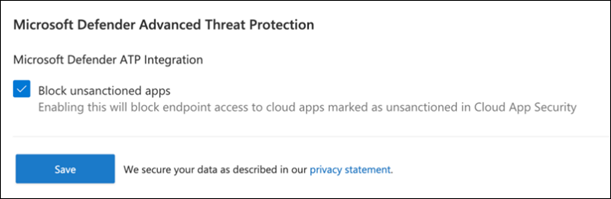  

5. Under Molnidentifieringsinställningar väljer du **Användarberikande**och aktiverar sedan integreringen med Azure Active Directory.
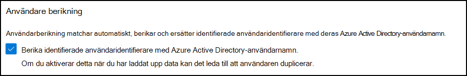  

## Konfigurera avancerat hotskydd för Microsoft Defender
>[!NOTE]
>Hoppa över det här steget om du redan har aktiverat Microsoft Defender Advanced Threat Protection.

1. Navigera till [Microsoft 365 Security Center](https://security.microsoft.com/info)Mer  >  **resurser**Microsoft Defender  >  **Security Center**. Klicka på **Öppna**.
   
 
2. Följ guiden Avancerat skydd mot microsoft defender.Follow the Microsoft Defender Advanced Threat Protection wizard. Klicka på **Nästa**. 
   

3. Välj baserat på önskad plats för datalagring, datalagringsprincip, organisationsstorlek och opt-in för förhandsversionsfunktioner. 
   
>[!NOTE]
>Du kan inte ändra vissa inställningar, till exempel datalagringsplats, efteråt. 
 

Klicka på **Nästa**. 

4. Klicka på **Fortsätt** så etablerar microsoft defender ATP-klienten.
 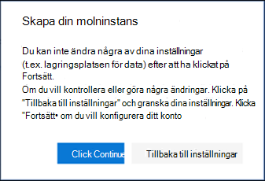  

5. Ombord på dina slutpunkter via grupprinciper, Microsoft Slutpunktshanteraren eller genom att köra ett lokalt skript till Microsoft Defender ATP. För enkelhetens skull använder den här guiden det lokala skriptet.

6. Klicka på **Hämta paket** och kopiera introduktionsskriptet till slutpunkterna.  
 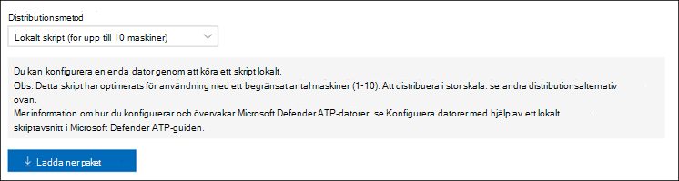  

7. På slutpunkten kör du introduktionsskriptet som administratör och väljer Y.
   

8. Grattis, du har onboarded din första slutpunkt.  
   

9. Kopiera in identifieringstestet från Atp-guiden Microsoft Defender.
   

10. Kopiera PowerShell-skriptet till en upphöjd kommandotolk och kör det. 
   

11. Välj **Börja använda Microsoft Defender ATP** i guiden.
   
 
12. Besök [Microsoft Defender Security Center](https://securitycenter.windows.com/). Gå till **Inställningar** och välj sedan **Avancerade funktioner**. 
   

13. Aktivera integreringen med **Azure Advanced Threat Protection**.  
 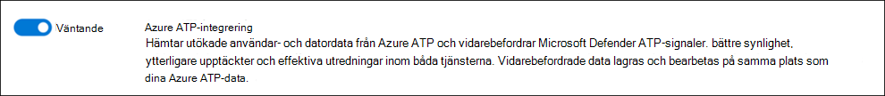  

14. Aktivera integreringen med **Office 365 Threat Intelligence**.
 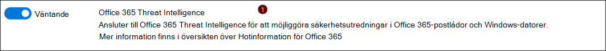  

15. Aktivera integrering med **Microsoft Cloud App Security**.
 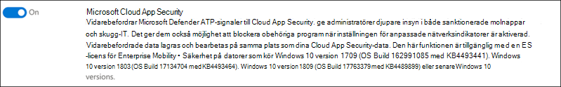  

16. Bläddra nedåt och klicka på **Spara inställningar** för att bekräfta de nya integreringarna.
 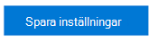  

## Aktivera Microsoft Hotskydd
>[!NOTE]
>Från och med den 1 juni 2020 aktiverar Microsoft automatiskt Microsoft Threat Protection-funktioner för alla berättigade klienter. Mer information finns i den här [artikeln i Microsoft Tech Community om licensberättigande.](https://techcommunity.microsoft.com/t5/security-privacy-and-compliance/microsoft-threat-protection-will-automatically-turn-on-for/ba-p/1345426) 
 

Gå till [Microsoft 365 Security Center](https://security.microsoft.com/homepage). Navigera till **Inställningar** och välj sedan **Microsoft Threat Protection**.
 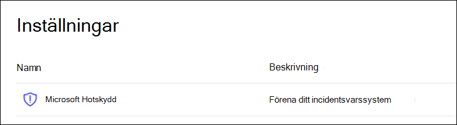  

Grattis! Du har precis skapat testlabbmiljön för Microsoft Threat Protection! Du kan nu simulera en attack och se hur cross-produktfunktionerna identifierar, skapar aviseringar och automatiskt svarar på en fillös attack på en slutpunkt.

## Nästa steg
[Generera en testavisering](generate-test-alert.md).
