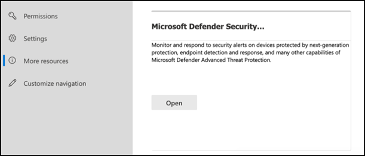
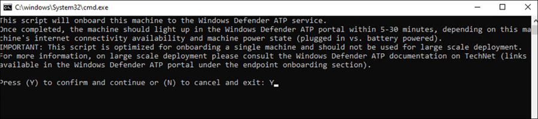

# Konfigurera Microsoft 365 Defender-pelare för ditt testlabb eller pilotmiljö

[!INCLUDE [Microsoft 365 Defender rebranding](../includes/microsoft-defender.md)]

**Gäller för:**
- Microsoft 365 Defender

Att skapa ett testlabb eller pilotmiljö i Microsoft 365 Defender och distribuera den är en process i tre steg:

| [Fas 1: Förbereda](prepare-mtpeval.md) | [Fas 2: Konfigurera](setup-mtpeval.md) | Fas 3: Onboard |  [Tillbaka till pilotspelboken](mtp-pilot.md) |
|--|--|--|--|
|| |*Du är här!* | |

Du befinner dig för närvarande i konfigurationsfasen.

Förberedelse är avgörande för en lyckad distribution. I den här artikeln får du vägledning om de punkter du behöver tänka på när du förbereder för distribution av Microsoft Defender för Slutpunkt.

## Microsoft 365 Defender-pelare
Microsoft 365 Defender består av fyrapelare. Även om en av de två pelarna redan kan ge värde åt nätverksorganisationens säkerhet, ger de fyra Microsoft 365 Defender-pelarna din organisation mest värde.

I det här avsnittet får du hjälp med att konfigurera:
-   Microsoft Defender för Office 365
-   Microsoft Defender for Identity 
-   Microsoft Cloud App Security
-   Microsoft Defender för Endpoint

## Konfigurera Microsoft Defender för Office 365

>[!NOTE]
>Hoppa över det här steget om du redan har aktiverat Defender för Office 365. 

Det finns en PowerShell-modul som kallas *Office 365 Advanced Threat Protection Recommended Configuration Analyzer (ORCA)* som hjälper dig att avgöra några av de här inställningarna. När du kör som administratör i klientorganisationen kan du använda GET-ORCAReport för att generera en utvärdering av skydd mot skräppost, nätfjädrade meddelanden och andra inställningar för att skapa meddelanden. Du kan hämta den här modulen https://www.powershellgallery.com/packages/ORCA/ från. 

1. Gå till [Office 365 Security & Compliance Center](https://protection.office.com/homepage)Threat  >  **Management**  >  **Policy.**

   
 
2. Klicka **på Skydd mot nätfiske,** **välj** Skapa och fyll i principens namn och beskrivning. Klicka på **Nästa**.

   

   > [!NOTE]
   > Redigera avancerad nätfiskeprincip i Microsoft Defender för Office 365. Ändra **avancerad nätfisketröskel till** **2 – Aggressiv.**

3. Klicka på **listrutan Lägg** till ett villkor och välj dina domäner som mottagardomän. Klicka på **Nästa**.

   
 
4. Granska inställningarna. Klicka **på Skapa den här principen för** att bekräfta. 

   
 
5. Välj **Säkra bifogade** filer och välj Aktivera **ATP för SharePoint, OneDrive och Microsoft Teams.**

   

6. Klicka på +-ikonen för att skapa en ny princip för säkra bifogade filer och använd den som mottagardomän för domänerna. Klicka på **Spara**.

   
 
7. Välj sedan principen Säkra **länkar** och klicka sedan på pennikonen för att redigera standardprincipen.

8. Se till att **alternativet Spåra inte när användare klickar** på säkra länkar inte är markerat, medan resten av alternativen är markerade. Se [inställningarna för säkra länkar](https://docs.microsoft.com/microsoft-365/security/office-365-security/recommended-settings-for-eop-and-office365-atp) för mer information. Klicka på **Spara**. 

   

9. Välj sedan **standardprincipen** för skadlig programvara och sedan pennikonen.

10. Klicka **på Inställningar** och välj Ja och använd **standardmeddelandetexten för** att aktivera svar för identifiering av skadlig **kod.** Aktivera filtret **För vanliga bifogade filer.** Klicka på **Spara**.

    
  
11. Gå till [Office 365-& granskningsloggsökning](https://protection.office.com/homepage)i  >    >  **Efterlevnadscenter** och aktivera granskning.

    

12. Integrera Microsoft Defender för Office 365 med Microsoft Defender för Slutpunkt. Gå till [Office 365 Security & Compliance Center](https://protection.office.com/homepage)Threat Management Explorer och välj Microsoft Defender för Slutpunktsinställningar i det övre högra hörnet av  >    >   skärmen.  I dialogrutan Defender för slutpunktsanslutning aktiverar du **Anslut till Microsoft Defender för Slutpunkt.**

    

## Konfigurera Microsoft Defender för identitet

>[!NOTE]
>Hoppa över det här steget om du redan har aktiverat Microsoft Defender för identitet

1. Gå till [Microsoft 365 Säkerhetscenter och >](https://security.microsoft.com/info) välja Fler **resurser** Microsoft Defender  >  **för identitet.**

   

2. Klicka **på Skapa** för att starta guiden Microsoft Defender för identitet. 

   

3. Välj **Ange ett användarnamn och lösenord för att ansluta till Active Directory-skogen.**  

   

4. Ange lokala autentiseringsuppgifter för Active Directory. Det kan vara alla användarkonton som har läsbehörighet till Active Directory.

   

5. Välj sedan Ladda **ned sensorinstallationen** och överför filen till domänkontrollanten.

   

6. Kör Microsoft Defender för konfiguration av identitets sensor och börja följa guiden.

   
 
7. Klicka **på Nästa** på sensordistributionstypen.

   
 
8. Kopiera snabbtangenten eftersom du måste ange den nästa i guiden.

   
 
9. Kopiera snabbtangenten till guiden och klicka på **Installera.** 

   

10. Grattis! Du har konfigurerat Microsoft Defender för identitet på domänkontrollanten.

    
 
11. Under avsnittet [Inställningar för Microsoft Defender](https://go.microsoft.com/fwlink/?linkid=2040449) för identitet väljer du **Microsoft Defender för Slutpunkt **. Aktivera sedan växlingsknappen. Klicka på **Spara**. 

    

>[!NOTE]
>Windows Defender ATP har rebranded as Microsoft Defender för Endpoint. Rebranding changes across all of our portals are under rolled out the consistency.

## Konfigurera Microsoft Cloud App-säkerhet

>[!NOTE]
>Hoppa över det här steget om du redan har aktiverat Microsoft Cloud App Security. 

1. Gå till [Microsoft 365 Säkerhetscenter](https://security.microsoft.com/info)  >  **Fler resurser** Microsoft Cloud App  >  **Security.**

   

2. När du uppmanas att integrera Microsoft Defender för identitet väljer du **Aktivera Microsoft Defender för identitetsdataintegrering.**
  
   

   > [!NOTE]
   > Om du inte ser det här alternativet kan det innebära att dataintegreringen i Microsoft Defender för identitet redan har aktiverats. Om du är osäker kontaktar du IT-administratören för att bekräfta. 

3. Gå till **Inställningar,** aktivera växlingsknappen **för Microsoft Defender för** identitetsintegrering och klicka sedan på **Spara.** 

   
   
   > [!NOTE]
   > För nya Microsoft Defender för identitetsinstanser aktiveras den här integreringsreglaget automatiskt. Kontrollera att Microsoft Defender för identitetsintegrering har aktiverats innan du går vidare till nästa steg.
 
4. Under inställningarna för molnidentifiering väljer du **Microsoft Defender för slutpunktsintegrering** och aktiverar sedan integreringen. Klicka på **Spara**.

   

5. Under inställningar för molnidentifiering **väljer du Användarberikning** och aktiverar sedan integreringen med Azure Active Directory.

   

## Konfigurera Microsoft Defender för slutpunkt

>[!NOTE]
>Hoppa över det här steget om du redan har aktiverat Microsoft Defender för Slutpunkt.

1. Gå till [Microsoft 365 Säkerhetscenter](https://security.microsoft.com/info)  >  **Fler resurser** Microsoft Defender  >  **Säkerhetscenter.** Klicka **på Öppna.**

   
 
2. Följ guiden Microsoft Defender för slutpunkt. Klicka på **Nästa**. 

   

3. Välj baserat på önskad datalagringsplats, databevarandeprincip, organisationsstorlek och möjlighet att registrera dig för förhandsgranskningsfunktioner.

   
   
   > [!NOTE]
   > Du kan inte ändra vissa inställningar, till exempel datalagringsplats, efteråt. 

   Klicka på **Nästa**. 

4. Klicka **på Fortsätt** så etableras din Microsoft Defender för slutpunktsklientorganisation.

   

5. Introducera dina slutpunkter genom grupprinciper, Microsoft Endpoint Manager eller genom att köra ett lokalt skript till Microsoft Defender för Slutpunkt. För enkelhetens skull använder den här guiden det lokala skriptet.

6. Klicka **på Ladda ned** paket och kopiera onboarding-skriptet till dina slutpunkter.

   

7. Kör onboarding-skriptet som administratör på slutpunkten och välj Y. 

   

8. Grattis! Du har tagit med din första slutpunkt.

   

9. Kopiera och klistra in identifieringstestet från guiden Microsoft Defender för slutpunkt.

   

10. Kopiera PowerShell-skriptet till en upphöjd kommandotolk och kör det. 

    

11. Välj **Börja använda Microsoft Defender för slutpunkt** i guiden.

    
 
12. Besök [Microsoft Defender Säkerhetscenter.](https://securitycenter.windows.com/) Gå till **Inställningar** och välj sedan **Avancerade funktioner.** 

    

13. Aktivera integreringen med **Microsoft Defender för identitet.**  

    

14. Aktivera integrering med **Office 365 Threat Intelligence.**

    

15. Aktivera integrering med **Microsoft Cloud App Security.**

    

16. Rulla nedåt och klicka **på Spara inställningar för** att bekräfta de nya integrationerna.

    

## Starta tjänsten Microsoft 365 Defender

>[!NOTE]
>Från och med den 1 juni 2020 aktiverar Microsoft automatiskt Microsoft 365 Defender-funktioner för alla berättigade klientorganisationar. Mer information finns [i den här Microsoft Tech Community-artikeln om licensberättigande.](https://techcommunity.microsoft.com/t5/security-privacy-and-compliance/microsoft-threat-protection-will-automatically-turn-on-for/ba-p/1345426) 

Gå till [Microsoft 365 Säkerhetscenter.](https://security.microsoft.com/homepage) Gå till **Inställningar** och välj sedan **Microsoft 365 Defender.**

  

Mer omfattande vägledning finns i Aktivera [Microsoft 365 Defender.](mtp-enable.md) 

Grattis! Du har just skapat din utvärderingslabb- eller pilotmiljö i Microsoft 365 Defender! Nu kan du bekanta dig med användargränssnittet i Microsoft 365 Defender! Se vad du kan lära dig av följande interaktiva Microsoft 365 Defender-guide och vet hur du använder varje instrumentpanel för dina dagliga säkerhetsåtgärdsuppgifter.

>[!VIDEO https://aka.ms/MTP-Interactive-Guide]

Därefter kan du simulera en attack och se hur funktionerna i korsprodukten identifierar, skapar aviseringar och automatiskt svarar på fillösa angrepp på en slutpunkt.

## Nästa steg
|[Attackfas för simulering](mtp-pilot-simulate.md) | Kör attacksimuleringen för din Microsoft 365 Defender-pilotmiljö.
|:-------|:-----|
