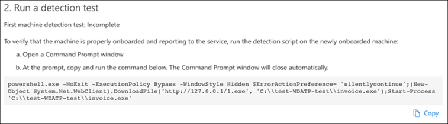

# Konfigurera Microsoft Threat Protection-pelare för testlabbetaConfigure Microsoft Threat Protection pillars for your trial lab environment

**Gäller:****Applies to:**
- Microsoft HotskyddMicrosoft Threat Protection

Att skapa en testlabbmiljö för Microsoft Threat Protection och distribuera den är en trefasprocess:Creating a Microsoft Threat Protection trial lab environment and deploying it is a three-phase process:

 
<table border="0" width="100%" align="center">
  <tr style="text-align:center;">
    <td align="center" style="width:25%; border:0;" >
      <a href= "https://docs.microsoft.com/microsoft-365/security/mtp/prepare-mtpeval?view=o365-worldwide"> 
        
       Fas 1: Förbered</a>Phase 1: Prepare </a> 
    </td>
     <td align="center">
      <a href="https://docs.microsoft.com/microsoft-365/security/mtp/setup-mtpeval?view=o365-worldwide">
        
       Fas 2: Installation</a>Phase 2: Setup </a> 
    </td>
    <td align="center" bgcolor="#d5f5e3">
      <a href="https://docs.microsoft.com/microsoft-365/security/mtp/config-mtpeval?view=o365-worldwide">
        
       Fas 3: Konfigurera & ombord</a>Phase 3: Configure & Onboard </a> 
</td>

  </tr>
</table>

Du befinner dig för närvarande i konfigurationsfasen.You are currently in the configuration phase.

Förberedelse är nyckeln till en lyckad distribution.Preparation is key to any successful deployment. I den här artikeln får du vägledning om de punkter du behöver tänka på när du förbereder distributionen av Microsoft Defender ATP.In this article, you'll be guided on the points you'll need to consider as you prepare to deploy Microsoft Defender ATP.

## Pelare för skydd av Microsofts hotskyddMicrosoft Threat Protection pillars
Microsoft Threat Protection består av fyra pelare.Microsoft Threat Protection consists of four pillars. Även om en pelare redan kan ge värde till nätverksorganisationens säkerhet, ger aktivering av de fyra Microsoft Threat Protection-pelarna din organisation mest värde.Although one pillar can already provide value to your network organization's security, enabling the four Microsoft Threat Protection pillars will give your organization the most value.

![Image of_Microsoft Threat Protection-lösning för användare, Azure Advanced Threat Protection, för slutpunkter Microsoft Defender Advanced Threat Protection, för molnappar, Microsoft Cloud App Security och för data, Office 365 Advanced Threat ProtectionImage of_Microsoft Threat Protection solution for users, Azure Advanced Threat Protection, for endpoints Microsoft Defender Advanced Threat Protection, for cloud apps, Microsoft Cloud App Security, and for data, Office 365 Advanced Threat Protection  ](../../media/mtp-eval-31.png)  

Det här avsnittet hjälper dig att konfigurera:This section will guide you to configure:
-   Office 365 Avancerat skyddOffice 365 Advanced Threat Protection
-   Azure Advanced Threat ProtectionAzure Advanced Threat Protection 
-   Microsoft Cloud App SecurityMicrosoft Cloud App Security
-   Microsoft Defender Avancerat skyddMicrosoft Defender Advanced Threat Protection

## Konfigurera avancerat hotskydd för Office 365Configure Office 365 Advanced Threat Protection
>[!NOTE]
>Hoppa över det här steget om du redan har aktiverat förhandsskydd för Office 365.Skip this step if you have already enabled Office 365 Advanced Threat Protection.Skip this step if you have already enabled Office 365 Advanced Threat Protection. 

Det finns en PowerShell-modul som kallas *Office 365 Advanced Threat Protection Recommended Configuration Analyzer (ORCA)* som hjälper till att avgöra några av dessa inställningar.There is a PowerShell Module called the *Office 365 Advanced Threat Protection Recommended Configuration Analyzer (ORCA)* that helps determine some of these settings. När du kör som administratör i din klientorganisation, get-ORCAReport kommer att bidra till att generera en bedömning av anti-spam, anti-phish och andra inställningar meddelandehygien.When run as an administrator in your tenant, get-ORCAReport will help generate an assessment of the anti-spam, anti-phish, and other message hygiene settings. Du kan ladda ner denna modul från https://www.powershellgallery.com/packages/ORCA/ .You can download this module from https://www.powershellgallery.com/packages/ORCA/. 

1. Navigera till [Office 365 Security & Compliance Center](https://protection.office.com/homepage)Threat  >  **management**  >  **Policy**.Navigate to [Office 365 Security & Compliance Center](https://protection.office.com/homepage) > **Threat management** > **Policy**.
  
 
2. Klicka på **ATP-anti-nätfiske,** välj **Skapa** och fyll i principnamnet och beskrivningen.Click **ATP anti-phishing**, select **Create** and fill in the policy name and description. Klicka på **Nästa**.Click **Next**.
  

>[!NOTE]
>Redigera din avancerade ATP-policy mot nätfiske.Edit your Advanced ATP anti-phishing policy. Ändra **avancerad nätfisketröskel** till **2 - Aggressiv**.Change **Advanced Phishing Threshold** to **2 - Aggressive**.
 

3. Klicka på den nedrullningsbara menyn **Lägg till ett villkor** och välj domänen/domänerna som mottagardomän.Click the **Add a condition** drop-down menu and select your domain(s) as recipient domain. Klicka på **Nästa**.Click **Next**.
  
 
4. Granska dina inställningar.Review your settings. Klicka på **Skapa den här principen** för att bekräfta.Click **Create this policy** to confirm. 
  
 
5. Välj **ATP Säkra bilagor** och välj alternativet Aktivera **ATP för SharePoint, OneDrive och Microsoft Teams.**Select **ATP Safe attachments** and select the **Turn on ATP for SharePoint, OneDrive, and Microsoft Teams** option.  
  

6. Klicka på ikonen + om du vill skapa en ny princip för säker bifogade filer och tillämpa den som mottagaredomän på dina domäner.Click the + icon to create a new safe attachment policy, apply it as recipient domain to your domains. Klicka på **Spara**.Click **Save**.
  
 
7. Välj sedan **atp-principen för säkra länkar** och klicka sedan på pennikonen för att redigera standardprincipen.Next, select the **ATP Safe Links** policy, then click the pencil icon to edit the default policy.

8. Kontrollera att alternativet **Spåra inte när användare klickar på säkra länkar** inte är markerat, medan resten av alternativen är markerade.Make sure that the **Do not track when users click safe links** option is not selected, while the rest of the options are selected. Mer information finns i inställningar för [säkra länkar.](https://docs.microsoft.com/microsoft-365/security/office-365-security/recommended-settings-for-eop-and-office365-atp?view=o365-worldwide)See [Safe Links settings](https://docs.microsoft.com/microsoft-365/security/office-365-security/recommended-settings-for-eop-and-office365-atp?view=o365-worldwide) for details. Klicka på **Spara**.Click **Save**. 
  

9. Välj sedan policyn **mot skadlig kod,** välj standardikonen och välj pennikonen.Next select the **Anti-malware** policy, select the default, and choose the pencil icon.

10. Klicka på **Inställningar** och välj **Ja och använd standardmeddelandetexten** för att aktivera **svar på identifiering av skadlig kod**.Click **Settings** and select **Yes and use the default notification text** to enable **Malware Detection Response**. Aktivera **filtret Vanliga typer av bifogade filer.**Turn the **Common Attachment Types Filter** on. Klicka på **Spara**.Click **Save**.
   
  
11. Navigera till [Office 365 Security &](https://protection.office.com/homepage)  >  **Search**  >  **Audit-loggsökning för** efterlevnadscenter och aktivera granskning.Navigate to [Office 365 Security & Compliance Center](https://protection.office.com/homepage) > **Search** > **Audit log search** and turn Auditing on.  
  

12. Integrera Office 365 ATP med Microsoft Defender ATP.Integrate Office 365 ATP with Microsoft Defender ATP. Navigera till [Office 365 Security & Compliance Center](https://protection.office.com/homepage)Threat  >  **management**  >  **Explorer** och välj **WDATP-inställningar** längst upp till höger på skärmen.Navigate to [Office 365 Security & Compliance Center](https://protection.office.com/homepage) > **Threat management** > **Explorer** and select **WDATP Settings** on the upper right corner of the screen. Aktivera **Anslut till Windows ATP**i dialogrutan Microsoft Defender ATP-anslutning .In the Microsoft Defender ATP connection dialog box, turn on **Connect to Windows ATP**.
  

## Konfigurera Avancerat hotskydd för AzureConfigure Azure Advanced Threat Protection
>[!NOTE]
>Hoppa över det här steget om du redan har aktiverat Azure Advanced Threat ProtectionSkip this step if you have already enabled Azure Advanced Threat Protection

1. Navigera till [Microsoft 365 Security Center](https://security.microsoft.com/info) > välja Fler **resurser**Azure Advanced  >  **Threat Protection**.Navigate to [Microsoft 365 Security Center](https://security.microsoft.com/info) > select **More Resources** > **Azure Advanced Threat Protection**.
  

2. Klicka på Skapa om du vill starta guiden Avancerat skydd mot Azure.Click **Create** to start the Azure Advanced Threat Protection wizard.Click **Create** to start the Azure Advanced Threat Protection wizard. 
   

3. Välj **Ange ett användarnamn och lösenord för att ansluta till Active Directory-skogen**.Choose **Provide a username and password to connect to your Active Directory forest**.  
  

4. Ange lokala autentiseringsuppgifter för Active Directory.Enter your Active Directory on-premises credentials. Detta kan vara alla användarkonton som har läsbehörighet till Active Directory.This can be any user account that has read access to Active Directory.
  

5. Välj sedan **Hämta sensorinstallation och** överför filen till domänkontrollanten.Next, choose **Download Sensor Setup** and transfer file to your domain controller. 
  

6. Kör installationen av Azure ATP-sensor och börja följa guiden.Execute the Azure ATP Sensor Setup and begin following the wizard.
   
 
7. Klicka på **Nästa** vid sensordistributionstypen.Click **Next** at the sensor deployment type.
   
 
8. Kopiera åtkomstnyckeln som du behöver för att ange den nästa i guiden.Copy the access key as you will need to enter it next in the Wizard.
  
 
9. Kopiera åtkomstnyckeln till guiden och klicka på **Installera**.Copy the access key into the Wizard and click **Install**. 
   

10. Grattis, du har konfigurerat Azure Advanced Threat Protection på domänkontrollanten.Congratulations, you have successfully configured Azure Advanced Threat Protection on your domain controller.
  
 
11. Under avsnittet [Azure Azure ATP-inställningar](https://go.microsoft.com/fwlink/?linkid=2040449) väljer du **Windows Defender ATP**och aktiverar sedan växlingsknappen.Under the [Azure Azure ATP](https://go.microsoft.com/fwlink/?linkid=2040449) settings section, select **Windows Defender ATP**, then turn the toggle on. Klicka på **Spara**.Click **Save**. 
  

>[!NOTE]
>Windows Defender ATP har bytt namn till Microsoft Defender ATP.Windows Defender ATP has been rebranded as Microsoft Defender ATP. Omprofilering förändringar över alla våra portaler håller på att rullas ut för konsekvens.Rebranding changes across all of our portals are being rolled out the for consistency.

## Konfigurera Säkerhet för Microsoft Cloud-apparConfigure Microsoft Cloud App Security
>[!NOTE]
>Hoppa över det här steget om du redan har aktiverat Microsoft Cloud App Security.Skip this step if you have already enabled Microsoft Cloud App Security. 

1. Navigera till [Microsoft 365 Security Center](https://security.microsoft.com/info)Fler  >  **resurser**Microsoft Cloud  >  **App Security**.Navigate to [Microsoft 365 Security Center](https://security.microsoft.com/info) > **More Resources** > **Microsoft Cloud App Security**.
  

2. Vid informationsfrågan om att integrera Azure ATP väljer du **Aktivera Azure ATP-dataintegration**.At the information prompt to integrate Azure ATP, select **Enable Azure ATP data integration**. 
   

>[!NOTE]
>Om du inte ser den här prompten kan det innebära att din Azure ATP-dataintegrering redan har aktiverats.If you don’t see this prompt, it might mean that your Azure ATP data integration has already been enabled. Om du är osäker kontaktar du dock IT-administratören för att bekräfta.However, if you are not sure, contact your IT Administrator to confirm. 

3. Gå till **Inställningar**, aktivera växlingsknappen för **Azure ATP-integrering** och klicka sedan på **Spara**.Go to **Settings**, turn the **Azure ATP integration** toggle on, then click **Save**. 
  
>[!NOTE]
>För nya Azure ATP-instanser aktiveras den här integrationsväxlingen automatiskt.For new Azure ATP instances, this integration toggle is automatically turned on. Bekräfta att din Azure ATP-integrering har aktiverats innan du går vidare till nästa steg.Confirm that your Azure ATP integration has been enabled before you proceed to the next step.
 
4. Under inställningarna för molnidentifiering väljer du **Microsoft Defender ATP-integrering**och aktiverar integreringen.Under the Cloud discovery settings, select **Microsoft Defender ATP integration**, then enable the integration. Klicka på **Spara**.Click **Save**.
Click save.](../../media/mtp-eval-56.png)  

5. Under Molnidentifieringsinställningar väljer du **Användarberikande**och aktiverar sedan integreringen med Azure Active Directory.Under Cloud discovery settings, select **User enrichment**, then enable the integration with Azure Active Directory.
  

## Konfigurera avancerat hotskydd för Microsoft DefenderConfigure Microsoft Defender Advanced Threat Protection
>[!NOTE]
>Hoppa över det här steget om du redan har aktiverat Microsoft Defender Advanced Threat Protection.Skip this step if you have already enabled Microsoft Defender Advanced Threat Protection.

1. Navigera till [Microsoft 365 Security Center](https://security.microsoft.com/info)Mer  >  **resurser**Microsoft Defender  >  **Security Center**.Navigate to [Microsoft 365 Security Center](https://security.microsoft.com/info) > **More Resources** > **Microsoft Defender Security Center**. Klicka på **Öppna**.Click **Open**.
   
 
2. Följ guiden Avancerat skydd mot microsoft defender.Follow the Microsoft Defender Advanced Threat Protection wizard.Follow the Microsoft Defender Advanced Threat Protection wizard. Klicka på **Nästa**.Click **Next**. 
   

3. Välj baserat på önskad plats för datalagring, datalagringsprincip, organisationsstorlek och opt-in för förhandsversionsfunktioner.Choose based on your preferred data storage location, data retention policy, organization size, and opt-in for preview features. 
 Click next when you're done selecting.](../../media/mtp-eval-60.png)  
>[!NOTE]
>Du kan inte ändra vissa inställningar, till exempel datalagringsplats, efteråt.You cannot change some of the settings, like data storage location, afterwards. 
 

Klicka på **Nästa**.Click **Next**. 

4. Klicka på **Fortsätt** så etablerar microsoft defender ATP-klienten.Click **Continue** and it will provision your Microsoft Defender ATP tenant.
   

5. Ombord på dina slutpunkter via grupprinciper, Microsoft Slutpunktshanteraren eller genom att köra ett lokalt skript till Microsoft Defender ATP.Onboard your endpoints through Group Policies, Microsoft Endpoint Manager or by running a local script to Microsoft Defender ATP. För enkelhetens skull använder den här guiden det lokala skriptet.For simplicity, this guide uses the local script.

6. Klicka på **Hämta paket** och kopiera introduktionsskriptet till slutpunkterna.Click **Download package** and copy the onboarding script to your endpoint(s).  
   

7. På slutpunkten kör du introduktionsskriptet som administratör och väljer Y.On your endpoint, run the onboarding script as Administrator and choose Y.
   

8. Grattis, du har onboarded din första slutpunkt.Congratulations, you have onboarded your first endpoint.  
   

9. Kopiera in identifieringstestet från Atp-guiden Microsoft Defender.Copy-paste the detection test from the Microsoft Defender ATP wizard.
   

10. Kopiera PowerShell-skriptet till en upphöjd kommandotolk och kör det.Copy the PowerShell script to an elevated command prompt and run it. 
   

11. Välj **Börja använda Microsoft Defender ATP** i guiden.Select **Start using Microsoft Defender ATP** from the Wizard.
   
 
12. Besök [Microsoft Defender Security Center](https://securitycenter.windows.com/).Visit the [Microsoft Defender Security Center](https://securitycenter.windows.com/). Gå till **Inställningar** och välj sedan **Avancerade funktioner**.Go to **Settings** and then select **Advanced features**. 
   

13. Aktivera integreringen med **Azure Advanced Threat Protection**.Turn on the integration with **Azure Advanced Threat Protection**.  
   

14. Aktivera integreringen med **Office 365 Threat Intelligence**.Turn on the integration with **Office 365 Threat Intelligence**.
   

15. Aktivera integrering med **Microsoft Cloud App Security**.Turn on integration with **Microsoft Cloud App Security**.
   

16. Bläddra nedåt och klicka på **Spara inställningar** för att bekräfta de nya integreringarna.Scroll down and click **Save preferences** to confirm the new integrations.
   

## Starta tjänsten Microsoft Threat ProtectionStart the Microsoft Threat Protection service
>[!NOTE]
>Från och med den 1 juni 2020 aktiverar Microsoft automatiskt Microsoft Threat Protection-funktioner för alla berättigade klienter.Starting June 1, 2020, Microsoft automatically enables Microsoft Threat Protection features for all eligible tenants. Mer information finns i den här [artikeln i Microsoft Tech Community om licensberättigande.](https://techcommunity.microsoft.com/t5/security-privacy-and-compliance/microsoft-threat-protection-will-automatically-turn-on-for/ba-p/1345426)See this [Microsoft Tech Community article on license eligibility](https://techcommunity.microsoft.com/t5/security-privacy-and-compliance/microsoft-threat-protection-will-automatically-turn-on-for/ba-p/1345426) for details. 
 

Gå till [Microsoft 365 Security Center](https://security.microsoft.com/homepage).Go to [Microsoft 365 Security Center](https://security.microsoft.com/homepage). Navigera till **Inställningar** och välj sedan **Microsoft Threat Protection**.Navigate to **Settings** and then select **Microsoft Threat Protection**.
   

Mer omfattande vägledning finns i [Aktivera Microsoft Threat Protection](mtp-enable.md).For a more comprehensive guidance, see [Turn on Microsoft Threat Protection](mtp-enable.md). 

Grattis!Congratulations! Du har precis skapat testlabbmiljön för Microsoft Threat Protection!You've just created your Microsoft Threat Protection trial lab environment! Nu kan du bekanta dig med användargränssnittet i Microsoft Threat Protection!Now you can familiarize yourself with the Microsoft Threat Protection user interface! Se vad du kan lära dig av och veta hur du använder varje instrumentpanel för dina dagliga säkerhetsoperationsuppgifter: [Interaktiv guide för Microsoft Threat Protection](https://aka.ms/MTP-Interactive-Guide).See what you can learn from and know how to use each dashboards for your day-to-day security operation tasks: [Microsoft Threat Protection interactive guide](https://aka.ms/MTP-Interactive-Guide).

Därefter kan du simulera en attack och se hur cross-produktfunktionerna identifierar, skapar aviseringar och automatiskt svarar på en fillös attack på en slutpunkt.Next, you can simulate an attack and see how the cross product capabilities detect, create alerts, and automatically respond to a fileless attack on an endpoint.

## Nästa stegNext steps
[Generera en testavisering](generate-test-alert.md).[Generate a test alert](generate-test-alert.md).
