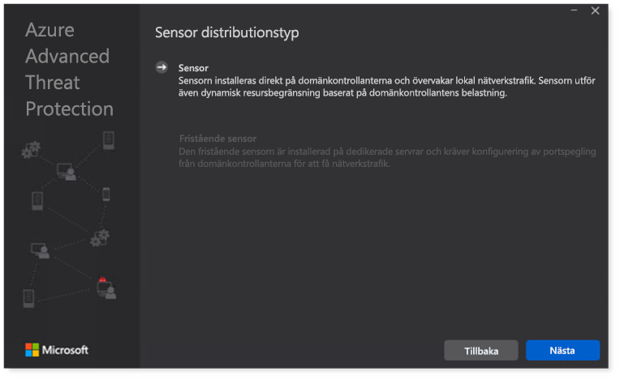

# Konfigurera Microsoft 365 Defender-pelaren för utvärderings labbet eller pilot miljönConfigure Microsoft 365 Defender pillars for your trial lab or pilot environment

[!INCLUDE [Microsoft 365 Defender rebranding](../includes/microsoft-defender.md)]

**Gäller för:****Applies to:**
- Microsoft 365 DefenderMicrosoft 365 Defender

Att skapa en test labb-eller pilot miljö för Microsoft 365 Defender och distribuera det är en process i tre steg:Creating a Microsoft 365 Defender trial lab or pilot environment and deploying it is a three-phase process:

| [Fas 1: förberedaPhase 1: Prepare](prepare-mtpeval.md) | [Fas 2: KonfigureraPhase 2: Set up](setup-mtpeval.md) | Fas 3: inbyggtPhase 3: Onboard |  [Tillbaka till pilot PlaybookBack to pilot playbook](mtp-pilot.md) |
|--|--|--|--|
|| |*Nu är det här!**You are here!* | |

Du är för närvarande i konfigurations fasen.You're currently in the configuration phase.

Förberedelsen är viktig för eventuell distribution.Preparation is key to any successful deployment. I den här artikeln vägleder vi dig på de Points du måste tänka på när du förbereder dig för att distribuera Microsoft Defender för slut punkten.In this article, you'll be guided on the points you'll need to consider as you prepare to deploy Microsoft Defender for Endpoint.

## Microsoft 365 Defender-pelareMicrosoft 365 Defender pillars
Microsoft 365 Defender består av fyra pelare.Microsoft 365 Defender consists of four pillars. Även om en pelare redan kan ge ett värde till din organisations säkerhet i ditt nätverk, ger de fyra hög365 Defender-stenarna det mest aktuella värdet.Although one pillar can already provide value to your network organization's security, enabling the four Microsoft 365 Defender pillars will give your organization the most value.

I det här avsnittet får du hjälp att konfigurera:This section will guide you to configure:
-   Microsoft Defender för Office 365Microsoft Defender for Office 365
-   Microsoft Defender for IdentityMicrosoft Defender for Identity 
-   Microsoft Cloud App SecurityMicrosoft Cloud App Security
-   Microsoft Defender för EndpointMicrosoft Defender for Endpoint

## Konfigurera Microsoft Defender för Office 365Configure Microsoft Defender for Office 365

>[!NOTE]
>Hoppa över det här steget om du redan har aktiverat Defender för Office 365.Skip this step if you've already enabled Defender for Office 365. 

Det finns en PowerShell-modul som heter *Office 365 Advanced Threat Protection (Orca)* som hjälper dig att avgöra vissa av de här inställningarna.There's a PowerShell Module called the *Office 365 Advanced Threat Protection Recommended Configuration Analyzer (ORCA)* that helps determine some of these settings. När du kör som administratör i klient organisationen kan du med ORCAReport få en utvärdering av skräp post, anti-Phish och andra inställningar för meddelande hygien.When run as an administrator in your tenant, get-ORCAReport will help generate an assessment of the anti-spam, anti-phish, and other message hygiene settings. Du kan hämta den här modulen från https://www.powershellgallery.com/packages/ORCA/ .You can download this module from https://www.powershellgallery.com/packages/ORCA/. 

1. Navigera till [Office 365-säkerhets &](https://protection.office.com/homepage)  >  policy för **hantering** av villkor för efterlevnad  >  **Policy**.Navigate to [Office 365 Security & Compliance Center](https://protection.office.com/homepage) > **Threat management** > **Policy**.

   
 
2. Klicka på **nätfiske**, Välj **skapa** och fyll i princip namnet och beskrivningen.Click **Anti-phishing**, select **Create** and fill in the policy name and description. Klicka på **Nästa**.Click **Next**.

   

   > [!NOTE]
   > Redigera din avancerade policy för anti-nätfiske i Microsoft Defender för Office 365.Edit your Advanced anti-phishing policy in Microsoft Defender for Office 365. Ändra den **avancerade nät fiske tröskeln** till **2-aggressivt**.Change **Advanced Phishing Threshold** to **2 - Aggressive**.

3. Klicka på den nedrullningsbara menyn **Lägg till en villkors** lista och välj din domän (er) som mottagar domän.Click the **Add a condition** drop-down menu and select your domain(s) as recipient domain. Klicka på **Nästa**.Click **Next**.

   
 
4. Granska dina inställningar.Review your settings. Klicka på **skapa den här principen** för att bekräfta.Click **Create this policy** to confirm. 

   
 
5. Välj **bifogade filer** och välj alternativet **Aktivera ATP för SharePoint, OneDrive och Microsoft Teams** .Select **Safe Attachments** and select the **Turn on ATP for SharePoint, OneDrive, and Microsoft Teams** option.

   

6. Klicka på ikonen + för att skapa en ny princip för säker bifogad fil, tillämpa den som mottagar domän i domänerna.Click the + icon to create a new safe attachment policy, apply it as recipient domain to your domains. Klicka på **Spara**.Click **Save**.

   
 
7. Välj sedan principen för **säkra länkar** och klicka sedan på Penn ikonen för att redigera standard principen.Next, select the **Safe Links** policy, then click the pencil icon to edit the default policy.

8. Kontrol lera att alternativet **Spåra inte när användare klickar på säkra länkar** inte är markerat, medan resten av alternativen är markerade.Make sure that the **Do not track when users click safe links** option is not selected, while the rest of the options are selected. Se [Inställningar för Safe Links](https://docs.microsoft.com/microsoft-365/security/office-365-security/recommended-settings-for-eop-and-office365-atp) .See [Safe Links settings](https://docs.microsoft.com/microsoft-365/security/office-365-security/recommended-settings-for-eop-and-office365-atp) for details. Klicka på **Spara**.Click **Save**. 

   

9. Välj sedan standard principen för att förhindra **mot skadlig program vara** och välj sedan Penn ikonen.Next select the **Anti-malware** policy, select the default, and choose the pencil icon.

10. Klicka på **Inställningar** och välj **Ja och Använd standard meddelande texten** för att aktivera **identifiering av skadlig program vara**.Click **Settings** and select **Yes and use the default notification text** to enable **Malware Detection Response**. Aktivera **filtret vanliga typer av bifogade filer** .Turn the **Common Attachment Types Filter** on. Klicka på **Spara**.Click **Save**.

    
  
11. Navigera till [Office 365-säkerhets & Compliance Center](https://protection.office.com/homepage)  >  **Sök** efter  >  **gransknings loggs ökning** och aktivera granskning.Navigate to [Office 365 Security & Compliance Center](https://protection.office.com/homepage) > **Search** > **Audit log search** and turn Auditing on.

    

12. Integrera Microsoft Defender för Office 365 med Microsoft Defender för slut punkten.Integrate Microsoft Defender for Office 365 with Microsoft Defender for Endpoint. Navigera till [Office 365-säkerhets & efterlevnad för Compliance Center](https://protection.office.com/homepage)  >  **Threat management**  >  **Explorer** och välj **Microsoft Defender för slut punkts inställningar** i det övre högra hörnet av skärmen.Navigate to [Office 365 Security & Compliance Center](https://protection.office.com/homepage) > **Threat management** > **Explorer** and select **Microsoft Defender for Endpoint Settings** on the upper right corner of the screen. I dialog rutan Defender för slut punkts anslutning aktiverar **du Anslut till Microsoft Defender för slut punkt**.In the Defender for Endpoint connection dialog box, turn on **Connect to Microsoft Defender for Endpoint**.

    

## Konfigurera Microsoft Defender för identitetConfigure Microsoft Defender for Identity

>[!NOTE]
>Hoppa över det här steget om du redan har aktiverat Microsoft Defender för identitetSkip this step if you've already enabled Microsoft Defender for Identity

1. Navigera till [Microsoft 365 säkerhets Center](https://security.microsoft.com/info) > Välj **fler resurser**  >  **Microsoft Defender för identitet**.Navigate to [Microsoft 365 Security Center](https://security.microsoft.com/info) > select **More Resources** > **Microsoft Defender for Identity**.

   

2. Klicka på **skapa** för att starta Microsoft Defender för identitets guiden.Click **Create** to start the Microsoft Defender for Identity wizard. 

   

3. Välj **ge ett användar namn och lösen ord för att ansluta till Active Directory-skogen**.Choose **Provide a username and password to connect to your Active Directory forest**.  

   

4. Ange lokala inloggnings uppgifter för Active Directory.Enter your Active Directory on-premises credentials. Det kan vara vilket användar konto som helst som har Läs åtkomst till Active Directory.This can be any user account that has read access to Active Directory.

   

5. Välj sedan **Ladda ned sensor konfiguration** och överföra fil till domänkontrollanten.Next, choose **Download Sensor Setup** and transfer file to your domain controller.

   

6. Kör installations programmet för Microsoft Defender för identitets sensor och börja följa guiden.Execute the Microsoft Defender for Identity Sensor Setup and begin following the wizard.

   
 
7. Klicka på **Nästa** på sensor distributions typen.Click **Next** at the sensor deployment type.

   
 
8. Kopiera snabb tangenten eftersom du måste ange den intill i guiden.Copy the access key because you need to enter it next in the Wizard.

   
 
9. Kopiera till guiden och klicka på **Installera**.Copy the access key into the Wizard and click **Install**. 

   

10. Grattis! du har konfigurerat Microsoft Defender för din domänkontrollant.Congratulations, you've successfully configured Microsoft Defender for Identity on your domain controller.

    
 
11. Under [Microsoft Defender för identitets](https://go.microsoft.com/fwlink/?linkid=2040449) inställningar väljer du \* \* Microsoft Defender för slut punkt \* \* och aktiverar sedan växlingen.Under the [Microsoft Defender for Identity](https://go.microsoft.com/fwlink/?linkid=2040449) settings section, select \*\*Microsoft Defender for Endpoint \*\*, then turn on the toggle. Klicka på **Spara**.Click **Save**. 

    

>[!NOTE]
>Windows Defender ATP har ändrats som Microsoft Defender för slut punkt.Windows Defender ATP has been rebranded as Microsoft Defender for Endpoint. Att ändra dina ändringar i alla portaler blir då mer konsekvens.Rebranding changes across all of our portals are being rolled out the for consistency.

## Konfigurera säkerhet för Microsoft Cloud AppConfigure Microsoft Cloud App Security

>[!NOTE]
>Hoppa över det här steget om du redan har aktiverat säkerhet för Microsoft Cloud App.Skip this step if you've already enabled Microsoft Cloud App Security. 

1. Navigera till [Microsoft 365 säkerhets Center](https://security.microsoft.com/info)  >  **fler resurser**  >  **Microsoft Cloud App-säkerhet**.Navigate to [Microsoft 365 Security Center](https://security.microsoft.com/info) > **More Resources** > **Microsoft Cloud App Security**.

   

2. I rutan information om hur du integrerar Microsoft Defender för identiteter väljer du **aktivera Microsoft Defender för identitets data integrering**.At the information prompt to integrate Microsoft Defender for Identity, select **Enable Microsoft Defender for Identity data integration**.
  
   

   > [!NOTE]
   > Om du inte ser den här uppmaningen kan det betyda att din Microsoft Defender för identitets data integrering redan har Aktiver ATS.If you don’t see this prompt, it might mean that your Microsoft Defender for Identity data integration has already been enabled. Om du är osäker kontaktar du IT-administratören för att bekräfta.However, if you are not sure, contact your IT Administrator to confirm. 

3. Gå till **Inställningar**, aktivera växla mellan **Microsoft Defender för identitets integrering** och klicka sedan på **Spara**.Go to **Settings**, turn on the **Microsoft Defender for Identity integration** toggle, then click **Save**. 

   
   
   > [!NOTE]
   > För nya Microsoft Defender för identitets instanser är denna växel växling automatiskt aktive rad.For new Microsoft Defender for Identity instances, this integration toggle is automatically turned on. Kontrol lera att din Microsoft Defender för identitets integrering har Aktiver ATS innan du fortsätter till nästa steg.Confirm that your Microsoft Defender for Identity integration has been enabled before you proceed to the next step.
 
4. Under Inställningar för moln identifiering väljer du **Microsoft Defender för slut punkts integrering** och aktiverar integrationen.Under the Cloud discovery settings, select **Microsoft Defender for Endpoint integration**, then enable the integration. Klicka på **Spara**.Click **Save**.

   

5. Under Inställningar för moln identifiering väljer du **användar upplevelse** och aktiverar integrationen med Azure Active Directory.Under Cloud discovery settings, select **User enrichment**, then enable the integration with Azure Active Directory.

   

## Konfigurera Microsoft Defender för slut punktenConfigure Microsoft Defender for Endpoint

>[!NOTE]
>Hoppa över det här steget om du redan har aktiverat Microsoft Defender för slut punkter.Skip this step if you've already enabled Microsoft Defender for Endpoint.

1. Gå till [Microsoft 365 säkerhets Center](https://security.microsoft.com/info)  >  **fler resurser**  >  **Microsoft Defender säkerhets Center**.Navigate to [Microsoft 365 Security Center](https://security.microsoft.com/info) > **More Resources** > **Microsoft Defender Security Center**. Klicka på **Öppna**.Click **Open**.

   
 
2. Följ instruktionerna i Microsoft Defender för slut punkter.Follow the Microsoft Defender for Endpoint wizard. Klicka på **Nästa**.Click **Next**. 

   

3. Välj baserat på din önskade lagrings plats för data, bevarande princip för data, organisations storlek och val för förhands gransknings funktioner.Choose based on your preferred data storage location, data retention policy, organization size, and opt-in for preview features.

   
   
   > [!NOTE]
   > Du kan inte ändra vissa inställningar, till exempel data lagrings plats, efteråt.You cannot change some of the settings, like data storage location, afterwards. 

   Klicka på **Nästa**.Click **Next**. 

4. Klicka på **Fortsätt** så tillhandahåller Microsoft Defender för slut punkts klient organisation.Click **Continue** and it will provision your Microsoft Defender for Endpoint tenant.

   

5. Ta fram dina slut punkter via grup principer, Microsoft slut punkts hanteraren eller genom att köra ett lokalt skript till Microsoft Defender för slut punkt.Onboard your endpoints through Group Policies, Microsoft Endpoint Manager or by running a local script to Microsoft Defender for Endpoint. För enkelhetens skull använder den här guiden det lokala skriptet.For simplicity, this guide uses the local script.

6. Klicka på **Ladda ned paket** och kopiera registrerings skriptet till din slut punkt (er).Click **Download package** and copy the onboarding script to your endpoint(s).

   

7. Kör skriptet som administratör på slut punkten och välj Y.On your endpoint, run the onboarding script as Administrator and choose Y. 

   

8. Grattis! du har öppnat din första slut punkt.Congratulations, you've onboarded your first endpoint.

   

9. Kopiera – klistra in identifierings testet från Microsoft Defender för slut punkts guiden.Copy-paste the detection test from the Microsoft Defender for Endpoint wizard.

   

10. Kopiera PowerShell-skriptet till en upphöjd kommando tolk och kör det.Copy the PowerShell script to an elevated command prompt and run it. 

    

11. Välj **börja använda Microsoft Defender för slut punkt** från guiden.Select **Start using Microsoft Defender for Endpoint** from the Wizard.

    
 
12. Gå till [Microsoft Defender säkerhets Center](https://securitycenter.windows.com/).Visit the [Microsoft Defender Security Center](https://securitycenter.windows.com/). Gå till **Inställningar** och välj sedan **avancerade funktioner**.Go to **Settings** and then select **Advanced features**. 

    

13. Aktivera integrationen med **Microsoft Defender för identiteten**.Turn on the integration with **Microsoft Defender for Identity**.  

    

14. Aktivera integrationen med **Office 365 Threat Intelligence**.Turn on the integration with **Office 365 Threat Intelligence**.

    

15. Aktivera integrering med **säkerhet för Microsoft Cloud App**.Turn on integration with **Microsoft Cloud App Security**.

    

16. Rulla nedåt och klicka på **Spara inställningar** för att bekräfta de nya integreringarna.Scroll down and click **Save preferences** to confirm the new integrations.

    

## Starta tjänsten Microsoft 365 DefenderStart the Microsoft 365 Defender service

>[!NOTE]
>Från och med den 1 juni 2020, aktiverar Microsoft automatiskt Microsoft 365 Defender-funktioner för alla kvalificerade klient organisationer.Starting June 1, 2020, Microsoft automatically enables Microsoft 365 Defender features for all eligible tenants. Mer information finns i den här [artikeln i Microsoft Tech community](https://techcommunity.microsoft.com/t5/security-privacy-and-compliance/microsoft-threat-protection-will-automatically-turn-on-for/ba-p/1345426) .See this [Microsoft Tech Community article on license eligibility](https://techcommunity.microsoft.com/t5/security-privacy-and-compliance/microsoft-threat-protection-will-automatically-turn-on-for/ba-p/1345426) for details. 

Gå till [Microsoft 365 säkerhets Center](https://security.microsoft.com/homepage).Go to [Microsoft 365 Security Center](https://security.microsoft.com/homepage). Navigera till **Inställningar** och välj sedan **Microsoft 365 Defender**.Navigate to **Settings** and then select **Microsoft 365 Defender**.

  

En mer omfattande vägledning finns i [aktivera Microsoft 365 Defender](mtp-enable.md).For a more comprehensive guidance, see [Turn on Microsoft 365 Defender](mtp-enable.md). 

Grattis!Congratulations! Du har just skapat en utvärderings version av Microsoft 365 Defender eller pilot miljö!You've just created your Microsoft 365 Defender trial lab or pilot environment! Nu kan du bekanta dig med Microsoft 365 Defender-användargränssnittet!Now you can familiarize yourself with the Microsoft 365 Defender user interface! Se vad du kan lära dig från följande Microsoft 365 Defender interaktiva guide och hur du använder varje instrument panel för dina dagliga säkerhets åtgärder.See what you can learn from the following Microsoft 365 Defender interactive guide and know how to use each dashboard for your day-to-day security operation tasks.

>[!VIDEO https://aka.ms/MTP-Interactive-Guide]

Sedan kan du simulera en attack och se hur funktionerna för kors produkten identifieras, skapa aviseringar och automatiskt svara på en fillös attack på en slut punkt.Next, you can simulate an attack and see how the cross product capabilities detect, create alerts, and automatically respond to a fileless attack on an endpoint.

## Nästa stegNext step
|[Fasen för attack simuleringAttack simulation phase](mtp-pilot-simulate.md) | Kör angrepps simuleringen för din Microsoft 365 Defender pilot miljö.Run the attack simulation for your Microsoft 365 Defender pilot environment.
|:-------|:-----|
